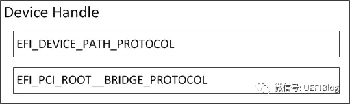

# 深入PCI与PCIe之二：软件篇
> 我们前一篇文章（[深入PCI与PCIe之一：硬件篇 - 知乎专栏](https://zhuanlan.zhihu.com/p/26172972)）介绍了PCI和PCIe的硬件部分。本篇主要介绍PCI和PCIe的[软件界面](https://zhida.zhihu.com/search?q=%E8%BD%AF%E4%BB%B6%E7%95%8C%E9%9D%A2&zhida_source=entity&is_preview=1)和UEFI对PCI的支持。

## **PCI/PCIe软件界面**

**1。配置空间**

PCI spec规定了PCI设备必须提供的单独地址空间：配置空间（configuration space）,前64个字节（其地址范围为0x00~0x3F）是所有PCI设备必须支持的（有不少简单的设备也仅支持这些），此外PCI/PCI-X还扩展了0x40~0xFF这段配置空间，在这段空间主要存放一些与MSI或者MSI-X[中断机制](https://zhida.zhihu.com/search?q=%E4%B8%AD%E6%96%AD%E6%9C%BA%E5%88%B6&zhida_source=entity&is_preview=1)和电源管理相关的Capability结构。

前文提到过，PCI配置空间和内存空间是分离的，那么如何访问这段空间呢？我们首先要对所有的PCI设备进行编码以避免冲突，通常我们是以三段编码来区分PCI设备，即Bus Number, Device Number和Function Number,以后我们简称他们为BDF。有了BDF我们既可以唯一确定某一PCI设备。不同的芯片厂商访问配置空间的方法略有不同，我们以Intel的芯片组为例，其使用IO空间的CF8h/CFCh地址来访问PCI设备的配置寄存器:

  

CF8h: **CONFIG\_ADDRESS**。PCI配置空间地址端口。

CFCh: **CONFIG\_DATA**。PCI配置空间数据端口。

　　CONFIG\_ADDRESS寄存器格式：

　31 位：Enabled位。

23:16 位：总线编号。

15:11 位：设备编号。

10: 8 位：功能编号。

7: 2 位：配置空间寄存器编号。

1: 0 位：恒为“00”。这是因为CF8h、CFCh端口是32位端口。

如上，在CONFIG\_ADDRESS端口填入BDF,即可以在CONFIG\_DATA上写入或者读出PCI配置空间的内容。

PCIe规范在PCI规范的基础上，将配置空间扩展到4KB。原来的CF8/CFC方法仍然可以访问所有PCIe设备配置空间的头255B，但是该方法访问不了剩下的（4K-255）配置空间。怎么办呢？Intel提供了另外一种PCIe配置空间访问方法：通过将配置空间映射到Memory map IO（MMIO）空间，对PCIe配置空间可以像对内存一样进行读写访问了。如图

  

这样再加上PCI板子上的RAM或者ROM，整个PCIe Device空间如下图：

  

MMIO这段空间有256MB，因为按照PCIe规范，支持最多256个buses，每个Bus支持最多32个PCI devices，每个device支持最多8个function,也就是说：占用内存的最大值为：256 \* 32 \* 8 \* 4K = 256MB。在台式机上我们很多时候觉得占用256MB空间太浪费（造成4G以下memory可用空间变少，虽然实际memory可以映射到4G以上，但对32位OS影响很大），PCI Bus也没有那么多，所以可以设置成最低64MB，即最多64个Bus。那么这个256MB的MMIO空间在在哪里呢？我们以Intel的Haswell平台为例：

  

其中PCIEXBAR就是这个MMIO的起始位置，在4G下面占据64MB/128MB/256MB空间（4G以上部分不在本文范围内，我们今后会详细介绍固件中的内存布局），其具体位置可以由平台进行设置，设置寄存器一般在Root complex（下文简称RC）中。

如果大家忘记RC，可以参考前文硬件部分的典型PCIe框图。

  

RC是PCIe体系结构的一个重要组成部件，也是一个较为混乱的概念。RC的提出与x86处理器系统密切相关，PCIe总线规范中涉及的RC也以x86处理器为例进行说明，而且一些在PCIe总线规范中出现的最新功能也在Intel的x86处理器系统中率先实现。事实上，只有x86处理器才存在PCIe总线规范定义的“标准RC”，而在多数处理器系统，并不含有在PCIe总线规范中涉及的，与RC相关的全部概念。

在x86处理器系统中，RC内部集成了一些PCI设备、RCRB(RC Register Block)和Event Collector等组成部件。其中RCRB由一系列的寄存器组成的大杂烩，而仅存在于x86处理器中；而Event Collector用来处理来自PCIe设备的错误消息报文和PME消息报文。RCRB的访问基地址一般在LPC设备寄存器上设置。

如果将RC中的RCRB、内置的PCI设备和Event Collector去除，该RC的主要功能与PCI总线中的Host Bridge类似，其主要作用是完成存储器域到PCI总线域的地址转换。但是随着[虚拟化技术](https://zhida.zhihu.com/search?q=%E8%99%9A%E6%8B%9F%E5%8C%96%E6%8A%80%E6%9C%AF&zhida_source=entity&is_preview=1)的引入，尤其是引入MR-IOV技术之后，RC的实现变得异常复杂。

**2。BAR空间**

现在我们来看看在配置空间里具体有些什么。我们以一个一般的type 0（非Bridge）设备为例：

  

其中Device ID和Vendor ID是区分不同设备的关键，OS和UEFI在很多时候就是通过匹配他们来找到不同的设备驱动（Class Code有时也起一定作用）。为了保证其唯一性，Vendor ID应当向PCI特别兴趣小组(PCI SIG)申请而得到。

我们重点来了解一下这些Base Address Registers(BAR)。BAR是PCI配置空间中从0x10 到 0x24的6个[register](https://zhida.zhihu.com/search?q=register&zhida_source=entity&is_preview=1)，用来定义PCI需要的配置空间大小以及配置PCI设备占用的地址空间。

每个PCI设备在BAR中描述自己需要占用多少地址空间，UEFI通过所有设备的这些信息构建一张完整的关系图，描述系统中资源的分配情况，然后在合理的将地址空间配置给每个PCI设备。

BAR在bit0来表示该设备是映射到memory还是IO，bar的bit0是readonly的，也就是说，设备寄存器是映射到memory还是IO是由设备制造商决定的，其他人无法修改。

下图是BAR寄存器的结构，分别是Memory和IO：

  

BAR通过将某些位设置为只读，且0来表示需要的地址空间大小，比如一个PCI设备需要占用1MB的地址空间，那么这个BAR就需要实现高12bit是可读写的，而20-4bit是只读且位0。地址空间大小的计算方法如下：

**a.**向BAR寄存器写全1

**b.**读回寄存器里面的值，然后clear 上图中特殊编码的值，(IO 中bit0，bit1， memory中bit0-3)。

**c.**对读回来的值去反，加一就得到了该设备需要占用的地址内存空间。

这样我们就可以在构建一张大表，用于记录所有PCI设备所需要的空间。这也是PCI枚举的主要任务之一。另外别忘记设置Command寄存器enable这些BARs。

**3。PCI桥设备**

PCI桥在PCI[设备树](https://zhida.zhihu.com/search?q=%E8%AE%BE%E5%A4%87%E6%A0%91&zhida_source=entity&is_preview=1)中起到呈上起下的作用。一个PCI-to-PCI桥它的配置空间如下：

  

注意其中的三组绿色的BUS Number和多组黄色的BASE/Limit对，它决定了桥和桥下面的PCI设备子树相应/被分配的Bus和各种资源大小和位置。这些值都是由PCI枚举程序来设置的。

**4。Capabilities结构**

PCI-X和PCIe总线规范要求其设备必须支持Capabilities结构。在PCI总线的基本配置空间中，包含一个Capabilities Pointer寄存器，该寄存器存放Capabilities结构链表的头指针。在一个PCIe设备中，可能含有多个Capability结构，这些寄存器组成一个[链表](https://zhida.zhihu.com/search?q=%E9%93%BE%E8%A1%A8&zhida_source=entity&is_preview=1)，其结构如图：

  

PCIe的各种特性如Max Payload、Complete Timeout(CTO)等等都通过这个链表链接在一起，Capabilities ID由PCIe spec规定。链表的好处是如果你不关心这个Capabilities（或不知道怎么处理），直接跳过，处理关心的即可，兼容性比较好。另外扩展性也强，新加的功能不会固定放在某个位置，淘汰的功能删掉即好。

**5。PCI枚举**

PCI枚举是个不断[递归调用](https://zhida.zhihu.com/search?q=%E9%80%92%E5%BD%92%E8%B0%83%E7%94%A8&zhida_source=entity&is_preview=1)发现新设备的过程，PCI枚举简单来说主要包括下面几个步骤：

**A．** 利用深度优先算法遍历整个PCI设备树。从Root Complex出发，寻找设备和桥。发现桥后设置Bus,会发现一个PCI设备子树，递归回到A)

**B．** 递归的过程中通过读取BARs，记录所有MMIO和IO的需求情况并予以满足。

**C．** 设置必要的Capabilities

在整个过程结束后，一颗完整的资源分配完毕的树就建立好了。

**6。地址译码**

在[PCI总线](https://zhida.zhihu.com/search?q=PCI%E6%80%BB%E7%BA%BF&zhida_source=entity&is_preview=1)中定义了两种“地址译码”方式，一个是正向译码，一个是负向译码。当访问Bus N时，其下的所有PCI设备都将对出现在地址周期中的PCI总线地址进行译码。如果这个地址在某个PCI设备的BAR空间中命中时，这个PCI设备将接收这个PCI总线请求。这个过程也被称为PCI总线的正向译码，这种方式也是大多数PCI设备所采用的译码方式。

但是在PCI总线上的某些设备，如PCI-to-(E)ISA桥（或LPC）并不使用正向译码接收来自PCI总线的请求， PCI BUS N上的总线事务在三个[时钟周期](https://zhida.zhihu.com/search?q=%E6%97%B6%E9%92%9F%E5%91%A8%E6%9C%9F&zhida_source=entity&is_preview=1)后，没有得到任何PCI设备响应时(即总线请求的PCI总线地址不在这些设备的BAR空间中)，PCI-to-ISA桥将被动地接收这个数据请求。这个过程被称为PCI总线的负向译码。可以进行负向译码的设备也被称为负向译码设备。

在PCI总线中，除了PCI-to-(E)ISA桥可以作为负向译码设备，PCI桥也可以作为负向译码设备，但是PCI桥并不是在任何时候都可以作为负向译码设备。在绝大多数情况下，PCI桥无论是处理“来自上游总线(upstream)”，还是处理“来自下游总线（downstream)”的总线事务时，都使用正向译码方式。如图：

  

在某些特殊应用中，PCI桥也可以作为负向译码设备。PCI总线规定使用负向译码的PCI桥，其Base Class Code寄存器为0x06，Sub Class Code寄存器为0x04，而Interface寄存器为0x01；使用正向译码方式的PCI桥的Interface寄存器为0x00。

如笔记本在连接Dock插座时，也使用了PCI桥。因为在大多数情况下，笔记本与Dock插座是分离使用的，而且Dock插座上连接的设备多为慢速设备，此时用于连接Dock插座的PCI桥使用负向译码。在该桥管理的设备并不参与处理器系统对PCI总线的枚举过程。当笔记本插入到Dock之后，[系统软件](https://zhida.zhihu.com/search?q=%E7%B3%BB%E7%BB%9F%E8%BD%AF%E4%BB%B6&zhida_source=entity&is_preview=1)并不需要重新枚举Dock中的设备并为这些设备分配系统资源，而仅需要使用负向译码PCI桥管理好其下的设备即可，从而极大降低了Dock对系统软件的影响。

## **UEFI对PCI/PCIe的支持**

UEFI对于PCI总线的支持包括以下三个方面：

1） 提供分配PCI设备资源的协议（Protocol）。

2） 提供访问PCI设备的协议（Protocol）。

3） 提供PCI枚举器，枚举PCI总线上的设备以及分配设备所需的资源。

4） 提供各种Lib，方便[驱动程序](https://zhida.zhihu.com/search?q=%E9%A9%B1%E5%8A%A8%E7%A8%8B%E5%BA%8F&zhida_source=entity&is_preview=1)访问PCI/PCIe配置空间或者MMIO/IO空间。

**1.PCI驱动**

UEFI BIOS提供了两个主要的模块来支持PCI总线，一个是PCI Host Bridge控制器驱动，另一个是PCI总线驱动。

PCI Host Bridge控制器驱动是跟特定的平台硬件绑定的。根据系统实际I/O空间和memory map，为PCI设备指定I/O空间和Memory空间的范围，并且产生PCI Host Bridge Resource Allocation 协议（Protocol）供PCI总线驱动使用。该驱动还对HostBridge控制器下所有RootBridge设备产生句柄（Handle），该句柄上安装了PciRootBridgeIoProtocol。PCI总线驱动则利用PciRootBridgeIo Protocol枚举系统中所有PCI设备，发现并获得PCI设备的Option Rom，并且调用PCI Host Bridge Resource Allocation 协议（Protocol）分配PCI设备资源。PCI Host Bridge Resource Allocation协议的实现是跟特定的芯和平台相结合的，毕竟只有平台所有者才知道资源从哪里来和有多少。每一个PCI HostBridge Controller下面可以接一个或者多个PCI root bridges，PCI Root Bridge会产生PCI local Bus。正如我们前文举得例子，如Intel志强第三代四路服务器，共四颗CPU，每个CPU都被划分了共享但区隔的Bus, PCI I/O, PCI Memory范围，其构成可以表示成如下图：

  

其他情况可见上文。PCI设备驱动不会使用PCI Root Bridge I/O协议访问PCI设备，而是会使用PCI总线驱动为PCI设备产生的PCI IO Protocol来访问PCI设备的IO/MEMORY空间和配置空间。PCI Root Bridge I/O协议（Protocol）是安装在RootBridge设备的句柄上（handle），同时在该handle上也会有表明RootBridge设备的DevicePath协议（Protocol），如下图所示

  

PCI总线驱动在BDS阶段会枚举整个PCI设备树并分配资源（BUS，MMIO和IO等），它还会在不同的枚举点调用Notify event通知平台，平台的Hook可以挂接在这些点上做些特殊的动作。具体各种点的定义请参阅UEFI spec。

PCI bus驱动在这里：[tianocore/edk2](https://link.zhihu.com/?target=https%3A//github.com/tianocore/edk2/tree/master/MdeModulePkg/Bus/Pci/PciBusDxe)

**2。PCI Lib**

在MdePackage下有很多PCI lib。有Cf8/CFC形式访问配置空间的，有PCIe方式访问的。都有些许不同。注意Cf8/CFC只能访问255以内的，而PCIe方式访问的要配置正确PCIe base address PCD。

## **结语**

本篇没有介绍下列内容，以后有机会再补。

1\. Non-transparent bridge

2\. LPC

3\. 各种PCIe的feature

4\. MSI中断处理

如果你还觉得意犹未尽，仔细思考一下下面这些问题并找找资料有助于你更深入了解PCI/PCIe

1． 前文说过，PCIe的速度和Lane的数目是在Training的时候由Root Port和EndPoint协调得到的。那这个Training的过程发生在什么时候呢? (提示，Hard Strap,Soft Strap, Wait for BIOS/Bifurcation)。

2． UEFI PCI Bus枚举发生在BDS阶段，很靠后。那我们如果在芯片初始化阶段需要对PCI设备MMIO空间的寄存器甚至Bridge后面的设备做些设置，该怎么办呢？