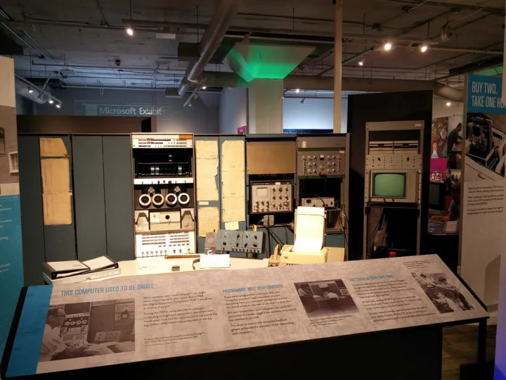
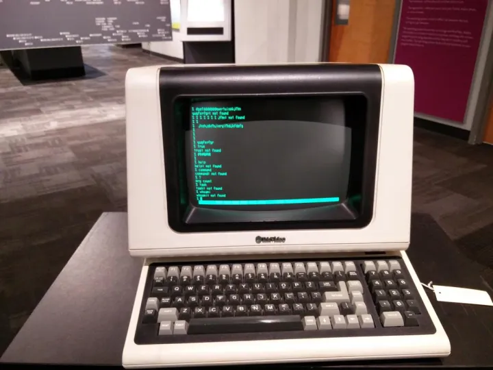

# 带你逛西雅图活电脑博物馆（一）
在西雅图星巴克总部大楼的旁边，坐落着一座不起眼的灰色建筑，这儿就是由微软创始人之一保罗艾伦所创办的Living Computer Museum——活电脑博物馆。

保罗艾伦不仅是微软的创始人之一，也是一名爱好广泛的收藏家，其创立的Experience Music Project（音乐体验计划）和Flying Heritage Collection（飞行遗产收藏计划）都是西雅图的著名景点。而这家Living Computer Museum（活电脑博物馆）则是保罗艾伦创建的另一家博物馆，不过由于其名气远不如前两家大，所以并不为中文社区所熟知。

Living Computer Museum的前身是保罗艾伦在2006年创建的网站PDP Planet，主要致力于修复老旧的DEC PDP系列主机，并对公众开放远程Telnet服务。在2012年10月25日，这间博物馆才正式对公众开放，其间的收藏也不局限于DEC的PDP系列电脑，而是包含了从大型主机到个人电脑的各种电脑设备。  

  

[https://web.archive.org/web/20060208173518/http://www.pdpplanet.com/TemplateMain.aspx?contentId=1](https://link.zhihu.com/?target=https%3A//web.archive.org/web/20060208173518/http%3A//www.pdpplanet.com/TemplateMain.aspx%3FcontentId%3D1)  

## 上集：小型机及其外设

应该说，博物馆内最为重要的展品应该是这些小型机，DEC的PDP系列是美国60~80年代最为常见的小型机，也是80年代个人电脑开发的先驱们所使用的主力开发平台，可以说没有PDP小型机，就没有80年代个人电脑行业的繁荣。

这台PDP-7电脑是这座博物馆的招牌展品，也是馆内历史最为悠久的产品，PDP-7电脑于1965年发布，其PDP取义自Programmed Data Processor（可编程数据处理器），1969年，在这款电脑上诞生了最早的Unix操作系统和C语言的前身B语言，这些技术发展至今，成为现代软件行业的基石。

熟悉类Unix操作系统的朋友一定对tty这个单词感到非常亲切，putty也是Windows系统下常用的仿真终端软件，而在这里我们终于可以看到tty的真身了——teletypewriter（电传打字机），在这款电传打字机上，我们可以看到两个按钮Line Feed（换行 LF）和Return（回车 CR），按Line Feed键电传打字机的纸卷上卷一行，按Return电传打字机打印头回到行首，形象的解释了电脑中换行符（CRLF，\\r\\n）的来源。

电传打字机的出现让电脑的操作者们可以直接与计算机即时进行交互，而不需要费时费力制作穿孔卡片或纸带，大大提升了开发效率。并且电传打字机可以让用户利用电信网络连接远在另一个城市的电脑，或是让许多用户同时操作同一台电脑，从而大大降低了电脑的使用成本，提高了操作效率。

我：tty是用来取代纸带或者穿孔卡片的，另外一个好处是可以通过电信网络实现远程**输入**

桌子上摆着的是1969年推出的，Data General Nova，Nova是世界上第一款微型电脑，相比上面售价72000美元的PDP-7来说，Nova的售价只要8000美元。Nova电脑不仅是苹果公司创始人沃兹尼亚克开发个人电脑创意的来源，也是第一台被用于CT（电脑断层扫描）机的电脑。  

这台完整配置的PDP-8e大概是1970年的产品，我们能看到两款常见的PDP外设，RK05磁盘驱动器，和TU-56磁带驱动器。在当时，每一盘磁带的容量大概是184K 12-bit字元，而每盘RK05磁盘的容量是1.6M 12-bit字元。

熟悉类Unix系统的读者一定知道有个tar命令可以将多个文件打包成一个tar文件，而在这里我们终于可以看到真正的tar（Tape ARchive 磁带存档）了，因为磁带不像磁盘一样能够随机读写，所以必须将所有存入磁带的文件先行排列并加以索引，这也是tar命令的最初用途。

这台绿色调的电脑则是PDP-12，是PDP-8和麻省理工学院开发的LINC(Laboratory INstrument Computer - 实验室仪器电脑)的混血儿，同时配备了PDP-8和LINC的CPU，并继承了LINC的CRT显示器，是一款面向研究机构及交互用途的电脑。

下面这台decwriter II电传打字机制造于1970年代，是一台宽度达132列的电传打字机，电传打字机的列宽越大，同样的纸张长度显示的内容也就越多（到今天PC上的VGA标准只有25行80列，所有的DOS程序都按照这个标准设计，相比之下这台DEC一行能显示更多内容）。  

这一台则是PDP-11/70系列的DEC DataSystem 570，大概出厂于1975年，配备了10MB的RL02磁盘驱动器和MassBus高速总线，在修复的时候使用一台HP 2U服务器模拟MassBus磁盘，从70年代末期开始，电子视频终端（video terminal）开始取代电传打字机成为小型机上常用的终端设备，旁边的那台VT100（Telnet、ssh登陆最常用的类型）推出于1978年，直到今天仍然是远程登陆的事实标准。

这一台生产于1974年的Interdata 7/32，是世界上第一款32位小型机

这款电脑的资料并不是很多，也远不如DEC的PDP系列使用广泛，不过由于其强大的32位处理能力，曾经被用在飞行模拟和CG动画等领域。

为本文压轴的则是大名鼎鼎的施乐（Xerox） Alto电脑，它是第一款被称为个人电脑（Personal Computer - PC）的电脑，第一款采用图形用户界面的电脑，现代电脑的“桌面”概念和鼠标使用的基本模式都有其建立。

Alto电脑使用Unix操作系统，即使放到今天对于熟悉类Unix的使用者来说也不难上手。在上面运行的台球游戏已经具备了一定的物理模拟效果。而其图形界面也启发了之后的苹果Lisa和微软Windows的界面交互。

值得一提的是，Alto电脑虽然使用了74181集成电路作为其ALU（算术逻辑单元），但却并不是一款使用微处理器的微型电脑（Microcomputer），所以仍然算作是小型机（Minicomputer），这与今天中文语境中把所有Unix服务器、工作站称为小型机的定义是不同的。

关于活电脑博物馆的小型机馆藏到这里基就介绍完了，[带你逛西雅图活电脑博物馆（二）](https://zhuanlan.zhihu.com/p/21786403?refer=retrocomputing)将为大家介绍博物馆中所收藏的各类微型电脑。

我：不使用微处理器算作是小型机（Minicomputer）；否则 是微型电脑（Microcomputer）