# 带你逛西雅图活电脑博物馆（三）
本来这个系列只打算分上中下三集，但是微电脑的型号实在太多，只好分成几篇来讲了。言归正传，1980年代是8位个人电脑发展的巅峰，也是快速向16位、32位电脑过渡的一段时间，许多中国读者较为熟悉的机型也出现于这一时期。

## 16位电脑的曙光

德州仪器的TI-99/4A是第一款使用了16位处理器的家用电脑，其CPU TMS9900是德州仪器TI990小型机的单芯片版本，集成电路技术的发展此时已经可以将原先需要诸多部件的小型机集成到一块芯片上，小型机和微机之间的区别开始变得模糊。

TI-99机器右侧的卡带插槽上面的表示为“Solid State Software（固态软件）”让今天的参观者感到既熟悉又陌生，嗯，历史总是惊人的相似。德州仪器作为当年堪比Intel的半导体巨头，整部电脑全都采用了自家的芯片，除了TMS9900 CPU之外，还有TMS9918 VDP（Video Display Controller - 视频显示芯片，类似于今天的GPU）以及TMS9919声音芯片。而最令人称奇的是TI-99的内存架构，由于16位总线上的SRAM价格昂贵，TI-99仅仅保留了256字节的scratchpad memory（暂存，作用类似于今天的高速缓存，但原理并不相同），而另外装有16KB内存（显存）由VDP管理，而用户程序和数据都统统放在显存里，仔细一想这VDP既充当了内存控制器，也充当了显示芯片，和今天带集显的芯片组颇有几分神似。

**TI-99/4A**  
CPU：TMS9900/3Mhz  
内存：256字节暂存  
显示：TMS9918 VDP，16KB显存（兼做内存），256 × 192分辨率，15彩色+1透明  
声音：TMS9919，三组方波，一组噪音

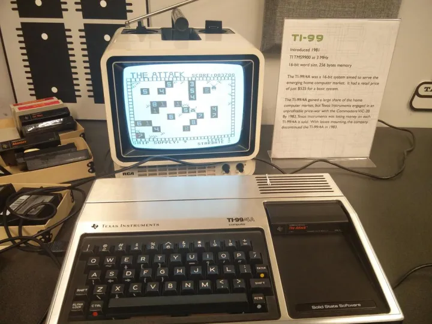

## 8-Bit的巅峰

这部Sinclair ZX81被放在展区一角的架子上，并没有配置成可以让参观者操作的状态，但这部电脑确是家用电脑小型化和廉价化的先驱，Sinclair的设计方是Sinclair Research（关于这家公司的创始人Clive Sinclair，曾经出现在[追寻ARM的起源——Acorn电脑简史](https://zhuanlan.zhihu.com/p/20498012)一文中），Sinclair ZX81的价格在当时可谓低到惊人，需要自行组装的配件只要£49.95，而开箱即用的整机则只要£69.95（美国售价$99.95），电脑的重量只有350克，但却配置有一颗速度相当快的3.25Mhz Z80处理器，加上来自包括Psion在内的软件提供商提供了一系列优秀的软件（这段历史可以在[PSION简史——Symbian的史前时代](https://zhuanlan.zhihu.com/p/21363028)找到），让整个Sinclair ZX系列成为少数能和Atari，Commodore等美国品牌抗衡的非美国出产的家用电脑产品。

**Sinclair ZX81**  
CPU：Zilog/NEC Z80/3.25Mhz  
内存：1KB

  

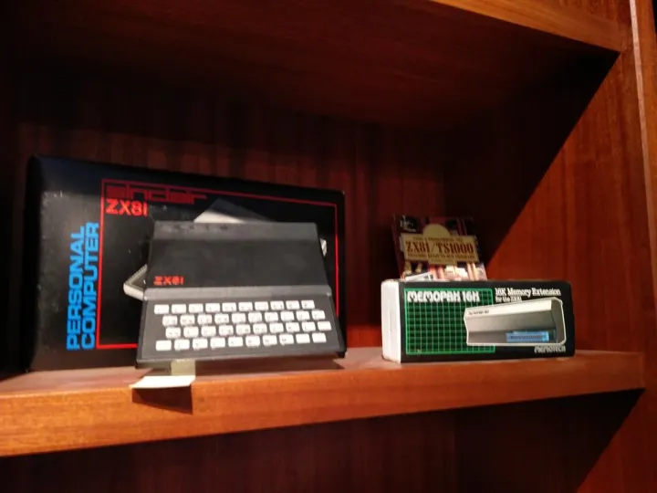

1982年，历史上最为成功的8-Bit电脑Commodore 64发布了。Commodore 64的核心是来自MOS Technology三件套，MOS 6510 CPU，MOS VIC-II图形芯片，以及MOS SID声音芯片。Commodore 64的名称取自其装备了在8-Bit时代相当奢侈的64KB内存，在当时，装有48KB内存的家用电脑已经算得上是“顶配”，一台48KB Apple II+当时大概要$1200，一台同样内存容量的Atari 800要$899，而Commodore 64只要$595（相当于今天的$1480）。

而Commodore 64最令人称道的则是其装备了由Robert Yannes（在离开MOS Technology之后，Robert创立了电子乐器和声音芯片厂商Ensoniq）设计的SID声音芯片，与当时大多数家用电脑只能产生方波不同，SID能够产生锯齿波、三角波、脉冲、噪音，还带有ADSR包络功能，给电脑音乐的创作带来了极大的空间，而像Martin Galway、Rob Hubbard、Jeroen Tel等游戏作曲家也在Commodore 64平台上创作出一大批优秀的游戏音乐作品，成为后来Chiptune音乐的起源（参见：[比特革命（下）——8-bit名人录](https://zhuanlan.zhihu.com/p/21327642)）。

**Commodore 64**  
CPU：MOS 6510 1Mhz  
内存：20KB ROM+64KB RAM  
显示：VIC-II，320x200分辨率，16色

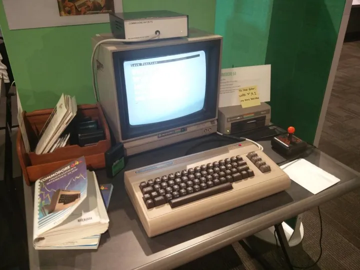

作为欧洲厂家对Commodore 64的反击，1984年由英国制造商Amstrad推出的Amstrad CPC 464（Colour Personal Computer - 彩色个人电脑）可能是最成功的一个。CPC464采用4Mhz Zilog Z80A处理器，内置64K内存，并集成了磁带机，这款电脑在欧洲多个国家总共销售了两百万台。  

  

**Amstrad CPC-464**  
CPU：Zilog Z80A 4Mhz  
内存：64KB RAM  
显示：Motorola 6845（IBM PC的CGA采用同样的芯片）  
声音：General Instrument AY-3-8910

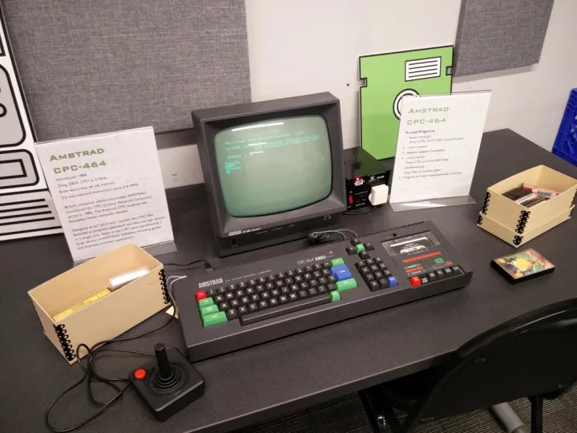

1984年，苹果在推出他们的16-Bit电脑Macintosh的同时也推出了Apple IIc，以证明他们并非因Macintosh的推出而放弃之前的Apple II用户（2015年的电影史蒂夫·乔布斯中也有表现沃兹尼亚克和乔布斯就Apple II电脑的价值而产生的争执）。Apple IIc在硬件上讲是一部便携版的Apple IIe，使用了低功耗的65C02处理器，和类似于后来笔记本电脑中所采用的侧置软驱设计。并且Apple IIc是苹果“白雪公主”设计语言的第一款机型，其未来感的造型即使放到今天也不落伍。  

**Apple IIc**  
CPU：65C02 1Mhz  
内存：32KB ROM+128KB RAM  
显示：560x192分辨率，15色  
软驱：内置140KB 5.25英寸软驱

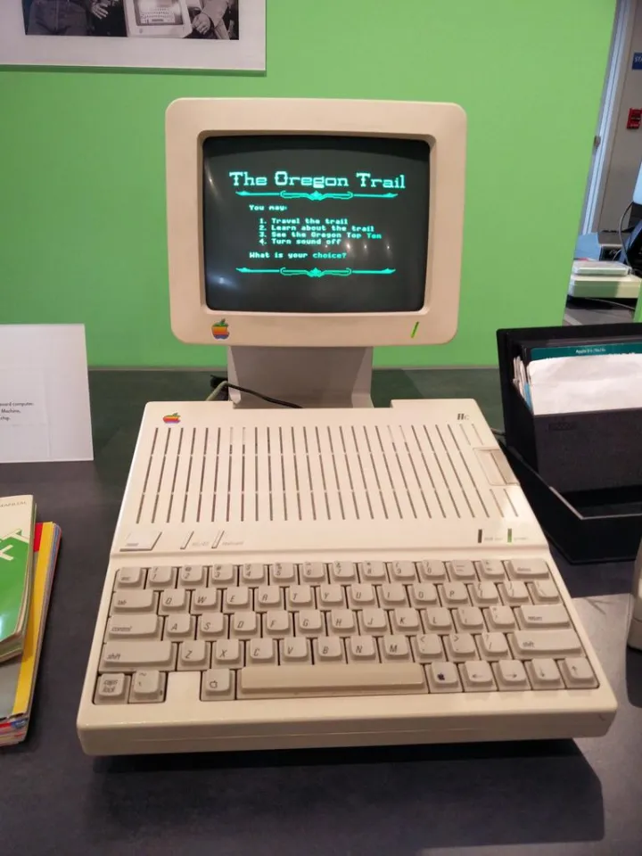

便携电脑的出现  

在液晶显示器被应用在现代意义的笔记本电脑之前，已经有许多厂家开始尝试生产便携式电脑了，Osborne是最早生产便携式电脑的厂家之一，其著名的Osborne 1（1981年）是第一款商业上取得成功的编写式电脑，而Osborne Executive是他们的第二款产品（1982年）。这部便携式电脑的性能相当强大，装备了6Mhz的Z80B CPU和124KB内存，以及双5.25寸软驱，价格自然也是不菲，$2,495（今天的$6000左右）的售价果然配得上总裁（Executive）的称号。

**Osborne Executive**  
CPU：Zilog Z80B/6Mhz  
内存：124KB，60KB用户可用空间，最高可扩展到384KB  
软驱：双5.25英寸软驱  
操作系统：CP/M  
重量：13KG

  

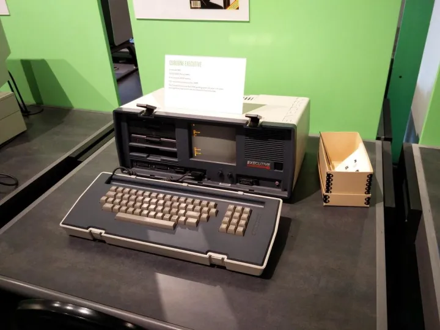

在当时的便携电脑市场上，并非是Osborne一枝独秀，Non-Linear Systems的KAYPRO系列就是当时诸多编写电脑生产商之一，下面的这台KAYPRO 10是KAYPRO在1983年最高配置的产品，其配置了10MB内置硬盘在当时可谓是“小身材大肚量”了，有趣的是在它使用的CP/M操作系统中，两个硬盘分区的盘符分别是A:和B:，而软驱则是C:，跟后来的DOS系统正好相反。

**KAYPRO 10**  
CPU：Zilog Z80/2.5Mhz  
内存：64KB  
显示：9英寸绿色磷光显示屏，24行80列  
软驱：5.25英寸双面软驱，380KB  
硬盘：10MB  
操作系统：CP/M  
重量：14KG

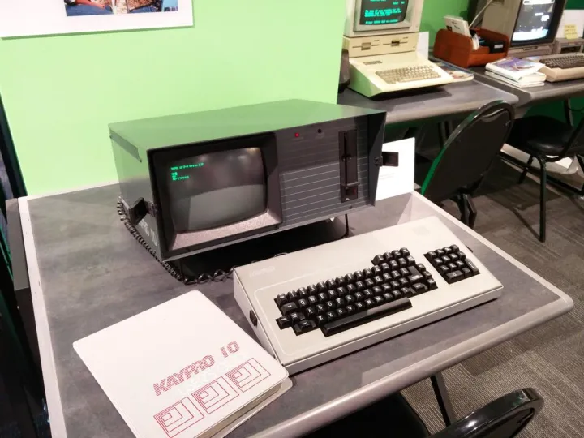

## IBM PC及兼容机

1981年，在大多数电脑厂商仍然在享受着8-Bit架构巨大销量（1979年销售额为1.5亿美元，1980年在此基础上增加了40%）所带来的红利时，IBM就已经开始布局16位市场了。IBM PC 5150系列的正式祖先一般认为是IBM 5100，一部售价高达8000~20000美元的，面向专业可研市场的“小大型机”（最高配置的机型可以运行当时只能在大型主机上使用的APL编程语言）。

IBM PC采用了Intel的16-Bit处理器8088，出厂预装的内存为16KB或64KB，可以选装CGA彩色显卡或者MDA单色显卡，其中CGA显卡可以兼容NTSC制式的电视机。不过由于高昂的售价（16K内存，没有软驱和显示器要$1565），大多数的IBM PC都被用作商用，因此能显示更多文字内容的黑白显卡以及带单软驱或双软驱的配置是当时最为常见的。

**IBM PC 5150**  
CPU：Intel 8088/4.77 Mhz  
内存：16KB~256KB  
显示：CGA彩色显卡或MDA单色显卡  
软驱：5.25英寸软驱，160 KB SSDD/360KB DSDD  
操作系统：PC-DOS  

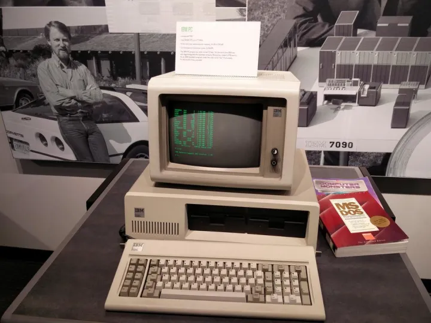

IBM公开了其IBM PC的硬件细节，并放弃了硬件的专利权，但是IBM仍然持有PC硬件的软件部分——BIOS的专利，这“留一手”的做法保证了IBM在PC市场上的先发优势。相比其他一些厂家照抄IBM的电路板及BIOS，三洋MBC-550系列采用了自行设计的电路板和BIOS。出于支持日文汉字显示的缘故（日本型号为MBC-55），这款机型采用了一款改进过的CGA显卡（支持640x200高分辨率，取消了纯文本模式）导致其并不完全与原厂IBM PC兼容。同样，出于节约成本（售价低于$1000）的考虑，MBC-550使用了只有3.58Mhz的Intel 8088处理器，是市面上唯一一款处理器速度低于IBM 5150的PC兼容机。

**Sanyo MBC-555**  
CPU：Intel 8088/3.58 Mhz  
内存：128KB/256KB  
显示：增强版CGA彩色显卡  
软驱：5.25英寸软驱，160 KB SSDD/360KB DSDD（不完全兼容IBM格式）  
操作系统：MS-DOS  

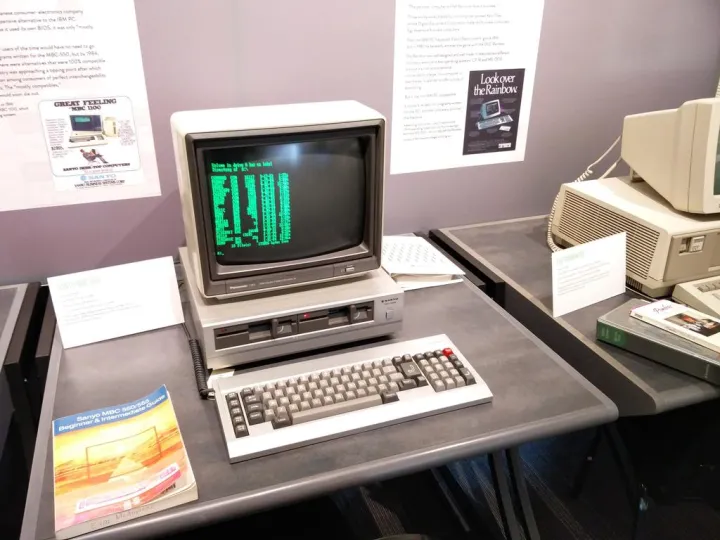

在80年代初期，商用微型电脑市场上同时存在着三种需求。连接大型主机或小型机的终端机、应用环境成熟的8080/Z80+CP/M 8-Bit微型电脑，以及新兴的、功能更为强大的8086+MS/DOS 16-Bit微型电脑。

DEC Rainbow（彩虹）100就是整合这三种应用的一次尝试，Rainbow 100内置了两颗CPU：一颗Zilog Z80和一颗Intel 8088，同时支持三种操作模式，VT-100终端，8-Bit CP/M电脑（使用Z80），和16-Bit CP/M或MS-DOS电脑（使用8088）。

1984年，旧金山的Tom Jennings开发了FIDO（惠多网）协议，并和圣路易斯的John Madil使用两台DEC Rainbow完成了第一次BBS转信，基于FIDO协议，一个世界范围内的计算机网络——FidoNet被建立起来，在Internet服务普及之前，这是最为著名的BBS网络，而世界范围的电子邮件服务，也在FidoNet的基础上流行起来。

**DEC Rainbow**  
CPU：Intel 8088/4.815 Mhz + Zilog Z80/4.012Mhz  
内存：64~896KB  
显示：纯文本 24行 x 80列/132列  
软驱：两部或四部5.25英寸软驱，400KB  
操作系统：CP/M，MS-DOS  

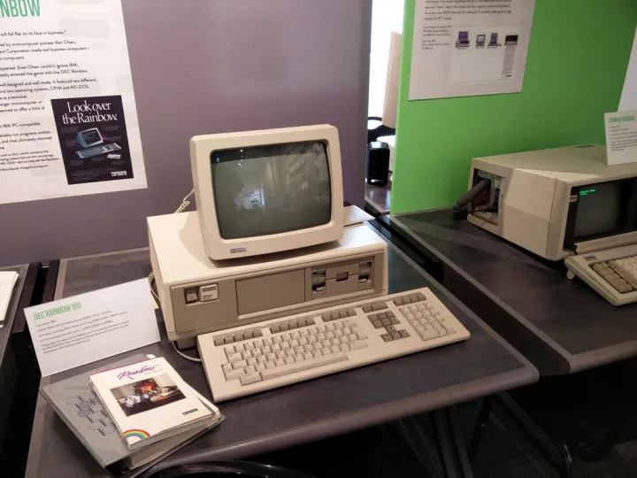

1983年，IBM希望将IBM PC先进的16位架构推向家用电脑市场，推出了一款面向家用电脑市场的廉价IBM PC兼容机，PCjr（PC junior “小PC”），为了照顾家用电脑用户的习惯，PCjr的软驱下方加入了两个卡带插槽，并且采用了红外无线连接的巧克力键盘。同时，IBM升级了之前IBM PC中所使用的CGA显卡，称为“Video Gate Array”（请不要和后来的VGA - Video Graphics Array混淆，PCjr上的显示模式往往会被称作CGA+），并采用了和TI-99/A相同的TI SN76489声音芯片，雪乐山（Sierra）的成名作King's Quest - 国王密使，就是为PCjr量身定制的。

  

不过PCjr普遍被认为是一款商业上失败的产品，而罪魁祸首就是那个看起来相当先进的无线键盘。在当时PCjr的价格高于Apple IIc在内的8-Bit家用电脑，使其往往被作为低端的商用、教育电脑采购，而糟糕的键盘手感使其难以胜任商业场合密集的录入工作。这种高不成低不就的状态使其在Tandy 1000等竞争者出现后迅速淡出市场。

**IBM PCjr**  
CPU：Intel 8088/4.77 Mhz  
内存：64KB  
显示：Video Gate Array（CGA+）300x200@16色，640x200@4色  
声音：TI SN76489  
软驱：5.25英寸软驱，360KB DSDD  
操作系统：PC-DOS

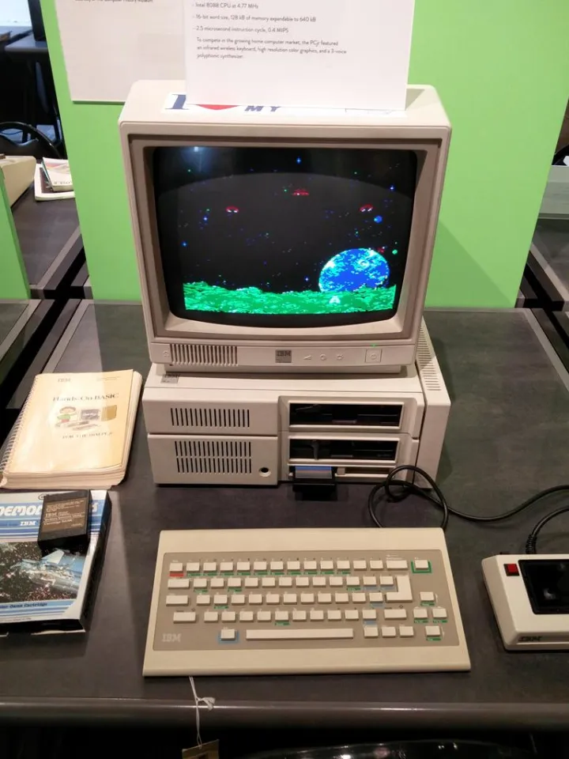

1984年，曾经发布了1977年三剑客之一TRS-80的Tandy/RadioShark看到PCjr背后巨大的市场机会，开发了第一款商业上成功的IBM PC兼容型家用电脑——Tandy 1000。许多人认为，Tandy 1000“是PCjr应有的样子”。Tandy 1000的声音和显示芯片都与PCjr兼容，以至于成了当时IBM PC架构家用电脑的事实标准，Tandy Graphics Adapter (TGA) 显示模式被80年代众多游戏开发商所使用（照片中显示的是1989年版的模拟城市）。

**Tandy 1000**  
CPU：Intel 8088/4.77 Mhz  
内存：128KB，可升级到640KB  
显示：Tandy Graphics Adapter（TGA）300x200@16色，640x200@4色  
声音：TI SN76496  
软驱：5.25英寸软驱，360KB DSDD  
操作系统：MS-DOS  

  

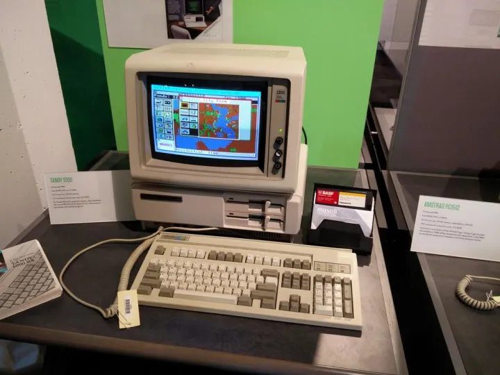

同年，IBM推出了其高端PC产品，著名的IBM PC/AT，使用了带有24位地址总线、支持保护模式的80286处理器，从此有了x86的说法，IBM PC/AT可以说是一款定义了现代PC的产品，许多AT上引入的新技术都沿用至今，比如ATA（IDE）硬盘，电池支持的RTC和CMOS参数存储区（所以BIOS设置也叫CMOS设置），101键键盘，16450 UART等等。

图中运行的图形操作环境就是大名鼎鼎的Windows 1.0了，其附带的文件管理器被称作MS-DOS Executive（MS-DOS总管），可以看作是今天Windows上File Explorer的起源。

**IBM PC/AT**  
CPU：Intel 80286/ 6Mhz或8 Mhz  
内存：256KB，可升级到16MB  
显示：CGA/MDA/EGA/PGA  
软驱：5.25英寸软驱，1.2MB DSHD  
操作系统：PC-DOS，OS/2，PC/IX，Xenix  

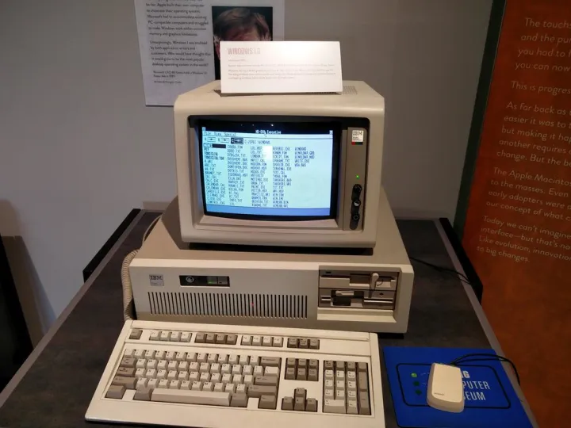

英国制造商Amstrad同样选择了IBM PC兼容机作为其16-Bit产品线的基础，1986年的PC1512是欧洲市场上第一款平价的PC兼容机，售价£499。另外值得一提的是，这款电脑出厂的预装软件里，不仅仅有IBM PC兼容机通常使用的MS-DOS，还有来自Digital Research Inc.（数字研究公司，CP/M的开发者）的DOS Plus（DR-DOS的早期版本），以及同样由Digital Research开发的Graphical Environment Manager (图形环境管理员 - GEM)，GEM曾经是MS Windows在PC兼容机图形界面上的有力竞争者，后来Digital Research被Novell收购，GEM也由此淡出市场，不过DR-DOS仍然出现在Novell的NetWare等产品中。  

**Amstrad PC1512**  
CPU：Intel 8086/8 Mhz  
内存：512KB，可升级到640KB  
显示：CGA+  
声音：TI SN76496  
软驱：5.25英寸软驱，360KB DSDD  
操作系统：MS-DOS，DOS Plus  

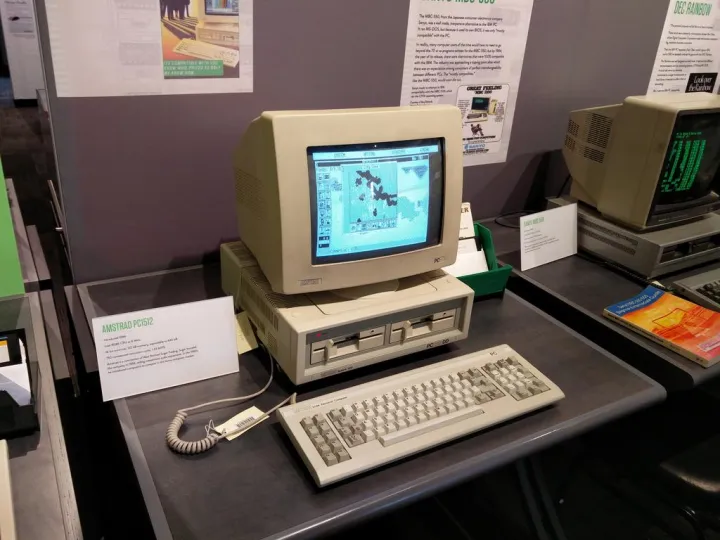

1980年代是一个微处理器大战的年代，8-Bit处理器延续了MOS 6502对阵Zilog Z80的格局，而在换代的处理器上，当年8-Bit时代的风光无限的厂商苹果、Commodore和Atari却不愿跟随IBM的脚步，而是投奔了跟MOS 6502有着叔侄关系的Motorola 68000（m68k）阵营。请看下集 [带你逛西雅图活电脑博物馆（四）](https://zhuanlan.zhihu.com/p/21829764)。