# 带你逛西雅图活电脑博物馆（四）
## 摩托还要骡拉

似乎在大多数中文媒体的语境中，个人电脑发展史似乎就是这样的：

70年代：Apple II  
80年代，IBM大战苹果，IBM胜  
90年代，Wintel帝国  
00年代，苹果靠iPhone逆袭成功

但事实上，个人电脑的发展史远不是如此单薄，从Apple II的那个时代起，个人电脑大战一直都是围绕着两大微处理器供应商——Intel和Motorola展开的，从今天看来，IBM当年选择开放的PC架构是Intel阵营取得胜利的关键，因为在当时仅以IBM一己之力，是几乎不可能战胜Motorola阵营的精兵强将的。

Motorola 68000，也就是我们后来所说的m68k处理器，要到比Intel 8086处理器晚两年的1979年才出现，这也让它未能成为IBM PC的心脏。为了不落后于8086，m68k在设计上使用了32位寄存器和内部总线，成为一款16/32-Bit混合型CPU，性能也较8086更强，所以80年代的主流的家用电脑为了实现图形界面和多媒体功能，都采用了m68k处理器。  

Apple Lisa被认为是消费市场上第一款采用了GUI的个人电脑产品，而展出的这台则是Lisa于1984年的改进版Lisa 2，相比初代的Lisa，第二代产品还用了和Macintosh电脑上类似的3.5寸软驱。

虽然很多人认为Macintosh是Lisa的替代品，但实际上这两款产品的开发却几乎是并行的。Lisa被设计为高端的Apple III的继承者，而Macintosh则被设计用来替代Apple II。相比Macintosh，Lisa被设计为“开放系统”，具备可以安装扩展卡的插槽。

**Apple Lisa 2**  
CPU：Motorola 68000/5MHz  
内存：512KB~2MB（标配1MB）  
显示：12英寸灰度显示器， 720x364分辨率  
软驱：索尼3.5寸软驱，400KB SSDD  
硬盘：5MB/10MB，外置式（照片中没有安装）  
系统：Lisa OS

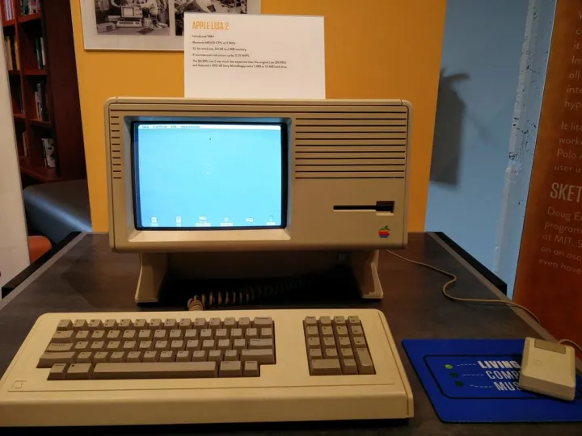

Macintosh最初设计为使用Motorola 6809E处理器的8-Bit电脑，不过在1980年，融合了部分Lisa开发成果（包括68000处理器，以及基于Lisa图形功能开发的QuickDraw）的Macintosh使苹果的整个产品线都迁移到68000处理器上来。

1984年上市的Macintosh有着比Lisa更快的8KB CPU，不过相比起面向高端市场的Lisa，Macintosh只配置了较少的128KB内存，不过无论是Macintosh（US$2495）还是Lisa（$9995），在当年都是相当昂贵的产品，对于他们来说，8-Bit家用电脑仍是较为可以承受的选择。

**Apple Macintosh**  
CPU：Motorola 68000/7.83MHz  
内存：128KB/512KB  
显示：9英寸灰度显示器， 512x342分辨率  
软驱：索尼3.5寸软驱，400KB SSDD  
系统：System 1.0

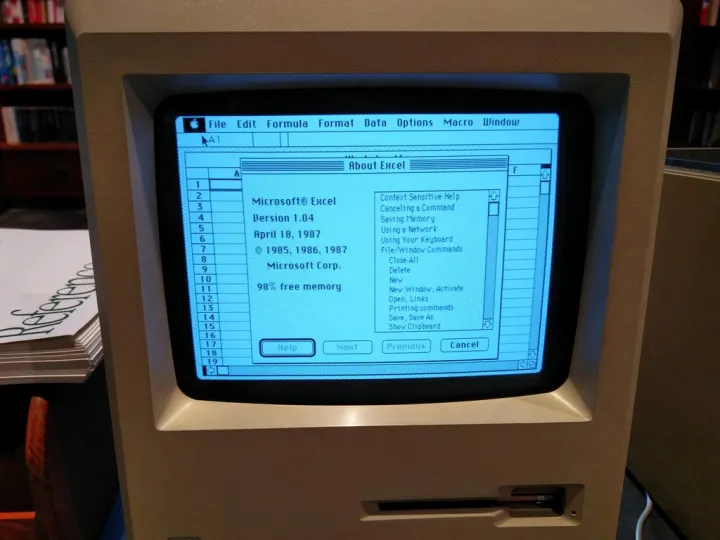

在Macintosh刚刚问世的那段时间，大多数的软件开发者对于开发图形界面的软件仍然相当的陌生，随着1984年的Multiplan（Excel的前身）和1985年的Word陆续登陆Macintosh平台，微软是当时Macintosh平台上最重要的软件开发商之一。

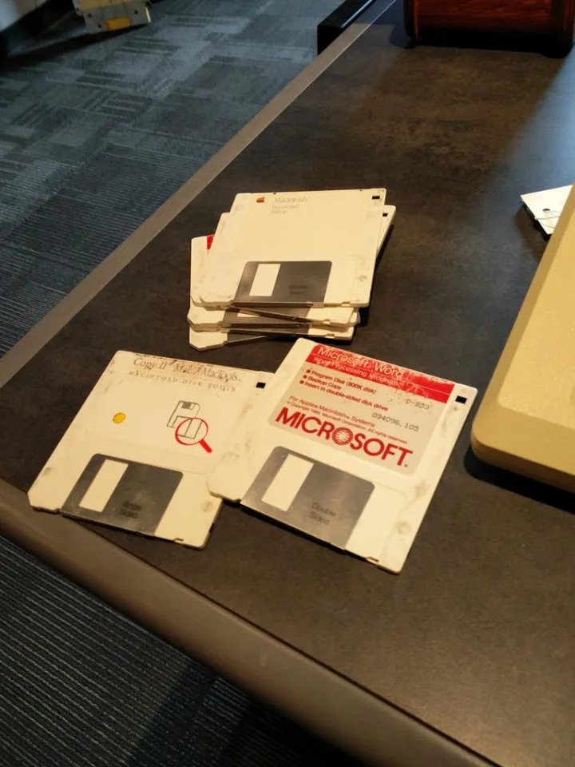

1984年，Commodore的创始人Jack Tramiel由于和Commodore的早期投资人Irving Gould在经营理念上的冲突，离开了自己一手创建的Commodore，与追随自己的一批老员工一起创办的Tramel Technology，开始设计基于Motorola 68000处理器的新型电脑。而此时的Atari，正深陷1983年“Atari危机”所带来的电子游戏大崩溃当中难以自拔，此时Jack Tramiel看好Atari遍布世界的制造与销售网络，将Atari的消费电子部门收入囊中，并于Tramel Technology合并成为新的Atari Corp.（之前的Atari全名为Atari Inc.）

Atari ST的操作系统Atari TOS使用了由 Digital Research开发的GEM图形界面，是当时市面上能买到的少数几款预装有图形界面的个人电脑之一，加上使用了与Macintosh相同的Motorola 68000处理器，被当时的许多媒体称为“Jackintosh”。

在MIDI音乐的历史上，Atari ST电脑也有着不可磨灭的贡献，与其他电脑需要额外的接口板、接口箱不同，Atari ST内置了MIDI输入输出接口，使其成为当时最适合MIDI创作的电脑，著名的音频软件Cubase以及Notator（Logic Pro的前身）都出现在这一平台上。

**Atari ST**  
CPU：Motorola 68000/8MHz  
内存：512KB~4MB（图中的1040ST预装1MB）  
显示：600x200 4色，320x200 16色  
声音：Yamaha YM2149 PSG，MIDI输入/输出  
软驱：3.5寸软驱，360KB SSDD  
系统：TOS

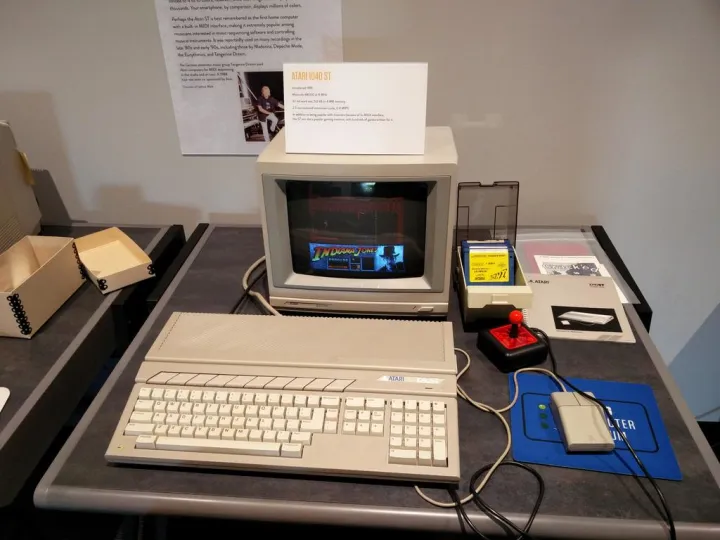

实际上，早在Jack Tramiel收购Atari消费产品部门之前，Atari内部就有技术人员开始了对Motorola 68000处理器的研究，曾经主持Atari 800芯片组中ANTIC芯片设计的Jay Miner就是其中之一。只是当时的Atari并没有开发新型电脑架构的意愿，使Jay Miner不得不另外找机会实现自己的新型电脑，这就是后来Atari ST最大的竞争者——Amiga。[Amiga电脑传奇（一）](https://zhuanlan.zhihu.com/p/20861793)  

Amiga以其强大的图像和声音处理功能著称，其三芯片的芯片组设计从某种程度上可以说是Atari 400/800中三芯片结构的延续，其显示部分支持非常超前的4096色显示，而声音部分则可以支持立体声8-Bit PCM，并同时支持播放四个独立的音轨。

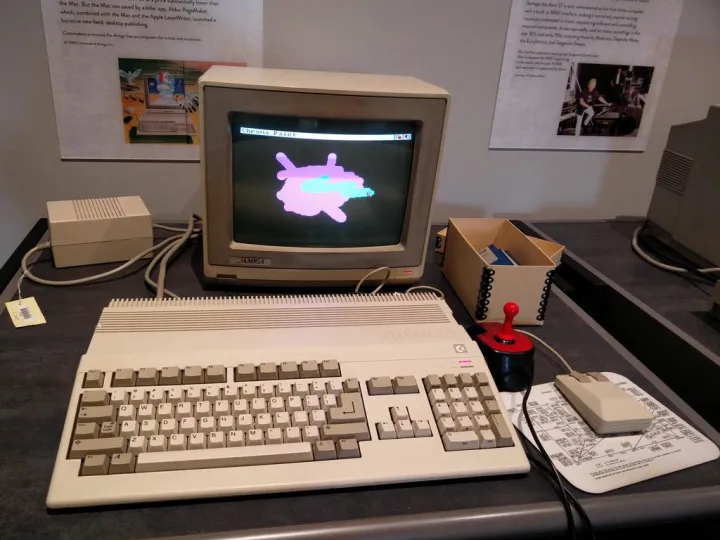

得益于强大的图像和声音处理功能，Amiga上出现了一大批面向数字内容创作的软件，这其中就包括了成为90年代游戏图形标准的Deluxe Paint [写给程序员的美术创作指南](https://zhuanlan.zhihu.com/p/21706579)，著名的三维绘图软件LightWave，而Tracker music这种电脑音乐类别也出现在Amiga平台上。

这台1987年的Amiga 500是Amiga面向家庭用户的低端产品，同时期的，还有1985年上市的“原版”Amiga 1000和高端型号Amiga 2000，不过Amiga 500的处理器和内存并没有因此而缩水，只是少了高端用户所需的扩展插槽。

**Amiga 500**  
CPU：Motorola 68000/7.14MHz  
内存：512KB~8MB（预装512KB）  
显示：600x400 16色，320x200 4096色  
声音：Amiga Paula，8-Bit立体声  
软驱：3.5寸软驱，880KB  
系统：AmigaDOS+ Amiga Workbench GUI  

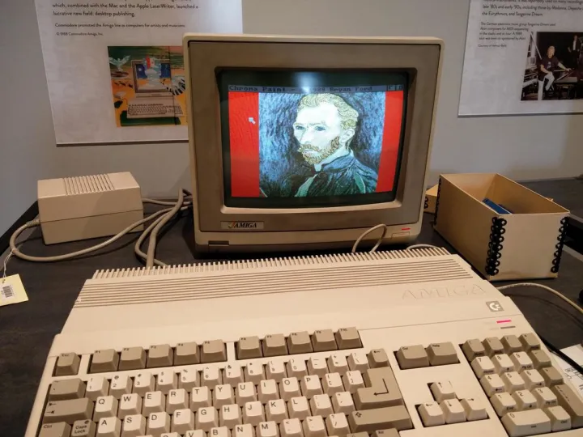

1982年，曾经喊出“网络就是计算机”，并发明了Java语言的太阳计算机系统（Sun）公司开始开发他们的Unix工作站产品，最初的产品线从Sun-1（68000）到Sun-3x（68020）都是基于Motorola 68000系列微处理器开发的。博物馆里展示的，是1986年的Sun-3/160，这台Unix工作站使用了16.67Mhz的Motorola 68020处理器，并配备4MB~16MB的内存。操作系统则是基于BSD的SunOS，同样得益于Unix体系良好的延续性，今天的Linux用户使用这台机器并不会感到太难上手。

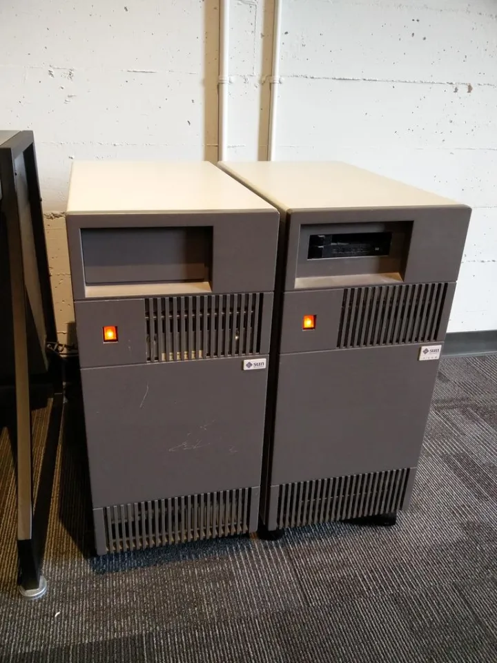

这台工作站最引人注目的，使其分辨率高达1152x900的19英寸显示器，想一下现在市面上那些分辨率只有1366x768的笔记本电脑，就知道这台当年只有灰度显示的显示器是多么的超前了。

**Sun-3/160**  
CPU：Motorola 68020/16.67MHz  
内存：4MB~16MB  
显示：1152x900 灰度  
系统：SunOS  
扩展槽：12个VME扩展槽

当年SunOS上面的窗口系统并非是现在在类Unix系统上流行的X-Window，而是自行开发的NeWS（Network extensible Window System - 网络可扩展窗口系统），NeWS采用PostScript解释器来驱动其界面显示，这一点非常类似于后来在NeXT上使用的Display PostScript。而NeWS的许多界面元素，后来也影响到OPEN LOOK和Motif中（看到那个熟悉的小挂钟了吗？）。

  

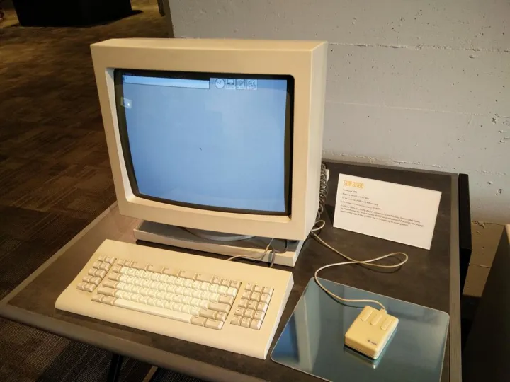

1985年，离开苹果的史蒂夫·乔布斯希望设计一款面向高等教育的“3M电脑”（megabyte，megapixel ，million instructions per second 百万字节内存，百万像素显示器，百万指令每秒）。1989年，乔布斯带来了这款名为NeXT的电脑，它装备有25Mhz的Motorola 68030处理器，8MB内存，256MB MO驱动器，40MB~330MB的硬盘，10Mbps以太网，以及17寸1120x832高分辨率显示器。

虽然高昂的售价$6500（约合现在$13000）未能让NeXT电脑在普通用户中取得成功，但在高校、政府和科研机构相当受欢迎，世界上第一台Web服务器就是架设在CERN（欧洲核子研究中心）的一台NeXT电脑上的。

**NeXT Computer**  
CPU：Motorola 68030/25MHz  
FPU：Motorola 68882/25Mhz  
DSP：Motorola XSP56001  
内存：8MB~16MB  
显示：1120x832 灰度  
系统：NeXTSTEP  

时至今日，我们仍然能在苹果的macOS和iOS上找到许多当年NeXT电脑的痕迹，最新版本的XCode的界面设计器就是当年NeXTSTEP系统的界面设计器Interface Builder的后裔。

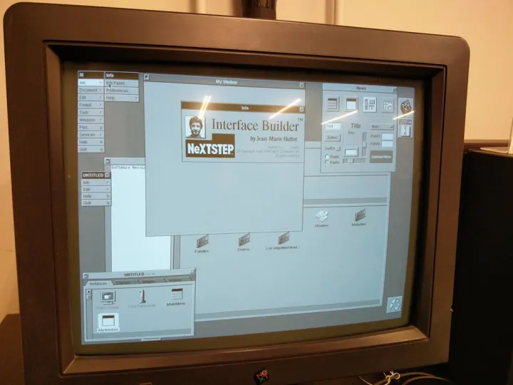

Project Builder（在Mac OS X 10.3中改名为XCode）和Objective-C代码，至今仍然是苹果平台上的主力开发环境。  

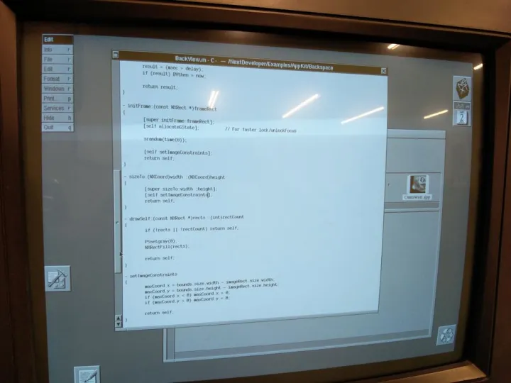

NeXT上的国际象棋游戏，20多年来几乎没有明显的变化。

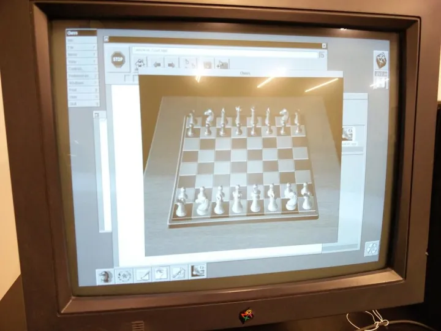

这一张图中，运行的是1995年的浏览器OmniWeb，The Omni Group从1989年成立以来一直专注于NeXTSTEP和后续的Mac OS X以及iOS的开发，也是最早应用Cocoa框架的应用程序开发商之一。macOS和iOS上流行的OmniFocus也是他们的产品之一。

  

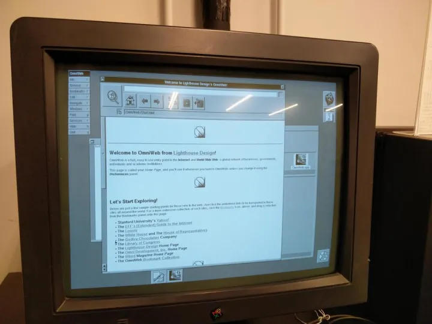

## Wintel帝国

相比Motorola的68000系列（1979），Intel进入32位时代整整晚了7年，不过在IBM开放架构的支撑下，一批实力雄厚的PC兼容机厂商涌现出来。1987年，康柏电脑抢先发布了自家的Deskpro 386电脑，比老大哥IBM领先了整整七个月。

这台出厂于1989年的Compaq Deskpro 386S是使用Intel 386SX处理器的低端型号，其管脚兼容286主板，所以只能算是一部16/32位混合型处理器，但在当时这样的电脑仍然是非常昂贵的，1MB内存，5.25寸软驱，不带硬盘的最低配置也要$3799，如果加上40M硬盘和彩色VGA显示器的话，价格则要$5018。

**Compaq Deskpro 386S**  
CPU：Intel 80386SX/16Mhz  
内存：1MB~13MB  
显示：VGA  
系统：DOS 3.31  
软驱：5.25寸1.2MB或3.5寸1.44MB

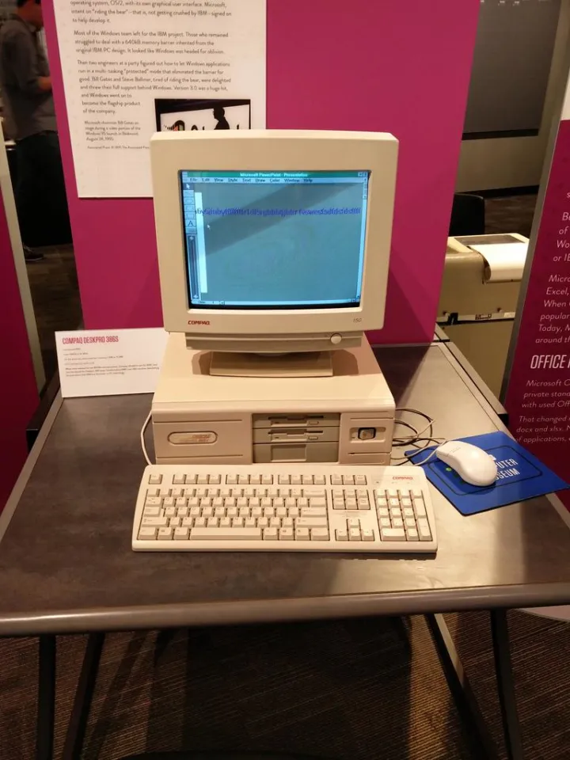

1990年，微软推出了两个重量级的产品：Windows 3.0以及从Forethought收购而来的PowerPoint，Windows 3.0添加了386增强模式，支持32位内存寻址，并在一年之后加入了Windows多媒体扩展，将PC带入多媒体时代。而PowerPoint则创造了PPT这一大家耳熟能详的新名词，改变了商务展示的模式。

1989年，Intel的486处理器进一步强化了32位x86处理器的性能，整合了FPU和8KB片上L1-Cache的486DX最高主频可达50Mhz，同时具有50MIPS的峰值性能，而它的前辈386 33Mhz只有11.4 MIPS，而其竞争对手Motorola 68030在50Mhz下也只有18 MIPS，微处理器大战的天平开始倒向Intel一方。

这台Gateway 2000 4DX/33推出于1992年，此时486电脑逐渐开始成为商用市场的主流，这台电脑装备有8MB内存和212MB硬盘，带有1MB显存的Cirrus Logic显卡（集成在主板上），并可以扩展到64MB内存。

**Gateway 2000 4DX/33**  
CPU：Intel 80486DX/33Mhz  
内存：8MB~64MB  
显示：Cirrus Logic 1MB  
系统：DOS 5.0+Windows 3.1  
软驱：3.5寸1.44MB  

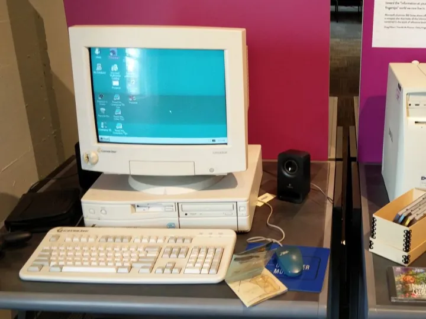

1995年，在滚石乐队Start me Up的节奏中，划时代的Windows 95上市，正式拉开Wintel王朝的序幕，486处理器的主频一路狂飙至100Mhz，而Motorola 68000系列的最后一款产品68060则永远的停在了66Mhz。

微软为了尽可能的展示Windows 95系统的强大功能，开发了一系列配套的应用软件，其中就包括这款把“拟物化”发挥到极致的Microsoft Bob。虽然Bob被PC World评为25款最差的科技产品中的第七名，但却启发了联想“幸福之家”系列的开发，而屏幕上那只小黄狗，也作为“Office助手”一直被保留到Office 2003中。

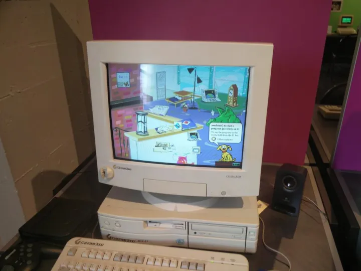

世纪末的1999年，Wintel帝国正处于其鼎盛时期，虽然微软仍然面对反垄断调查的困扰，但事实上已经没有对手，8-Bit时代的诸侯Apple、Commodore、Tandy和Atari中只剩下Apple还在勉力支撑，而x86处理器的频率也在此时突破1Ghz，不仅把老对手68000远远甩在后面，许多高性能的RISC处理器也感到巨大的压力。

这一年，以廉价的直销模式运营的戴尔电脑超过康柏成为世界第一大PC制造商，这台Dimension XPS B733具备超越其前辈的许多特征，800Mhz Rambus高速内存总线、AGP 4X高速显卡接口，高性能的SoundBlaster Live! Value声卡，以及纯32位的Windows 2000操作系统。

**Dimension XPS B733**  
CPU：Intel Pentium III/733Mhz  
内存：128MB RDRAM  
显示：TNT2 M64 32MB，AGP 4X  
声音：SoundBlaster Live! Value  
软驱：3.5寸1.44MB  
硬盘：30GB 7200RPM，ATA66  
显示器：Dell UltraScan P780 17寸特丽珑  
系统：Windows 2000 Professional

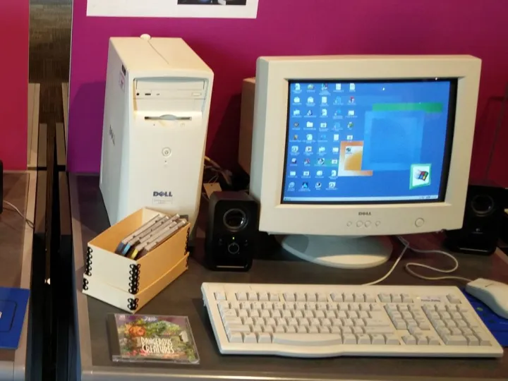

这一时期，IBM兼容机成为家用电脑游戏的主流平台，在之后的语境中，“PC游戏”这一概念，往往特指IBM兼容机上的游戏了。

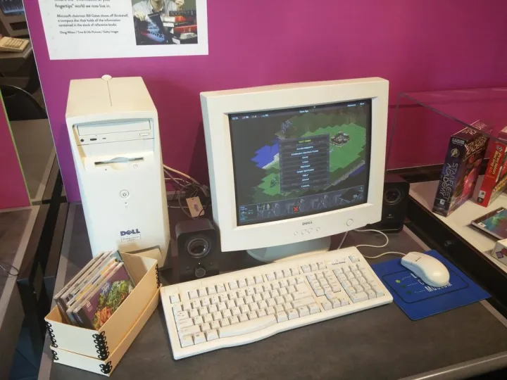

记得90年代中期笔者第一次进学校的电脑房的时候，仍然是需要穿鞋套的~( ╯□╰ )，在活电脑博物馆中，有一个被称作“conditioned room - 空调房”的区域，不过别紧张，不需要穿鞋套就可以进，下一期[带你逛西雅图活电脑博物馆（五）](https://zhuanlan.zhihu.com/p/21895357)我们将带你走进空调房，看一看那些曾经“养尊处优”的大型主机们。

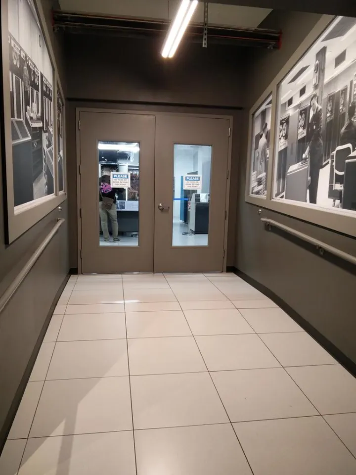

发布于 2016-08-04 16:27