# 带你逛西雅图活电脑博物馆（五）
## 走进“玻璃房子”

许多介绍国产服务器的文章，都会提到那间放着大型主机却不许中方员工入内的“玻璃房子”，将电脑房设计成“玻璃房子”，一方面出于安全的考虑（防止无关人员操作，以及防盗的需求），而另一方面，高价买来电脑主机的企业也希望那些闪烁着灯光的电脑成为企业展示实力的“活广告”。

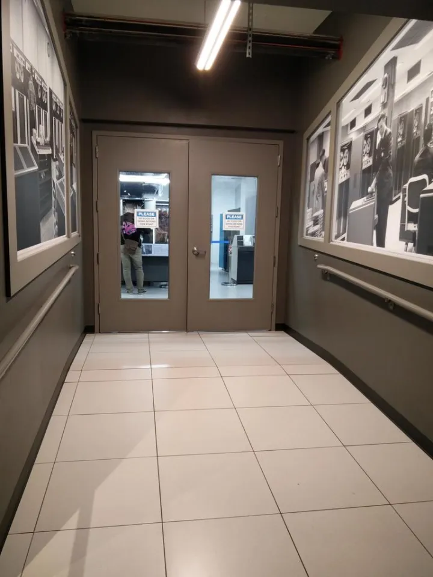

时过境迁，今天的国产超级电脑在电脑排行榜上屡次夺冠，昔日不得入内的中国员工如今正是“去IOE”的主力军。但神秘的“玻璃房子”仍然是不少电脑爱好者心中的圣地。

1964年，东西方两大阵营之间军备和太空竞赛日益升级，这一年，中国第一颗原子弹在罗布泊试验成功，成为世界上第五个核国家。同年，超级计算机之父西摩·克雷研制成功出定义了“超算”概念的CDC6600，而这款电脑使用最多的场合，就是模拟核试验（这才是真正的核弹啊）。

活电脑博物馆里的这台CDC 6500，则是CDC 6600的低端版本，使用了两颗40Mhz的6400 CPU，售价高达800万美元。

  

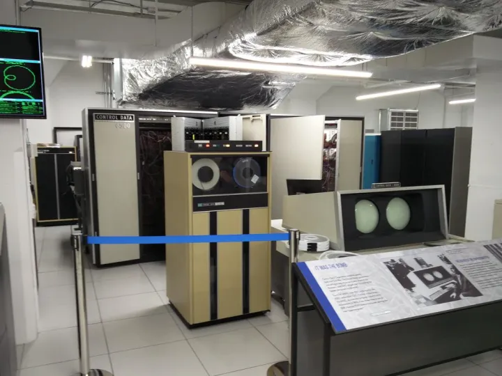

这台电脑在1967年由普渡大学购置，一直运行到1989年退役，后来被齐佩瓦瀑布工业历史博物馆（Chippewa Falls Museum of History and Industry）收藏，2013年底，保罗艾伦买下了这台电脑，修复工作持续至今仍在进行。下图是CDC 679-6磁带机。

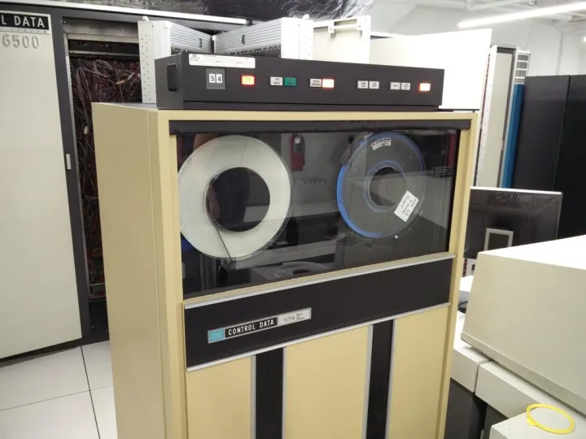

CDC 6400 CPU，相比CDC 6600所具有的10个功能单元，CDC 6400只有一个通用算术单元，所以性能不如CDC 6600那么强大，但价格也明显低于CDC 6600。CDC 6400的知名用户包括亚琛工业大学（RWTH Aachen University），以及欧洲核子研究中心（CERN）。

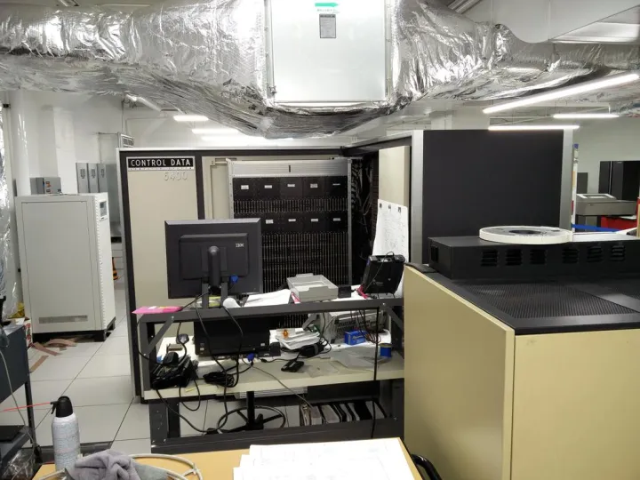

下图为CDC电脑的外设控制器  

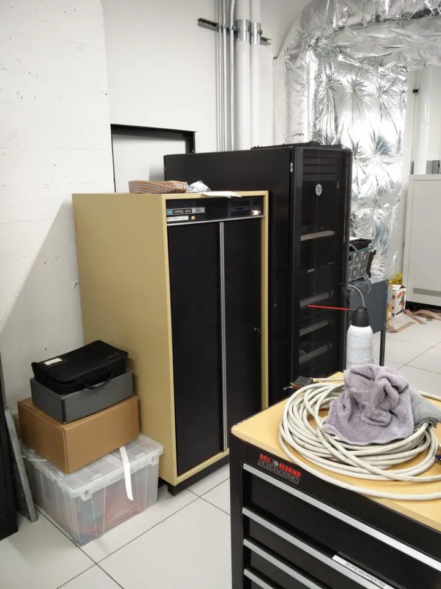

与著名的CDC 6600同年问世的，还有著名的IBM System/360——IBM最高端的大型主机z系列的前身。IBM 360系列的开发总共花费了50亿美元，是IBM 1962年营业额的两倍，不仅创造了延续至今的大型主机产品线，而且第一次实现了兼容多款机型的操作系统OS/360。

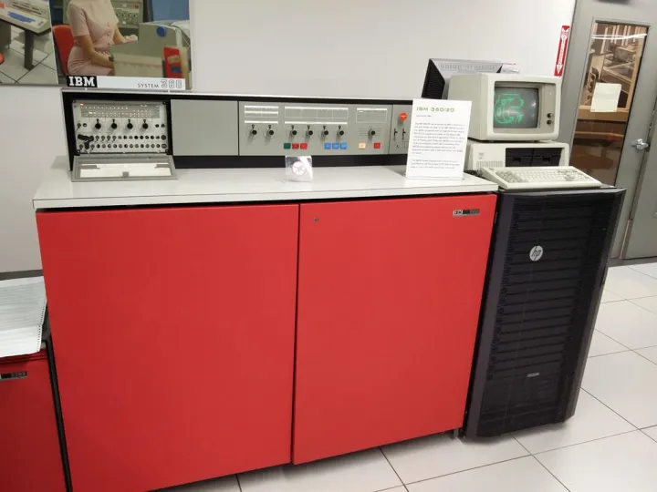

这台展示的IBM System/360，是1964年底的16-Bit（大多数的360都是32-Bit的）低端型号IBM 360/20，但大多数企业用户仍然买不起这样一台电脑，而是选择以$2000每月的价格租用。

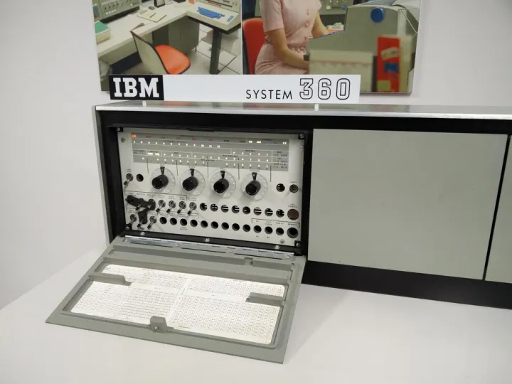

IBM 360的操作系统OS/360是计算机发展史上最有名的大型软件项目，IBM以五亿美元的高昂代价，为后来的大型软件工程留下了宝贵的经验，而主持开发OS/360的项目经理佛瑞德·布鲁克斯将这些经验写成《人月神话》一书，成为软件工程最重要的书籍之一。

下面这个面板是IBM 360系列最具代表性的控制面板了，开机的时候先要启动各种外设（90年代学电脑的童鞋们一定记得老师那句“先开外设再开主机”吧）把右边的四个（还是最右边的三个？）旋钮转到带有启动程序的外存（穿孔卡片、穿孔纸带或者磁带机）地址上，然后按绿色的START键就可以开机了，这个过程叫IPL（Initial Program Load），时至今日，AS/400小型机（IBM i系列）的启动过程仍然叫做IPL。

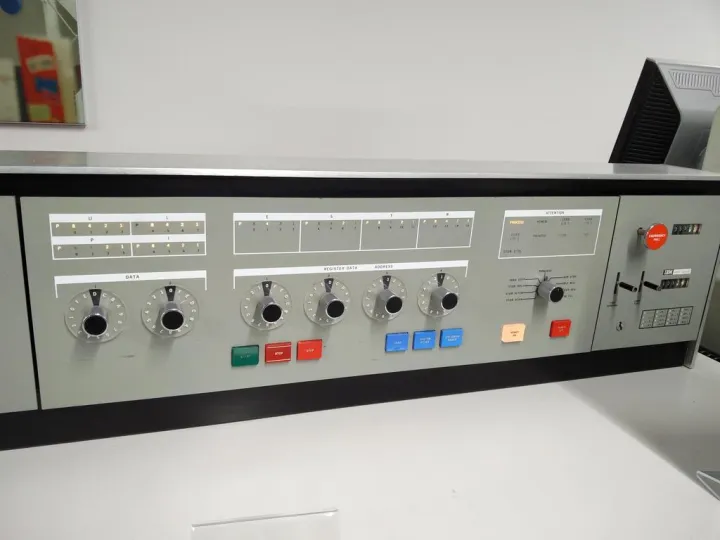

IBM 3330兼容型硬盘驱动器，使用的可更换磁盘包（Disc Pack）是Memorex Mark X型，每个磁盘包容量高达100MB。在现代电脑表示“数据库”的图标中，仍然能看到当年Disc Pack的影子。[为什么数据库会用圆柱体来表示?](https://www.zhihu.com/question/19673248)

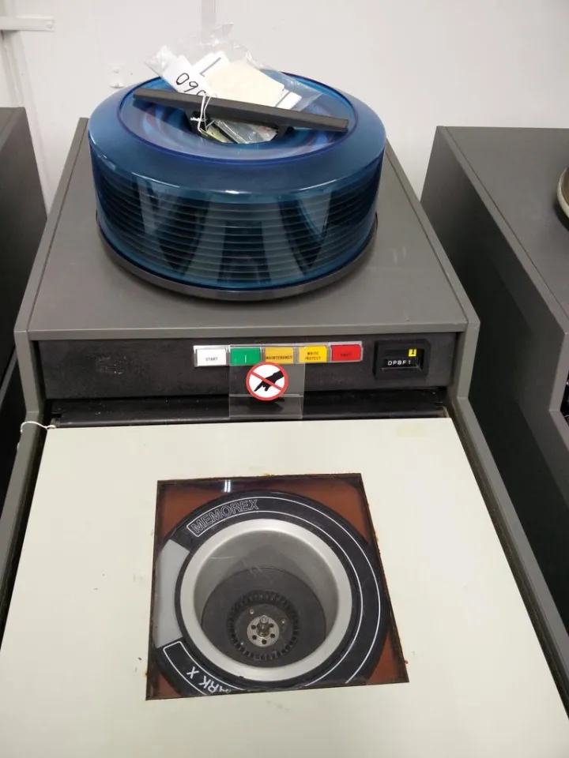

  
1969年，施乐收购了生产科研用电脑的Scientific Data Systems（科学数据系统），并获得了SDS Sigma产品线（后来改名为Xerox Data Systems），博物馆中的这台Sigma大型主机，是1971年生产的Sigma-9型大型主机。

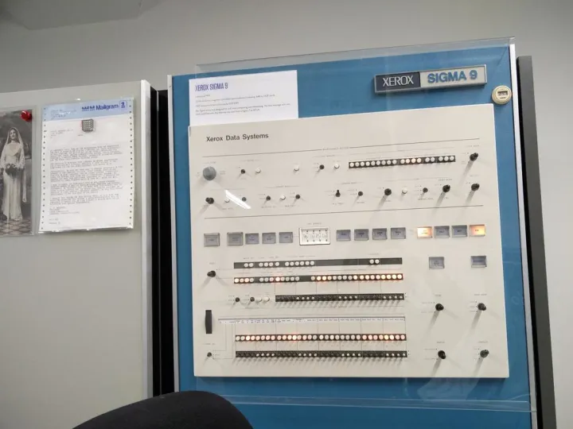

Sigma系列大型主机，在Internet的历史上曾经起到过举足轻重的作用，1969年，加州大学洛杉矶分校（UCLA）的一台Sigma-7大型主机成为ARPANET上第一个节点，拉开了Internet时代的序幕。  

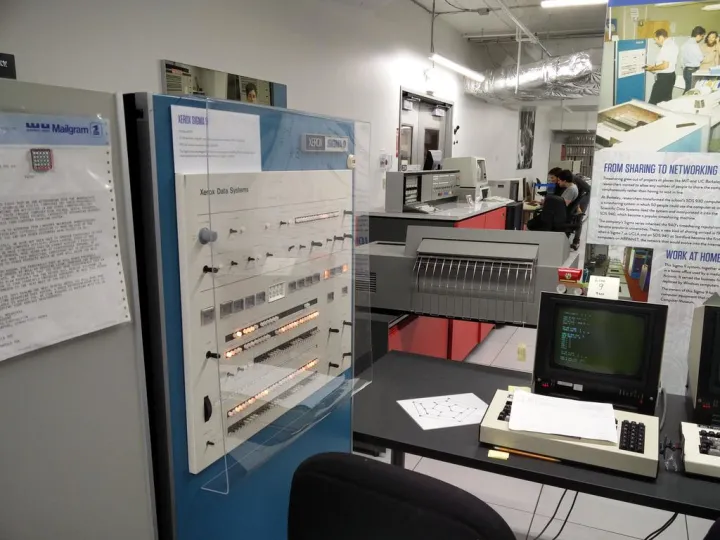

随着大型主机在大学和企业中的广泛应用，人们可以有更多的时间接触和使用大型主机，所以许多人也尝试着为大型主机编写游戏，在这台Sigma-9上，就可以玩经典的Hunt the Wumpus（Wumpus是游戏中的怪物名字，翻译过来就是“打怪兽”？），这是最早的文字冒险游戏之一。旁边的地图，则是游戏中的迷宫地图。

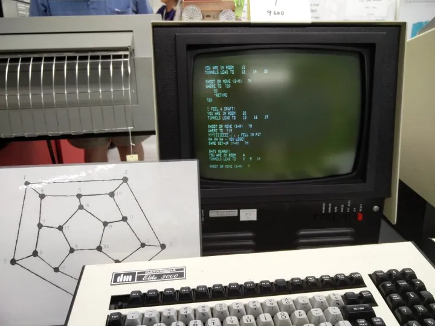

Xerox大型主机所使用的磁带机，其实相比起CPU，大型主机巨大体积的大部分都是由这些外设贡献的。

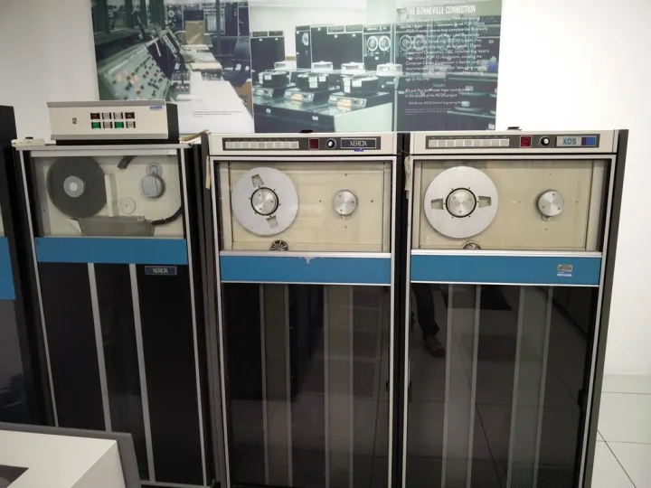

这台IBM 4341仍然在修复当中，所以并没有开机。IBM 4341是一款“中型机”（mid-range computer）推出于1979年，兼容IBM 370大型机的指令集。由于集成电路技术的进步，这台电脑并不一定要安装在空调房间内使用，而其性能则是IBM在1972年推出了IBM 370/138型的3.2倍。

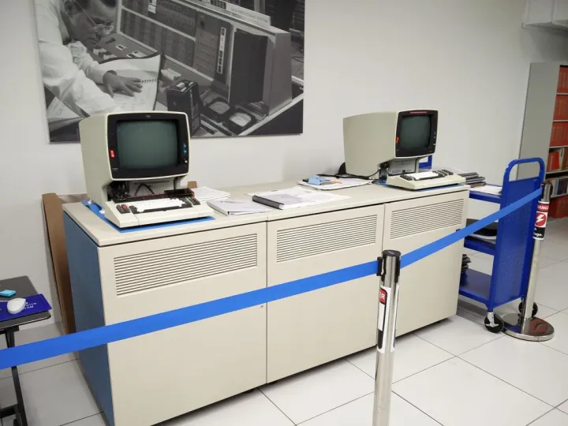

在改名为Living Computer Museum之前，这间博物馆被称作[PDPplanet.com](https://link.zhihu.com/?target=http%3A//www.pdpplanet.com)，保罗·艾伦创办这间网站，是为了让DEC PDP系列电脑的爱好者们能够利用telnet远程登陆体验到不同型号的PDP主机。自然，PDP系列电脑是这间博物馆藏品最丰富的类别，下一期[带你逛西雅图活电脑博物馆（六）](https://zhuanlan.zhihu.com/p/21916256)将专门介绍馆藏的PDP系列大型主机和外设。