# 带你逛西雅图活电脑博物馆（六）
## PDP行星

保罗·艾伦将这座建筑里变成活电脑博物馆之前，这儿曾经是[PDPplanet.com](https://link.zhihu.com/?target=http%3A//www.pdpplanet.com) 的总部，保罗·艾伦不仅收藏了大量的DEC PDP电脑，而且他还非常具有共享精神的博物馆里的许多电脑接上因特网，供爱好者免费接入。

在空调房中间的大屏幕上，显示着目前正链连接在因特网上的主机正在运行的程序。时至今日，对PDP有兴趣的爱好者仍然可以填写申请表获得可以远程登陆到博物馆内收藏的大型主机的账户。[Request a Login](https://link.zhihu.com/?target=http%3A//www.livingcomputermuseum.org/Online-Systems/Request-a-Login.aspx)

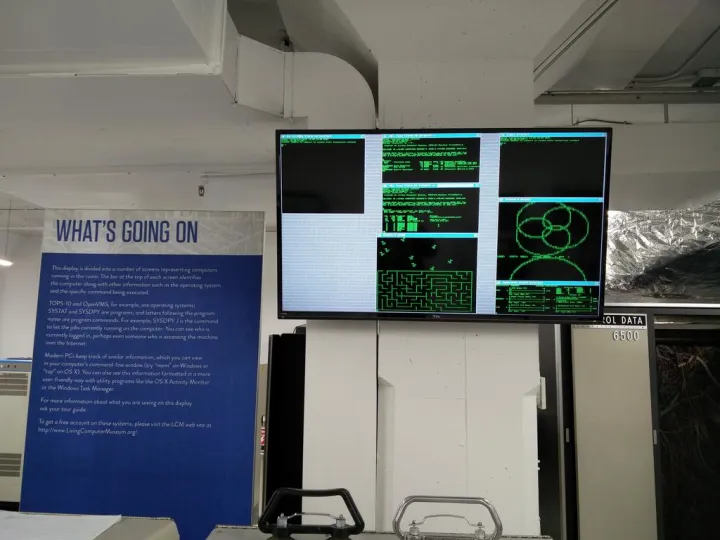

在构成APRANET最初的四个节点中，位于犹他大学（University of Utah）的节点是一台PDP-10大型主机，这台电脑的操作系统TOPS-10(Timesharing / Total Operating System-10 分时/汇总操作系统-10) 是早期互联网上使用最广泛的分时操作系统之一。由于其支持不同用户间共享内存，让多人在线游戏等应用成为可能。  

博物馆中的这台DEC PDP-10: KI-10 又被称作DEC System 10，是生产于1971年的型号。其指令周期为1微秒，折合成核心频率就是1Mhz。  

  

下图中蓝色亮灯的大柜子，都是PDP-10的内存模块，每个内存模块的容量是16K words（36-bit字，约合72KBytes），在当时，半导体内存仍不流行，这些巨大的内存模块都是磁芯内存，而磁芯内存的发明者，正是著名的华人科学家王安。

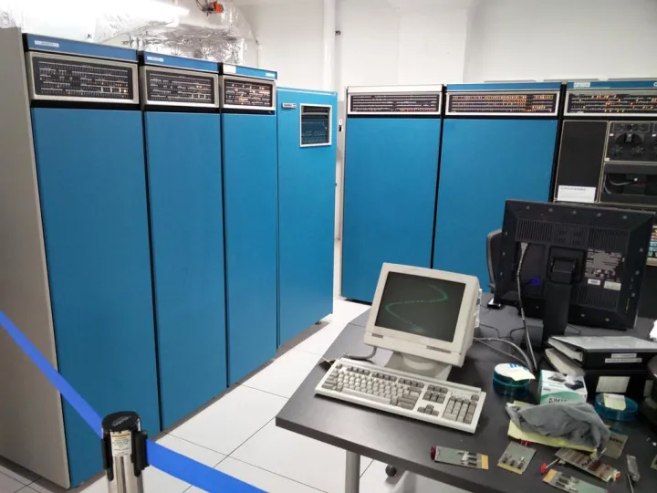

PDP-10系列最大的用户是世界上最早的网络服务提供商CompuServe，CompuServe使用了超过200台PDP-10为使用电话线接入的用户提供分时系统使用时间和信息服务。下面的这一台DEC System 20（PDP-10: KL-10 ，1974年），是PDP系列的高端型号，其指令周期只有DEC System 10的一半，计算能力达到1.8 MIPS。是为高端的分时数据中心开发的型号。

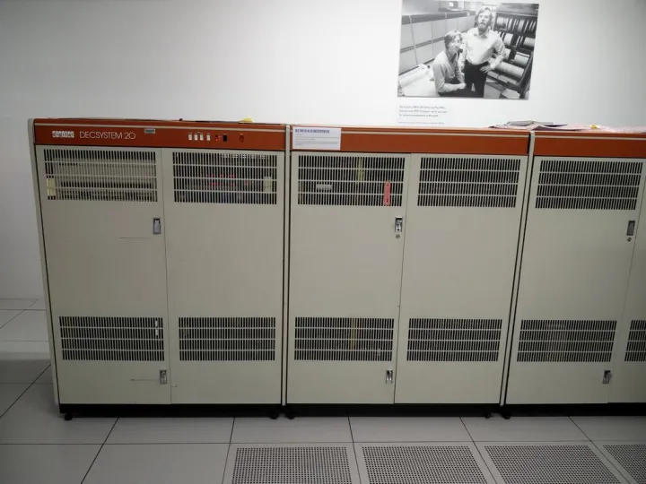

DEC System 20和DEC System 10除了硬件上有所提升之外，软件上也使用了1976年推出的TOPS-20，支持完整的虚拟内存操作，使每个应用程序都可以同时访问262K words内存（18-bit字长上限）。下图中是机房一角的书架上所摆放的TOPS-20操作系统的文档和资料。

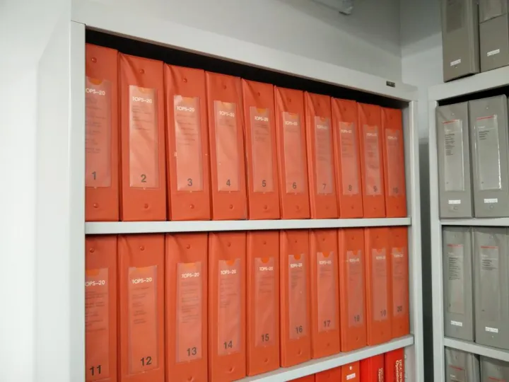

值得一提的是，TOPS-20并不是TOPS-10的升级版本，而是由BBN科技重新开发的，BBN科技是美军的高科技承包商，曾参与建立包括ARPANET在内的一系列早期互联网（包括了MILNET、CSNET、NEARnet）。世界上第一封电子邮件，也是由BBN发出的 [电子邮件发明人去世：当初为何选择@符号？](https://link.zhihu.com/?target=http%3A//news.mydrivers.com/1/472/472948.htm)，并从此确立的以@符号作为电子邮件地址标识的标准。BBN的研究成果还包括了最早的IP路由、LOGO语言，以及VoIP的前身Voice Funnel。

蓝色边框的柜子应该是另外一台PDP-10系列电脑，而机柜的尽头是一台TU 56磁带机，可能是用于启动大型主机的PDP-11前置机的一部分。

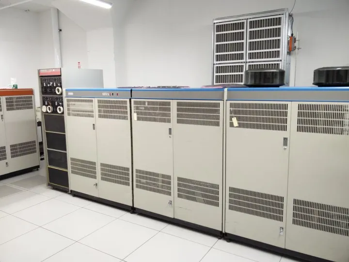

PDP-10系统所使用的板卡，可能是内存或者CPU的组件，稍大的芯片可能是ALU。

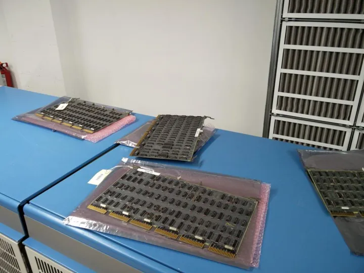

  

下面的这台是1979年的DEC System 2020（DEC PDP-10: KS-10 ）是PDP-10系列的最后一款机型，也是比较低端的型号，运算能力300 KIPS，只有上面那台DEC System 20的1/6，所以严格的讲应该算作是一台小型机，通常用作“部门级”的电脑主机，同时支持10~20个用户操作（其它大型机往往可以支持几十上百个用户）。

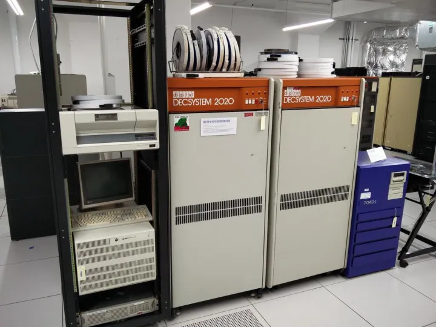

DEC System 2020除了可以运行TOPS-20（晚些时候才支持TOPS-10）之外，还支持由麻省理工学院（MIT）人工智能实验室开发的ITS（Incompatible Timesharing System - 不兼容分时系统），而最早使用Gnu授权的软件Emacs，就是理查德·斯托曼（Richard Stallman）在ITS上开发的。[GNU 工程](https://link.zhihu.com/?target=https%3A//www.gnu.org/gnu/thegnuproject.zh-cn.html)

当1979年初微软将他们的办公室从新墨西哥州的阿布奎基（Albuquerque）搬到华盛顿州的贝尔维尤（Bellevue）时，购买了一台DEC System 2020，在许多微软的老照片中，都会出现这台电脑的身影。[微软早期图片中的这个人在干什么？](https://www.zhihu.com/question/34998213)

下面的这一台，是一台1984年推出的VAX 11/780-5，作为PDP-11系列的接班人VAX是一台32-Bit、CISC架构的小型机，名称来自于增强的虚拟内存支持功能（virtual address extension - 虚拟地址扩展）。VAX 11/780-5的运行频率为7.52Mhz，性能750KIPS，内存容量则为1MB~64MB。

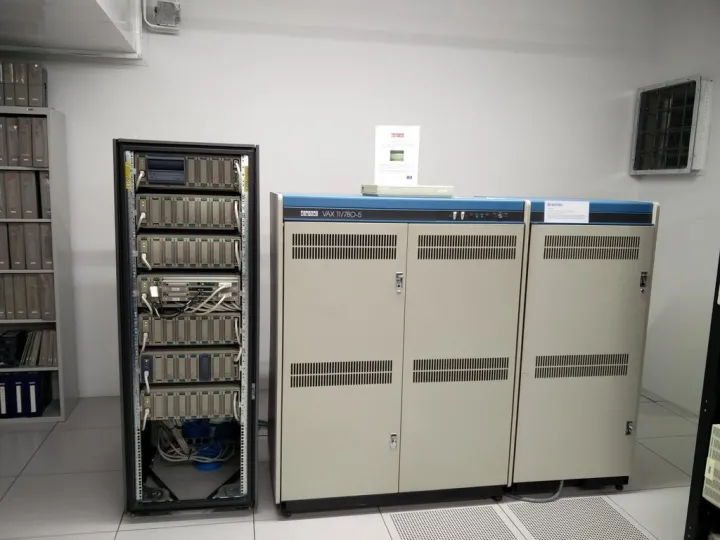

摆在体型巨大的VAX 11/780-5上面的小白盒子，则是VAX架构中体型最小的成员，VAXstation 4000 Model VLC，推出于1991年，使用25Mhz KA48处理器，支持8~24MB内存，见证了80年代~90年代集成电路技术的巨大飞跃。

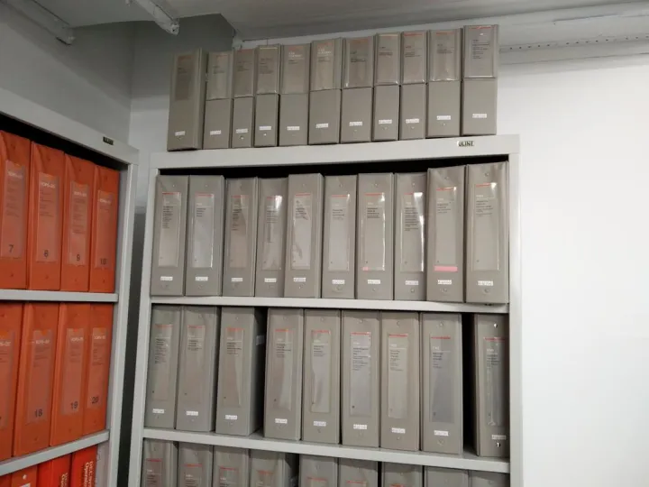

DEC VAX-11系列使用的操作系统叫VMS，也就是后来OpenVMS的前身，VAX在开发之初并没有设计为POSIX和Unix兼容的操作系统，直到1991年，加入了Unix兼容性的VMS才被改名为OpenVMS。之后OpenVMS被移植到DEC Alpha和Itanium处理器上，至今仍被HP的高端服务器所使用。而最早的VMS开发者戴夫·卡特勒（Dave Cutler），在1988年加入微软，主持开发了Windows NT内核，成为今日Windows操作系统的基础。上面一张照片中展示了博物馆中所收藏的VMS系统文档和资料。  

上图中是使用Massbus总线的磁带机TU77和TU78，存储密度分别为1600bpi（bit per inch - 比特每英寸）和6250bpi，一盘2400英尺的磁带可以存储40MB或145MB。下面这张照片可以看到磁带机内部复杂的结构。

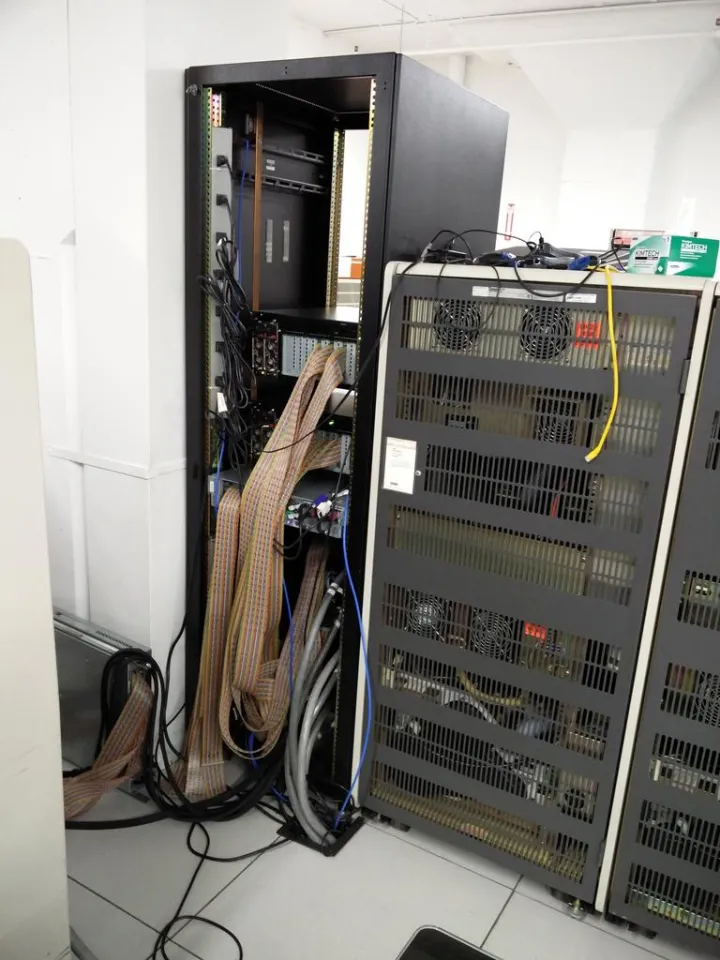

随着微电脑技术的发展，视频终端（Video Terminal）逐渐取代电传打字机成为大型主机和小型机的主流操作界面，这款DEC VK100 "GIGI"带一些当时家用电脑上常见的功能，比如视频输出和BASIC语言解释器，同时整合了VT125终端机的功能以及可以在屏幕上绘制矢量图形的ReGIS（Remote Graphic Instruction Set - 远程图形指令集）解释器，开始了图形终端的时代。

  

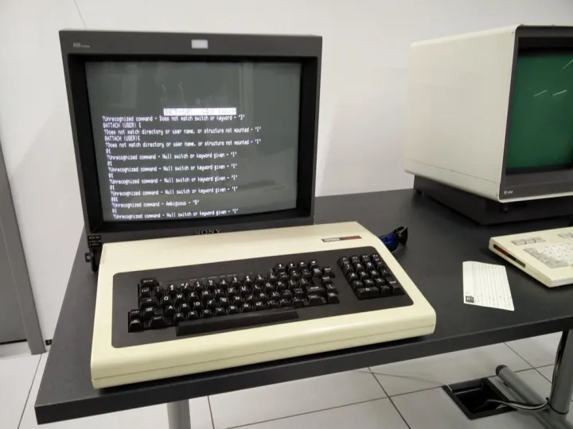

Dataproducts BP-1500打印机（右），及其OEM版本DEC LP-27，对于高分辨率显示器仍然相当昂贵的80年代，“打Log”（打印日志）和输出结果这样的工作往往都是由这些高速的宽幅打印机完成的，BP-1500每分钟可以打印1500行，是程序员们调试程序的好帮手。  

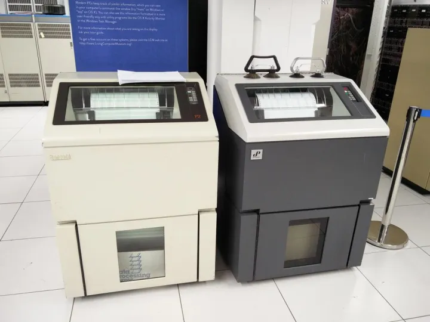

1982年，受Xerox Alto电脑的启发，贝尔实验室开发了Blit系列位图终端，Blit的名字来自于Bell Labs Intelligent Terminal（贝尔实验室智能终端），不过由于形似西红柿的红色鼠标，所以又被戏称为（Bacon, Lettuce, and Interactive Tomato - 熏肉，生菜和互动西红柿）。这台DMD 5620终端的分辨率为800x1024@30Hz，可以显示66x88字符。作为Unix系统图形界面的先驱，Blit终端使用名叫“Layers”的窗口管理器，最早被整合在System V SVR3中。

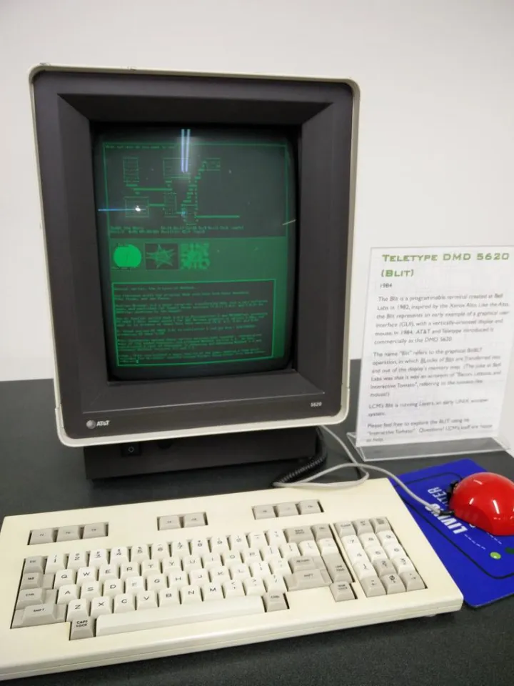

细心的朋友可能会注意到，这台DMD 5620终端中，运行的是时至今日仍在开发的最古老的网络游戏——NetHack，从1987年至今，这款游戏的开发改进持续了接近30年。也是目前世界上开发者最多的游戏。

下图中展示的BBS系统，是世界上最大的Unix shell提供商SDF（Super Dimension Fortress 超时空要塞）的公告板系统[bboard](https://link.zhihu.com/?target=http%3A//sdf.org/%3Ftutorials/bboard-tutorial)，现在SDF主要提供NetBSD系统的shell服务，同时也提供TWENEX（TOPS-20）和Symbolics Genera（用于Lisp机器 - Lisp machines的操作系统）。

[http://sdf.org/](https://link.zhihu.com/?target=http%3A//sdf.org/)  

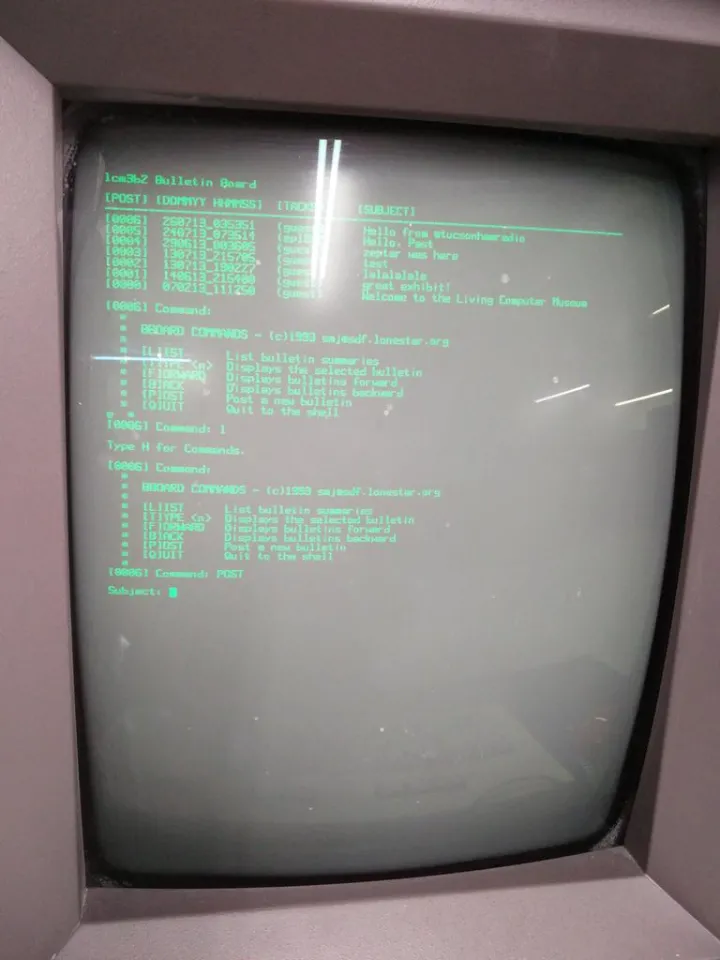

1991年，思科公司的创始人Leonard Bosack成立了XKL, LLC，新公司的第一款产品TOAD-1，是一台现代版的PDP-10大型主机，其名字“TOAD”来自于"Ten On A Desk"——既该项目开发的目标：桌上型的PDP-10。这台机器最终于1995年开始销售，运行36-Bit TOPS-20系统，可以支持超过100个用户。

  

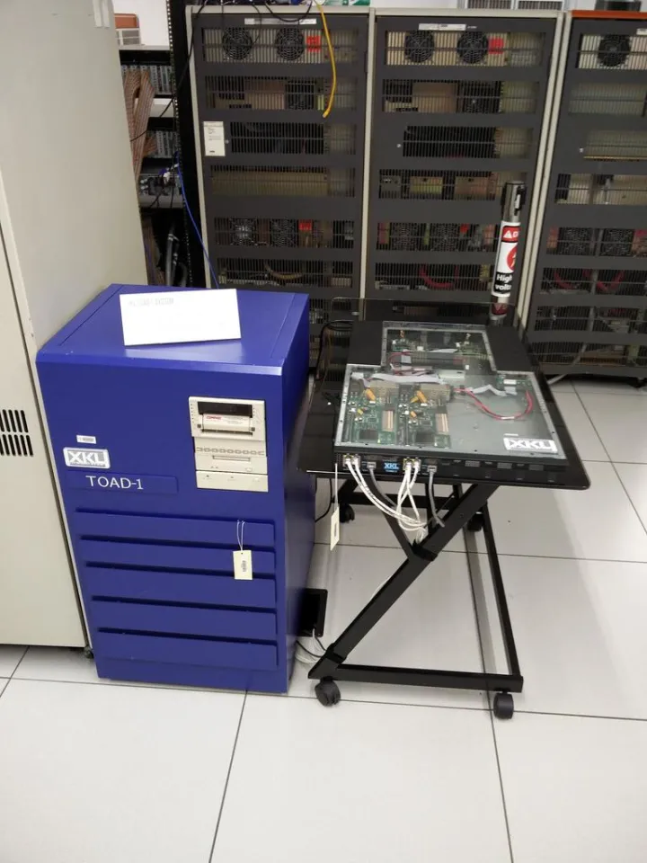

在TOAD-1上市10年之后，2005年的TOAD-2更近一步，将完整的PDP-10大型主机集成到单个芯片内，而主板的大小只使用了常用的1U服务器机箱的一般。相比身后那些体型巨大的前辈们，集成电路工业的发展所带来的变化一目了然。

这个原本计划只有三篇的系列不知不觉却写到了第六篇，到这一篇为止，活电脑博物馆中各种型号的大型机、小型机和微型电脑就像大家介绍完了，下一篇[带你逛西雅图活电脑博物馆（七）](https://zhuanlan.zhihu.com/p/21949849)将会是这个系列的最后一篇，主要会介绍一些不是那么好分类但仍然很有意思的展品。