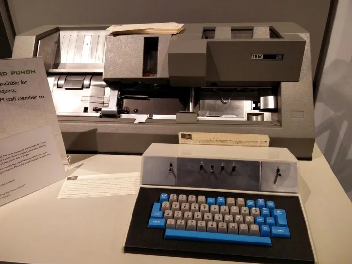
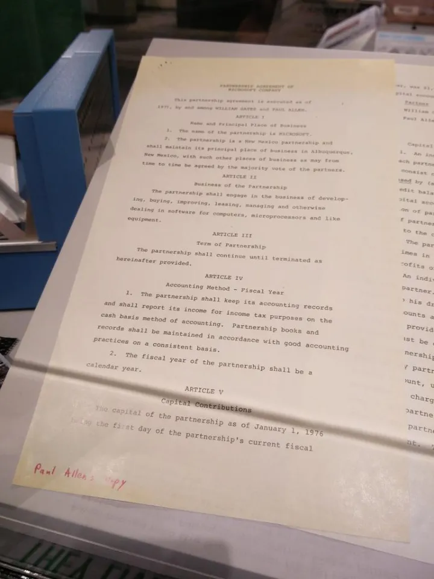

# 带你逛西雅图活电脑博物馆（七）
在前面的几期文章中，介绍了活电脑博物馆中各种活着的古董电脑，从大型主机到PC和可移动电脑，都是观众可以亲自操作的，而这一期作为整个系列的最后一期，主要介绍博物馆中其它的一些展品。

下面的这张图是1960年代电脑上常用的磁芯内存和延迟线内存，磁芯内存是一种非易失性内存NVRAM，与现在的DRAM和SRAM掉电之后丢失数据不同，磁芯存储器在失去电力之后仍然可以存储数据。挑战者号航天飞机在1986年失事，其中一部分的飞行数据就是从搭载的磁芯内存中恢复的。

而延迟线存储器的工作方式则有点类似于今天的半导体内存，需要通过不断刷新来保持数据，不过保存数据的并非是二极管的通电状态，而是线圈中的机械波。

下面这台巨大的圆柱并不是硬盘，而是磁鼓内存，磁鼓内存的原理与硬盘类似，不过却没有硬盘的磁头和盘片，而是使用了巨大的圆筒形磁鼓以及许多的磁头，所以其访问速度更快，可以作为电脑的内存使用，这只磁鼓的使用年份大概是1969年，容量400KB~1.5MB，这个容量今天看起来很小，在当时可是价值3万~6万美元的高端设备。

穿孔卡片式是1960年代常用的外存设备之一，通常用作批量的输入设备，虽然现在穿孔卡片已经很少用作电脑的输入设备，但其进化版本光学卡片仍然被用作考试和彩票等场合。

上面的这台IBM 029与著名的IBM 360大型主机一同于1964年面世，是一台使用了EBCDIC（Extended Binary Coded Decimal Interchange Code - 扩增二进式十进交换码）的打卡机，这个名字来源于每一个竖排上面都包括了从0~9的十进制数字，电脑读取二进制的打孔状态，而操作者则读取卡片上的十进制数字。  

下面的这台机器是IBM 1052打印机键盘（Printer-Keyboard），因为没有远程通信的能力，所以不能称作是电传打字机。这台机器的打印部分非常特别，它使用了IBM Selectric打字机所使用的“高尔夫球”球形打印头。

  

在1970年代使用微处理器的小型计算器出现之前，机械计算器可能是人们能够接触到的最方便的计算工具，这只Curta发明于1940年的纳粹集中营，从1948年~1972年，Curta系列计算器总共销售了14万只。

从1970年代，随着微处理器的流行，电子计算器逐渐取代机械式计算器成为便携式的计算设备，进入90年代后，Apple Newton和Palm Pilot的出现，定义了日后PDA和智能手机的基本形态。

体型较小，使用嵌入式操作系统的“亚笔记本”，在多点触摸技术成熟之后，进化为以iPad和Android Tablet为代表的专用系统平板电脑，而UMPC则进化为今日的X86平板电脑。

2007年的Surface 1.0（后来成为PixelSense），则展示出未来电脑的一种可能的形态。  

下面这张照片主要是80年代的电脑游戏，此时正是电脑平台大战的时期，每一款游戏都跟着长长的平台列表，如果想您还不了解这些电脑平台，可以回头看一下 [带你逛西雅图活电脑博物馆（二）](https://zhuanlan.zhihu.com/p/21786403)、[（三）](https://zhuanlan.zhihu.com/p/21803962)、[（四）](https://zhuanlan.zhihu.com/p/21829764)

**陆军野战医院 M\*A\*S*H**，1983年，Atari 2600，Atari 400/800，TI-99/4A  

**野战排 Platoon**，1987年，Amiga, Amstrad CPC, Apple II, Atari ST, Commodore 64, MS-DOS, NES, ZX Spectrum

**铁血战士 Predator**，1987年， Acorn Electron, Amiga, Amstrad CPC, Atari ST, BBC Micro, Commodore 64, ZX Spectrum

  

**机械战警 RoboCop**，1988年，Arcade, Atari ST, Game Boy, Amiga, Commodore 64, Apple II, IBM PC compatible with DOS, MSX, NES, ZX Spectrum, Amstrad CPC, TRS-80 CoCo

**夺宝奇兵3：圣战奇兵 Indiana Jones and the Last Crusade**，1989年， DOS, Amiga, Amstrad CPC, Atari ST, Commodore 64, Game Boy, NES, Sega Master System, Mega Drive/Genesis, Sega Game Gear, MSX and ZX Spectrum

**虎胆龙威 \- Die Hard**，1990年，Commodore 64, NES, MS-DOS  

  

## 微软之家

这间博物馆的创办者保罗·艾伦是微软的创始人之一，自然博物馆里也少不了微软产品的展示，这个柜台的标签叫“Microsoft Home”，展示的全都是微软在1990年代的软件产品，大盒包装的游戏包括：

**疯狂大脚车 \- Monster Truck Madness**，1996年  
**近距离作战 \- Close Combat**，1996年  
**星际迷航：星际舰队学院 \- Star Trek: Starfleet Academy**，1997年  
**精度赛车 \- CART Precision Racing**，1997年  
**帝国时代 \- Age of Empires**，1997年  
**微软模拟飞行98 - Flight Simulator 98**，1997年

而小包装的包括了微软MS-DOS 5.0，MS-DOS 6.22，ENCARTA 95等等，柜台前面展开的杂志中的图片是微软总部1995年的航拍照片。

微软虽然名为“微软”，可是微软生产硬件的时间一点也不短，这倒是坐实了“巨硬”的外号。这张1980年生产的Microsoft SoftCard，是一张为Apple II开发的Z80处理器卡，装上它的Apple II电脑同时具有MOS 6502和Zilog Z80两款当时最流行的微处理器，除了可以运行Apple II自带的BASIC语言解释器和Apple DOS，还可以运行工业标准的CP/M操作系统。所以今天我们大可不必吐槽用苹果电脑装Windows的做法，因为三十多年前的保罗·艾伦几乎也是这么想的。（SoftCard的想法是由保罗·艾伦提出的）。

1983年，微软推出了他们的第一款鼠标——“绿眼睛” Microsoft Mouse，而中间的大黄色轨迹球EasyBall则是1996年针对2~6岁儿童开发的。

这是当年保罗艾伦和比尔盖茨成立微软时的合伙协议，对于微软粉丝来说这可是无价之宝。

保罗艾伦和比尔盖茨当年的名片，旁边的合同上写着微软开出的第一份工资，1516美元。

无论你是古董电脑爱好者，还是微软的忠实粉丝，活电脑博物馆都是一个能让你“信仰充值”的地方，走在活电脑博物馆中就像走进一只时光隧道，等着你去发掘电脑发展史中那些鲜为人知的秘密。（全文完）