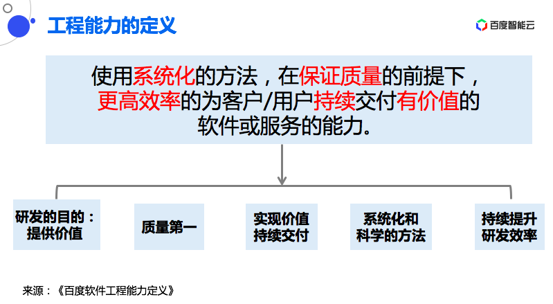
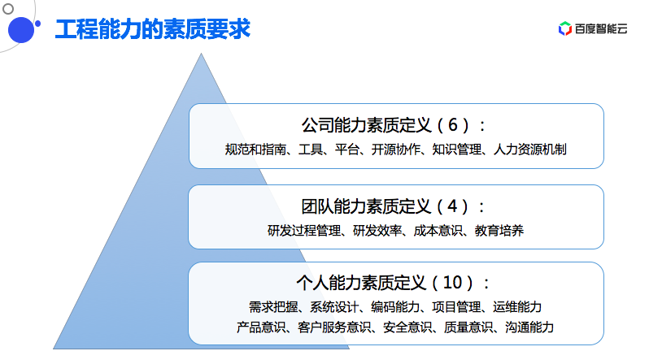
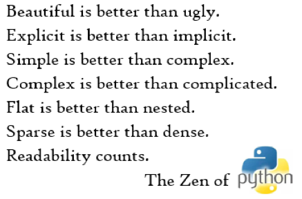

​

转自：[软件工程能力漫谈：比质量更重要的，是项目管理能力 | ArchSummit](https://mp.weixin.qq.com/s/rl-Qp5j_Qt6Imz0ZRyPFnQ "软件工程能力漫谈：比质量更重要的，是项目管理能力 | ArchSummit")

章淼老师在软件工程能力方面，积累了多年的经验，这个话题他之前也分享过多次，整体上内容有修改调整。

章老师博士毕业后在清华待了 12 年，主要是做网络方面的研究，到 2006 年的时候离开清华，进入到工业界，首先做了六年的用户产品研发，之后在 2012 年加入百度，一直做网络基础架构相关的开发工作，主要是对内服务，在运维部和系统部，做 BFE 平台研发。2020 年 6 月份转入对外服务，现在在做 BFE 商业化推广。2018 年 1 月到 2021 年 10 月份，兼任百度公司代码规范委员会主席。

接下来的内容主要分为三个部分，都是在围绕工程能力。第一，说明清楚为什么要重视工程能力；第二，阐述什么是工程能力；第三，说一下怎么来提高工程能力。

为什么要提升工程能力

这个话题这两年受到很大的关注，和现在形势变化有很大关系，第一个很重要的形势是业界竞争加剧了，很多所谓蓝海或者非常空白的领域已经不存在了，大家都在同一个领域竞争，竞争非常激烈；**成本已经发生了巨大的上涨，现在中国软件工程师成本与美国相比，差距没有那么大，据之前的交流，中国软件工程师的成本已经超过英国，跟美国已经没有太大的差距了**；产业升级，之前互联网公司大部分做的是 ToC 互联网，现在很多公司都转向 ToB，转向 ToB 对软件研发或者工程能力的要求，已经有了非常大的变化。

另外也发现一些现象，现在很多互联网公司加班加点。在去年还出现了 996.ICU，圈外人不知道什么意思，圈内人都知道，每天 9 点上班，9 点下班，一周工作 6 天，最后累到进入 ICU 重症监护室。今年我们也发现有一些变化，很多公司开始响应国家号召，减少工作时间，尽量避免 6 天工作制。但是减少时间之后，我们该怎么样保证工作产出？这其实要依赖我们的工程能力。

我还观察到的现象，很多的从业者写了很长时间的代码，甚至 8-10 年以上，但是很多的方法都是错的，换句话说，软件工程师是一个所谓的青春饭，为什么？其实跟从业者的素质是有关系的。所以以上的形式，要求我们中国的软件工程师，也需要更新迭代。

《经济新动能》一书讨论的是中国经济如何进行转型升级。在这种大潮流下，IT 从业者或者中国软件工程师也要考虑这个问题，就是这四个字“转型升级”。

**什么是工程能力**

很多人认识到要提升工程能力，但是提升什么能力呢？如果没有正确的认识，可能也无从下手。有些人会认为工程能力就是写好代码。确实我们很多软件工程师每天关注的或者平时学习的东西，仅仅是写代码。

但是我今天重点想表达的观念是，工程能力不仅仅是写好代码这么简单，也不是某一个人写好代码这么简单，它反映的是团队的综合素质。软件工程师大多是理工科毕业，感觉人文学科对软件工作似乎是没有太大的帮助，但我经过这 20 多年软件研发之后，深刻体会到做工程不仅仅是自然科学，也是人文社会科学。所以对于从业者来说是需要关注那些非技术的方方面面，而且你会发现在你工作的大量时间中，并不是用在琢磨技术上，很多时间可能是涉及到沟通等非技术因素，对我们影响非常非常大，还有包括项目管理，这些看上去和技术并没有直接关系，但是对研发项目，或者工程能力影响是巨大的。

工程能力的定义来自《百度软件工程能力定义》，这是百度内部的文件，写于 2019 年底，当时要提升工程能力，需要有文件阐述到底什么是工程能力。最后我们写了这样的一句话：使用系统化的方法，在保证质量的前提下，更高效率为客户和用户持续交付有价值的软件或服务的能力。这句话可以拆解为以下五个要点，**第一是研发的目的是要提供价值，第二是质量第一，第三是要实现价值持续交付，第四要使用系统化和科学的方法，第五是持续提升研发效率。**

软件研发的目的是要提供价值

业界中的现象是，很多从事软件研发的同学，比较习惯从技术角度来考虑问题，比较喜欢研究复杂的技术，技术简单觉得没有意思，没有兴趣去搞。这就造成我们花了大量的精力搞了很复杂的技术，但是做出来对社会没有价值。所以这里面也写了一下我的观点，**我们在工作中所使用的手段，包括技术设计、编写代码等技术只是手段，而不是目的**。所以我们不要因为在做的过程当中，使用太多的手段，而忘记我们的目的。

在软件项目规划阶段，需要从客户需求或商业价值角度考虑，而不是你写完整后再考虑这个问题。另外，要建立成本意识，我们要考虑投入产出比，要做一个项目应该是有收益，而不是最后获得收益比成本还要小，那就亏本了。这是刚才说的第一点，软件要能够提供价值。

质量第一

这一点也经常被忽视，在项目紧急的时候，就在时间和质量之间进行权衡和取舍，牺牲质量，降低对质量的要求。那么在《软件开发的 201 个原则》里面对质量也有所讨论，第一条讲到质量第一。**作者是这样说的，无论如何定义质量，客户都不会容忍低质量的产品。即使质量差，也按时交付产品，这似乎是政治正确的行为，但这是短视的。从中长期来看，这样做是自杀**。质量必须放在首位，没有可权衡的余地，说的非常明确。我们拿这条来衡量我们现实当中工作，会发现很多团队其实都是在做这样的事情。

那我们该怎么做呢？第一，对所有的项目，首先需要明确定义质量的要求，质量并不是绝对的，在各个场景下可能质量要求有所不同。所以我们到底做到什么样的质量，这是需要在项目初期定义清楚。第二，在质量方面不能妥协。前面提到我们的软件要交付提供价值，如果是低质量的软件无法提供价值，整个研发活动就变得没有意义了。第三点，我们也需要平衡质量和交付时间的关系，不是降低质量，要提高技术水平，通过技术手段更高效率、更低成本的保障质量，比如说我们可以用自动回归方法，甚至用 AI 方法，用这些高技术来保证质量。第四，**高质量的软件一定是设计出来的，而不是靠后边测试、运维保证的，这些都已经很晚了**。所以我们在设计阶段，就应该保证软件设计的质量，这是非常关键的。

实现软件价值的持续交付

观察到很多现象，即项目执行过程当中的前紧后松状态，前边非常投入，花了很多资源，等软件研发出来之后，后边软件没有人关注了，会发现设计文档腐烂、代码没有人维护。原因是我们没有对软件整个生命周期与价值输出有清晰的认识，我们只做了短期准备，我们觉得软件开发完就结束了。所以第一点**要提升认识，认识到软件开发与维护都是长周期的，一个软件甚至可以运行 10、20 年。**在这样的认识基础上，需要综合考虑全周期的研发成本问题，而不是只考虑开始的时候很快的，最后成本非常高。要做好长期维护的准备，而且要持续进行改进，一个软件是逐步通过长期迭代、长期优化产生出来的。

这一点也非常非常重要。我们可以看到的现象是什么？在中国软件很多从业者是缺乏对软件开发方法的深入学习。我曾经做过调研，很多从业者看过真正的软件工程的书籍，不超过两本，甚至有些人没看过，比如说我看到一些列表，某个语言的用法，比如说某些网络知识，这些都不是专业的软件工程的书籍，我们可以看到在中国软件复用比例是非常之低的。所以这一点我们首先要认识到，软件工程本身是一个非常专业的方向，软件诞生已经超过半世纪，这些方法甚至在上世纪 90 年代已经出现很多成熟的方法，但是非常遗憾的是中国很多从业者，对这些方法都还没有充分的掌握。另外，我们也要基于现在优秀的基础设施高速迭代，现在出现了像云原生思想，包括很多设施已经云化，这些对我们是非常有帮助的。还有软件复用能力，建立可复用的软件。

使用系统化和科学的方法

是否使用科学的方法，效率差距是非常大的，可能差 10 倍、100 倍，甚至从零到一，你用这些正规方法，有些软件就可以搞定，如果你没有掌握系统科学的方法，这样复杂度的软件你可能根本搞不定。所以掌握科学方法，对我们驾驭大型软件是非常重要的。

谈到系统科学方法，我引申一下，我们需要坚持软件开发的原则，**很多从业者在现实中，我发现很容易屈服于各种外部力量，比如说一个领导怎么怎么说，或者说他的需求方怎么怎么说，或者周围人怎么怎么说，就很容易做出很扭曲的行为**。这个原因是什么呢？我思考一下，因为很多从业者并不知道软件研发的基本原则，一个人当他心里没有原则的时候很容易屈服于外界压力，所以我们需要坚持软件开发的原则。

这里讲到什么是原则，原则是工作的准则，而且它代表了很多的集体智慧。在《软件的 201 原则》里提到了很多重要的原则，我们这儿列了一下，**比如说质量第一，先确定问题，再写需求，没有文档的设计不是设计**。像这样的原则都非常重要，但是你仔细想，在现实工作当中很多团队、很多人在工作当中，不断的打破这些原则，这恰恰是造成我们工作非常低效重要的原因。这里面我写了：没有原则就会随意妥协，结果就是低效、低质的工作。

这也是百度这些同学为什么在过去两年很努力在推这本书《软件开发 201 个原则》，这是 1995 年出版的非常经典的软件工程书籍，这里面提到很多重要的原则，这本书上个月已经正式出版，我们发现很多开发者对这本书评价非常高。但是我也看到很多人对这些原则嗤之以鼻，甚至看不懂，有些人对这本书评价非常低，这一点是非常令人痛心，明明不知道这些原则，当把这些原则告诉他的时候也没有任何感觉，这一点我是非常遗憾的。

持续提升研发效率

研发效率绝对不是一天可以见成的，甚至永无止境。发现很多管理者对业务目标非常关注，但是对软件研发的能力并没有持续关注。这是一个非常大的误区。所以提升效率、提升人效，应该是一个软件研发团队一直需要追求的目标，应该去想一想我们今天是怎么做软件的，一年两年之后，我们怎么能够更好的做软件，会有什么变化。

软件工程能力提升，该怎么做？

在百度的软件工程能力定义里，工程能力的素质中的个人能力素质，包括团队的能力素质，以及公司的能力素质。个人能力素质包括需求的把握、系统设计，这两个主要是关于前面的设计阶段。编码能力、项目管理，还有运维能力，这是软件后期上线运维，以及产品意识、客户服务意识、安全意识、质量意识，还有沟通能力。对一个个体来说，这些是非常重要的工程能力。

这里想强调一点，对于工程能力来说，人是根本。我认为人的要素是最为关键的。这里面有一个说法，为什么使用同样工具的人，为什么你的效率只有别人的 N 分之一。而且对一个优秀的人来说，他只使用一般的工具，他工作的产出会远远超过一般的人使用优秀的工具。还有一个很重要的趋势是什么呢？小规模优秀工程师团队，要远远超过大规模一般工程师团队。这是为什么呢？因为对一个大的团队来说，沟通成本是非常高的，团队内沟通成本是随着人的数量呈指数级上升。所以这方面由于现在软件工具提升，包括各种云平台的出现，实际上把效能变的更大了，一个小的团队可以做非常非常多的事情。

对于一个优秀产品，一定是来自于优秀的人与团队的，一定不是来自一个一般的团队。我也曾经讲过，软件是人类智慧的结晶，优秀的智慧结晶一定是来自优秀的人与团队。所以我的建议是软件研发主管或者 Leader，多投一些精力培养团队成员。

从个人素质来讲，我经常简化为三点：代码、文档、项目管理。这三者当中的排序，**我个人认为项目管理是高于文档、高于代码，这可能跟很多人的认识会不一样，很多工程师认为代码是最重要，90% 甚至 95% 以上的软件工程师是忽视项目管理的，没有掌握正规的方法。**

首先从代码说起，要求非常清楚，要能写出让别人很容易看懂的代码，这个要求好像非常低，但是其实很多人是做不到的。这里面我引用的是 Python 的非常好的一句话，第一句话是优美比丑陋好，你的显示比隐示更好。其实 Python 语言，很多人没有关注到这里面讲到的东西，所以我们代码应该是写的要尽量简单、尽量优美，要尽量使用简单的方法。

所以写好代码方法也很简单，我这边列了五点：

第一，合理的模块划分。很多同学模块划分有很严重的问题，导致未来软件维护非常困难，也非常难以复用。第二，清晰的函数定义。别看函数这么简单，我发现很多同学对函数语义定义并不清楚。第三，短小清晰的代码段落。如果我们想想很多同学写出的代码几百行没有任何一行空行、注释。第四，准确的命名，强调一下，漂亮代码要具备一定的语文基础，写代码和写文章一样。第五，清晰的注释，确实应该讲很多人的代码里面，几乎看不到任何一行注释。

此外，认真的代码评审，是提升代码质量最好的方法，同时也是传播编程方法最好的方法。但是非常遗憾，在中国互联网行业还有很多团队没有真正执行代码评审。

**真正的软件工程师在软件上的追求：差一个空格都不行。我们离这个目标还很远。**

**工程能力提升的第二点：文档**

我们需要大家重视文档，文档的忽视确实受到了所谓“敏捷”运动的影响，**因为很多人对敏捷有错误的认识，似乎很多人的概念里，敏捷就是不写文档。**但是我今年确实对敏捷做了一些研究，敏捷运动当时的起源是应对上世纪 80 年代或者是 90 年代非常重视文档要求，做一个项目要写非常非常多文档，文档已经成为工作的负载。所以敏捷思想提出要少写一点文档，是说少写一点，而不是不写，不知道在中国怎么传成敏捷就是不写项目文档。

在《软件开发 2.0》的书里面明确提出，没有文档的设计，不是设计。所以现实当中很多软件工程师没有做设计，直接就是扑上去写代码，这件事情是非常荒谬的，在其他行业都会去写设计文档，再投入生产，而在我们这个行业，都没有写任何文档，就做完了，开始编码，所以这件事情非常荒谬。

另外一个角度大家要认识到为什么要写好项目文档，因为在整个项目过程当中我们有超过 50% 的时间是用来沟通的，所以沟通效率会极大影响研发的效率。**文档的目的是什么呢？我认为，第一点提升沟通的效率，通过一个清晰的文档，可以极大提升沟通效率。**第二是提升对思考过程的管理。你在整个设计过程当中，我们把文档作为一种设计工具，用来整理思想。

所以从这个角度出发，我们很多人关于文档是作为最后存档方式的一种认识，是非常错误的。这里面我写了两句话，第一，不会写文档就等于你不会做设计。第二，不会写文档就无法成为高级工程师。所以很多人的天花板是非常明确，可能写了 8-10 年的代码，但是你不会写文档，所以至今仍然无法跃升成为高级软件工程师。

怎么才能写好文档？第一，**用户思维**。比如说写需求文档，要从用户角度想问题，而不是从内部实践角度。第二，**准确的概念定义**。这跟刚才讲代码命名有一点类似，命名代表了概念，在文档里面也同样面临着概念的问题。第三，**要有清晰准确的逻辑**，这一点也非常重要。第四，可能大家一般没有关注到，就**是规范的表达方式**。无论是用文字还是图表，我确实在工作当中会说，某某同学请你不要再使用你的方言。很多人确实没有使用规范的方式，他用自己看懂的方式表达，别人理解起来很困难。第五，**一定要有研究和思考能力**，我们在工作当中都在不知不觉做着研究，研究就是定义问题、分析问题、解决问题。第六，**严谨科学态度**，很多同学写文档有很多的问号、不清楚的地方都留下来，这样的话保留之后进入下一阶段，这样做的系统是经不起历史与时间的检验。第七，**要认真和充分的设计评审**，很多团队在代码评审上做的不好，应该在文档评审上做的更差，很多文档可能没有人看，直接通过了。所以这里面现在是 7 点，似乎好像很简单，如果能把这些做到，我们一定可以产出非常高质量的项目文档。

也推荐对大家提升文档是有帮助的两本书，第一《人人都是产品经理 2.0》，如果想学怎么做需求分析，我建议看看这本书，即使你不是产品经理。第二本是《金字塔原理——思考、理论和解决问题的逻辑》，也很不错，大家可以看看这两本书。

第三点要强调的，也是最高优先级的重视项目管理。从我到工业界差不多 15 年时间，我认为大量的团队忽视了项目管理，在《软件开发的 2.0》里面提到一个观点，原则 127：好的管理比好的技术更重要。有再好的技术，如果你管理的不好，这个项目也是要失败的。这里面就会有一个大家经常问到的问题，我不是管理者，也不是 Leader，为什么要做项目管理？**从德鲁克的观点出发，他提到我们现在这些人从事着这些行业，其实都是知识工作者，每个知识工作者都是管理者，我们要站在这个角度上看问题。所以每个工程师其实都是管理者，要做好自己的管理。**而且现实工作当中你会发现很多项目是工程师在管理，他的经理、Leader，这些细节都管不过来。而且从整个行业趋势来看，高度自组织的小团队才是趋势。大家可能记得我前面提到，由优秀的人构成小规模软件工程团队，远远高于大规模一般人构成的团队。

好的项目管理来自：第一，了解项目管理的常识和原则；第二，实事求是的态度。我发现很多人在面临项目问题的时候，采取回避，或者是隐瞒的态度，这不利于项目正常进行。所以这里面非常强调我们要讲真话，要敢于向外披露。

第三，需要对知识社会有正确的理解。知识社会的特征是什么，从权利为中心转向以知识为中心，我们要尊重专业、自主管理，这些不是靠人能看住，即使可以看着人表面在工作，但没有看住大脑。还有以人为中心，要摒弃大工业生产的思想，每个人都是螺丝钉，每个人都会被替代，这样的思想是会被替代的。

这里面推荐两本书，一个是德鲁克《知识社会》，如果没有知识社会，我们不可能建立现在非常高效知识团队。第二本书是清华的《快速开发》，出版的非常早，但是非常好的一本书。

总    结

我们的社会越来越被信息驱动，在信息社会里面软件驱动信息社会，软件研发是非常重要的。其次，软件工程师的提升，对中国有巨大的意义，大家不要忽视自己的责任。

​