<h1>35款Linux发行版名字的含义</h1>
2008年07月06日 星期日 09:57
Linux有众多发行版，有许多各具特色的名字，有的有趣、有的浪漫、有的见解深刻、有的可爱、有的名字太短而满足不了创作者的大抱负…..这里列出了35款最受欢迎的Linux（BSD）[发行版名字的含义](http://hehe2.net/linux-general/etymology-of-a-linux-distro/)：

1.[Ubuntu](http://www.ubuntu.com/)  

它的意思每一位Geek应该都知道，这是一个古非洲语单词，代表“人性”或者“我的存在是因为大家的存在”。

2.[PCLinuxOS](http://www.pclinuxos.com/)  
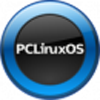
PC + Linux + Operating System，用户界面很像Windows。

3.[openSUSE](http://www.opensuse.org/)  
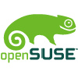
是[**Novell**](file::;)和[**AMD**](file::;)资助的SUSE社区项目，SUSE取德语单词首字母“Software- und System-Entwicklung” ([**软件**](file::;)和软件开发)。但也有人声称它是为了纪念计算机工程师 [Konrad Zuse](http://en.wikipedia.org/wiki/Konrad_Zuse) 。

4-Fedora  

[**Fedora**](file::;) is a community Linux project sponsored by Red Hat. The name “fedora” is derived from the fedora that the shadowman is wearing in the Red Hat logo. (see below)

5-Mandriva  

This Linux distro was the original Mandrake Linux distro, which was maintained by MandrakeSoft, however MandrakeSoft lost a legal battle against Hearst Corporation over the name “Mandrake”. MandrakeSoft later on bought Connectiva, the result of the fusion = Mandriva

6-Sabayon  

Sabayon is a distro produced in Trentino, Italy and is named after an Italian dessert also called Sabayon. Sabayon (or Zabaglione) is made of egg yolks, sugar, and sweet liquor.

7-Debian  
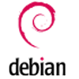
Debian was first introduced by Ian Murdock in 1998. The name itself is a portmanteau of his girlfriend (now wife) Debra and his name Ian.

8-Damn Small Linux  
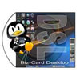
Damn Small Linux is a very small Linux distro with the size of only 50 MB. Hence the name. Like Duuuuh

号称是最小的光碟版迷你LINUX,不过麻雀虽小,五脏俱全,可以通过有线网卡、pppoe adsl拔号或无线网卡接入internet上网，也带有monkey web、ftp等服务器，还带有excel、pdf、MP3等软件。

9-MEPIS  

According to the original creator of MEPIS, Warren Woodford, MEPIS orginally didn’t mean anything, he just misheard a friend on a bad Skype connection, and liked the name!

10-FreeBSD  
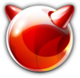
FreeBSD is not exactly a Linux distro, it’ more like a sibling of Linux, and it ranked 11 on distrowatch. BSD is a Unix derivative developed by the University of Califrnia at Berkeley, BSD itself is an acronym for Berkeley Software Distribution. FreeBSD is the free branch of the Berkeley Distro.

11-CentOS  
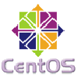
CentOS is based on Red Had Enterprise Linux (RHEL), it basically stands for Community Enterprise Operating System.

12-Dreamlinux  

Dreamlinux is a Brazilian Linux distro based on Debian and looks very similar to Apple’s MAC OSX. I don’t really think there is a real reason behind the name. Just mashed up “dream” and “linux” together, talk about orginal! Sorry guys.

13-Puppy Linux  

Puppy Linux is a small live CD distro that focuses on ease of use. This distro has it’s own mascot called “Puppy” which is a real Chihuahua.

14-Kubuntu

Pretty much straight forward [**KDE**](file::;) \+ Ubuntu = Kubuntu

15-Zenwalk  

This one kinda stumped me. Visiting their website I was greeted with the tagline “ever tried zen computing?”, so the Zen part is pretty much explainable. But walk? The logo of dolphin? Do dolphins even walk? LOL. Well I e-mailed JP Guillemin, the creator of the distro, asking him for an explanation. His answer was wicked:

Hi, Zenwalk is intended to sound (and mean) similary as Nextstep, the famous OS created by Steve Job when he was fired by Apple

Cheers

16-Slackware  

Slackware was created by Patrick Volkerding. Slackware initially was a private side project, and to prevent it from being a serious one, Patrick named it “slack.” In reference to the term slack from the Church of SubGenius (Thanks to the many who pointed this out) The kinda name stuck :).

17-Knoppix  
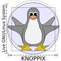
Knoppix is a Debian based Live CD distro developed by Klaus Knopper and named after him.

18-Gentoo  

Gentoo is a source code based distro, meaning that everything is compiled from scratch, which contributes to it’s speed. This fact prompted to a name change (originally Enoch) to Gentoo, which is the fastest swimming penguin. Oh and since this is a naming topic, I actually convinced a friend of mine to name her cat “Gentoo”, how cute is that?

19-Slax  

Slax is a live CD distro based on Slackware, and from it comes the name. Nothing interesting here, move along.

20-Sidux  

Sidux is a Linux distro based on the unstable branch of Debian which is codenamed “Sid”, which in turn is named after the Sid Phillips character in Toy Story - usually destroys and tortures his sister Hannah’s toys. You see, geeks do have a sense of humor

21-Ubuntu Studio  

Ubuntu Studio is just a special derivative from Ubuntu geared to general multimedia production.

22- PC-BSD  
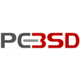
PC-BSD is a BSD based distro. It aims to be easy to install by using a graphical installation program, and easy- and ready-to-use immediately by providing KDE as the default, pre-installed graphical user interface, hence adding the “PC” prefix. Pretty unoriginal if you ask me.

23-Xubuntu  

Whats up with all these Ubuntu derivatives? Sheeesh…Xubuntu is just XFCE + Ubuntu. Next!

24-Foresight  
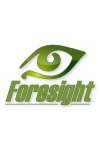
Foresight is a Linux distro that uses Conary as a package manager, it allows rolling updates, rather than the 2 big releases a year most distros do. For example, when banshee 1.0 comes out next month Foresight users will have it in less than a week, while Ubuntu users will wait until October (Thanks to pcutler from the forsight IRC channel for explaining this). Anyways, with Conary, Forsight in a sense gets software you otherwise will have to wait for in other distros, pretty neat

25-DesktopBSD  

From the site: “DesktopBSD aims at being a stable and powerful operating system for desktop users.” Meh.

26-Red Hat  
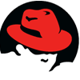
This one has some really interesting stories behind it, I’ll leave the floor to Red Hat co-founder Bob Young to explain:

最老牌的linux发行版！

27-OpenGEU  

OpenGEU was originally Geubuntu, which is a distro based on Ubuntu but uses [**GNOME**](file::;) and Enlightenment as [**windows**](file::;) manager, the “G” and “E” stand for this combo. But due to some legal boo-haa it was changed to OpenGEU.

28-Elive  

This one is just a Debian based live CD that also uses Enlightenment as a windows manager.

29-Freespire  

In August 2005, a distribution Live CD based on Linspire’s source pools named Freespire hit the web by accident. It later evolved to become it’s own distro. Linspire also has a interesting tale behind it’s name. Linspire originally was “Lindows” but some spoiled brat in the Microsoft legal department decided that “Lindows” infringes on their “Windows” brand and decided to sue. Microsoft’s case didn’t really hold water in court, so Microsoft decided to settle and pay $20 million for Lindows to change to Linspire.

30-Frugalware  

I couldn’t find any documented reason, but it’s probably taken from the frugality philosphy. According to Wikipedia:

Frugality in the context of certain belief systems, is a philosophy in which one does not trust, or is deeply wary of “expert” knowledge, often from commercial markets or corporate cultures, claiming to know what is in the best economic, material, or spiritual interests of the individual.

31-Fluxbuntu  

Again with Ubuntu? Just an Ubuntu based distro that uses Fluxbox as it’s windows manager.

32-Xandros  
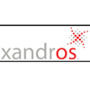
Xandros’s name is derived the X Windows system and the Greek island Andros.

33-TinyME  

TinyME is a small light-weight version of PCLinuxOS, it’s derived from two words; “tiny” and “me”

34-gOS  

gOS is an Ubuntu based distro that has tight integeration of [**Google**](file::;) apps, the “g” stands for Google if you haven’t figured it out yet. gOS stands for ‘Good OS LLC’ which is the name of the company behind the distro. (Thanks to konradc from stumbleupon for pointing this out)

35-Backtrack  
](http://www.lupaworld.com/22802/batch.download.php?aid=10176)

Backtrack is security testing and penetration detection distro with a collection of security and forensics tools. The name is derived from this fact; “back tracing” the intruders.

网络安全渗透测试工具光碟

From:http://hehe2.net/linux-general/etymology-of-a-linux-distro/