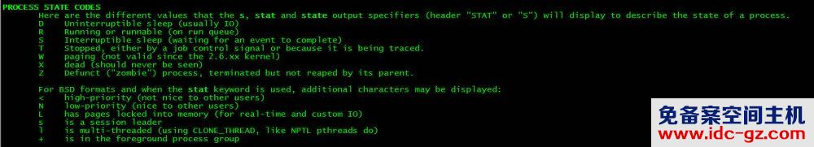

​

##  1.Linux 内存管理中的 RSS 和 VSZ 是什么意思？

https://www.jianshu.com/p/9bf36aa82f90

RSS 是常驻内存集（Resident Set Size），表示该进程分配的内存大小。

RSS 不包括进入交换分区的内存。

RSS 包括共享库占用的内存（只要共享库在内存中）

RSS 包括所有分配的栈内存和堆内存。

VSZ 表示进程分配的虚拟内存。

VSZ 包括进程可以访问的所有内存，包括进入交换分区的内容，以及共享库占用的内存。

如果一个进程，程序的大小有 500K，链接的共享库大小有 2500K，堆栈内存共有 200K，其中 100K 进入了交换分区。

进程实际加载了共享库中的 1000K 的内容，以及自己程序的中的 400K 的内容。请问 RSS 和 VSZ 应是多少？

RSS: 400K + 1000K + 100K = 1500K  
VSZ: 500K + 2500K + 200K = 3200K

RSS 中有一部分来自共享库，而共享库可能被许多进程使用，所以如果把所有进程的 RSS 加起来，可能比系统内存还要大。

有一个较新的参数 PSS (proportional set size)，它对于共享内存的计算与 RSS 不同。参考前面的例子，如果有两个进程使用同一个共享库，那么：

PSS: 400K + (1000K/2) + 100K = 400K + 500K + 100K = 1000K

线程共享同一个地址空间，所以一个进程内部的所有线程有相同的 RSS， VSZ 和 PSS。可使用 ps 或者 top 命令观察这些信息。

##   2.linux进程状态都是s,ps命令输出进程状态S+的含义解析

转自：[linux进程状态都是s,ps命令输出进程状态S+的含义解析\_ARUANTOU的博客-CSDN博客](https://blog.csdn.net/weixin_35990358/article/details/116575502 "linux进程状态都是s,ps命令输出进程状态S+的含义解析_ARUANTOU的博客-CSDN博客")

最近发现一个问题，ps命令输出里面进程状态为S+的含义，网上好多文章都说是表明进程“位于在后台进程组”。

例如下面这个ps命令输出说明：

D 不可中断 Uninterruptible sleep (usually IO)

R 正在运行，或在队列中的进程

S 处于休眠状态

T 停止或被追踪

Z 僵尸进程

W 进入内存交换(从内核2.6开始无效)

X 死掉的进程

< 高优先级

N 低优先级

L 有些页被锁进内存

s 包含子进程

\+ 位于后台的进程组；

l 多线程，克隆线程 multi-threaded (using CLONE\_THREAD, like NPTL pthreads do)

但其实这是不对的，后面有加号说明进程是“位于在前台进程组”。也就是进程可以使用键盘输出。下面做一个试验证明这点：

首先，在终端一个会话执行一个sleep命令，让其在前台运行。

​编辑

接着，另启一个终端会话，启动一个后台运行的sleep命令

​编辑

使用ps查看进程状态

​编辑

可以看出在前台的进程状态为S+，而在后台的sleep进程状态都是S

查询ps命令的帮助，是说”is in the foreground process group”，也可以证明我说的这点。

​编辑

网上流传的ps命令输出说明的错误解释非常多，我写这篇文章，希望能纠正一下

## 3.Linux进程状态解析 之 R、S、D、T、Z、X (主要有三个状态)

转自：[Linux进程状态解析 之 R、S、D、T、Z、X (主要有三个状态)\_沈万三gz的博客-CSDN博客](http://blog.csdn.net/shenwansangz/article/details/51981459 "Linux进程状态解析 之 R、S、D、T、Z、X (主要有三个状态)_沈万三gz的博客-CSDN博客")

[Linux](http://lib.csdn.net/base/linux "Linux")是一个多用户，多任务的系统，可以同时运行多个用户的多个程序，就必然会产生很多的进程，而每个进程会有不同的状态。

**Linux进程状态：R (TASK\_RUNNING)，可执行状态。**

&nbsp;&nbsp;&nbsp;&nbsp;&nbsp;只有在该状态的进程才可能在CPU上运行。而同一时刻可能有多个进程处于可执行状态，这些进程的task\_struct结构（进程控制块）被放入对应CPU的可执行队列中（一个进程最多只能出现在一个CPU的可执行队列中）。进程调度器的任务就是从各个CPU的可执行队列中分别选择一个进程在该CPU上运行。

&nbsp;&nbsp;&nbsp;&nbsp;很多[操作系统](http://lib.csdn.net/base/operatingsystem "操作系统")教科书将正在CPU上执行的进程定义为RUNNING状态、而将可执行但是尚未被调度执行的进程定义为READY状态，这两种状态在linux下统一为 TASK\_RUNNING状态。

**Linux进程状态：S (TASK\_INTERRUPTIBLE)，可中断的睡眠状态。**

&nbsp;&nbsp;&nbsp;&nbsp;处于这个状态的进程因为等待某某事件的发生（比如等待socket连接、等待信号量），而被挂起。这些进程的task\_struct结构被放入对应事件的等待队列中。当这些事件发生时（由外部中断触发、或由其他进程触发），对应的等待队列中的一个或多个进程将被唤醒。

   通过ps命令我们会看到，一般情况下，进程列表中的绝大多数进程都处于TASK\_INTERRUPTIBLE状态（除非机器的负载很高）。毕竟CPU就这么一两个，进程动辄几十上百个，如果不是绝大多数进程都在睡眠，CPU又怎么响应得过来。

**Linux进程状态：D (TASK\_UNINTERRUPTIBLE)，不可中断的睡眠状态。**

&nbsp;&nbsp;&nbsp;&nbsp;与TASK\_INTERRUPTIBLE状态类似，进程处于睡眠状态，但是此刻进程是不可中断的。不可中断，指的并不是CPU不响应外部硬件的中断，而是指进程不响应异步信号。  
绝大多数情况下，进程处在睡眠状态时，总是应该能够响应异步信号的。否则你将惊奇的发现，kill -9竟然杀不死一个正在睡眠的进程了！于是我们也很好理解，为什么ps命令看到的进程几乎不会出现TASK\_UNINTERRUPTIBLE状态，而总是TASK\_INTERRUPTIBLE状态。

   **而TASK\_UNINTERRUPTIBLE状态存在的意义就在于，内核的某些处理流程是不能被打断的**。如果响应异步信号，程序的执行流程中就会被插入一段用于处理异步信号的流程（这个插入的流程可能只存在于内核态，也可能延伸到用户态），于是原有的流程就被中断了。（参见《linux内核异步中断浅析》）  
       在进程对某些硬件进行操作时（比如进程调用read系统调用对某个设备文件进行读操作，而read系统调用最终执行到对应设备驱动的代码，并与对应的物理设备进行交互），可能需要使用TASK\_UNINTERRUPTIBLE状态对进程进行保护，以避免进程与设备交互的过程被打断，造成设备陷入不可控的状态。这种情况下的TASK\_UNINTERRUPTIBLE状态总是非常短暂的，通过ps命令基本上不可能捕捉到。

&nbsp;&nbsp;&nbsp;&nbsp;&nbsp;linux系统中也存在容易捕捉的TASK\_UNINTERRUPTIBLE状态。执行vfork系统调用后，父进程将进入TASK\_UNINTERRUPTIBLE状态，直到子进程调用exit或exec（参见《神奇的vfork》）。  
通过下面的代码就能得到处于TASK\_UNINTERRUPTIBLE状态的进程：

#include   void main() {  if (!vfork()) sleep(100);  } 

  
编译运行，然后ps一下：

kouu@kouu-one:~/test$ ps -ax | grep a\\.out  4371 pts/0    D+     0:00 ./a.out  4372 pts/0    S+     0:00 ./a.out  4374 pts/1    S+     0:00 grep a.out 

  
然后我们可以试验一下TASK\_UNINTERRUPTIBLE状态的威力。不管kill还是kill -9，这个TASK\_UNINTERRUPTIBLE状态的父进程依然屹立不倒。

上面我们介绍了Linux进程的R、S、D三种状态，这里接着上面的文章介绍另外三个状态。

**Linux进程状态：T (TASK\_STOPPED or TASK\_TRACED)，暂停状态或跟踪状态。**

&nbsp;&nbsp;&nbsp;&nbsp;向进程发送一个SIGSTOP信号，它就会因响应该信号而进入TASK\_STOPPED状态（除非该进程本身处于TASK\_UNINTERRUPTIBLE状态而不响应信号）。（SIGSTOP与SIGKILL信号一样，是非常强制的。不允许用户进程通过signal系列的系统调用重新设置对应的信号处理函数。）  
向进程发送一个SIGCONT信号，可以让其从TASK\_STOPPED状态恢复到TASK\_RUNNING状态。

当进程正在被跟踪时，它处于TASK\_TRACED这个特殊的状态。“正在被跟踪”指的是进程暂停下来，等待跟踪它的进程对它进行操作。比如在gdb中对被跟踪的进程下一个断点，进程在断点处停下来的时候就处于TASK\_TRACED状态。而在其他时候，被跟踪的进程还是处于前面提到的那些状态。

对于进程本身来说，TASK\_STOPPED和TASK\_TRACED状态很类似，都是表示进程暂停下来。  
而TASK\_TRACED状态相当于在TASK\_STOPPED之上多了一层保护，处于TASK\_TRACED状态的进程不能响应SIGCONT信号而被唤醒。只能等到调试进程通过ptrace系统调用执行PTRACE\_CONT、PTRACE\_DETACH等操作（通过ptrace系统调用的参数指定操作），或调试进程退出，被调试的进程才能恢复TASK\_RUNNING状态。

**Linux进程状态：Z (TASK\_DEAD - EXIT\_ZOMBIE)，退出状态，进程成为僵尸进程。**

   进程在退出的过程中，处于TASK\_DEAD状态。

在这个退出过程中，进程占有的所有资源将被回收，除了task\_struct结构（以及少数资源）以外。于是进程就只剩下task\_struct这么个空壳，故称为僵尸。  
之所以保留task\_struct，是因为task\_struct里面保存了进程的退出码、以及一些统计信息。而其父进程很可能会关心这些信息。比如在shell中，$?变量就保存了最后一个退出的前台进程的退出码，而这个退出码往往被作为if语句的判断条件。  
当然，内核也可以将这些信息保存在别的地方，而将task\_struct结构释放掉，以节省一些空间。但是使用task\_struct结构更为方便，因为在内核中已经建立了从pid到task\_struct查找关系，还有进程间的父子关系。释放掉task\_struct，则需要建立一些新的[数据结构](http://lib.csdn.net/base/datastructure "数据结构")，以便让父进程找到它的子进程的退出信息。

父进程可以通过wait系列的系统调用（如wait4、waitid）来等待某个或某些子进程的退出，并获取它的退出信息。然后wait系列的系统调用会顺便将子进程的尸体（task\_struct）也释放掉。  
  子进程在退出的过程中，内核会给其父进程发送一个信号，通知父进程来“收尸”。这个信号默认是SIGCHLD，但是在通过clone系统调用创建子进程时，可以设置这个信号。

通过下面的代码能够制造一个EXIT\_ZOMBIE状态的进程：

#include   void main() {  if (fork())  while(1) sleep(100);  } 

  
编译运行，然后ps一下：

kouu@kouu-one:~/test$ ps -ax | grep a\\.out  10410 pts/0    S+     0:00 ./a.out  10411 pts/0    Z+     0:00 \[a.out\]   10413 pts/1    S+     0:00 grep a.out 

只要父进程不退出，这个僵尸状态的子进程就一直存在。那么如果父进程退出了呢，谁又来给子进程“收尸”？  
当进程退出的时候，会将它的所有子进程都托管给别的进程（使之成为别的进程的子进程）。托管给谁呢？可能是退出进程所在进程组的下一个进程（如果存在的话），或者是1号进程。所以每个进程、每时每刻都有父进程存在。除非它是1号进程。

1号进程，pid为1的进程，又称init进程。  
linux系统启动后，第一个被创建的用户态进程就是init进程。它有两项使命：  
1、执行系统初始化脚本，创建一系列的进程（它们都是init进程的子孙）；  
2、在一个死循环中等待其子进程的退出事件，并调用waitid系统调用来完成“收尸”工作；  
init进程不会被暂停、也不会被杀死（这是由内核来保证的）。它在等待子进程退出的过程中处于TASK\_INTERRUPTIBLE状态，“收尸”过程中则处于TASK\_RUNNING状态。

**Linux进程状态：X (TASK\_DEAD - EXIT\_DEAD)，退出状态，进程即将被销毁。**

&nbsp;&nbsp;&nbsp;&nbsp;而进程在退出过程中也可能不会保留它的task\_struct。比如这个进程是多线程程序中被detach过的进程（进程？线程？参见《linux线程浅析》）。或者父进程通过设置SIGCHLD信号的handler为SIG\_IGN，显式的忽略了SIGCHLD信号。（这是posix的规定，尽管子进程的退出信号可以被设置为SIGCHLD以外的其他信号。）  
    此时，进程将被置于EXIT\_DEAD退出状态，这意味着接下来的代码立即就会将该进程彻底释放。所以EXIT\_DEAD状态是非常短暂的，几乎不可能通过ps命令捕捉到。

**进程的初始状态**

进程是通过fork系列的系统调用（fork、clone、vfork）来创建的，内核（或内核模块）也可以通过kernel\_thread函数创建内核进程。这些创建子进程的函数本质上都完成了相同的功能——将调用进程复制一份，得到子进程。（可以通过选项参数来决定各种资源是共享、还是私有。）  
那么既然调用进程处于TASK\_RUNNING状态（否则，它若不是正在运行，又怎么进行调用？），则子进程默认也处于TASK\_RUNNING状态。  
另外，在系统调用调用clone和内核函数kernel\_thread也接受CLONE\_STOPPED选项，从而将子进程的初始状态置为 TASK\_STOPPED。

**进程状态变迁**

&nbsp;&nbsp;&nbsp;&nbsp;进程自创建以后，状态可能发生一系列的变化，直到进程退出。而尽管进程状态有好几种，但是进程状态的变迁却只有两个方向——从TASK\_RUNNING状态变为非TASK\_RUNNING状态、或者从非TASK\_RUNNING状态变为TASK\_RUNNING状态。  
    也就是说，如果给一个TASK\_INTERRUPTIBLE状态的进程发送SIGKILL信号，这个进程将先被唤醒（进入TASK\_RUNNING状态），然后再响应SIGKILL信号而退出（变为TASK\_DEAD状态）。并不会从TASK\_INTERRUPTIBLE状态直接退出。

&nbsp;&nbsp;&nbsp;&nbsp;进程从非TASK\_RUNNING状态变为TASK\_RUNNING状态，是由别的进程（也可能是中断处理程序）执行唤醒操作来实现的。执行唤醒的进程设置被唤醒进程的状态为TASK\_RUNNING，然后将其task\_struct结构加入到某个CPU的可执行队列中。于是被唤醒的进程将有机会被调度执行。

  而进程从TASK\_RUNNING状态变为非TASK\_RUNNING状态，则有两种途径：  
1、响应信号而进入TASK\_STOPED状态、或TASK\_DEAD状态；  
2、执行系统调用主动进入TASK\_INTERRUPTIBLE状态（如nanosleep系统调用）、或TASK\_DEAD状态（如exit系统调用）；或由于执行系统调用需要的资源得不到满足，而进入TASK\_INTERRUPTIBLE状态或TASK\_UNINTERRUPTIBLE状态（如select系统调用）。  
显然，这两种情况都只能发生在进程正在CPU上执行的情况下。

​