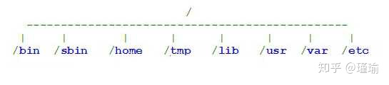
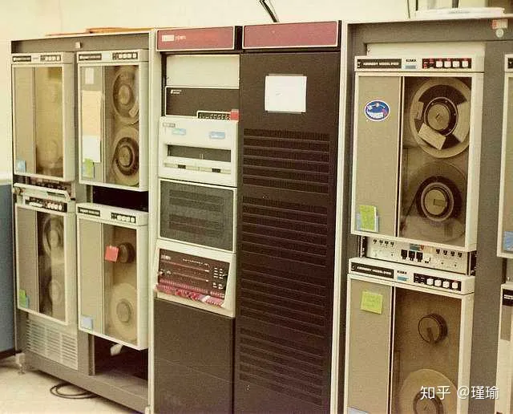
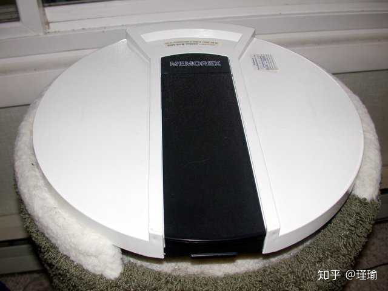

# Unix目录结构的来历

Unix（包含Linux）的初学者，常常会很困惑，不明白目录结构的含义何在。

  

  

举例来说，根目录下面有一个子目录/bin，用于存放二进制程序。但是，/usr子目录下面还有/usr/bin，以及/usr/local/bin，也用于存放二进制程序；某些系统甚至还有/opt/bin。它们有何区别？

长久以来，我也感到很费解，不明白为什么这样设计。像大多数人一样，我只是根据[《Unix文件系统结构标准》](https://link.zhihu.com/?target=http%3A//www.pathname.com/fhs/pub/fhs-2.3.html)（Filesystem Hierarchy Standard），死记硬背不同目录的区别。

昨天，我读到了Rob Landley的[简短解释](https://link.zhihu.com/?target=http%3A//lists.busybox.net/pipermail/busybox/2010-December/074114.html)，这才恍然大悟，原来Unix目录结构是历史造成的。

话说1969年，[Ken Thompson]和[Dennis Ritchie]在小型机PDP-7上发明了Unix。1971年，他们将主机升级到了PDP-11。

  

  

当时，他们使用一种叫做RK05的储存盘，一盘的容量大约是1.5MB。

  

  

没过多久，操作系统（根目录）变得越来越大，一块盘已经装不下了。于是，他们加上了第二盘RK05，并且规定第一块盘专门放系统程序，第二块盘专门放用户自己的程序，因此挂载的目录点取名为/usr。也就是说，根目录"/"挂载在第一块盘，"/usr"目录挂载在第二块盘。除此之外，两块盘的目录结构完全相同，第一块盘的目录（/bin, /sbin, /lib, /tmp...）都在/usr目录下重新出现一次。

后来，第二块盘也满了，他们只好又加了第三盘RK05，挂载的目录点取名为/home，并且规定/usr用于存放用户的程序，/home用于存放用户的数据。

从此，这种目录结构就延续了下来。随着硬盘容量越来越大，各个目录的含义进一步得到明确。

**/**：存放系统程序，也就是At&t开发的Unix程序。

**/usr**：存放Unix系统商（比如IBM和HP）开发的程序。

**/usr/local**：存放用户自己安装的程序。

**/opt**：在某些系统，用于存放第三方厂商开发的程序，所以取名为option，意为"选装"。

（完）

Understanding the bin, sbin, usr/bin , usr/sbin split

On Tuesday 30 November 2010 15:58:00 David Collier wrote:
> *I see that busybox spreads it's links over these 4 directories.* >  > *Is there a simple rule which decides which directory each link lives* > *in.....* >  > *For instance I see kill is in /bin and killall in /usr/bin.... I don't* > *have a grip on what might be the logic for that.* 
You know how Ken Thompson and Dennis Ritchie created Unix on a PDP-7 in 1969?  
Well around 1971 they upgraded to a PDP-11 with a pair of RK05 disk packs (1.5 
megabytes each) for storage.

When the operating system grew too big to fit on the first RK05 disk pack (their 
root filesystem) they let it leak into the second one, which is where all the 
user home directories lived (which is why the mount was called /usr).  They 
replicated all the OS directories under there (/bin, /sbin, /lib, /tmp...) and 
wrote files to those new directories because their original disk was out of 
space.  When they got a third disk, they mounted it on /home and relocated all 
the user directories to there so the OS could consume all the space on both 
disks and grow to THREE WHOLE MEGABYTES (ooooh!).

Of course they made rules about "when the system first boots, it has to come up 
enough to be able to mount the second disk on /usr, so don't put things like 
the mount command /usr/bin or we'll have a chicken and egg problem bringing 
the system up."  Fairly straightforward.  Also fairly specific to v6 unix of 35 
years ago.

The /bin vs /usr/bin split (and all the others) is an artifact of this, a 
1970's implementation detail that got carried forward for decades by 
bureaucrats who never question \_why\_ they're doing things.  It stopped making 
any sense before Linux was ever invented, for multiple reasons:

1) Early system bringup is the provice of initrd and initramfs, which deals 
with the "this file is needed before that file" issues.  We've already \_got\_ a 
temporary system that boots the main system.

2) shared libraries (introduced by the Berkeley guys) prevent you from 
independently upgrading the /lib and /usr/bin parts.  They two partitions have 
to \_match\_ or they won't work.  This wasn't the case in 1974, back then they 
had a certain level of independence because everything was statically linked.

3) Cheap retail hard drives passed the 100 megabyte mark around 1990, and 
partition resizing software showed up somewhere around there (partition magic 
3.0 shipped in 1997).

Of course once the split existed, some people made other rules to justify it.  
Root was for the OS stuff you got from upstream and /usr was for your site-
local files.  Then / was for the stuff you got from AT&T and /usr was for the 
stuff that your distro like IBM AIX or Dec Ultrix or SGI Irix added to it, and 
/usr/local was for your specific installation's files.  Then somebody decided 
/usr/local wasn't a good place to install new packages, so let's add /opt!  
I'm still waiting for /opt/local to show up...

Of course given 30 years to fester, this split made some interesting distro-
specific rules show up and go away again, such as "/tmp is cleared between 
reboots but /usr/tmp isn't".  (Of course on Ubuntu /usr/tmp doesn't exist and 
on Gentoo /usr/tmp is a symlink to /var/tmp which now has the "not cleared 
between reboots" rule.  Yes all this predated tmpfs.  It has to do with read-
only root filesystems, /usr is always going to be read only in that case and 
/var is where your writable space is, / is \_mostly\_ read only except for bits 
of /etc which they tried to move to /var but really symlinking /etc to 
/var/etc happens more often than not...)

Standards bureaucracies like the Linux Foundation (which consumed the Free 
Standards Group in its' ever-growing accretion disk years ago) happily 
document and add to this sort of complexity without ever trying to understand 
why it was there in the first place.  'Ken and Dennis leaked their OS into the 
equivalent of home because an RK05 disk pack on the PDP-11 was too small" goes 
whoosh over their heads.

I'm pretty sure the busybox install just puts binaries wherever other versions 
of those binaries have historically gone.  There's no actual REASON for any of 
it anymore.  Personally, I symlink /bin /sbin and /lib to their /usr 
equivalents on systems I put together.  Embedded guys try to understand and 
simplify...

Rob
\-\- 
GPLv3: as worthy a successor as The Phantom Menace, as timely as Duke Nukem 
Forever, and as welcome as New Coke.