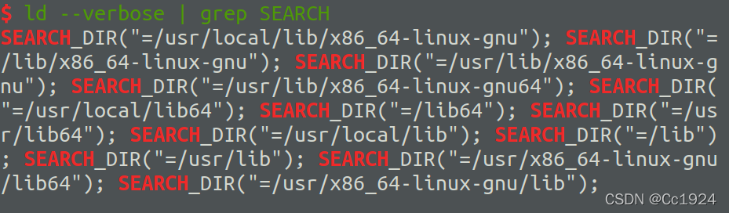
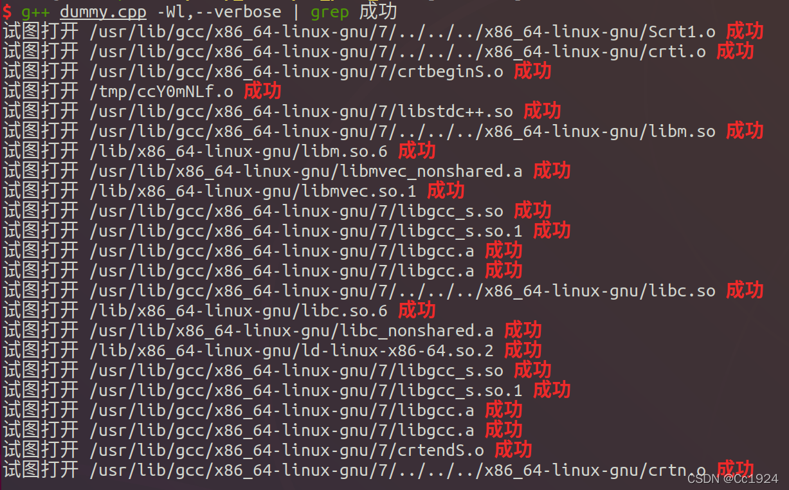

# ld
## 1.ld命令

参考： 
[Linux 命令（65）—— ld 命令](https://blog.csdn.net/K346K346/article/details/89088652)  
[使用 ld 命令链接目标文件生成可执行文件](https://dablelv.blog.csdn.net/article/details/88094902)

### 1.1.简介

ld（Link eDitor）命令是二进制工具集 [GNU Binutil](https://www.gnu.org/software/binutils/)s 的一员，是 GNU 链接器，用于将目标文件与库链接为可执行文件或库文件。

ld 命令支持众多链接选项，但是大部分选项很少被使用，常用参数：

```
-o	指定输出文件名
-e	指定程序的入口符号

```

### 1.2.使用示例

（1）链接目标文件生成可执行文件。如给定 C++ 目标文件 test.o 与 main.o，生成可执行文件 test.out。注意这个过程中还需要链接很多系统库文件，因此写法非常复杂。这也是ld命令很少使用的原因。

```shell
ld /usr/lib64/crt1.o /usr/lib64/crti.o /usr/lib64/crtn.o /usr/lib/gcc/x86_64-redhat-linux/4.8.5/crtbegin.o /usr/lib/gcc/x86_64-redhat-linux/4.8.5/crtend.o -L/usr/lib/gcc/x86_64-redhat-linux/4.8.5 -L/usr/lib64 -L/usr/lib -lstdc++ -lm -lgcc_s -lc -lgcc  main.o test.o -o test.out

```

（2）因为生成一个C++可执行文件，需要依赖很多系统库和相关的目标文件，比如C语言库libc.a，所以使用ld进行链接时，需要注意添加较长的命令选项，不然会报链接错误。使用`g++ -v`命令可以查看生成可执行文所需的相关依赖。

```shell
g++ -v main.o test.o
...
usr/libexec/gcc/x86_64-redhat-linux/4.8.5/collect2 --build-id --no-add-needed --eh-frame-hdr --hash-style=gnu -m elf_x86_64 -dynamic-linker /lib64/ld-linux-x86-64.so.2 /usr/lib64/crt1.o /usr/lib64/crti.o /usr/lib64/crtn.o /usr/lib/gcc/x86_64-redhat-linux/4.8.5/crtbegin.o /usr/lib/gcc/x86_64-redhat-linux/4.8.5/crtend.o -L/usr/lib/gcc/x86_64-redhat-linux/4.8.5 -L/usr/lib64 -L/usr/lib -lstdc++ -lm -lgcc_s -lc -lgcc  main.o test.o

```

## 2.ld命令搜索路径顺序

### 2.1.搜索路径顺序

参考：[Ubuntu之ld搜索路径顺序](https://blog.csdn.net/fightingform/article/details/47302415?csdn_share_tail=%7B%22type%22:%22blog%22,%22rType%22:%22article%22,%22rId%22:%2247302415%22,%22source%22:%22qq_42731705%22%7D&ctrtid=ZBcvD)

**注意**：下面说的搜索顺序应该是对的，但是其他内容**可能存在**一些错误。比如`LIBRARY_PATH`和`LD_LIBRARY_PATH`就分别是静态库和动态库吗？另外库的默认搜索路径不止`/lib /usr/lib /usr/local/lib`这些。

1. 静态库链接时搜索路径顺序

```shell
   1. ld会去找GCC命令中的参数-L

   2. 再找gcc的环境变量LIBRARY_PATH

   3. 再找内定目录 /lib /usr/lib /usr/local/lib 这是当初compile gcc时写在程序内的 

```

2. 动态链接时、执行时搜索路径顺序:

```shell
   1. 编译目标代码时指定的动态库搜索路径

   2. 环境变量LD_LIBRARY_PATH指定的动态库搜索路径

   3. 配置文件/etc/ld.so.conf中指定的动态库搜索路径

   4. 默认的动态库搜索路径/lib 

   5. 默认的动态库搜索路径/usr/lib  

```

3. 有关环境变量

```shell
   LIBRARY_PATH环境变量：指定程序静态链接库文件搜索路径

   LD_LIBRARY_PATH环境变量：指定程序动态链接库文件搜索路径

```

### 2.2.如何查看ld(链接器)的搜索顺序及编译时需要打开的库

参考：[如何查看ld(连接器)的搜索顺序及编译时需要打开的库](https://blog.csdn.net/yygydjkthh/article/details/45419373)

#### 2.2.1.查看ld默认搜索路径

```shell
# 1. 把ld命令脚本的所有内容输入到ld_path文件中
ld --verbose | tee ~/ld_path.txt

# 2.仅仅过滤其中SEARCH有关的部分显示
ld --verbose | grep SEARCH

```

其中，`ld --verbose | grep SEARCH`显示结果如下，可以看到不仅包括`lib /usr/lib uar/local/lib`等目录，还有其他目录。  


#### 2.2.2.查看编译时需要打开的库

假设有一个文件`dummy.cpp`，内容如下：

```cpp
#include <iostream>

int main()
{

}

```

使用`g++ dummy.cpp -Wl,--verbose | grep succeeded`，或者系统语言是中文的话，输入`g++ dummy.cpp -Wl,--verbose | grep 成功`，查看编译过程中打开的库。结果如下：  


# ldd

**ldd 命令的作用是 打印共享库的依赖关系：**
> ldd是List Dynamic Dependencies的缩写，列出动态库依赖关系
1. 首先ldd不是一个可执行程序，而只是一个shell脚本
2. ldd能够显示可执行模块的dependency，其原理是通过设置一系列的环境变量，如下：
    - LD\_TRACE\_LOADED\_OBJECTS
    - LD\_WARN
    - LD\_BIND\_NOW
    - LD\_LIBRARY\_VERSION
    - LD\_VERBOSE等。
    当LD\_TRACE\_LOADED\_OBJECTS环境变量不为空时，任何可执行程序在运行时，它都会只显示模块的 dependency，而程序并不真正执行。要不你可以在shell终端测试一下，如下： 　　      
    (1) export LD\_TRACE\_LOADED_OBJECTS=1
    (2) 再执行任何的程序，如ls等，看看程序的运行结果
3. ldd显示可执行模块的dependency的工作原理，其实质是通过ld-linux.so（elf动态库的装载器）来实现的。我们知道，ld-linux.so模块会先于executable模块程序工作，并获得控制权，因此当上述的那些环境变量被设置时，ld-linux.so选择了显示可执行模块的dependency。
4. 实际上可以直接执行ld-linux.so模块，如：/lib/ld-linux.so.2 --list program（这相当于ldd program）

# ldconfig
## 说明
1. 简介：
    ldconfig是一个动态链接库管理命令。
    其**目的**是为了让动态链接库为系统所共享。
    ldconfig命令的**用途** 主要是在默认搜寻目录(/lib和/usr/lib)以及动态库配置文件/etc/ld.so.conf内所列的目录下，搜索出可共享的动态链接库(格式如lib*.so*)，进而创建出动态装入程序(ld.so)所需的连接和缓存文件。 缓存文件默认为/etc/ld.so.cache,此文件保存已排好序的动态链接库名字列表。
    ldconfig命令的**使用时机**：ldconfig通常在系统启动时运行，而当用户安装了一个新的动态链接库时，就需要手工运行这个命令
2. ldconfig命令的**用途**：
    - 在默认搜寻目录(/lib和/usr/lib)以及动态库配置文件/etc/ld.so.conf内所列的目录下,搜索出可共享的动态链接库(格式lib*.so*)，进而创建出动态装入程序(ld.so)所需的连接和缓存文件。缓存文件默认为 /etc/ld.so.cache，此文件保存已排好序的动态链接库名字列表
    - 为了让动态链接库为系统所共享，需运行动态链接库的管理命令ldconfig，此执行程序存放在/sbin目录下。ldconfig通常在系统启动时运行,而当用户安装了一个新的动态链接库，修改了ld.so.conf时,就需要手工运行这个命令。
    - inux下的共享库机制采用了类似于高速缓存的机制，将库信息保存在/etc/ld.so.cache里边。程序连接的时候首先从这个文件里边查找，然后再到ld.so.conf的路径里边去详细找
3. ldconfig命令行用法如下

```
(1) -v或--verbose : 用此选项时,ldconfig将显示正在扫描的目录及搜索到的动态链接库,还有它所创建的链接的名字.
(2) -n : 用此选项时,ldconfig仅扫描命令行指定的目录,不扫描默认目录(/lib,/usr/lib),也不扫描配置文件/etc/ld.so.conf所列的目录.
(3) -N : 此选项指示ldconfig不重建缓存文件(/etc/ld.so.cache).若未用-X选项,ldconfig照常更新文件的连接.
(4) -X : 此选项指示ldconfig不更新文件的连接.若未用-N选项,则缓存文件正常更新.
(5) -f CONF : 此选项指定动态链接库的配置文件为CONF,系统默认为/etc/ld.so.conf.
(6) -C CACHE : 此选项指定生成的缓存文件为CACHE,系统默认的是/etc/ld.so.cache,此文件存放已排好序的可共享的动态链接库的列表.
(7)  -r ROOT : 此选项改变应用程序的根目录为ROOT(是调用chroot函数实现的).选择此项时,系统默认的配置文件 /etc/ld.so.conf,实际对应的为 ROOT/etc/ld.so.conf.如用-r /usr/zzz时,打开配置文件 /etc/ld.so.conf时,实际打开的是/usr/zzz/etc/ld.so.conf文件.用此选项,可以大大增加动态链接库管理的灵活性.
(8) -l : 通常情况下,ldconfig搜索动态链接库时将自动建立动态链接库的连接.选择此项时,将进入专家模式,需要手工设置连接.一般用户不用此项.
(9) -p或--print-cache : 此选项指示ldconfig打印出当前缓存文件所保存的所有共享库的名字.
(10) -c FORMAT 或 --format=FORMAT : 此选项用于指定缓存文件所使用的格式,共有三种: ld(老格式),new(新格式)和compat(兼容格式,此为默认格式).
(11) -V : 此选项打印出ldconfig的版本信息,而后退出.
(12) -? 或 --help 或--usage : 这三个选项作用相同,都是让ldconfig打印出其帮助信息,而后退出.

```

## NOTE

1. 往/lib和/usr/lib里面加东西，是不用修改/etc/ld.so.conf的，但是完了之后要调一下ldconfig，不然这个library会找不到
2. 想往上面两个目录以外加东西的时候，一定要修改/etc/ld.so.conf，然后再调用ldconfig，不然也会找不到
    比如安装了一个MySQL到/usr/local/MySQL，mysql有一大堆library在/usr/local/mysql/lib下面，这时 就需要在/etc/ld.so.conf下面加一行/usr/local/mysql/lib，保存过后ldconfig一下，新的library才能在 程序运行时被找到。
3. 如果想在这两个目录以外放lib，但是又不想在/etc/ld.so.conf中加东西（或者是没有权限加东西）。那也可以，就是export一个全局变 量LD\_LIBRARY\_PATH，然后运行程序的时候就会去这个目录中找library。一般来讲这只是一种临时的解决方案，在没有权限或临时需要的时候使用。
4. ldconfig做的这些东西都与运行程序时有关，跟编译时一点关系都没有。编译的时候还是该加-L就得加，不要混淆了。
5. 总之，就是不管做了什么关于library的变动后，最好都ldconfig一下，不然会出现一些意想不到的结果。不会花太多的时间，但是会省很多的事

## 注意事项

1. 64位的linux机器上的默共享库的查找路径为：/lib64 /usr/lib64。实测发现不会搜索/lib /usr/lib。而且以上的两个目录没有什么so文件。/usr/local/lib64、/usr/local/lib 这两个目录也不会搜索的
 
2. 动态库的搜索路径搜索的先后顺序是：
    1. 编译目标代码时指定的动态库搜索路径; //LDIRNAME
    2. 环境变量LD\_LIBRARY\_PATH指定的动态库搜索路径;
    3. 配置文件/etc/ld.so.conf中指定的动态库搜索路径;//只需在在该文件中追加一行库所在的完整路径如"/root/test/conf/lib"即可,然后ldconfig是修改生效。（实际上是根据缓存文件/etc/ld.so.cache来确定路径）
    4. 默认的动态库搜索路径/lib;（64位机器为/lib64）
    5. 默认的动态库搜索路径/usr/lib。（64位机器为/usr/lib64）
3. ldconfig相关介绍：
    - ldconfig主要的作用是根据/etc/ld.so.conf 的内容，查找内容中所包含目录下实际的动态库文件，生成搜索共享库的缓存文件/etc/ld.so.cache 。
    - 缓存必须与实际路径的文件相一致。机器比较傻，只认缓存，然后按照缓存的路径去实际路径查找文件。增加或删除了实际的共享库路径下的文件，而没有更新缓存，执行被其依赖的可执行文件时会出错。
    - 查看共享库的缓存内容。ldconfig -p
4. /lib 或 /usr/lib（64位系统下为/lib64 /usr/lib64）路径下的共享库比较特殊。
    - 它是默认的共享库的搜索路径。
    - 它没有放到/etc/ld.so.conf 文件中。但是在/etc/ld.so.cache 的缓存中有它。
    - 其路径下的共享库的变动即时生效，不用执行ldconfig。就算缓存ldconfig -p 中没有，新加入的动态库也可以执行
5. 实际上可以直接执行ld-linux.so模块，如：/lib/ld-linux.so.2 --list program（这相当于ldd program）