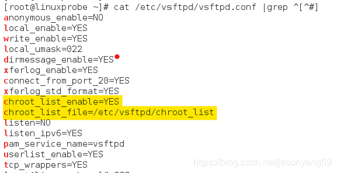
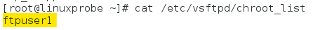

​

 转自：

[vsftp配置实例-虚拟用户锁定目录\_jasonyang69的博客-CSDN博客\_vsftpd锁定用户目录](https://blog.csdn.net/jasonyang69/article/details/111308641 "vsftp配置实例-虚拟用户锁定目录_jasonyang69的博客-CSDN博客_vsftpd锁定用户目录")

[快速解决 vsftpd nologin 虚拟用户 拒绝访问 无法登录\_小飞飞飞鱼的博客-CSDN博客\_vsftpd 拒绝访问](https://blog.csdn.net/sinat_35855737/article/details/104804565 "快速解决 vsftpd nologin 虚拟用户 拒绝访问 无法登录_小飞飞飞鱼的博客-CSDN博客_vsftpd 拒绝访问")

# 一、实验步骤

## 0、启用 nologin shell
~~~
#vim /etc/shells

/bin/sh  
/bin/bash  
/usr/bin/sh  
/usr/bin/bash  
/sbin/nologin      #添加这一行  
/usr/sbin/nologin  
 ~~~

  
## 1、创建用户

```
#创建ftpuser1登录用户
useradd -g ftp -d /share/soft -s /sbin/nologin ftpuser1

#为ftpuser1设置登录密码
passwd ftpuser1
```


## 2、编辑配置文件  
#vim /etc/vsftpd/vsftp.conf  


**设置：**  
#锁定目录，当chroot\_list\_enable=YES时将调用chroot\_list\_file  
chroot\_list\_enable=YES  
#指定锁定用户的文件列表  
chroot\_list\_file=/etc/vsftpd/chroot\_list

## 3、在/etc/vsftpd/目录下创建chroot\_list文件  
vim /etc/vsftpd/chroot\_list  


## 4、重启vsftpd服务

```
systemctl restart vsftpd
```

## 5、测试

测试连接报错：

```
500 OOPS: vsftpd: refusing to run with writable root inside chroot()
```

**问题：**  
原来vsftpd从2.3.5之后，增强了安全检查，如果用户被限定在了其主目录下，则该用户的主目录不能再具有写权限了！如果检查发现还有写权限，就会报该错误。  
**解决方法：  **
方法1：  
在配置文件中加入以下设置：  
#允许用户在被限定主目录下有写权限  
allow\_writeable\_chroot=YES  
方法2：  
可以用命令chmod a-w /share/soft 去除用户主目录的写权限;

测试连接成功；

​