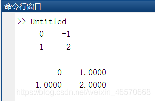
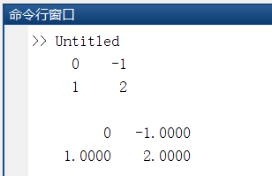
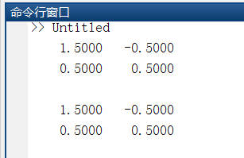
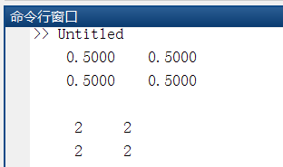

# MATLAB""（左除）、"/"（右除）以及"./"（右点除）、"."（左点除）

## “\\”左除

左除即求逆后相乘  
例如两个矩阵A、B  
A\\B=inv(A)\*B （inv()就是求逆）  
举例：

```javascript
A=[1 2;3 4];
B=[2 3;4 5];
C=A\B;
D=inv(A)*B;
disp(C);
disp(D);
```

运行结果：  
  
再比如说求解方程组Ax=b  
我们既可以使用x=inv(A)\*b，也可以直接A\\b

```javascript
A=[1 2;3 4];
b=[3;7];
x1=A\b;
x2=inv(A)*b;
disp(C);
disp(D);
```

结果  


## “/”右除

右乘就是乘逆矩阵  
例如两个矩阵A、B，  
A/B=A\*inv(B)  
举例

```javascript
A=[1 2;3 4];
B=[2 3;4 5];
C=A/B;
D=A*inv(B);
disp(C);
disp(D);
```

运行结果  


## “./”右点除和"."（左点除）

./就是左边矩阵元素分别与对应位置的右边矩阵上的元素相除  
.\\就是右边矩阵元素分别与对应位置的左边矩阵上的元素相除  
举例：

```javascript
A=[1 2;3 4];
B=[2 4;6 8];
C=A./B;
D=A.\B;
disp(C);
disp(D);
```

运行结果  
