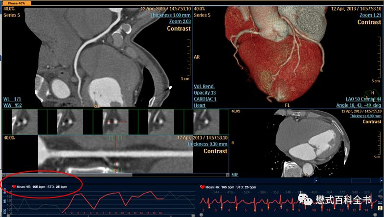
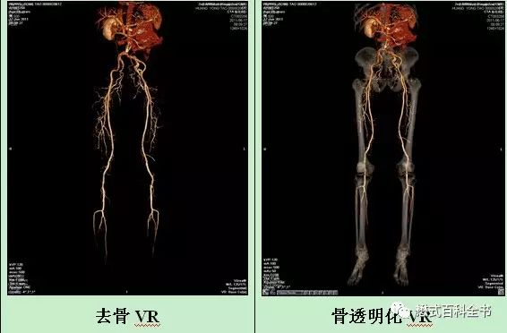

转自：  
  
[CTA图像](https://mp.weixin.qq.com/s?__biz=MzI1NzU4Njg2OQ==&mid=2247485678&idx=1&sn=eac9f8a6cc3db49cfccd66b704c841bf "CTA图像")

脑卒中头颅“一站式”CT检查又称多模式头颅CT成像，包括CT平扫（NCCT），CT血管成像（CTA）和CT灌注成像（CTP）

【高分辨CT（HRCT）、CT 血流储备分数 （ CT-FFR）、美国心血管计算机断层扫描学会(SCCT)】

&nbsp;&nbsp;&nbsp;&nbsp;CT检查在临床中应用十分广泛，CT以其扫描速度快，对骨头及钙化敏感而具有部分优势。

&nbsp;&nbsp;&nbsp;&nbsp;CTA是CT血管成像，是CT临床应用中一个非常重要的部分，由于血管及其背景软组织自然对比差，常规CT平扫往往难以显示血管。在进行CTA检查的时候，需要引入对比剂，改变血管与背景组织的影像对比，从而突显血管。

&nbsp;&nbsp;&nbsp;&nbsp;CTA广泛的应用在头颈部血管、心脏冠状动脉、肺动静脉、胸主动脉、腹主动脉、下肢动静脉中。

&nbsp;&nbsp;&nbsp;&nbsp;其中比较常用的是冠脉CTA及头颈部CTA（经常是配合CTA+CTP一站式解决方案）。

冠脉CTA

&nbsp;&nbsp;&nbsp;&nbsp;行冠脉CTA检查，原则上要把心率控制在70/min以下。当然现在设备越来越好了，对心率的要求也慢慢放宽松了。对于双源CT（西门子）、iCT（飞利浦）、Revolution（GE）及Aquillion One 320（Toshiba）等设备来说，即使心率＞70/min，也可能做出漂亮的冠脉。

飞利浦iCT，心率快并且伴有心率不齐，仍然能做出漂亮的冠脉图像

&nbsp;&nbsp;&nbsp;&nbsp;冠脉CTA做完一个最重要的步骤是进行图像后处理。CTA的图像后处理一般包括：VR（容积再现）、MIP（最大密度投影，磁共振就说最大信号强度投影）、CPR（曲面重建）、MPR（多平面重建）、SSD（表面遮盖）、CTVE（CT仿内镜）等技术。

&nbsp;&nbsp;&nbsp;&nbsp;冠状动脉CTA主要是找出冠状动脉的主要三个主干和三个分支。

冠状动脉由左冠窦和右冠窦发出。正常情况下（非变异）：左冠窦一般发出LM（左主支），LM又分出LAD（左前降支）和LCX（左旋支）；右冠窦发出RCA（右冠支）。

LAD的主要分支是D1（角支），D2（角第二支）；LCX主要分支是OM1（钝圆支）；有时候LM还会发出Ramus（中间支）。RCA主要分支是PDA（右后降支）。

&nbsp;&nbsp;&nbsp;&nbsp;如果有钙化或软化斑块要标出，钙化积分由数据工作站进行电脑测量。目前很多先进的设备不仅配备有钙化积分分析软件，甚至还配置有斑块分析软件。

&nbsp;&nbsp;&nbsp;&nbsp;当然也正常人也存在冠状动脉解剖变异的情况，这种情况需要对解剖非常熟悉，准确的识别出变异。

头颈CTA

&nbsp;&nbsp;&nbsp;&nbsp;头颈部CTA是应用第二多（有说第一多的）临床CTA技术。

&nbsp;&nbsp;&nbsp;&nbsp;颈动脉系统包括颈总动脉及其分支血管。颈总动脉在甲状软骨上缘水平又分为ICA（颈内动脉）和ECA（颈外动脉）。

&nbsp;&nbsp;&nbsp;&nbsp;主动脉弓发出三支主要的血管支（俗称三根毛），分别是头臂干（头臂动脉）、左侧颈总动脉及左侧锁骨下动脉。

&nbsp;&nbsp;&nbsp;&nbsp;头臂干又分为右侧颈总动脉和右侧锁骨下动脉。

&nbsp;&nbsp;&nbsp;&nbsp;当然，这是针对大部分正常人，少部分人仍然存在解剖变异。

&nbsp;&nbsp;&nbsp;&nbsp;除了颈动脉系统，颈部CTA重要的还是椎动脉系统。

&nbsp;&nbsp;&nbsp;&nbsp;椎动脉多由锁骨下动脉的第一段发出，沿前斜角肌内侧上行。

&nbsp;&nbsp;&nbsp;&nbsp;头颈部CTA看的动脉就简单了。

&nbsp;&nbsp;&nbsp;&nbsp;大脑的动脉学过医的都知道，主要是由颈内动脉系统和基-椎动脉系统构成。颈内动脉发出MCA（大脑中动脉）、ACA（大脑前动脉）；基-椎动脉延续为PCA（大脑后动脉）。

&nbsp;&nbsp;&nbsp;&nbsp;颈动脉主要是看左、右颈动脉（carotid artery）；左、右椎动脉（vertebral artery）。

下肢动脉

上腹部血管

&nbsp;&nbsp;&nbsp;&nbsp;腹部血管相对来说，大动脉比较好做。但是如果想要做肝脏的血管，把肝动脉、门静脉及肝静脉分开，还是比较有难度的。这一点来说，磁共振目前有其局限性。

肺静脉

肺静脉一般左右各3个分支，一共6个，当然很多情况下有变异。

&nbsp;&nbsp;&nbsp;&nbsp;当然，除了以上图像及应用，CTA基本上可以用在全身各个部位，由于笔者水平有限，就先介绍到这里。待我看2个月CT书，把CT知识重新捡起来的时候，在好好写一些CT的知识。