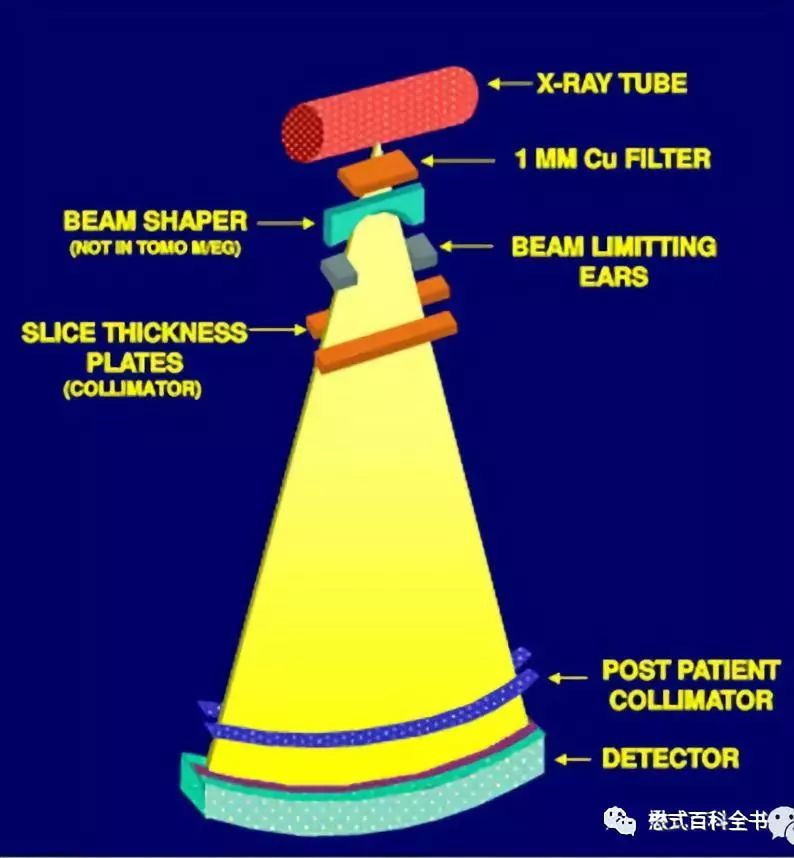
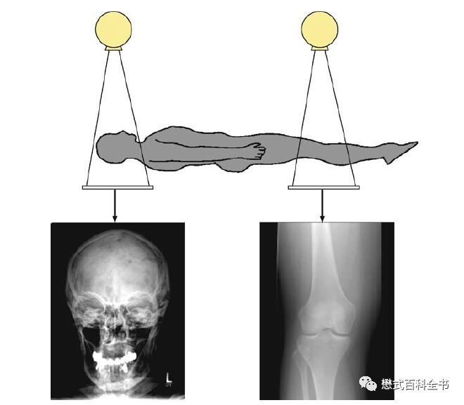
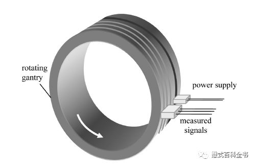
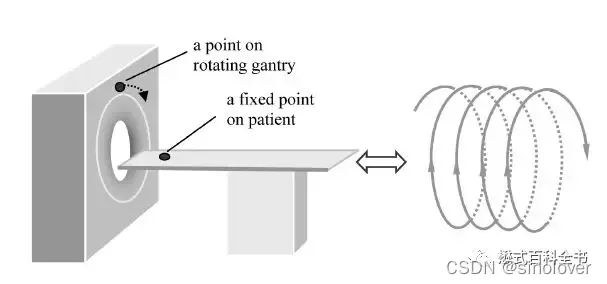
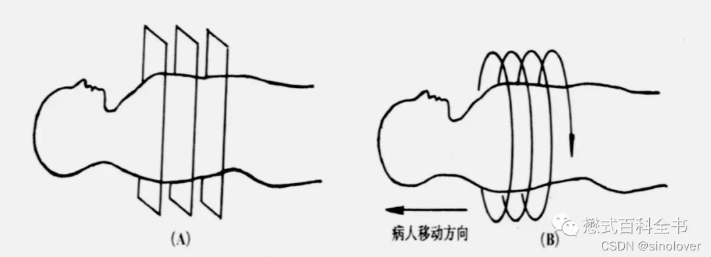
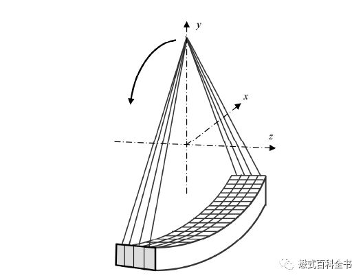
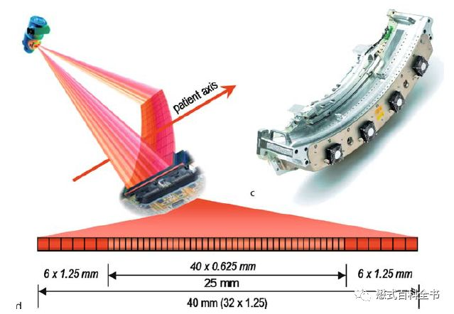
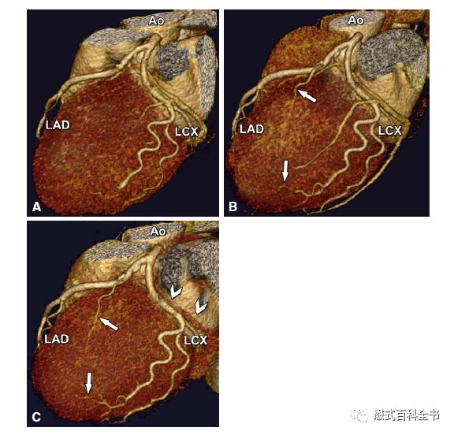
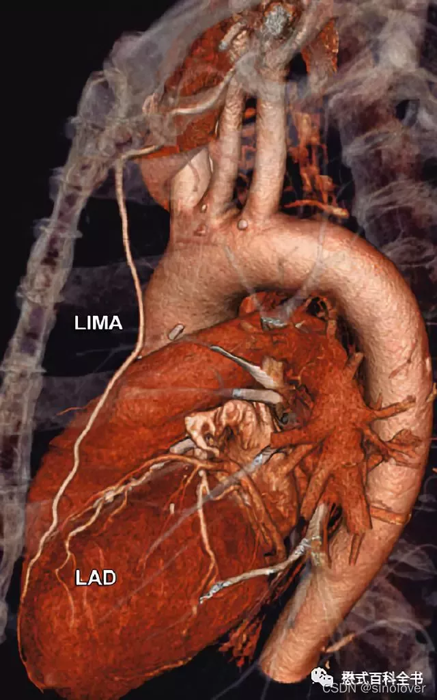

转自：[CT中的"层"与"排"的区别](https://mp.weixin.qq.com/s?__biz=MzI1NzU4Njg2OQ==&mid=2247486475&idx=1&sn=be6a0fe92a38b49c5db2fb4c03b59d07)

&nbsp;&nbsp;&nbsp;&nbsp;自从离开医院，专业培训磁共振，有差不多5年时间没有接触CT了。影像技术及影像医学诊断说到底是一门经验技术累积学科，这种学科的特点就是熟能生巧，几年不碰，我觉得我的CT技术差不多都忘光了。

&nbsp;&nbsp;&nbsp;&nbsp;最近有空也在看CT技术及诊断的书籍，就是不想完全把CT知识都丢光了。偶然间上各种影像论坛，看见我2~4年前发的帖子，还有好多内容是关于CT技术的，有一篇是2014年发的，一算距今已经快五年了。

&nbsp;&nbsp;&nbsp;&nbsp;所以，今天在整理一些CT的内容，自己回顾一遍，再查一些资料，重新写一遍，也是对知识的温故知新。

&nbsp;&nbsp;&nbsp;&nbsp;CT术语中的“**排**”和“**层**”只要是接触过CT的相关人员都不会陌生。对于大部分有工作经验或者专业的CT技术人员来说，理解这两个相关术语并不困难。而对于CT操作不太熟悉或者很多医学生，影像技术学生来说，经常容易把他们搞混淆。

&nbsp;&nbsp;&nbsp;&nbsp;**"层"（Slice）和"排"（detector row）是两个完全不同的概念**，这一点首先需要大家明确。

&nbsp;&nbsp;&nbsp;&nbsp;“排”是指CT探测器在Z轴方向的物理排列数目，简单来讲就是有多少排（个）探测器，就是多少排CT，这个指标主要是反映CT硬件结构。可以说排是一个硬件性参数。所谓硬件性参数就是直接可以在硬件（实体）中反映出来的，比如64排，那么可以数出来探测器的阵列数。目前的CT都是多排CT（MDCT），即Multi-detector CT或者可以写成Multi-row CT或者Multiple detector row CT。

&nbsp;&nbsp;&nbsp;&nbsp;“层”是指CT数据采集系统（Data Acquisition System, DAS）同步获得图像的能力，简单的说就是同步采集图像的DAS通道数目或机架旋转时同步采集图像的层数，这个指标主要是反映CT扫描的功能。可以说层是一个功能性参数。所谓功能性参数是指要通过图像性能来反映的，不能直接通过实体显示。有多少层CT就代表扫描一圈能够同步获得多少幅图像。比如，我们常说的16层CT、64层CT，就是表示扫描一圈能够获得16层图像、64层图像。目前的CT基本上都是多层CT（MSCT），即Multi-Slice CT或Multi-slice spiral CT或Multislice CT。

&nbsp;&nbsp;&nbsp;&nbsp;当然，在很多CT的书籍中，无论是国内的还是国外的，这两个术语基本上是随机的。甚至有些书籍直接这样写“Multiple detector row CT (MSCT)"，把两个概念或者术语经常相互切换，相互替换。理解其含义的人当然明白其各自的意义及侧重点，但是很多医学生经常被搞蒙。在部分书籍使用多排CT（MDCT）或多层CT（MSCT）中，主要是侧重点或者比较说明有所不同。比如，有的书籍使用MDCT是为了和single-detector row CT（SDCT）相比较。

&nbsp;&nbsp;&nbsp;&nbsp;第二点需要注意的就是，由于“层”和“排”是不同的概念。所以，很多时候，**层和排并不是一一对应的**。

&nbsp;&nbsp;&nbsp;&nbsp;前面讲了“排”代表探测器的阵列数，一般来说排越多，探测器宽度越宽，一次扫描完成的宽度越大，一次扫描得到的图像也越多。但是由于探测器的物理排布，组合方式及设计理念的不同，“排”数相同的CT得到的“层”数可能并不一样。

&nbsp;&nbsp;&nbsp;&nbsp;举个例子，如果每排探测器一次采集可以获得2幅图像，那么一排实际上对应的是两层。比如，某某机器的64层CT，实际上探测器是32排，每排出2幅图，一次采集可以获得64幅图像，所以该CT也可以叫做64层CT，也可以叫做32排CT。

&nbsp;&nbsp;&nbsp;&nbsp;在MSCT多层CT技术中，DAS控制着数据的采集及传输。利用DAS电子开关对受X线激发的多排探测器陈列的不同组合，可以进行不同层厚图像的采集。但是同步采集图像的层数仍然受到DAS通道数目的限制。也就是说，DAS是真正的决定同步多层采集图像的能力，与容积成像能力相关的应该是DAS通道数目，即“层”的数目。因此，层的叫法应该更准确。“排”的数目多少只决定对不同采集层厚的组合能力，与CT同步采集层数并没有直接的关系。因此，“层”更能精确地评价CT机器的扫描性能，也更便于CT使用者的理解。

&nbsp;&nbsp;&nbsp;&nbsp;目前GPSTH（GE、Philips、Siemens、Toshiba被Canon收购、Hitachi）都具有各种性能及参数的CT。在排数及层数上也是有非常多的选择。

&nbsp;&nbsp;&nbsp;&nbsp;CT的发展从早期的单排CT，到双排CT，到螺旋CT及多层螺旋CT，可以说经历了3次飞越。

*图6：传统的X线成像*

*图7：第一代非螺旋CT*

&nbsp;&nbsp;&nbsp;&nbsp;第一次飞越是由非螺旋CT发展为螺旋CT，英文Spiral CT或Helical CT，主要的技术革新是利用了滑环技术，探测器可以连续旋转，这次飞越使CT摆脱了逐层扫描的模式。传统的非螺旋CT扫描模式采用的是进步-采集模式，即step-and-shot。这种采集方式包含了两个周期：数据采集周期和非数据采集周期。在数据采集周期，病人不动（扫描床位置不动），X线球管和探测器以一定速度绕病人旋转一周，采集数据；当一层数据采集完成以后，进入非数据采集周期，扫描床移动到下一个扫描位置，等待新的数据采集周期。可以发现，螺旋CT出来之前，CT扫描是采用逐层扫描进床的模式，扫描速度非常慢，而且容易产生伪影，也不方便做一些受呼吸运动影响大的部位。

*图8：滑环技术原理示意图*

*图9：螺旋CT示意图*

*图10：非螺旋CT vs 螺旋CT*

&nbsp;&nbsp;&nbsp;&nbsp;第二次飞越是由单层螺旋CT发展为多层螺旋CT。多层螺旋CT是指在单层螺旋CT的基础上，增加了探测器在Z轴方向上的-排列数目，这样可以使X线管旋转一周，完成多个层面（断面）的数据采集。相比于单层CT，多层螺旋CT的主要优势在于扫描速度的大幅度提高。扫描速度提高以后，我们可以做很多新的项目，如一些呼吸运动器官的扫描得以实现。另外，由于Z轴（即层面方向）的探测器数目增加，使CT扫描的层厚得以更薄，提高了Z轴方向的空间分辨率或者层间分辨率，这样可以使各项同性成像成为可能。

*图11: 4排CT（注意Z轴方向探测器数目）*

*图12：多排探测器*

&nbsp;&nbsp;&nbsp;&nbsp;CT的发展除了在传统的探测器数目“排”上及采集数据重建图像“层”上做文章以外，目前大部分公司都在往能谱及能量上发展。第三次飞越应该就是将CT从单一的密度分辨率成像发展到类似多参数成像，如双源CT、能谱CT。

*图13：心脏冠脉成像是目前CT的主要应用之一*

&nbsp;&nbsp;&nbsp;&nbsp;目前CT发展到了从单纯比“排”数、“层”数到更多功能性比较，比如大家经常听到了双源CT，双能量CT，能谱CT等。

&nbsp;&nbsp;&nbsp;&nbsp;另外，大家出去听各种讲座，会经常听到一个词“双同”或“三同”，什么意思呢？

&nbsp;&nbsp;&nbsp;&nbsp;三同，指的是同源、同时、同向。

&nbsp;&nbsp;&nbsp;&nbsp;同源是指同一射线源发射（高低能量X射线的特性完全一致，无能量偏移）；

&nbsp;&nbsp;&nbsp;&nbsp;同时是指同一时间采集数据（高低能量X射线的采集时间完全一致，无时间偏差）；

&nbsp;&nbsp;&nbsp;&nbsp;同向是指同一方向采集数据（高低能量X射线的衰减路径完全相同，无空间位移）。

*图14：CT在心血管中的应用*

&nbsp;&nbsp;&nbsp;&nbsp;今天的内容到这里结束了，玩了一次“跨界”，影像技术及知识都是需要经验积累的，很久不碰，势必生疏。CT是这样，MR更是这样。原来在医院还经常做CTA，后处理，现在真的忘得差不多了。由于个人CT水平有限，文章中有不足及错误之处，希望大家多多指出及斧正，感谢大家只支持。