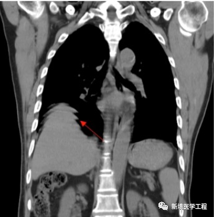

# ***\- 前言 -***

CT的伪影理论上可被定义为图像中被重建数值与物体真实衰减系数之间的差异，简单来说，对于图像重建过程中不该出现在图像上的影像，可认为其是伪影（antifacts）。

## ***\-*** ***01*** ***伪影的分类 -***

按产生伪影的来源分，可分为：

*   来自患者自身的伪影：如运动伪影
    

*   因设备本身产生的伪影：如因探测器坏道产生的环形伪影
    

按伪影的不同形状或表现，可分为：

*   条状伪影
    
*   环状伪影
    
*   阴影
    
*   带状伪影
    
*   其他伪影等
    

## ***\-*** ***02*** ***常见伪影及处理方法 -*** 

### **2.1「头部运动伪影」**

**【产生原因】**

患者在时头部运动导致。

**【解决办法】**

1.  重新并确保患者保持不动。
    
2.  采取螺旋方式
    
3.  采用420度
    
4.  利用附属装置（如楔形头侧垫）固定头部
    

### **2.2 「胸腹部运动伪影」**

**【产生原因】**

患者在时未憋住气导致的膈肌运动轮廓伪影

**【解决办法】**

### **2.3「体内金属伪影」**

**【产生原因】**

患者体内有金属，因为金属吸收了X射线，导致投影数据产生不完全，部分数据丢失导致放射状伪影。

**【解决办法】**

1.  移除金属物体（如可行）
    
2.  使用去金属伪影的算法，如MAC等
    

### **2.4「圆形伪影」**

**【产生原因】**

温湿度变化较大，或长时间未进行空气矫正。

**【解决办法】**

执行空气矫正，用最新的矫正表重建图像。

### **2.5「腹部放射条状伪影」**

**【产生原因】**

在FOV以外有对比度不连续的物体。如腹部时，患者手臂放置于体侧，未上举。（部分溶剂效应）

**【解决办法】**

2.  清除患者旁边的异物
    
3.  勾选自适应滤波功能
    

### **2.6「体外金属伪影」**

**【产生原因】**

体外的金属未去除，密度较大产生伪影。

**【解决方法】**

去除金属，再次

## ***\-*** ***03*** ***小结*** ***-*** 

与常规X射线成像设备相比，CT系统本质上更容易产生伪影：一个CT图像是由大量投影生成的。在一个典型的CT系统中，每个投影包含大约1000个单独的测量，在多层CT的情形下，形成一幅图像需要使用10E19个独立信号读取或测量！由于反投影过程的本质是将投影中的一点映射到图像中一条直线（如下图），投影读数的一个误差不像常规射线照相的情况，不再局限于局部区域。因为测量的不准确通常表现为重建图像中的误差，所以CT产生伪影的概率明显偏高。

随着计算机水平和算法的优化，如今的CT在图像的质量上有明显的提升，伪影的出现有很大改观，但了解伪影的形态、产生原因对于设备图像采集及后处理的理解都很有裨益，同时对于医师来说，分辨伪影与正常图像也是提高诊断水平的必备技能。

**新境医疗**给大家总结了一个表格供大家参考：

**伪影的基本表现和产生原因对照表**

|            |                                                                        |
| ------------- | ------------------------------------------------------------------------- |
| 条状、同心圆形 | 数据采样不当，部分容积效应，患者运动，金属物，射线束硬化，噪声，螺旋，机械故障等。 |
| 阴影状         | 部分容积效应，射线束硬化，螺旋，散射线，焦外辐射，投影数据不全等。                |
| 环状、带状     | 探测器通道故障                                                              |