# 物理方面引起的伪影

## 射束硬化

&nbsp;&nbsp;&nbsp;&nbsp;&nbsp;&nbsp;&nbsp;&nbsp;衰减系数和X光能量有关，X光能量越高，导致衰减系数越小，在图像上反应为亮度较暗。如下图所示，就是由于射束硬化造成的杯状伪影。

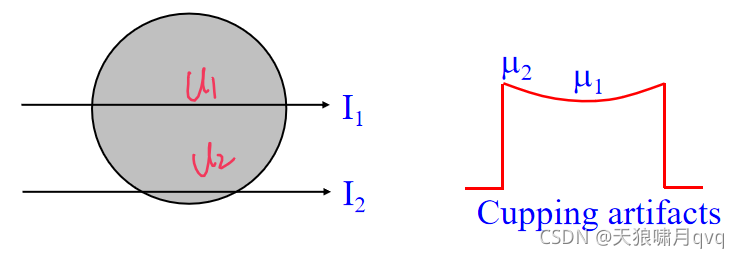

&nbsp;&nbsp;&nbsp;&nbsp;&nbsp;&nbsp;&nbsp;&nbsp;&nbsp;由于射束硬化还会造成条状或者深色带状伪影。如下图所示：

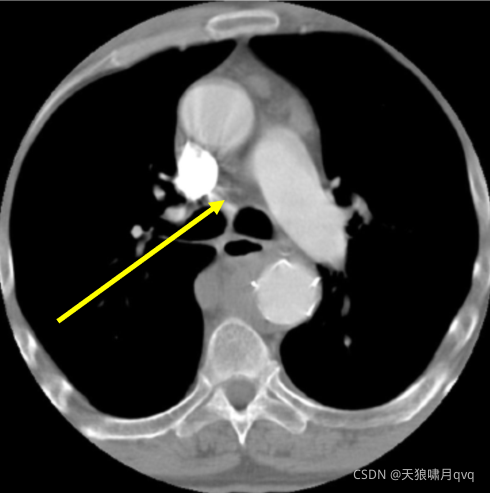

&nbsp;&nbsp;&nbsp;&nbsp;&nbsp;&nbsp;&nbsp;&nbsp;&nbsp;以上均是由射束硬化造成的伪影，解决方法有以下常见的三种：①领结过滤器 ②体模校正 ③使用软件的方法、迭代重建。（效果或方法如下图所示：从左到右）

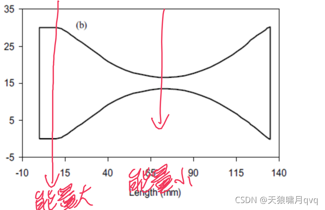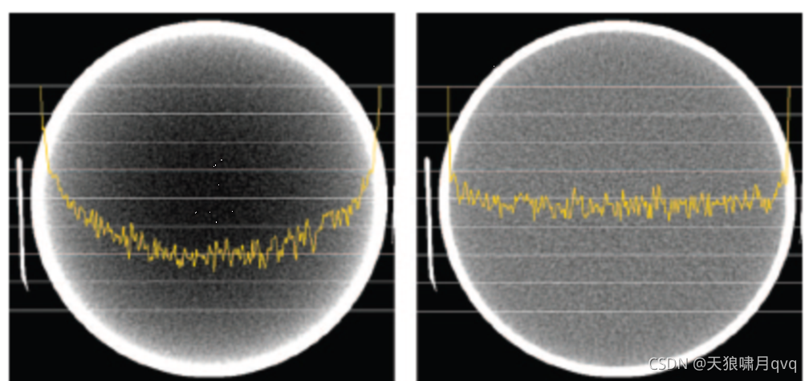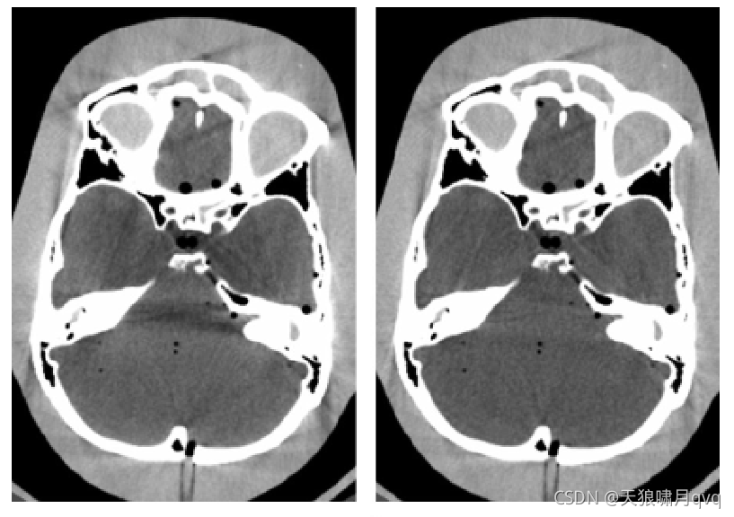

##  部分容积效应

&nbsp;&nbsp;&nbsp;&nbsp;&nbsp;&nbsp;&nbsp;&nbsp;由于某种原因，导致一个物体在某些角度可以被扫描到，而在其它一些角度不在扫描的范围之内，此时也会造成伪影的产生。下图便对此进行了形象的刻画。

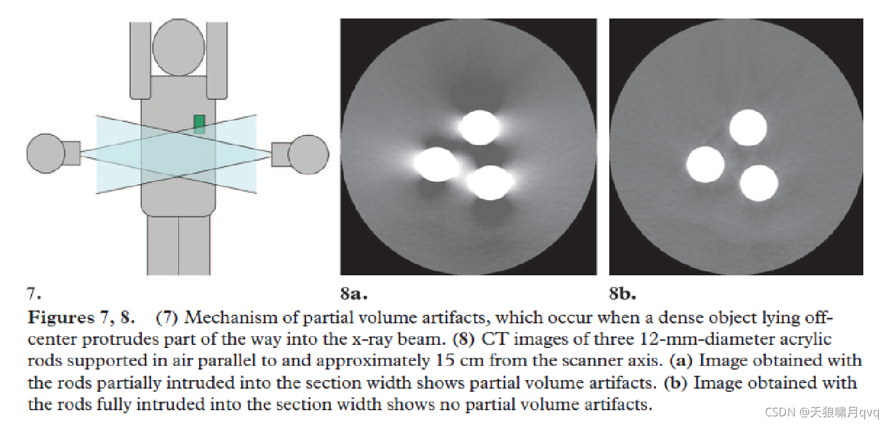

&nbsp;&nbsp;&nbsp;&nbsp;&nbsp;&nbsp;&nbsp;&nbsp;对于此类原因造成的伪影，解决的方法是使用更薄的切片进行扫描，能在一定程度上减少此类伪影：

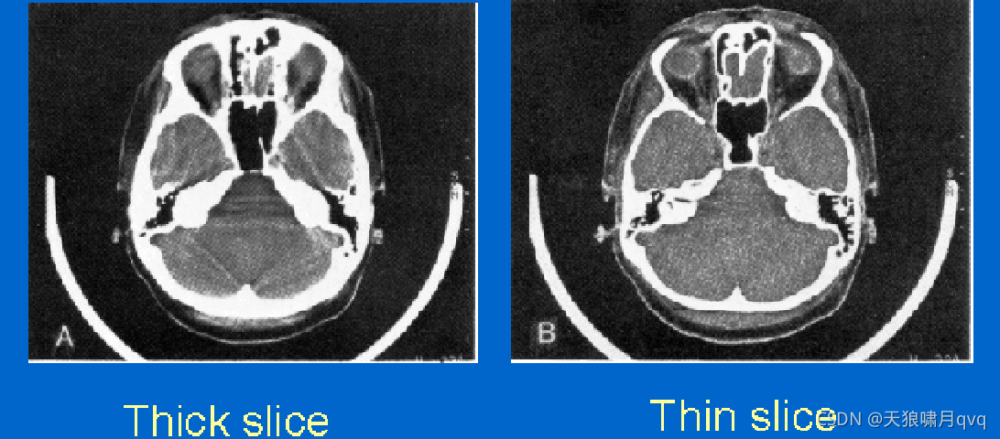

## 光子饥饿

&nbsp;&nbsp;&nbsp;&nbsp;&nbsp;&nbsp;&nbsp;&nbsp;在我们进行临床扫描时，尤其是对肩膀进行左右扫描的时候，由于肩膀太宽，许多光子无法穿透，导致信噪比降低，由此会造成一些伪影。

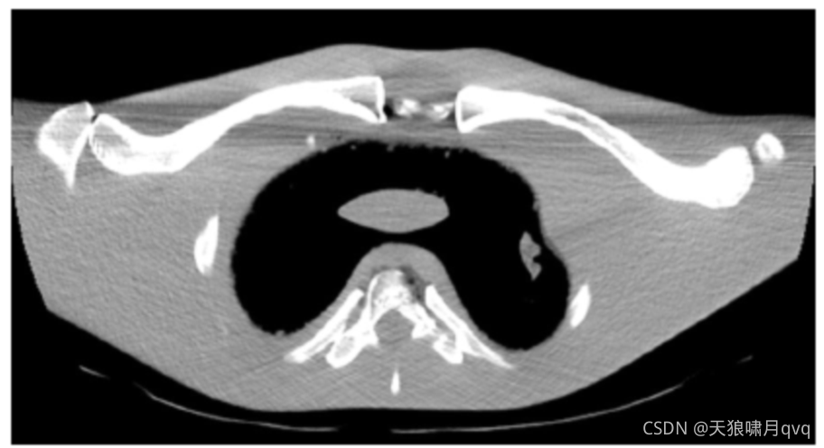

&nbsp;&nbsp;&nbsp;&nbsp;&nbsp;&nbsp;&nbsp;&nbsp;解决方法：动态调整管电流，在进行某些角度的扫描时，提高管电流，使光子能够穿透物体，提高信噪比。

## 角度欠采样

&nbsp;&nbsp;&nbsp;&nbsp;&nbsp;&nbsp;&nbsp;&nbsp;在进行图像重建过程中，边或角采样不够导致产生一些条状的伪影。在进行实验的过程中，我也发现了此类伪影。

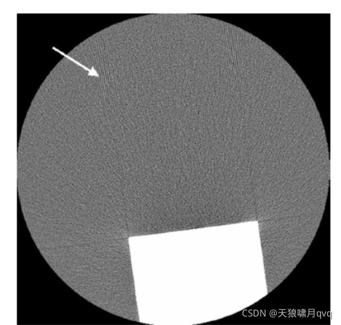

&nbsp;&nbsp;&nbsp;&nbsp;&nbsp;&nbsp;&nbsp;&nbsp;&nbsp;解决方法：增加角度的采样数，就可以减少此类伪影的产生。

# 病人引起的伪影

## 体内金属材料

&nbsp;&nbsp;&nbsp;&nbsp;&nbsp;&nbsp;&nbsp;&nbsp;某些病人体内存在一些金属物品，比如支架等等，在进行CT扫描时会产生金属伪影，此类伪影目前较为常见，并且还没有找到非常有效的方法抑制此类伪影。

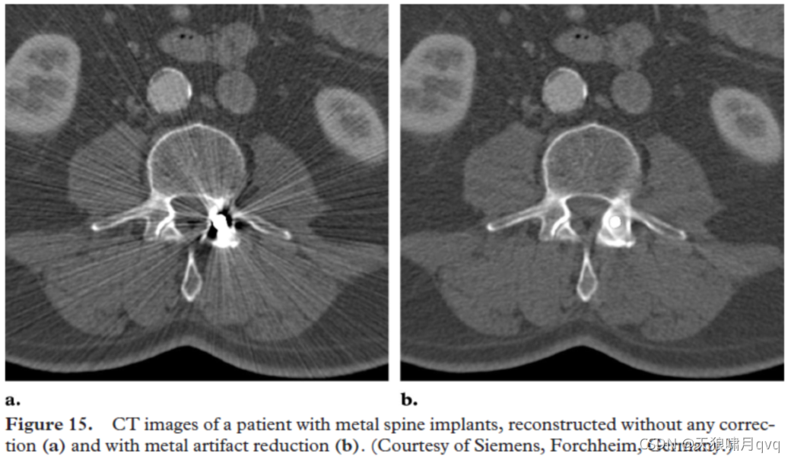

&nbsp;&nbsp;&nbsp;&nbsp;&nbsp;&nbsp;&nbsp;&nbsp;&nbsp;解决方法：在进行扫描时去除病人体内的金属物品，或者使用软件的方法进行修正。

## 病人的移动

&nbsp;&nbsp;&nbsp;&nbsp;&nbsp;&nbsp;&nbsp;&nbsp;在进行CT扫描的过程中，由于病人的微小晃动、呼吸等会导致一些运动伪影的产生。

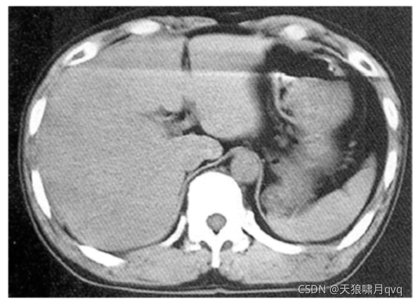           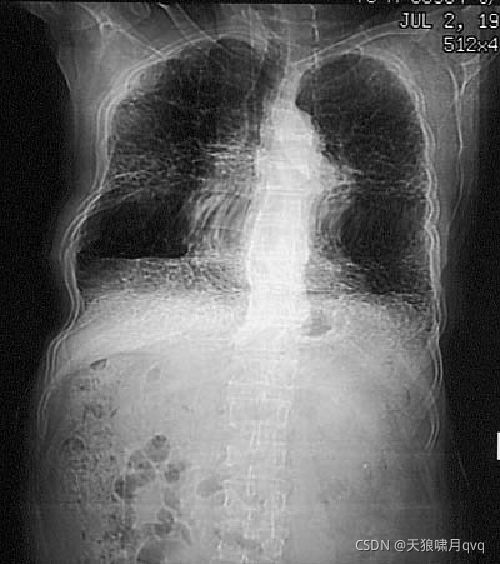

&nbsp;&nbsp;&nbsp;&nbsp;&nbsp;&nbsp;&nbsp;&nbsp;上面两幅图就是由于扫描过程中病人的移动造成的伪影，并且这些伪影非常的明显。解决方法：①给病人提供一个舒服的位置 ②对病人进行适当的约束 ③屏住呼吸 ④过采样 ⑤使用软件修正 ⑥心电门控

## 不充分投影

&nbsp;&nbsp;&nbsp;&nbsp;&nbsp;&nbsp;&nbsp;&nbsp;有一些病人比较肥胖，体积太大，导致体型超出了扫描范围，因此会产生一些伪影。我再进行扇束重建的实验中遇到了这个问题，该伪影与部分容积效应导致的伪影类似。

# 探测器引起的伪影

## 环状伪影

&nbsp;&nbsp;&nbsp;&nbsp;&nbsp;&nbsp;&nbsp;&nbsp;探测器的某一个探测元出现损坏或者有较大的误差，利用该投影数据进行图像重建的时候就会出现环状伪影。

&nbsp;&nbsp;&nbsp;&nbsp;&nbsp;&nbsp;&nbsp;&nbsp;&nbsp;&nbsp;&nbsp;&nbsp;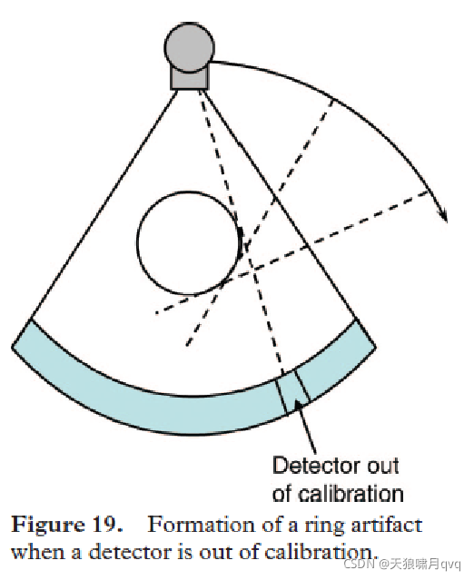       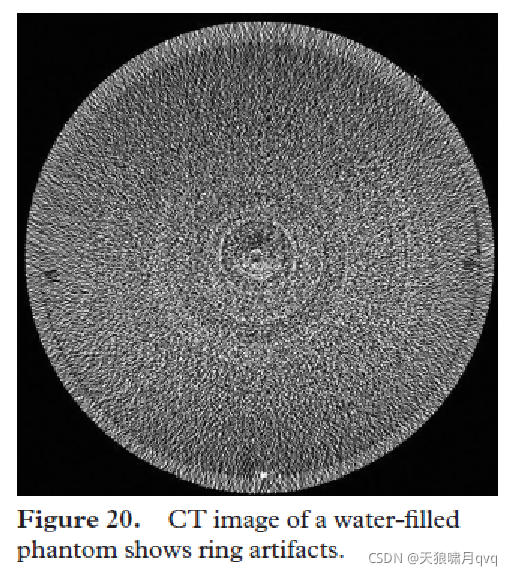      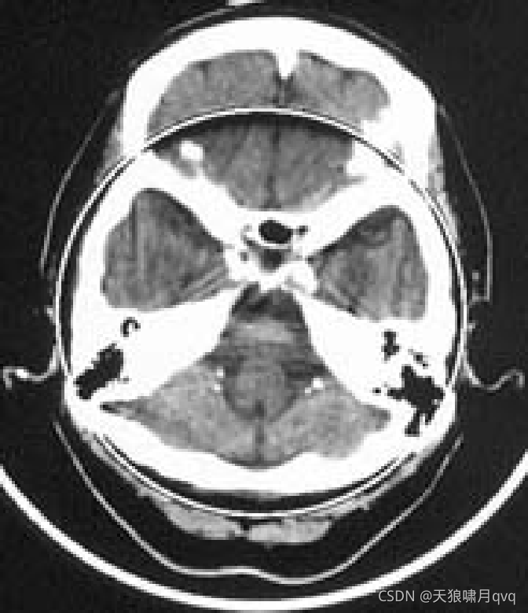

&nbsp;&nbsp;&nbsp;&nbsp;&nbsp;&nbsp;&nbsp;&nbsp;&nbsp;解决方法：在使用设备之前，首先进行探测器的校正，避免出现环状伪影。

# 总结

&nbsp;&nbsp;&nbsp;&nbsp;&nbsp;&nbsp;&nbsp;&nbsp;这是我在学习了B站贾广老师的视频课程之后做的简单复习，上面讲述了常见的各种伪影以及造成伪影的原因，下面还有螺旋和多截面伪影没有写（还没学明白）。在学习上述伪影的时候，要先搞清楚属于什么因素导致的，在进行解决。