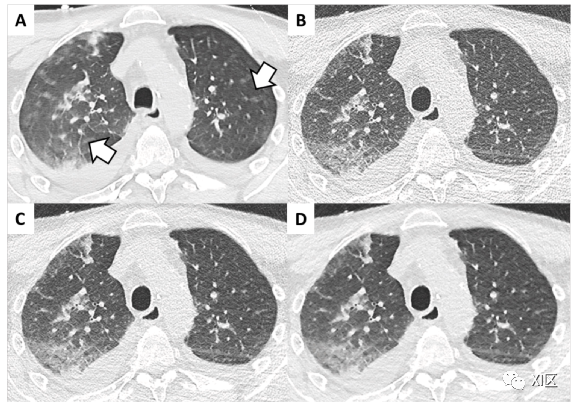

计算机断层扫描（CT）是一种成熟的诊断工具，可在紧急或非紧急情况下对全身进行成像。自20世纪70年代初推出以来，已经引入了许多技术解决方案，以提高诊断性能，减少运动伪影和辐射暴露。新一代扫描仪在机架设计、球管和探测器技术方面提出了多项创新。这些创新加上软件技术的重大创新，从迭代重建（IR）到人工智能（AI）、双能量CT（DECT）能谱成像和光子计数CT。其中一些解决方案顺利进入临床常规，而其他解决方案仍在研究中；为了更好地利用新的CT扫描仪，必须了解所有这些知识。

本文将主要介绍CT的最新技术及其主要临床应用。从机架设计、球管和探测器的创新，我们将转向重建软件和光子计数CT的创新。

**1、技术进步：机架设计**

现代CT扫描仪的创新正朝着两个主要方向发展：**减少辐射剂量**和以**高时间分辨率****沿z轴获取尽可能宽的扫描范围**。

在过去的10-15年中，引入了在z轴上覆盖范围越来越宽的探测器（多达192至320个探测器行，最大覆盖范围16厘米）。在一次旋转中获取整个器官（例如，大脑或心脏）的可能性减缓了对具有更宽探测器的竞争，并重新引入了动态增强检查（DCE）的轴位采集，以减少过度扫描。

**为了获得更好的时间分辨率，必须考虑旋转速度**。2014年宣称的0.20秒转速的目标尚未实现，最快旋转速度为0.28秒（Revolution Apex CT，GE Healthcare）或0.25秒（SOMATOM Force，Siemens Healthineers）。具有这种旋转速度的机架的技术实现需要特定的设计（例如，无摩擦空气轴承和无接触数据传输），并且必须承受0.25s/圈转速时高达40G的巨大离心力。机架的离心力直接影响球管的冷却系统，这需要进行特定的优化，例如旋转外壳、对流冷却和液态轴承。最近，一种特定的心血管扫描仪（CardioGraphe，GE Healthcare）利用更小的机架实现了0.24s的旋转时间。（更多内容参见：[CT的时间分辨率](http://mp.weixin.qq.com/s?__biz=MzU5MjYyMzQ2NQ==&mid=2247491460&idx=1&sn=b0186e8a31a69142b66d8dfa82dec9a8&chksm=fe1dbd82c96a34945724f5a45ee43d11574d0e994831507ede89f80fc35017dc332f7c2026d5&scene=21#wechat_redirect)；[CT机的转速越快越好吗？](http://mp.weixin.qq.com/s?__biz=MzU5MjYyMzQ2NQ==&mid=2247494870&idx=1&sn=e2eba7665cca7977c4dd46db4ca132f4&chksm=fe1e4ed0c969c7c66b4945399aac9bf668a1cce413e1573eceb54d07472f434bda064940f4da&scene=21#wechat_redirect)）。

**超快、高螺距（HP）采集必须依赖检查床快速移动**（高达737mm/s，加速度为150cm/s²）。**这是双源扫描仪**（TurboFlash，SOMATOM Definition Flash，Drive，Force，Siemens Healthineers）的一种**特殊采集技术**，在这种情况下，利用双球管探测器系统可以采集螺距为3的数据。

机架设计的最新创新涉及**人工智能（AI）的使用**。由于扫描仪和剂量减少装置（例如蝶形滤波器和管电流调制）的校准假设患者位于等中心，因此较新的扫描仪使用了AI算法，该算法在红外相机的引导下自动将患者移动到等中心位置，而不会出现中心误差。

**2、CT临床应用：超快采集**

HP扫描（TurboFlash，Siemens Healthineers）的主要应用是心血管成像。除此之外，**HP扫描在减少运动伪影方面提供了一些优势**，尤其是在胸部扫描中。

Lell等人优化了不合作患者的自由呼吸HP扫描，与标准CT采集相比，图像质量满意，运动伪影显著减少，解剖结构描绘更好。低剂量方案（LDCT）和COVID环境中获得了可比较的结果（图1）。更好的解剖描述可以提高诊断信心：Braun等人在他们的HP方案研究中记录了令人满意的诊断性能。Gariani等人评估了一组因各种临床原因接受胸腹部CT检查的成年患者。作者发现，标准CT（螺距0.6）和双源HP扫描（螺距3.2）的图像质量相当，后者的运动伪影明显减少。这些结果也在急诊和肥胖患者中得到证实。

图1 双源CT（SOMATOM Force，Siemens Healthineers）高螺距采集在光谱整形（锡滤波器）上的作用。新冠肺炎不合作患者（男性，77岁）。A 双能量（DECT）采集（90/150Sn kV）；旋转时间：0.25秒，螺距：1.1，曝光时间：1.98秒，ADMIRE 3。辐射剂量：CTDI 7.97 mGy；DLP:381.5 mGycm。B-D 具有光谱整形（Sn100 kV）的高螺距采集（TurboFlash，Siemens Healthineers）；旋转时间：0,25秒，螺距3，曝光时间：0.61秒，ADMIRE 0（滤波反投影，B），ADMIRE 3（C），ADMIRE 5（D）。辐射剂量：CTDI 0.78 mGy；DLP:30.5 mGycm。图像A是标准剂量下的采集；箭头指向咳嗽引起的运动伪影。由于采集时间更短，高螺距采集（图像B-D）避免了运动伪影。使用锡滤过减少辐射剂量至标准剂量的1/10。迭代重建（ADMIRE）是优化图像质量和充分描绘肺结构（图像C和D）的基础。

赵喜同学

，赞159

COVID-19肺炎能谱纯化扫描，0.18mSv。  

  

在儿科CT中，不合作的婴儿可能需要镇静。在全球范围内，**HP协议提供了最佳的图像质量和最有效的运动伪影管理，无需全身麻醉或屏气采集**。

**3、硬件技术进步：球管、探测器、调制和滤波器**

*   **球管**
    

球管技术进步的主要目标是**减少辐射暴露**并**优化对比度**、**快速采集**、**Z轴覆盖范围**和**机架内的机械力**。

除了最后一个问题，其他问题都是通过提**高球管输出**来解决。

首先，**在低kV下的采集允许减少辐射剂量，同时优化对比增强**（X线束的平均能量更接近碘的k边界），**同时较高的管电流可以补偿增加的噪声**。

其次，**HP采集需要持续高管电流量**，以缩短采集时间。

此外，安装在一些扫描仪（SOMATOM Drive和Force，Siemens Healthineers）上用于减少剂量的锡滤波器可吸收高达90%的发射光子；因此，补偿需要高管电流输出。（更多内容参见：[能谱纯化技术的基本原理与临床应用](http://mp.weixin.qq.com/s?__biz=MzU5MjYyMzQ2NQ==&mid=2247486141&idx=1&sn=e4bdf64e11021e1ad301f2d119807969&chksm=fe1da8bbc96a21ad051e19327c6132a556484472bbe6d92e72468f351f619a7321ea8fcfc4db&scene=21#wechat_redirect)）。

因此，高端球管提供了更多的kV选择，并在低电压下提供了更强大的管电流输出。例如，Vectron （Siemens Healthineers）和Quantix 160（GE Healthcare）球管均在70kV下可以提供1300 mA的管电流；Vectron 球管的工作电压可达150 kV，可在10 kV的步进内选择。

第三，**探测器的Z轴覆盖范围直接影响X射线束的锥角，其本身与阳极角成正比**。因此，增大的阳极角对应于更大的焦点（将导致空间分辨率的损失）。这可以用较窄的电子束来补偿（将导致磨损和冷却问题）。在高端球管中，Quantix 160（GE Healthcare）具有较大的阳极角（10°），在Z轴上的准直度为160 mm。

最后，这些性能需要在**高离心力下进行特定的冷却设计**：如旋转外壳和对流冷却（Straton或Vectron球管，Siemens Healthineers），或液体金属用作轴承和冷却系统的螺旋槽。

*   **探测器**
    

探测器技术的最新进展旨在**提高剂量减少、空间分辨率和响应速度方面的性能**。第一种策略是**改进电子元器件**，即光电二极管和模数转换器，这会导致图像噪声。最新的进展之一是将光电二极管和转换器集成在一个集成电路中（即Stellar和StellarInfinity探测器，Siemens Healthineers），在低剂量方案或肥胖患者中显著改善图像质量。

由于闪烁体材料，**当前的探测器技术基于通过可见光将X射线间接转换为电信号**。闪烁体材料必须满足几个要求：在不同的材料中，硫化钆是最常用的材料之一。最近，引入了其他性能更好的材料。例如，石榴石晶体（Gemstone Detector，GE Healthcare）的初级衰变时间为30ns（比硫氧化钆快100倍）；这种材料是快速kV切换能谱成像的基础（图2A-B）。其他材料可用于能谱成像。双层探测器（Spectral CT 7500，Philips Healthcare）有一层ZnSe叠加在Gd2O2S:Pr,Ce层上：上部ZnSe层对低能光子敏感，而下部层对光谱的高能成分敏感（图2 C-E）。

图2 能谱或光谱成像：扫描仪设计。A 双源（Siemens Healthineers）。双球管探测器系统的安装偏差约90°，在最近几代中有所增加，以改善双能量采集的视野。第三代双源扫描仪B球管在140-Sn150 kV的高压下工作，具有锡滤波器以改善光谱分离。B 快速kV切换（GE Healthcare）。球管在旋转时具有可变电压（在80和140 kV之间切换）。C 双层探测器（Philips Healthcare）有两个同心的探测器层，上层对低能光子进行采样，下层与光谱的较高部分相互作用。D 分离滤波器（Siemens Healthineers）。滤光器由金和锡组成：这些金属选择性地切割X射线光谱的高能和低能成分，从而分裂光束。E 连续采集（Canon Medical Systems）。该策略通常在z轴上具有广泛覆盖范围的扫描仪上实现，数据集以序列或螺旋模式顺序采集。F 光子计数CT。目前唯一商业解决方案（NAEOTOM Alpha，Siemens Healthineers）具有双源架构。光子计数探测器的CdTe晶体处于800-1000V的电场中。相互作用后，电子迁移并产生与入射X射线光子能量成比例的电脉冲。

**光子计数探测器使用半导体材料**，例如碲锌镉（CZT）、硅（Si）或碲化镉（CdTe），用于将X射线直接转换为电脉冲。将半导体置于电场（800-1000V）中；在与X射线光子相互作用期间产生的电子被移位并转换成与光子能量成比例的电信号。一旦光子的能量被量化，它们就可以被分组到能量箱中（图2F）。从而**在****图像质量、噪声和剂量减少、多材料分解和空间分辨率方面有众多优点**。

有几种解决方案可用于提高空间分辨率。如使用更小的探测器元件（从0.5mm/0.625mm到0.25mm，Aquilion Precision，Canon Medical Systems）或者使用额外的栅格（UHR或z-UHR，Siemens Healthineers）。

*   **减少剂量：mA和kV的调制**
    

**自动管电流调制（ATCM）**旨在通过不同的解剖区域均匀化图像噪声，这些解剖区域既没有圆形截面，也没有恒定的密度。除了均匀的图像噪声，体模和临床研究显示辐射暴露减少了超过50%。（更多内容参见：[自动管电流调制技术的原理和使用注意事项](http://mp.weixin.qq.com/s?__biz=MzU5MjYyMzQ2NQ==&mid=2247485519&idx=1&sn=de14241bca88b9c739dd3be9667f8707&chksm=fe1daa49c96a235fcc70916a84996e07e71a2b024a7722fcb32fde55be2ea3064be446488717&scene=21#wechat_redirect)）。

ACTM使用扫描投影图像（SPI、定位图）计算患者在一个或两个投影中的大小和衰减。因此，管电流在旋转期间被调制，或者在前后投影和侧向投影之间被内插；管电流也沿Z轴调制。ATCM通常处理图像噪声，可用算法对其进行不同的管理。然而，不同结构的识别依赖于对比噪声比，这取决于患者的体型和脂肪比例：ACTM算法可以针对较大体型患者的较高图像噪声进行优化。例如，CARE Dose4D（Siemens Healthineers）和DoseRight（Philips Healthcare）使用的算法可以通过平均衰减增加可接受的噪声。在第一系统中，需要手动选择参考管电流和调制强度。第二个系统有三个模块：独立工作的自动电流调制（手动或自动）、纵向调制（Z-DOM）和角度调制（D-DOM）。相反，在AutomA（GE Healthcare）和SUREExposure 3D（Canon Medical Systems）算法中，技术员选择噪声水平作为标准体模中的标准偏差值。ATCM的进一步发展是选择性减少浅表区域的辐射暴露，如Organ Dose Modulation（GE Healthcare）或X-CARE（Siemens Healthineers）。这些算法减少了当球管在可变旋转角度（从90°到180°）内照射浅表器官（例如，乳房或晶状体）时的管电流。

随着具有高功率输出和宽工作电压范围的球管的可用性，引入了**自动电压选择算法**，例如CARE kV（Siemens Healthineers）或kV Assist（GE Healthcare）。这些算法自动为特定采集选择具有最低CTDI的最佳管电压和管电流。

*   **光束滤波和光谱整形**
    

在CT成像中，球管发射的X射线和探测器测量的X射线的光谱明显不同：这就是所谓的线束硬化效应。低能量光子（<30keV）被生物组织快速吸收或散射：它们在产生噪声的同时也会增加辐射剂量。线束硬化取决于组织厚度，组织厚度在身体的侧面和周边部分较低。蝶形滤波器对X射线束进行整形：可变厚度的滤波器对X光束的外围部分进行更积极的过滤，计算辐射暴露量减少10-20%。

**光谱整形是减少剂量的另一种策略**：在西门子大部分CT扫描仪的球管端标准滤波器之外添加了额外的锡滤波器。锡滤波器通过滤过较低能级的光子而使X射线束变窄；从而使线束平均能量增加，线束硬化效应减小。（更多内容参见：[能谱纯化技术的基本原理与临床应用](http://mp.weixin.qq.com/s?__biz=MzU5MjYyMzQ2NQ==&mid=2247486141&idx=1&sn=e4bdf64e11021e1ad301f2d119807969&chksm=fe1da8bbc96a21ad051e19327c6132a556484472bbe6d92e72468f351f619a7321ea8fcfc4db&scene=21#wechat_redirect)）。

4、软件技术进步：滤波反投影、迭代重建、人工智能

与减少辐射剂量的硬件创新一起，引入了几种软件解决方案，以减少图像噪声，并允许以较低的曝光量进行采集。几十年来，CT图像重建的标准是分析方法，即所谓的**滤波反投影**（FBP）。考虑到探测器测量的假想铅笔束投影（原始数据）作为角位移和线性位移的积分函数，FBP通过反演求解这些方程并重建图像；该算法的进一步发展涉及扇形束和螺旋采集。FBP与滤波器相关联，以补偿通过中心和外围物体的不同投影数量所产生的低通模糊：补偿越高，清晰度越高，空间分辨率和图像噪声越高。FBP的**主要优点是低复杂性和所需的计算能力**；然而，**增加噪声的问题阻碍了FBP辐射暴露的减少**（图3，表1）。

图3 CT图像重建：A 滤波反投影重建。B 统计（混合）迭代重建（IR），C 基于模型的IR，D人工智能（AI）和神经网络。混合IR（B）涉及到图像或投影域中的至少一个迭代周期；大多数商业解决方案在两个域都有迭代周期。基于模型的IR算法（C）的特征在于至少一个前向投影，并且涉及到说明扫描仪采集过程的复杂模型。两种AI解决方案（D）的工作方式不同：AiCE（Canon Medical Systems）的神经网络用于混合IR后的图像恢复，而TrueFidelity（GE Healthcare）则根据投影重建图像。

  

表1 CT图像重建

|   |   |   |   |
| --- | --- | --- | --- |
| **重建技术** | **首字母缩略词** | **优势** | **缺点** |
| **滤波反投影** | \- | 重建速度；控制图像特性（例如，卷积核）图像纹理图像度量的稳健性 | 图像噪声对伪影（如条纹）的敏感性可忽略的剂量减少低对比度物体描绘有限 |
| **混合（统计）迭代重建** | ASIR，ASIR-V（GE Healthcare）AIDR 3D（Canon Medical Systems）iDose（Philips Healthcare）SAFIRE（Siemens Healthineers） | 降噪（中等）低对比度物体的分辨率（中等）减少剂量（中等）减少伪影（中度） | 重建速度图像特征控制过度平滑改变图像纹理图像度量的稳健性 |
| **基于模型的迭代重建** | VEO（MBIR，GE Healthcare）FIRST（Canon Medical Systems）IMR（Philips Healthcare）ADMIRE（Siemens Healthineers） | 降噪（强）低对比度物体的分辨率（中等-强）减少剂量（强）减少伪影（强） | 重建速度图像特征控制过度平滑改变图像纹理图像度量的稳健性 |
| **人工智能–深度学习重建** | AiCE（Canon Medical Systems）TrueFidelity（GE Healthcare） | 降噪（强）低对比度物体的分辨率（强）保持空间分辨率（强）减少伪影（强） | 考虑个人差异的大型培训数据集准确选择培训数据精细细节清晰度降低（轻微）图像度量的稳健性 |

  

**IR是在重建过程中减少噪声的算法，允许减少辐射暴露**。这些算法适用于原始数据或图像域，可分为统计IR（混合）和基于模型的IR。

从理论角度来看，IR由逐步重复计算组成，其中每个步骤允许更新或校正参数，直到匹配定义的标准。**理想的IR模型包括前向和后向的重复投影步骤**。从第一图像开始（例如，用FBP估计），计算合成原始数据（前向投影）并与测量的原始数据进行比较；所获得的校正参数被传播到测量的原始数据，用于估计更新的图像（反向投影）。计算合成原始数据的正向投影需要CT采集过程的模型：这些模型分为CT系统光学（与机架、球管和探测器的几何结构相关）和CT系统统计（与X射线光谱、光子统计分布和探测器电子噪声相关）（图3）。

关于技术解决方案，混合IR使用单独的过滤步骤进入原始数据和/或图像域；图像重建步骤依赖于FBP。原始数据域中的过滤是变化分析，以检测对于最终图像重建具有不同权重的噪声投影；在图像域中，统计模型检测并过滤噪声。

尽管第一个统计IR在图像域上工作（IRIS，Siemens Healthineers），但实际算法在两个域上执行迭代。基于模型的IR包括至少一个前向投影步骤；这一步骤需要系统和光学模型来计算合成原始数据，并在每次迭代时更新原始数据。**IR算法的主要优点是有效降低噪声和剂量，图像质量可接受；与FBP相比，主要缺点是计算时间较长，图像纹理可能发生变化**（图3，表1）。

图像的图像纹理（“斑点”或“油画”）方面的改变是由IR在低辐射剂量下对低空间频率噪声和低对比度空间分辨率的管理中的局限性引起，这是由于这些参数之间的非线性关系。人工智能算法有不同的方法来解决这些问题。机器学习（ML）是人工智能的一个子组，它在没有特定编程的情况下提高（“学习”）其性能：它可以分为有监督的（数据由人类标记，并在训练过程中用作基本事实）、无监督的（算法组和使用隐藏参数分开），以及强化学习（该算法在动态环境中工作，并接收正强化或负强化的反馈）。深度学习（DL）中使用的人工神经网络（ANN）代表ML的一个子集，并具有几个模拟人脑的连接模块（节点或神经元）：节点被组织为输入层、几个隐藏层和输出层。

在人工神经网络中，卷积神经网络（CNN）适合于图像重建：它们用低剂量、低质量的CT图像训练，并将高质量、高剂量的图像作为目标数据。目前，有两种商业解决方案可用：AiCE（Canon Medical Systems）应用CNN来改进混合IR，而True Fidelity（GE Healthcare）直接从投影重建图像（图3）。

*   临床实施：低剂量、低噪声、高对比度
    

**低kV采集和迭代重建的第一个应用是肺栓塞（PE）的评估**。了解PE患者的平均特征和合并症，CT方案被优化为以最低剂量的造影剂实现最佳血管内对比，并减少辐射暴露。伴随出现的其他肺部疾病，如新型冠状病毒肺炎，通常需要进行特殊调整，以充分评估肺实质。

在胸部成像中实施低剂量CT方案（LDCT，剂量长度乘积（DLP）<1.5 mSv，更多内容参见：[肺癌低剂量CT筛查方案的设置](http://mp.weixin.qq.com/s?__biz=MzU5MjYyMzQ2NQ==&mid=2247486289&idx=1&sn=c9511fa5bc28bc0e4acfd9d8d3fcab47&chksm=fe1da957c96a20416ab9eee197cd97db6481414863bea129ec54f4903ca2fb917a8f9f862280&scene=21#wechat_redirect)）是一个活跃的研究领域，特别是随着肺癌筛查运动的引入。减少剂量的策略取决于扫描仪技术，分为降低kV或mA以及使用锡滤波器。在成年患者中，大多数扫描仪上的LDCT协议保持中高压（120 kV），并显著降低管电流，以保持可接受的图像噪声。相反，在儿科患者中，已成功测试了低电压（例如，70 kV）。IR在优化LDCT协议的噪声和剂量减少方面具有关键作用；据估计，在相同的图像质量下，在胸部LDCT方案中，IR将剂量减少26-50%。

这些结果通过混合IR和基于模型的IR都得到了证实。大多数使用混合IR的研究都同意有效提高图像质量、描绘解剖结构和检测肺结节。一些学者强调了混合IR低对比度识别任务（例如磨玻璃影）中潜在的低可见度和诊断置信度；这一发现尚未得到所有关于谨慎应用IR的建议的研究的证实。基于模型的IR具有对图像纹理影响较小的理论优势；尽管一些研究记录了基于模型的IR的更好表现，但其他研究显示了与统计IR相当的诊断率。

胸部成像是LDCT在第三代双源扫描仪（SOMATOM Force，Siemens Healthineers）上使用锡滤波器的主要应用。通过频谱整形，提出的方案显著减少了辐射暴露(≈90%），具有可接受的图像质量和诊断性能。

基于模型的IR（ADMIRE，Siemens Healthineers）的作用至关重要，低对比识别任务需要最佳设置（图1）。该技术在儿科成像中有着有趣的应用，并且通常与高螺距采集相结合。其他初步报告证明了锡滤器在腹部检查、虚拟结肠造影或全身LDCT中的有效性。

**在腹部检查中，低kV的CT方案旨在提高图像对比度，同时减少辐射剂量**。一些报告显示，肝脏成像在检测肝脏病变、胰腺肿瘤、肾脏和泌尿道以及评估胃肠道方面取得了令人鼓舞的结果。低剂量协议通常与使用IR进行噪声抑制和图像质量优化相结合。即使被推荐，IR也显示了其在低对比度识别任务中的局限性，其中依赖于IR的辐射剂量的减少是有限的。一般来说，辐射暴露减少>25%，IR重建更强，导致图像纹理改变，诊断性能显著下降。使用DL进行图像重建克服了这些限制：病变检测和诊断性能保持在一半辐射照射下。

5、高级CT技术：双能量与多能量成像

**双能CT（DECT）的引入将CT的前沿从形态学转移到了功能**。

DECT的材料分解依赖于这样的假设：**X射线的衰减可以近似为康普顿效应和光电效应的线性组合，表示为材料密度和X射线束能量的函数**。这一原理可以扩展到不同材料的混合物：通过用两种不同的X射线光谱扫描同一体积，可以用已知的光谱曲线量化两种材料。通过包含第三个条件，例如体积或质量守恒，可以包含第三种已知材料，以执行三种材料分解或多种材料分解。

通过DECT数据集的后处理获得的图像提供了几种不同的信息。从理论上讲，将这些图像划分为材料选择性（我评估的是哪种材料？）是很方便的或能量选择性（X射线束提供什么样的信息？）。

利用材料选择性图像，检测特定材料（例如，碘）（材料标记）、量化（例如，定量图或碘图）或分离（例如，虚拟平扫，VNC）。对于能量选择性图像，使用假设的单色光束以不同的能量水平扫描体积，即使扫描仪上当前不可用（即单能谱图像）；否则，可以提取关于有效原子序数或有效电子密度（rho-Z）的信息。

目前，**能量积分探测器有几种不同的技术解决方案可用于DECT扫描仪**。光谱分离可以在球管层面或探测器层面执行。第一组包括具有两个管探测器系统的双源扫描仪（三代SOMATOM CT，Siemens Healthineers）、快速kV切换（Revolution CT，GE Healthcare）、分离滤波器（TwinBeam on SOMATOM Definition Edge，Siemens Healthineers），以及连续采集（Aquilion One，Canon Medical Systems），双层探测器（Spectral CT 7500，Philips Healthcare）是用于探测器层面的光谱分离方法。此外，光子计数CT（NAEOTOM Alpha，Siemens Healthineers）是未来的多能量成像解决方案，同样基于探测器层面实现（图2）。

如表2所示，每种配置都有一些优点和缺点。

双源扫描仪（Siemens Healthineers）的主要优点是**完全控制管电流和光谱分离**（即管电压），由于具备两个独立球管，高kV球管通过锡滤波器进一步改进。此外，扫描仪技术**允许以足够的时间分辨率进行快速采集**。潜在的缺点是两个球管之间的交叉散射（已经引入了特定的软件解决方案）、FOV减少（B探测器高达36 cm，几乎适用于所有解剖区域）。

在快速kV切换（Revolution Apex CT，GE Healthcare）中，球管在旋转时在两个电压之间切换：这需要球管、高压发生器（两个kV之间快速切换）和探测器（快速响应和短余辉；Gemstone探测器，GE Healthcare）的特定功能。ATCM不适用，光谱分离无法调节，但**DECT后处理是在50 cm的全视野下对投影域进行**。

分离滤波器（TwinBeam，Siemens Healthineers）使用金锡滤波器在z轴上分离光束。它的实现相对容易；相反，它提供了相对窄的光谱分离，但**DECT信息在50cm的全视野下可用**。

连续采集是第一个也是最古老的策略，目前在Z轴覆盖范围广的扫描仪上应用和实施；时间失配可能是一个重要问题，但**DECT信息在全FOV时可用**。

双层探测器（IQon Spectral CT，Philips Healthcare）将高能和低能光子分开。然而，不完美的分离降低了光谱分离，但DECT数据集在投影域上进行处理，因为它们**具有几乎完美的空间和时间匹配**。

更多内容参见：[双能量CT的实现方法](http://mp.weixin.qq.com/s?__biz=MzU5MjYyMzQ2NQ==&mid=2247488021&idx=1&sn=c2829d4d81682a00e58b83861557fd8e&chksm=fe1db013c96a39050803c0940400dfcb89da44a5bf6d8345673fb426598aebfda5f72a68096a&scene=21#wechat_redirect)。

最新的技术是光子计数探测器（NAEOTOM Alpha，Siemens Healthineers），它安装在双源架构上。一旦检测到光子并对其能量进行量化，它们就会被分类到能量箱中。这允许减少噪声（通过选择性地排除特定箱），从而提高空间分辨率并减少辐射剂量。此外，扫描仪体系结构提供HP采集的光谱数据。光子计数探测器代表了光谱成像的一个重大发展：考虑到能量仓作为一个单独的X射线光谱，可以使用尽可能多的基础材料进行真正的多材料分解。（更多内容参见：[什么是光子计数CT？](http://mp.weixin.qq.com/s?__biz=MzU5MjYyMzQ2NQ==&mid=2247493609&idx=1&sn=d0eb2a4a2807b073730f8340cbc53b8c&chksm=fe1e45efc969ccf9043e1ffc1890a8b5797261532033dfc83bb10695cb90aac12e10127cd4e1&scene=21#wechat_redirect)）

表2双能量及多能量重建技术

|   |   |   |   |
| --- | --- | --- | --- |
| **扫描仪技术** | **型号和功能** | **优势** | **缺点** |
| **双源** | SOMATOM Definition Flash，Drive，Force（Siemens Healthineers）两个独立的管检测器系统，偏移量为≈90° | 完全控制管的kV和mA具有材料分解算法稳健性的最高光谱分离（锡滤波器）时间分辨率 | 光谱信息的最大视野：36 cm（适用于大多数身体采集）交叉散射 |
| **快速kV切换** | Revolution Apex CT（GE Healthcare）旋转时，球管每150 ms切换一次电压；快速响应检测器 | 可忽略的投影失配(≈5°），允许投影域材料分解，和  更好的线束硬化校正50 cm全视野下的能谱信息 | 较低的光谱分离不能在不同能量下进行管电流调制转速有限 |
| **双层探测器** | Spectral CT 7500（Philips Healthcare）具有对不同能量敏感的两个叠加层的探测器 | 同时获取投影投影域材料分解50 cm全视野下的能谱信息 | 较低的光谱分离和不准确的材料分解 |
| **双光束** | SOMATOM Definition Edge上的TwinBeam（Siemens Healthineers）两种不同金属的滤光器将X射线束分成两个光谱 | 当前扫描仪可能易于实现50 cm全视野下的能谱信息   | 较低的光谱分离和不准确的材料分解 |
| **连续采集** | Aquilion One（Canon Medical Systems）仅在具有宽z轴覆盖探测器的扫描仪中实施 | 预测可能不匹配球管kV和mA的完全控制50 cm全视野下的能谱信息 | 最低的时间分辨率：运动伪影和数据集之间的不一致 |
| **光子计数** | NAEOTOM Alpha（Siemens Healthineers）能量分辨探测器，将每个光子的能量量化并分类到不同的能量仓中 | 多能量成像和多材料分解；双源模式下具有高螺距采集的光谱信息空间分辨率降噪减少剂量 | 多材料分解中的图像噪声 |

  

*   临床实施：双能量与多能量成像
    

**DECT数据集的后处理必须根据解剖区域和可用技术进行优化**。一般来说，每种扫描仪技术提供不同的图像系列：例如，双源扫描仪提供混合图像（即，两个光谱图像之间的加权平均值），快速kV切换提供单能谱系列和140 kV系列图像，而双层探测器CT使用120 kV系列。临床实践中对材料和能量选择性图像进行了评估：一般的胸腹部工作流程包括单能谱图像（胸部检查中40-60keV，以获得最佳对比；腹部检查中70keV，以模拟120kV）和碘图（以评估对比材料的分布）；针对特定的临床问题进行进一步的重建。

胸部成像的主要应用之一是肺栓塞的评估：低keV（40-60keV）下的单能谱图像最大化了图像对比，减少了造影剂的体积，而碘图突出了肺实质的灌注缺陷。碘图的使用，更具体地说是肺PBV（肺血容量，基于三物质分解；SiemensHealthineers）的使用超出了肺栓塞，在评估肺损伤（例如，治疗反应的表征或评估）或弥漫性疾病，如肺气肿，特发性肺纤维化，以及炎性病变和COVID肺炎。

已对DECT的腹部应用进行了广泛评估（图4A，B）。虚拟平扫图像的主要目的是通过避免真实平扫采集来减少剂量；然而，必须考虑腹部实质衰减的微小差异（图4C，D）。

图4 双能CT和材料分解。A-D，材料选择性图像。C-D，能量选择性图像。A 材料定义。痛风患者。尿酸标记为绿色（箭头），并对其进行定量。B 碘图。左门静脉分支有混合血栓：肿瘤成分的碘摄取量明显较高（见图像中的标签）。C-D 材料分解算法和虚拟平扫。C 120 kV时的平扫。D 虚拟平扫（第三代双源CT，SOMATOM Force，90/Sn150 kV，SiemensHealthineers）。图C和D显示了肝脏和肿瘤病变的相似衰减。E 第三代双源CT，门静脉期，100/Sn150 kV，混合0.8。混合图像模拟120 kV时的采集，标签是肝脏病变、门静脉和肝脏的衰减值。图F是55keV时的单能谱重建，标记是图像E相同结构的衰减。

  

低keV（40-55keV）下的单能量图像改善了高血管和低血管肝脏病变的可视化（图4E，F）；在胰腺腺癌中也获得了类似的结果。相反，高能（>100keV）下的单能谱图像对于减少线束硬化伪影（如金属植入物）有用。碘图的定性或定量评估在体部成像中有几个有趣的应用。关于肝脏，门静脉血栓的表征（图4B）、肝脏肿瘤治疗反应的表征和评估，以及弥漫性疾病（如脂肪变性或铁过载）的评估，都是有趣的应用。在胰腺成像中，碘图可用于急性胰腺炎的早期诊断和实质表征，而在泌尿生殖系统成像中，碘图可用于更好地表征肾囊性病变。低keV下的单能谱图像和碘图在胃肠道和腹膜的评估中具有互补作用，特别是在炎症病变（如克罗恩病）、肿瘤病变（胃肠道或腹膜定位）或血管状况（例如缺血或出血）的表征中。（更多内容参见：[DECT单能谱图的临床应用](http://mp.weixin.qq.com/s?__biz=MzU5MjYyMzQ2NQ==&mid=2247486406&idx=1&sn=1c07a6a5304550be37e6e79870af7019&chksm=fe1da9c0c96a20d648bde15e6df4bf220dcd7310613307d9666d0a8b11df98e49a1d2c8a4548&scene=21#wechat_redirect)）。

材料标记和rho-Z算法通常用于泌尿生殖系统或肌肉骨骼成像（图4A）。在泌尿系结石的表征中，CT值有几个局限性，不同材料的HU值重叠。使用尿酸能谱曲线的材料标记允许对尿结石进行更准确的分类。类似的算法用于痛风尿酸盐晶体的评估，具有良好的诊断性能。

材料标记的另一个有趣应用是虚拟去钙图像，用于评估各种原因引起的骨髓水肿（更多内容参见：[双能量CT骨髓分析在骨肌创伤中的价值](http://mp.weixin.qq.com/s?__biz=MzU5MjYyMzQ2NQ==&mid=2247490202&idx=1&sn=937fb5e78fe6aaf7bef95440d02930b9&chksm=fe1db89cc96a318a93be371db21259bfd07a496e2436329022f8f7117cadc7e9358ac0f38ed5&scene=21#wechat_redirect)）。rho-Z算法提供关于扫描混合物的有效密度和原子序数的信息。更常见的是用于评估软骨和肌腱；然而，正在进行的研究正在扩大应用范围。

光子计数技术之所以有趣，有几个原因。探测器可以通过提高空间分辨率和减少辐射剂量来选择性地减去导致图像噪声的光子。此外，X射线光子可以精确地分为几个能级：这使得真正的多材料分解和k边界成像成为可能，克服了DECT的局限性。最后，目前可用的扫描仪（NAEOTOM Alpha，Siemens Healthineers）允许使用HP协议获取多能量信息。

6、结    论

新的技术解决方案允许更好的诊断性能，并扩大了CT成像的适应症。充分理解这些解决方案可使现代CT扫描仪得到最佳利用。

**文献原文：****Agostini A, Borgheresi A, Granata V, Bruno F, Palumbo P, De Muzio F, Bicci E, Grazzini G, Grassi F, Fusco R, Barile A, Miele V, Giovagnoni A. Technological advances in body CT: a primer for beginners. Eur Rev Med Pharmacol Sci. 2022 Nov;26(21):7918-7937. doi: 10.26355/eurrev\_202211\_30144. 仅供专业人士交流目的，不用于商业用途。**