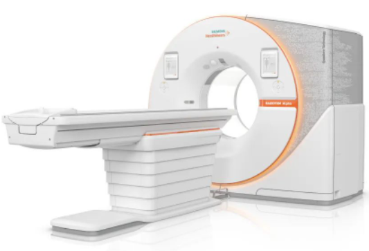

导语  

“拆解”系列是医工研习社挖坑最久的系列，继续以有趣科普形式讲解CT、MR、PET、DR、DSA、超声、放疗等医学影像设备参数，为医院，更为所有影像人。

“拆解”系列第1期，从CT开始，谈什么要开始这个系列。

**医工研习社：专注医学影像设备领域的产品、技术、关键零部件及行业分析等深度交流！**

2021年，某院配置了瓦里安 Vitalbeam、西门子 Prisma、飞利浦 Azurion 7M20等一批优秀高端医疗设备，不仅阵容强大，而且价格美丽，足以笑傲江湖。

得益于上层领导的支持、临床科室的专业、采购部门的把控，他们能以最合理的价格配置到最优秀的“满血版”设备。

我发现，专业、务实的团队越来越多；我更期待，懂设备、会砍价的医院越多越好。

**一、一件小事**  

前几天，笔者想退役已用3年的A手机。鉴于上部的良好表现，决定继续支持，但不巧赶上主板有问题，退货。决定换个品牌试试，选定了B手机和C手机，不过各有利弊：

1）B，手机没毛病，价格比较合适。不过，受到同事和朋友的猛烈批评：现在都是什么时候了，华为被打压，国家也被迫与美国贸易战，真是“商女不知亡国恨”，而且国产手机有什么不好。很羞愧，放弃了。

2）C，手机基本也没毛病，不过实在太贵了。虽然确实想支持，但实在囊中羞涩，毕竟今年有资助10位学生的目标。

借这个机会向大家汇报，**得益于某个不愿意被公开感谢的厂家**，我能在六一儿童节之前资助5名品学兼优的高一学生，届时继续公开具体情况。

作为重度PC党，笔者表示手机就是通讯工具，真心不懂，对其要求其实很简单：有颜值、大容量、大电池、拍照好、系统流畅、价格不贵。

之所以谈这件事儿，是因为我发现**把“手机”换成“CT”，把“B”换成“进口品牌”，把“C”换成“部分国产品牌”，把“A”换成“另一部分国产品牌”，把“有颜值、大容量、大电池、拍照好、系统流畅、价格不贵”换成“速度快、图像好、设备稳定、价格不贵”，这件事儿依然成立。**

于是，我就在想，那是不是懂了“手机”，会更好的选择“手机”呢？

**二、两次对话**

有时，某些医院采购设备时会和笔者讨论，有些是通过公众号认识已久的朋友，有些是顺着公众号专门找来的。

对于这种事儿，我都会实事求是，毕竟一台设备要用10年以上。不过，我一定会先问预算，**因为****设备档次、软硬件配置和价格是密不可分的**。

这是最新发生的两个比较有趣的对话(部分内容已经二次整理)：

**1、****认真的C老师**

> 老师，我们在采购DSA，预算XXX，要求各家：  
> 
> 1）必须提供实时冠脉支架精细显影功能，如飞利浦提供StentBoost live+StentBoost Substraction live，西门子提供ClearStent + ClearStent Live；
> 
> 2）提供最新最完整版低剂量高清平台，如西门子提供CARE&CLEAR平台，飞利浦提供ClarityIQ平台，岛津提供SCORE PRO Advance平台。您看看这些软件他们都有吗？
> 
>   
> 
> 看来贵院比较倾向飞利浦和西门子，这两台机器没毛病，都非常好，恰好也都用过，低剂量平台也都有的，选哪个都不会错。

> 嗯，我们想从飞利浦和西门子中间挑一个，现在A厂家向我们举报，B厂家没有提供真正的低剂量平台，您看A厂家提供的证明文件是真实的吗?  
> 
>   
> 
> 是的，这个文件是说的没错，确实没提供真正的低剂量平台。
> 
>   
> 
> 谢谢，我们非常关心低剂量平台。

**2、****有情怀的L老师**

> 朱老师，您好，医院现在采购CT，有6个选项，联影uCT760、西门子go.top、飞利浦incisive、GE optima ct680、东软NeuViz Prime、明峰Scintcare CT128。拜读了关于CT的大部分文章，但我拦不住专家把XX作为第1排序，挺担心国产可靠性。  
> 
>   
> 
> 国产品牌可靠性没问题，放心。
> 
>   
> 
> 都是64排的，您觉得哪一款更具性价比呢？看您文章，1根球管大几十万，甚至100万，这哪里用得起？
> 
>   
> 
> 有些事儿比较复杂，问题是您说了不算啊？
> 
>   
> 
> 我说了是不算，但说了算的是自己人，我必须把实际情况告诉他。

> 既然这样，那就放心了。有心仪的吗？还是客观和你说？贵院有维修力量吗?买保修吗？  
> 
>   
> 
> 我们不买保修，所以特别关心可靠性，您客观的和我说。
> 
>   
> 
> 那行，6台机器中有4台我摸过，另外两台听同行说过，我具体说说几台机器的性能和使用情况......
> 
>   
> 
> 谢谢朱老师，真的想支持国产，但是国产有时候真爱不起来。
> 
>   
> 
> 别担心，国产OK的，不过GPS那三台其实也是国内生产的。
> 
>   
> 
> 纠正一下，是国产品牌
> 
>   
> 
> 可是国家说了，不能歧视，不然谁还来咱们国家投资建厂啊？
> 
>   
> 
> 那我说民族品牌更贴切。
> 
>   
> 
> 朱老师，今天刚开完会，最后还是XX，XX万元，支持国产，但让他们带了3年维保。
> 
>   
> 
> 嗯，3年保修要的，这个价格可以，挺好的。

**三、10篇文章**

前几天，一位厂家朋友说，现在我国的设备采购，不能说完全合理、专业。如果可能，希望您可以贡献自己的一份力量，算是一个小成就吧。

基于此，医工研习社有了“拆解”系列，**做一个比较完整的梳理，告诉大家哪些是好的，哪些是要避免的，遇某些情况要怎么做**。

首先从CT开始，涵盖采购和维保：

> 看不懂CT招标参数？读这篇就够了（1）：序幕  
> 
> 看不懂CT招标参数？读这篇就够了（2）：机架篇
> 
> 看不懂CT招标参数？读这篇就够了（3）：扫描床篇
> 
> 看不懂CT招标参数？读这篇就够了（4）：X线系统篇
> 
> 看不懂CT招标参数？读这篇就够了（5）：探测器篇
> 
> 看不懂CT招标参数？读这篇就够了（6）：图像质量篇
> 
> 看不懂CT招标参数？读这篇就够了（7）：重建算法篇
> 
> 看不懂CT招标参数？读这篇就够了（8）：临床应用篇
> 
> 看不懂CT招标参数？读这篇就够了（9）：售后服务篇
> 
> 看不懂CT招标参数？读这篇就够了（10）：尾声

1）设备采购方面7篇，从科普角度介绍CT，从原理角度降维解读CT参数，方便大家都能系统各了解CT厂家的产品和新技术；

2）设备维保方面1篇，考虑到大型影像设备的维保成本比较高，为防止出现“买得起用不起”的情况，从采购和维护角度提供一些建议。

自公众号开始以来，已经写了很多关于CT的，除光子计数CT系列外，这将是最后一个CT系列，三个月内一定完结撒花。

**如果每家医院哪怕只有一个CT专家，我希望那个人是医工研习社的读者，这是我的愿望、愿景与期望**。。。