**专注于医学影像领域技术、产品、关键零部件及行业分析的深度解读！**

“拆解”系列第2期，讨论CT之骨：机架。考虑到我们一直在学习CT发展史，本文讨论的是进入螺旋时代以后的机架，整个CT系列也都是围绕螺旋CT。文中所有实例的图片部分原创，部分来自公开信息。

俗话说：头过身就过。每当医院的CT新装或移机时，最让人头疼就是那个庞然大物：**Gantry**，虽然翻译成“龙门架”更符合其霸气的气质，不过我们通常称之为：**机架**。从宏观结构上，所有的机架都是相似的；从具体设计上，所有的机架也各有各的不同。

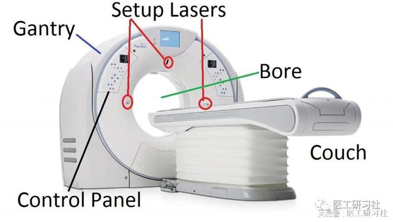  

**一、机架：CT之骨**  

与其他影像设备相比，CT的特殊之处在于其高速旋转下采集数据，这离不开机架的支撑。根据组成，机架可以分为主骨架和滑环：  

**01、****主骨架(Main Frame)**

主骨架包括定子部分（Stationary）和转子部分（Rotar），二者之间依靠轴承（Bearing）链接在一起。其中，定子部分，即机架固定部分，机架控制电路、部分通讯电路、驱动电机、电源分配、倾角液压、通风等均位于定子；转子部分，即机架旋转部分，高压发生器、球管、探测器等影像链核及其辅助控制均位于转子。

**随着临床对于扫描速度的要求越来越高，主骨架对其性能要求也越来越高**。需要说明的是，安装在主骨架的高压、球管、探测器等零部件高达数百公斤，带着如此巨大的负载，仍然必须保持足够的角度精度和位置精度，毕竟实际临床应用要求的扫描层厚如今已为亚毫米级，由此可见**研发和制造CT是非常复杂的**。

\[1\] 角度精度，在很高的转速下，机架依旧保持恒定旋转。

\[2\] 位置精度，在所有方向（即旋转平面（即XY轴）和垂直旋转平面（即Z轴）两个方向）在很高的转速下，机架没有明显的振动。

**2、滑环（Slip-Ring）**

滑环的出现是CT技术的一次革命，不仅使CT高速旋转，更解决了机架旋转部分与静止部分的馈电和信号传递问题。滑环负责连接定子和转子，转子的供电、信号控制、数据传输都要依托滑环，因此就有电能环（强电和弱电）和数据环等之分。滑环与定子上的链接方式有很多，供电部分主要依靠电刷与非接触耦合，通信部分主要依靠射频传输。

需要特别说明的是，**因CT的数据采集量是非常惊人的，为避免在CT旋转部分配置大量容存储器，必须让CT数据生成和数据传输速保持同步，滑环必须具备足够的****传输带宽**，本文后面将详细解读。

实际上，滑环属于转子的一部分，之所以单独拿出来讲，是因为实在太重要了。在这里，鸣谢佳能**与西门子**：

1985年，佳能基于工业滑环技术,推出**全球首款滑环CT**，使CT可以单向连续旋转；

1989年，西门子基于滑环和连续进床技术，推出**世界第一台螺旋CT**，使CT扩大了扫描范围。

**二、****核心性能**

作为金字塔的基石，改动机架意味着整机必须重新设计，孔径大小、驱动方式、零部件排布、重建算法等环环相扣。  

如今虽然我们早已看不到单双排CT，但还有部分在售的CT使用单双排时代机架，比如GE太行 (Brivo)CT使用经典的单双排时代（Prospeed/Hispeed系列）机架。这是因为，**CT机架的机械设计是非常“保守”的，一旦确立其生命周期长达十几年甚至超过20年。对于任何厂家来讲，出现“套娃”都就很正常，毕竟CT机架的稳定性是第一位的。**

**对于机架来说，我们通常关心其转速、孔径、滑环类型、机架倾斜方式和机架冷却方式等关键参数。**以西门子force为例，具有0.25s/r转速，78cm孔径，采用无接触静音滑环、水冷散热、数字倾斜。下面我们详细讨论上述指标性参数。

**三、指标1：转速**

CT整个机械运动系统由轴承、传动、电机、控制和反馈等部件组成，每一个部件必须有极高精度。**转速是机架的硬指标，我国采用的是国际标准单位，即是s/r（**秒/圈）；日本和欧洲等采用rpm(圈/分）表示，具体换算方式请百度，比如0.25 s/r等于240rpm。

高转速带来的好处是毋庸质疑的，CT对其的追求始终没有停止过，尤其是2007年 RSNA以后，超高端CT百花齐放。比如，飞利浦的Air Glide气垫机架系统，其转速高达到0.272s/r，率先使CT转速进入了0.3秒以内；比如，西门子、佳能、GE、联影、东软、明峰、安科等品牌的高端CT均实现了0.2X的转速；还比如，GE最新的APEX平台已实现0.23s/r。不过，**随着逼近0.2秒，转速提高带来好处的边际效应递减。运动器官追踪、深度学习等创新技术，也是提高动态器官成像能力的一种手段。**

\[3\] 0.23s/r的APEX目前正在申请美国FDA批准。

CT的转速，与其机械素质和驱动方式密切相关：

**01、****主轴承**

主轴承的核心技术在于材料学与加工精度，这直接决定了是否可以耐受高转速，以及在长时间使用后等中心ISO位置不偏移。**CT轴承分为接触式滚珠轴承和非接触式气垫轴承，目前除飞利浦以外，均采取的是机械滚珠轴承。**

气垫轴承是一种成本很高的技术，需配备单独空气压缩机，使用高压空气将转子托举起来，使定子和转子之间有5微米的空隙，这使得摩擦力大大减小，从而支持超高转速。

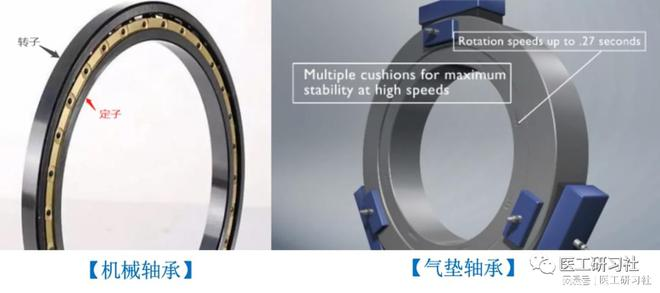  

此外，轴承在CT的整个生命周期是不再维修的，机械轴承都有加注润滑油的入口。目前，已有轴承可以做到终生免维护。

根据CT转速，目前包括第2代（60～90rpm，即1~0.67s/r）、第3代（120～180rpm，即0.5~0.33s/r）和第4代（240～300rpm，即0.25~0.2 s/r）主轴承，其中**第3代CT机主轴承占据主要市场份额，而钢丝滚道轴承类型轴承是目前主导的主轴承结构。**

CT机主轴承曾长期只能进口，**洛阳LYC打破了我国CT主轴承长期依赖进口的局面，成为第一家能批量生产的厂家，其第3代主轴承已大量应用在国产CT上；目前第4代主轴承仍主要依赖进口。**

**01、****驱动方式**

目前，CT的电机驱动方式主要包括数字钢带驱动和线性马达驱动两种。

**a、数字钢带驱动**

很好理解，CT主机发出适当的脉冲信号驱动电机，电机带着钢带运动，钢带与CT轴承转子的外侧齿咬合，继而带动CT旋转。

**这一种是成本较低、但高度可靠的方式，其普遍支持的转速为1~0.35s/r，目前除超高端CT以外，绝大多数16-64排CT都在采用。**

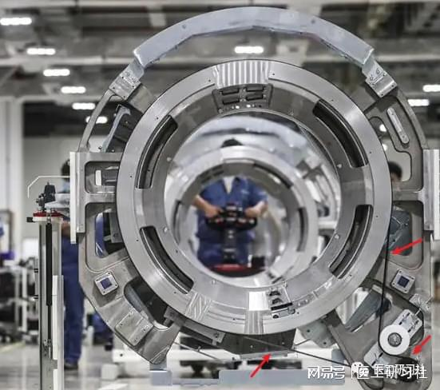  

数字刚带驱动  

**b、线性马达驱动**  

多年来，我们知道有一种名为“磁悬浮机架”，感觉非常炫酷。实际上，在轴承支持方式上，仅仅有上文提到的机械滚珠轴承与气垫轴承两种，那为什么会有磁悬浮这个说法呢？

工业上确实有磁悬浮轴承，但是CT这么大型的轴承很难通过埋设永磁体，并利用磁体的斥力托举轴承；再者轴承一般是垂直于地面，各个方向受力并不相等，如何磁悬浮呢？

实际上，采用的是**线性马达驱动（Liner Motor Drive）**，它摒弃钢带，将感应线圈埋设在转子的表面，在驱动和转动的能量传递上，驱动电机根据控制信号产生电磁斥力进行驱动，而**电磁斥力听起来和磁悬浮比较接近**。

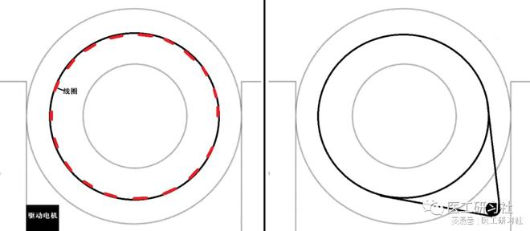  

线性马达驱动

**一般来讲，0.35 s/r以下的转速，都采用线性马达驱动，目前见到的超高端CT均采用这种技术。除了转速高优势外，其旋转所产生的噪音也会更小。**以GE Revolution为例，其Whisper Drive结合无碳刷结构可以使噪声低于70db。

值得一提的是，十几年来至今，超高端CT和部分64排CT在机架方面同属于一个系列，例如西门子Flash与AS+/Edge、飞利浦iCT与iCT sp、佳能Aquilion One与Prime、东软Epoch与Prime、联影uCT960+与uCT820等，这是基于历史沿革以及摊薄主要零部件成本考虑。

目前，**线性马达驱动的64排CT在64排档CT市场的占比在迅速减少**，这是因为：1）各厂家出于成本考量，基本都聚焦于非线性马达平台CT的生产，转速集中在0.35~0.5s/r；2）超高端CT愈发普及，而线性马达高转速对于64排CT的应用，费效比不高。所以，**如果贵院采购到一台线性马达驱动的64排CT，这说明您“意外”获得更好的平台。**

**c、****离心力**

我们经常听到一个说法，即机架高速旋转时要承受多少G的离心力，指的是相对离心力（RCF），与机架转速、球管到旋转中心的距离有关，具体公式请再次百度。

举个列子，假设球管质心到旋转中心的距离是60cm(大部分CT都是60cm左右)，转速0.25s/r，此刻机架要承受38.6G的载荷，这就是为什么我们要求此时的球管可承受加速度至少要为40G，毕竟球管球管旋转阳极的轴承也是在高速旋转的。

假设我们把机架转速进一步提高至0.2s/r，那么其承受的载荷将达到惊人的60G，这在工业上是一个“天堑”式的挑战。

我们知道，机架转速越快，离心力越大，这就特别考验随着转子高速旋转的重要零部件的耐受力，特别是球管，这是因为**球管旋转阳极的轴承方向和离心力方向垂直，机架转速越大，球管轴承的承受的负荷就越大，这也就是为什么越高端的CT，其球管越容易损坏，尤其是机械滚珠轴承球管。**

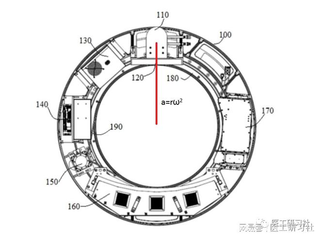  

机架转子上各个部件的合理布局十分重要，需反复对结构设计进行讨论和仿真，最终将众多部件巧妙配置，其位置、外形、重量都是轻易不调整的。假如换了新型的球管，就算其总重量没有变化，但是其质心还是会发生轻微移动。机架静止时，对静平衡影响不大；但高速旋转时，则极有可能发生杨氏模量的偏心，导致轴承旋转过程中，每个方向受力不均。比如，GE Optima CT660小幅升级至Optima CT680时，球管由6.3MHu更换为7MHu，其机架的动平衡也是经过微调的。  

因此，在更换转子上的大型部件（球管、高压、探测器等）后，必须要做动平衡测试，否则CT是不允许使用的。我们知道，转子上有很多地方可以增减配重块，通常实际上极少会操作，但是一旦需要工程师现场调整，这将是一个极耗耐心的过程。再次说明，机架设计是非常复杂的，一旦确定，几乎很少调整。

**四、指标2：孔径**

通常，**CT孔径决定着旋转半径、扇形束算法模型、几何效率、X光利用率、患者舒适度等等。****目前CT的孔径大多数都集中在70~75cm，超高端CT集中在78-80cm。**更大的孔径意味着可以容纳更多的零配件，也意味着更小的锥角，更低的X线发射利用率，这当中有着相当多的取舍与平衡，每个厂家在设计时，均会考量各个因素。

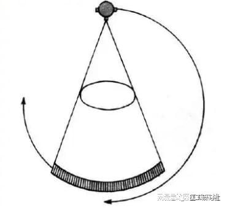  

**对于医院来说，CT孔径其实就是患者的舒适度，更大的孔径可以减少幽闭恐惧，适合更多的特殊摆位等。**比如，80cm孔径的CT，通过置换专业的扫描床（Radiation Therapy）并符合TG66规范，还可以当做放疗模拟定位CT使用。比如，某医院在Revolution CT ES上配置TG66床，专门用于模拟定位。当然了，这是比较土豪的做法。

在同样的孔径下，更优的几何设计可以提高X射线的应用效率；而如果球管距离ISO中心过大，则需要更高功率的球来弥补。因此，扫描条件、图像质量、辐射剂量的综合计算，是一个系统性、且复杂度极高的工作。不同设备，即使同样的高压参数，对于扫描中心的剂量分布也是不一样的。

此外，**不能说小孔径图像就好，大孔径图像就不好，图像质量是一个系统的最终结果，要以图像质量参数和可视化评价体系来进行综合判断。**

**五、指标3：滑环**

滑环的出现是CT技术的一次革命，不仅使CT高速旋转，更解决了机架旋转部分与静止部分的馈电和信号传递问题。滑环负责连接定子和转子，转子的供电、信号控制、数据传输都要依托滑环，因此就有电能环（强电和弱电）和数据环等之分。

在应用到CT之前，滑环其实早已应用到工业的方方面面。前文提及，滑环负责CT机架旋转部分与静止部分的馈电和信号传递，其原理不难理解，困难的是**如何以更低的成本，换取更稳定的性能，以方便量产和各种型号CT的适配。****从这点来讲，更改机架设计，就意味着滑环这一关键零部件的成本需要再次大规模量产才能实现摊薄。**

通常，**CT整机厂商会委托专业厂家定制滑环，如MOOG、Schleifring等世界知名滑环巨头，基本上所有CT厂家都在使用这两家的滑环。**

根据滑环排列方式，可分为水平滑环和垂直滑环，水平滑环并不意味着CT需要躺下。厂家在选择滑环时首先考虑的零部件合理分布：垂直滑环会使机架会更厚一些，患者进入孔径也更深一些；水平式滑环会使机架厚度小，与整机适配容易，也容易得到厂商的青睐。

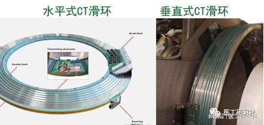  

滑环是多道同心圆环，其结构包括强电环、弱电环、信号环。以水平滑环为例，强电环负责给高压发生器供电，如380VAC；弱电环负责给探测器、控制电路等部件供电，如115VAC，信号控制；信号环负责信号传输，如急停、数据采集等。

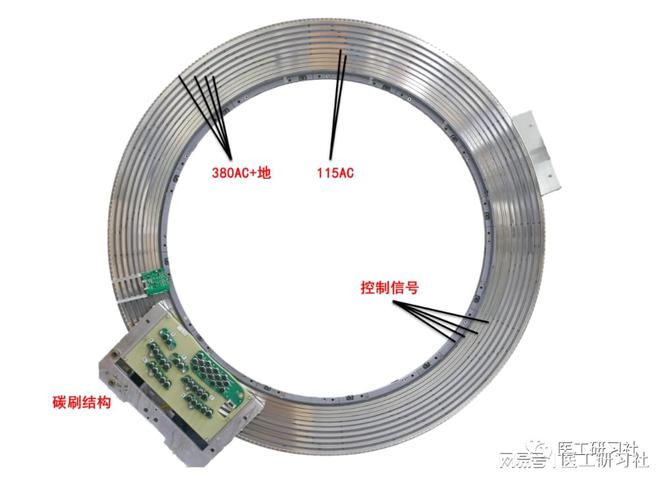  

其中我们最需要了解的是信号环，负责将探测器采集的原始数据通过高速串行方式传回重建柜。根据信号信号传输方式，分为激光传输和射频传输两种：

1）激光传输，即光通信，飞利浦Brilliance系列CT均采用激光传输，对机架内环境要高一些，因为光路会被灰尘等因素干扰，影响传输。

2）**射频传输，这一种电容耦合技术，也是绝大部分CT采用的方式，比如GE全系列CT均采用射频传输。**其实现逻辑是，通过滑环外的一圈金属箔就是发射天线（Transmitter）发射信号，接收装置（Receiver）接收及转换信号后通过光纤传递到CT重建柜。  

通常，由于数据量大256排以上CT通常会配不止一组发射天线。以下图飞利浦ICT为例，其有4根射频发射天线，保证了短时间内的超大数据量传输。

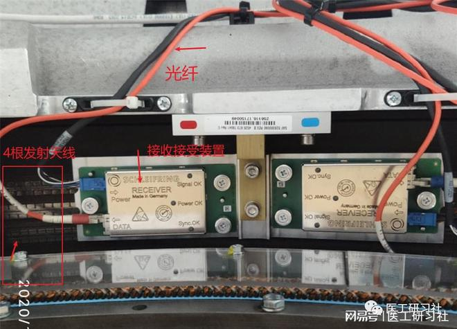  
射频传输  

**之所以强调“短时间内的超大数据量传输”，是因为CT的原始数据量（raw data）是很大的，尤其是256排以上CT、双源CT等。****这涉及“数据链带宽”这一关键参数，单位为Gbps，其值越大，数据传输速度越快。**以GE Revolution CT为例，其数据带宽高达40Gbps。

也许您会好奇究竟滑环究竟需要多大带宽才能满足“瞬间传输”？咱们以联影uCT960+为例，每排探测器有 963个通道，最高转速0.25s/r，机架旋转1圈最多产生4800个投影(view)，重建出640层图像，则其数据传输速率R = (旋转1圈的CT层数/旋转1圈的时间)\* 每排探测器通道\*机架旋转1圈投影数=11.2\*109 bps。假如每个数据采用32位浮点数，在不考虑误差消耗的情况下，滑环的最小带宽必须是**35.8Gbps**，非常惊人。

此外，我们还听说某些CT采用了“非接触滑环”，这是指其电源和信号均传输均采用非接触式，所有CT的信号传输均采用非接触传输，并无奇怪；特殊的是**供电也采用非接触传输，其原理类似手机的无线充电方式，在机架的定子和滑环分别嵌入发射线圈和接收线圈，通过电磁感应实现供电。**

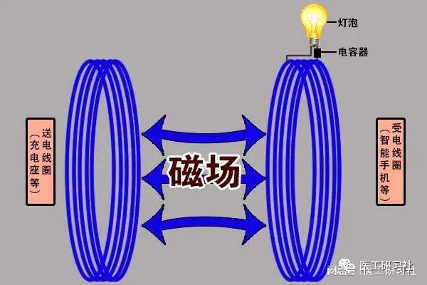  

非接触供电逻辑

**“非接触滑环”是有意义的，其他价值暂别不说，最起码再也不用清理可能导致设备故障的碳粉，也再不用更换碳刷。**

**六、指标4：机架倾斜**

机架倾斜，通常指**CT机架能实现±30°的机械倾斜，可以有效实现特殊体位扫描，避免频繁调整调整患者体位**，带来更好的检查体验。

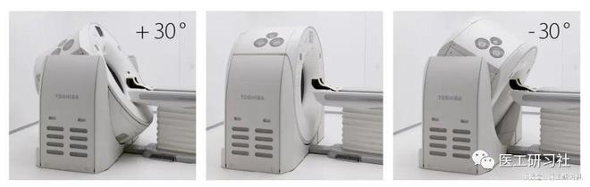  
±30°机械倾  

以往，**±30°机械倾斜基本是CT标配，但****近年来出现“数字倾斜”这一概念，目前一半高端CT、少部分64排CT已采用数字倾斜**，那该技术到底是怎样的，以及是否更高级呢？

所谓**数字倾斜，是指机架自身不具备机械倾斜功能，而是通过软件方式实现**。数字倾斜一定程度上降低了CT制造成本，但对医院和患者来说并不友好：

1）**更费球管**。由于X射线不能直射病人接受检查的器官，数字倾斜CT只能通过增加扫描范围来覆盖重建所需的角度，原本需要的倾角越大，额外扫描范围就越大，也就浪费更多球管曝光秒次。由于头颈部是医院日常扫描最多的部位，因此数字倾斜CT实际上更费球管；

2）**更多辐射**。数字倾斜CT增加的扫描范围，让患者承受过多的辐射剂量。比如，头颅扫描时，在没有机械倾斜情况下，会把患者的眼眶和鼻窦一并扫进去，使其接收了不必要的辐射。

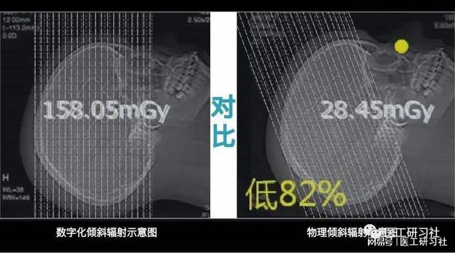  
不同倾斜下患者承受的辐射对比  

不过，**我国大部分医院的CT扫描量实在太大，为了提高效率，更多的时候是来不及打角度，而是通过让患者特殊摆位实现，比如，头部扫描时，为保护患者眼睛，让其把下巴压低一些。**

因此，数字倾斜也有一定好处，相当于“我预判了你的预判”，同时也一定程度上降低了CT使用难度。

**相对来说，笔者更推荐具有机械倾斜功能的CT，因为机械倾斜CT也具备数字倾斜功能，可根据实际情况是否使用。**比如，安科ANATOM 64同时具备±30°机械倾斜和±50°数字倾斜。怎么用是后话，反正最好得有，万一就想打角度呢。

****七、指标5：冷却方式****

我们知道，CT运行时球管及各种部件会产生大量热，尤以球管产热最大，因此机架散热是必须需要考虑的。目前主要有风冷和水冷两种散热方式：

1）风冷，绝大多数CT都采用的是更经济的“风冷”方式散热，即通过机架中的风扇将热量通过空气传递到整个扫描间，最后通过空调将热量带走，这就是为什么CT扫描间必须长期保持适宜温度。风冷CT安装极其简便，不需要独立的设备间。

2）水冷，仅西门子某些高端CT(如双源CT)采用“水冷”方式散热，即通过外置水冷机通过水循环散热，其密闭机架，在保证散热良好的同时，灰尘等污染物引入也更少。水冷CT安装稍微复杂，需要独立的设备间。

需要说明的是，**风冷CT和水冷CT不存在孰优孰劣，最好根据医院机房情况选择CT**。假如贵院CT机房没有预留设备间，哪怕再想要双源CT，也不可能现实。

****八、小结****

行文至此，机架篇正式结束，这应该是目前最系统介绍CT机架的文章。了解机架是深入理解CT的基础，咱们下期见。。。