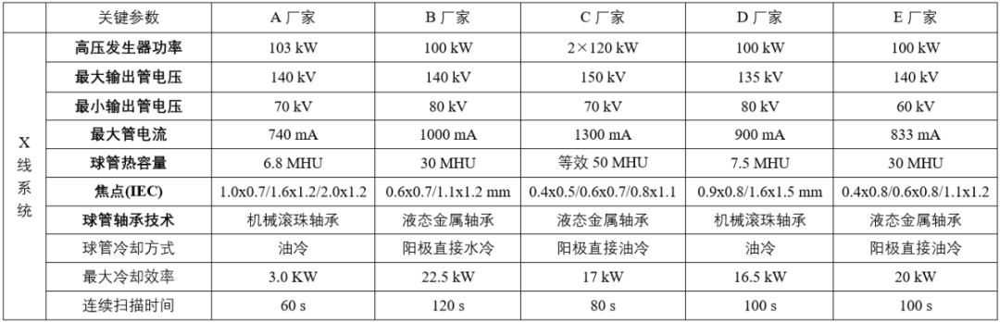
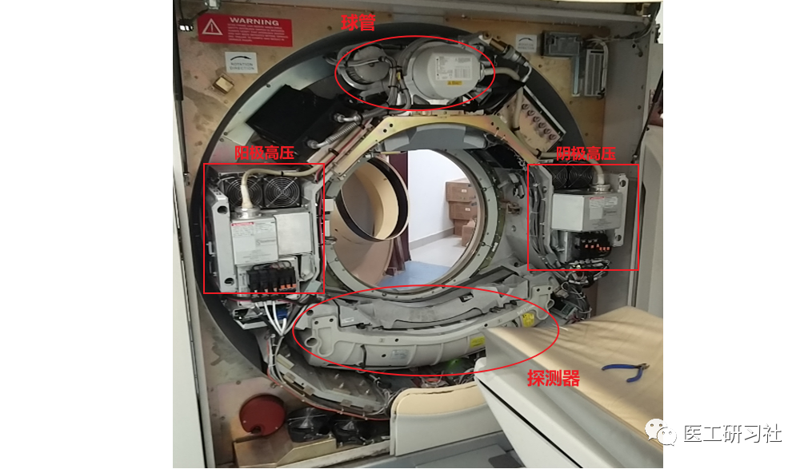
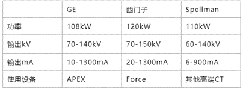
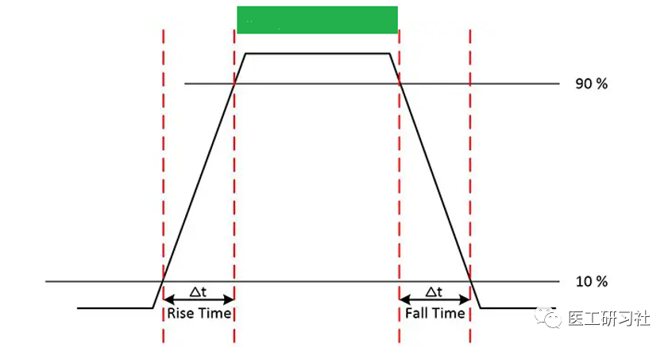
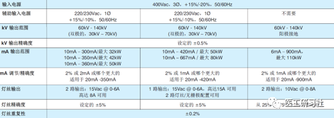
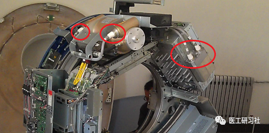
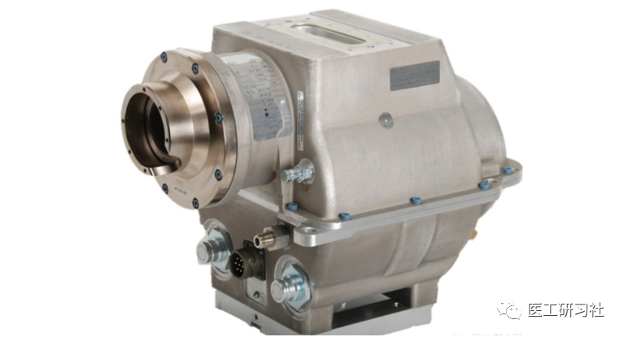
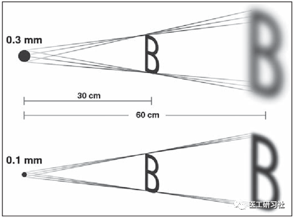
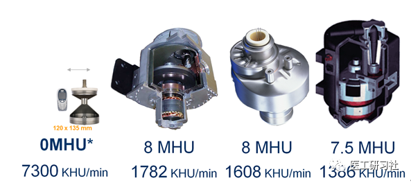
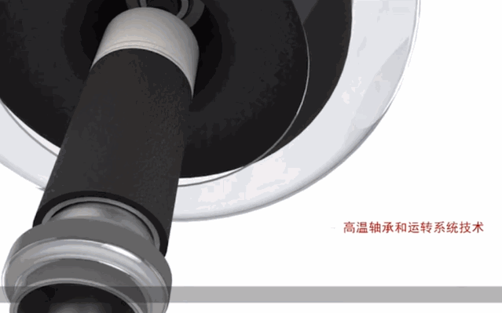

医工研习社

液态金属轴承在相当长的一段时间内并不能完全代替机械滚珠轴承，起码在中低端CT球管领域，毕竟液态金属轴承更贵，并未广泛普及。

**第124篇原创**

**2022**

**相约第667天**

**专注于医学影像领域技术、产品、关键零部件及行业分析的深度解读！**

导语

“拆解”系列第3期，讨论CT三大核心部件之二，由球管和高压发生器组成的X射线系统。无论从科普还是CT选型角度，本文非常重要。

在所有的X线类设备，最重要也最有趣的一定是球管、高压发生器与探测器。高压发生器和球管共同组成X射线系统，探测器及其它组件组成采集系统，他们仨基本决定了一台设备的档次。今天的主角就是球管及其背后的高压发生器。

5台高端CT高压和球管参数横对比(原创)

**高压发生器：运筹帷幄的元帅**

高压发生器历史非常久远，DR、DSA、CT等所有X射线类设备均需要高压发生器。根据使用场景不同，其设计性能略有区别，但总体原理是一致的：根据扫描部位，主机确定扫描条件，即管电压(kV)、管电流(mA)、时间(s)，高压发生器收到主机指令后启动旋转阳极，激励灯丝电流，高压快速达到预设值并开始曝光，以产生精确的管电压和管电流，并产生所需X射线。

高压、球管、探测器(原创)

通常，CT高压发生器安装在机架转子上并紧邻球管，除高压发生器外，还有控制阳极旋转、阴极灯丝加热的辅助电路；其作用是通过高压电缆在球管上施加高压。 **与普放设备相同的是，**   **CT高压发生器最重要的功能也是提供精确稳定的kV和mA**   **。不同的是，**   **CT高压发生器需要更好的散热以维持更长连续扫描时间，需要更小的体积以节省更多机架空间等** 。因此，当今螺旋CT上搭载的高压发生器都具备小型、高性能、通用性等特点。

目前，GE、西门子、斯派曼、当立、万睿视等均有高性能CT高压发生器，其产品具有功率大(高达100kW)、高压线性稳定度高(0.5%)、灯丝电流稳定度高(2%)等优点。下图为GE、西门子、斯派曼目前最高端高压发生器部分参数。

三家高压发生器对比(原创)

对于CT高压发生器来说，输出功率、响应速度、稳定性以及控制精度是决定了高压发生器的品质。从招采角度，主要考虑   **管电压范围、输出功率、高压发生器**类型等指标性参数：

**01**

**高压范围**

高压范围指的是高压发生器施加在球管阳极和阴极之间的电压，即**最小输出管电压和最大输出管电压**之间的范围。

早期高压发生装置仅有80kV、120kV和140kV，目前绝大多数的CT高压范围集中在80kV、100kV、120kV、140kV。随着CT技术的发展，高压档位数也越来越丰富，甚至出现了“70、80、90、100、110、120、130、140、150kV”，可根据人体部位自动选择合适的管电压档位。

需要说明的是，**日常中所有的kV均为kV****p**。p指peak，即从零加压到最高点的电压。因为高压从0到峰值，不是瞬间的，而是有一个爬升过程，即**爬升时间或上升时间，这与磁共振的关键指标“梯度爬升时间”非常类似**。

电压上升时间(来自互联网)   “上升时间”是从额定电压的10%上升到90%所需的时间，一般要求在250毫秒以内，时间越快，电压波形越陡峭。该指标通常不体现在CT选型或招采中，但其实非常重要。 在上图绿色区域内，电压和自由电子配合才是最佳产生X线的时间区间。   **更短的上升时间，可以实现更快的kV、mA响应速度，避免患者遭受无效射线的伤害。**  

**Q1**

60/70kV扫描意味着低剂量，是真的吗？

临床上，80kV一般用于易穿透组织，如儿科、CTA、灌注等。最常使用的kV还是主要集中在100、120、140kV。

一般来讲，辐射剂量和kV呈指数关系，低kV扫描被认为是降低辐射剂量的一种手段，因此70kV甚至60kV被宣传得很多，但千万不要简单的认为60/70kV是低剂量的代名词。

患者剂量要结合发射参数（包括kV，mA，滤线）和吸收部位综合考量，要理性看待低kV成像，仍需要大量的临床实践去验证。

**02**

**输出功率**

高压发生器功率(kW)，即管电压(kV)和管电流(mA)的乘积。通常，**功率一定程度上决定了CT档次，因为更大的功率，能提供足够的球管驱动能力，以实现更大电流输出，能满足各种类型的患者。**

根据设备档次不同，高压发生器一般分为三个档次： 1）   **紧凑型**，用于16排/32排档CT，集中在 32/42/50 kW； 2）   **性能型**，用于 64排档CT，集中在 50/80 kW； 3）   **高端型**，用于高端及超高端CT，集中在 110 kW左右；

目前，**除GE和西门子使用自研高压发生器外，几乎所有CT均使用斯派曼（Spellman）高压发生器**，以斯派曼（Spellman）高压发生器为例展示“紧凑型”“性能型”“高端型”：

三个档次高压发生器对比(来自互联网)    

**Q2**

高压发生器有这么多指标，为什么以功率划分档次？

其实不仅是高压发生器，功率也是评价球管最重要的指标。功率意味着很多：

1）**更大功率匹配更高的机架转速**。为了获得更高时间分辨率，机架转速越来越快，必然也要更大的管电流，也就意味着更大的输出功率。比如，0.35s/r搭配600mA/120kV和0.28s/r搭配900mA/120kV获得类似图像效果。

2）**更大功率带给我们更多的扫描自由**。再比如，普通患者可以使用72kW(600mA/120kV)扫描；但遇到肥胖患者，必须使用108kW(900mA/120kV)扫描，否则就会因为光子饥饿而产生条纹伪影。

**03**

**高压发生器类型**

一般来说，高压发生器分为两种，双极型高压发生器和单极型高压发生器。之所以这么区分是为了“迎合”单极型球管和双极型球管。比如，有的是±70kV施加于球管两极；有的是-140kV施加于球管阴极，阳极接地。

典型双极型高压和球管(来自互联网)   **阳极接地技术(Anode End Grounded, AEG)最早是由万睿视发明的**。与双极(±70V)球管不同，阳极接地的阴极接负-140KV，金属壳接地，其优点很多：捕获杂散电子；减小球管体积；降低Z轴位移；提高球管冷却效率；减少离焦辐射，提升X射线源质量；此外，还可承受更大的重力加速度。

典型单极球管(来自互联网)   高压发生器的构造，基本可分为逆变（Inverter），隔离（HV tank） 辅助电路（Auxiliary Power）等部分： 1）**逆变器**，主要由高频功率电子器件组成，如IGBT，通过频率控制来决定电压输出； 2）隔离油箱（高压油箱），主要用于电气隔离，因为逆变器会产生十几万伏特的高压，一旦球管遇到故障，如没有隔离是会引起很严重的电气串联事故。因此，通常使用高压绝缘油，将变压器耦合线圈主级（逆变器）和次级（负载）分别浸泡起来，即使负载端短路，逆变器和辅助电路在多数时候也受到保护。 **和球管一样，高压油箱的损坏，多数也是由于气密性破坏而进入空气，在高压下击穿打火**。所以，   **遴选CT设备时，高压发生器的供应商和产地可以看出该高压发生器的水准**。同样的高压发生器设计，不同的产地其寿命也不同，例如法国产的就优于印度产的。 3）辅助电路，主要用于提供阳极旋转动力和阴极灯丝加热所需的电流以及球管电流磁控偏转（飞焦点）等。需要强调的是，灯丝加热电流和球管管电流是两个截然不同的概念：

管电流是灯丝产生自由电子，自由电子在高压两级之间运动形成的电流，一般为数百到一千多毫安；灯丝加热电流是辅助电源产生，其电流强度在十几到几十安培，根本不在一个数量级。

**球管：攻城略地的将军**

**CT球管，因需要不定期更换，及其动辄上百万的单价，成为医学影像圈最知名的“耗材”，没有之一。**

作为CT毋庸置疑的核心，球管是一种在高压发生装置作用下产生X射线的关键零部件。鉴于大家对其比较熟悉，加上已在球管系列(   [上篇](http://mp.weixin.qq.com/s?__biz=MzU5MDU1NTMzOQ==&mid=2247483817&idx=1&sn=8dd618b6bc151b1904b5e5cfff147104&chksm=fe3d300dc94ab91b50f28930afe8ba77ff2af1c92dd45b37b71d255677b465a274972b909a95&scene=21#wechat_redirect)、   [中篇](http://mp.weixin.qq.com/s?__biz=MzU5MDU1NTMzOQ==&mid=2247483873&idx=1&sn=7390b0928a98e4ff64b89ee4e18f1726&chksm=fe3d3045c94ab953e8f712d1d3f141f1b06b06c4483f468d448619718bf17fcf6176214708e9&scene=21#wechat_redirect)、   [下篇](http://mp.weixin.qq.com/s?__biz=MzU5MDU1NTMzOQ==&mid=2247483917&idx=1&sn=aa2c0e317dd26a68ce0fce490d51764c&chksm=fe3d33a9c94ababf52b5eaacdf2fcdb8975d14180d0a225a2ec1a49d6649e59f7d3364f33ca3&scene=21#wechat_redirect))详细阐述其原理、结构和新技术，本篇不做过多介绍。 从原理和结构上，球管非常简单；而从制造和工艺上，球管又相当复杂，因此，能设计和制造CT球管的厂商屈指可数，仅   **飞利浦、西门子、GE、佳能**等整机厂商，以及   **万睿视、当立**等知名OEM厂商，除GPS外几乎所有CT球管都来自这两家。我国的   **昆山医源、无锡麦默、电科睿视、珠海瑞能**也有CT球管，主要应用在球管替代领域，目前尚未在CT整机中使用。 **从性能和寿命上，不同的CT球管差别巨大，最大管电流是700mA的和1300mA的；最长寿命是30万秒的和300万秒的，都根本不是一回事儿。**   对于球管来说，主要考虑功率、管电压、管电流、焦点尺寸、热容量、阳极转速、最大冷却效率、冷却方式、轴承技术等指标性参数。其中， 1）鉴于高压发生器是为球管“服务”的，因此   **球管功率、管电压基本等同于高压发生器的“输出功率”和“管电压”，不再重复**； 2）无论从技术还是招标角度，   **不建议分拆比较阳极转速、最大冷却效率、冷却方式，除了“比大小”基本没有实际意义**，因为热容量、阳极转速、最大冷却效率、冷却方式共同决定（等效）热容量。   **对于医院来说，我们要看结果，而不是过程。因此，只考虑（等效）热容量即可。**   综上，重点介绍管电流、焦点尺寸、（等效）热容量、轴承技术。

**01**

**管电流**

灯丝加热后产生自由电子在球管两极之间运动形成电流，产生的自由电子越多，形成的管电流就越大。管电流与高压发生器功率、管电压密切相关。最大管电流一般集中在300-1300mA之间，不同设备、球管档次的管而不同。

如今，   **越高端的CT，其球管电流越大**。比如，西门子Force管电流可达1300mA，飞利浦iMRC球管可达1000mA。那这是为什么呢？ 因为，这是由一个最主要的复合参数：毫安秒(mAs)决定的。 先举个例子，张三在雨中边飞奔，边拿杯子(探测器)接雨水(X射线光子)。在到达目的地(扫描结束)之前，要想杯子接满(采集足够数据)，要么让张三跑慢点(机架转速慢)，要么让雨下大一点(加大mAs)。 在CT采集数据时，mAs直接决定每个投影（view）的光子数。   **为保证图像质量，不同部位和器官需要的最低毫安秒是不同的，毫安秒过低就会造成光子饥饿(Photon Starving)**   **。**   例如，一个部位成像轴扫需要270mAs，转速为1秒，其球管达到270mA管电流即可，若转速使用0.3秒，则管电流就要达到900mA。 因此，   **转速和管电流以及扫描协议必须要严格匹配，才能达到较好的成像效果。尤其是肥胖患者，在球管能力不足时产生的光子饥饿效应就非常明显。**  

以某高端CT为例，在0.28 s/r的超高转速下，其最高电流仅为740mA，即最高207 mAs,在极速扫描时，碰到肥胖患者会略显力不从心。

肥胖患者光子饥饿现象   (来自互联网)   近年来出现了一种   **低千伏、高毫安**技术。比如，西门子64排CT在70kV时可达到惊人的825mA，使用滤线设备滤除不必要的软射线人为硬化后，在不提高辐射剂量的前提下，可在肺、结肠等部位获得较好的图像质量和软组织分辨能力。     

**02**

**焦点尺寸**

在重建CT图像时，重建算法尤其是FBP算法，是将X线光源无限近似为几何上的一个点，但是实践中半影始终会存在。因为，**X光源是点光源，CT成像为扇形束或者锥形束，就必将面临半影的问题**。

因此，从这个维度讲，   **球管焦点尺寸越小，半影效应就越小，图像质量也就越高。**  

球管焦点和图像清晰度关系(来自互联网)   ‍   目前目前已经应用在CT上的、业界最小的球管焦点是0.4×0.5mm，分别出现在西门子Force和佳能Precision上。但   **凡事都有两面性，球管的焦点不能做到无限小，因为考虑到阳极靶面承受灼烧的能力，小焦点承载过大电流就会影响球管寿命。**   因此，一般球管会有若干个焦点，越大的焦点，对应的最大管电流也就越大。   **球管焦点尺寸是个需要综合考量的问题，在球管寿命和图像质量之间做平衡**。还以Force和Precision为例，Force是0.4×0.5mm/0.6×0.7mm/0.8×1.1mm三焦点设计；Precision的是0.4×0.5mm/0.6×0.6mm/0.6×1.3/0.8×1.3/1.0×1.4mm/1.6×1.4六焦点设计。 不过，优秀的厂家依然可以把小焦点输出能力做到很强，比如飞利浦MRC球管，其小焦点(0.5mm×1mm)能承载50kW功率，但其球管寿命依然非常惊人。 **作为球管损耗点之一，灯丝在长时间加热后会抵达生命终点，有时小焦点先损坏，**   **通常还可以继续使用大焦点扫描，但是需要修改部分扫描协议，患者也会承受更多辐射剂量，所以并不提倡这样节约**   **。**   如今，已经出现了快速可变的管电流技术，可以实时控制每个view的管电流，称之为数字阴极技术。长久以来，仅靠控制灯丝加热控制，是难以实现电流的瞬间精准调控的，数字阴极技术突破性地解决了这一问题。

**03**

**(等效)热容量**

热容量，其定义为：球管处于最大散热率时，连续使用下阳极热量累积的最大允许值，即连续负荷能力的指标，单位是HU(Heat Unit)。

**在如今的招采中，****热容量几乎成为了评价球管最重要的指标**。球管的档次也是据此划分，如2MHU、3.5MHU、5.3MHU、8MHU、30MHU、33MHU等，由此也产生了一批评价球管热性能的指标，其中最重要的是阳极热容量和散热率。 球管的热容量，由球管阳极靶材料和构造参数决定。一般来说，阳极靶越大，热容量越大。但   **在当前CT系统普遍追求高转速的前提下，更大更重的靶盘越来越接近阳极轴承的机械性能极限，对球管的可靠性(寿命)是很大的挑战**。因此，球管热容量的最大值基本停留在8MHU。

于是，越来越多的球管厂商开始追求提高“最大散热率”，第一个吃螃蟹的是西门子0兆球管，其最大散热率达到惊人的7300KHU/min，也开始有了“等效热容量”这个概念，30MHU、50MHU球管开始流行。不过，**等效热容量并没有严格的标准，除了常规指标，阳极冷却技术、机架散热设计、甚至迭代算法都会影响等效热容量。**

不同球管热容量和效率对比(来自互联网)

**Q3**

招标的时候到底要不要认等效热容量? 

**现代球管技术进步巨大，等效值是要认的，尤其是通过新式阳极冷却方式实现的等效热容量**。比如，飞利浦iMRC球管，虽然其热容量为2.4MHU，但采用了液态金属轴承、阳极直接水冷(透心凉)、螺纹轴承、节段阳极等散热技术，其等效热容量则高达30MHU等。

2010年，国际电工委员会(IEC)，发布新的国际医用球管标准(IEC 60613-2010)，正式将“热容量”指标删除。我国也于2016年发布新标准《医用诊断X射线管组件电气及负载特性》(YY/T0064-2016)，也删除该指标，与IEC保持一致。至此，热容量“理应”退出历史舞台。 但是，“热容量”过于深入人心，目前在招采中依然被当作评价球管的重要指标，因其一定程度上代表检查流通量。我们经常听到“8MHU大热容量球管满足临床高通量检查需求”，但实际上5.3MHU球管能实现360人次/8小时的CT扫描，哪家医院有这么大的检查量？ 此外，   **我们之所以如此关心球管，一方面是关系图像质量，更重要的自然是球管太贵，更高的寿命，意味着医院更省钱。**   因此，   **在评价球管的热容量时，建议同时考虑热容量+功率，功率为主、热容量为辅导，才更稳妥。**  

**Q4**

为什么不把寿命也作为球管评价标准？

其实有，第三方替代球管基本都会保球管寿命，有些厂家其实也会保球管，目前最长纪录是保30万秒(或保12个月)。

通常厂家只列一个“最低寿命”，但意义不大。比如，我们会把外形、财富、才华作为找对象的标准，但不会把寿命作为考量依据，因为这是不可预期的，符合正态分布就不错了。

**目前来看，除了极个别CT球管的寿命较短外，绝大部分CT球管正常都在一年以上，部分甚至能达到3年以上。**

我们知道，随着医术进步，人类的平均寿命越来越高。球管也一样，随着平板灯丝和液态金属轴承等技术的愈发普及，其寿命一定会越来越长。

**04**

**轴承技术**

在液态金属轴承技术出现之前，球管都是以机械滚珠作为转动支撑，但滚珠受热会变形，磨损也变形；此外，转速越快，噪音越大，磨损越严重。因此，   **很多球管故障并不是灯丝断了，而是阳极卡死，或者转速不达标，导致无法曝光。**   **这就是为什么越高端的CT，其机械滚珠球管寿命越短。**  

机械滚珠轴承球管（来自互联网）   近几年，又兴起了液态金属轴承(   [下篇](http://mp.weixin.qq.com/s?__biz=MzU5MDU1NTMzOQ==&mid=2247483917&idx=1&sn=aa2c0e317dd26a68ce0fce490d51764c&chksm=fe3d33a9c94ababf52b5eaacdf2fcdb8975d14180d0a225a2ec1a49d6649e59f7d3364f33ca3&scene=21#wechat_redirect))技术，相较于滚珠轴承，能以几乎无摩擦式工作，阳极的热容量也更大。   **凭借其零磨损、零震动、高散热率，液态金属轴承球管成为长寿的代名词，不过它怕突然断电，需要更注意使用。**   因此，笔者认为   液态金属轴承在相当长的一段时间内并不能完全代替机械滚珠轴承，起码在中低端CT球管领域，毕竟液态金属轴承更贵，并未广泛普及。  

**小结**

值得一提的是，现在优秀的第三方OEM厂商已能提供完整的X射线系统（球管和高压发生器），甚至能提供全影像链解决方案。从这个角度讲，大大地降低CT研发门槛被，这也是为何我国近十年来雨后春笋般涌现了十几家CT整机厂商的重要原因。比如，联影uCT 960+与东软Neuviz Epoch的高压、球管参数是一模一样的。 此外，万睿视、当立、斯派曼等核心部件OEM供应商的存在，也如鲶鱼般刺激并带动着国内零部件厂商的进步。。。