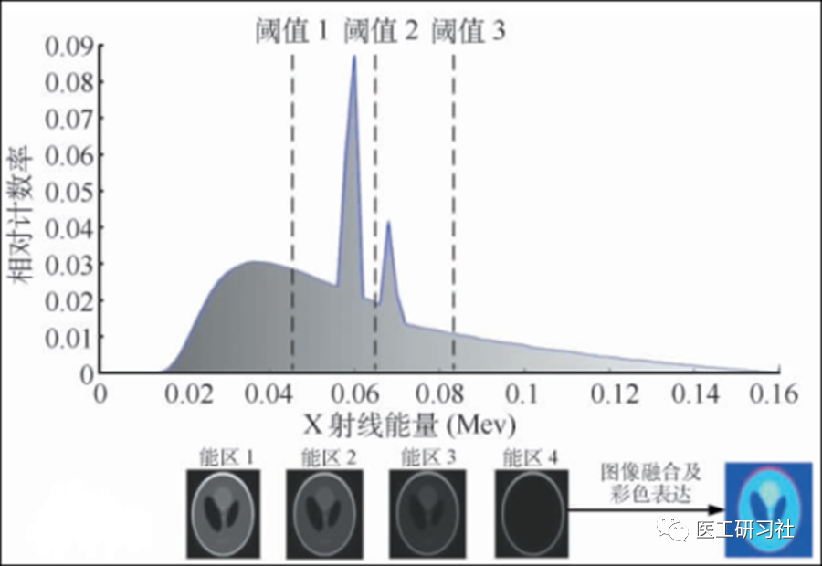

导语

“拆解”系列第4期，讨论CT之眼：探测器，CT设备最重要的核心部件，没有之一。本文主要讨论CT进入稀土陶瓷时代以后的探测器，以及光子计数探测器。

1971年，英国工程师亨斯菲尔德制造了一台用于扫描人脑的CT，我们称之为CT元年。纵观其52年的发展史，一定程度上等同于探测器的发展史。

探测器，CT核心中的核心。我们常说的多少排CT，其实就指探测器的排数。所有知名的CT整机厂商，也都有悠久的探测器研发及制造历史。

CT探测器(来自互联网)  

**探测器结构**

我们先简单了解下CT原始数据的生成过程：X线对人体某一部位进行扫描，射线穿过人体组织后发生不同程度的衰减，探测器接收衰减的X线，将其转换成数字信号，最后通过重建产生CT图像。

探测器的本质是“传感器”，其数据采集和转换过程如下：**X线穿过准直器(Anti Sccatter Grid，ASG)到闪烁体(Scintillator)，将其变成可见光，然后通过光电二极管阵列(Photodiode Array)，将光信号转换成电信号，然后通过以高速多通道模数转换器(ADC)为核心的读出电路，将其转换成原始数字信号，最终通过光纤传入重建柜。**

探测器宏观结构(来自互联网)

探测器内部结构(来自互联网)

从探测器角度，沿着这一数据采集链路，并结合CT工作原理，常见探测器参数则包括探测器材料、层厚(Z轴探测器单元尺寸）、Z轴宽度(覆盖范围)、排数、单圈扫描可获得图像数、每排探测器个数、探测器总像素单元数、采样率等。其中，探测器材料、层厚、Z轴宽度、排数、采样率尤其重要，我们来一起梳理。

**探测器核心参数**

**01**

**指标1：探测器材料**

探测器材料，又称闪烁体材料。总体说来，这是一种吸收高能光子(X射线、γ射线等)后发出可见光的闪烁晶体，广泛应用于高能物理、工业探伤及医学影像等领域。

作为探测器的心脏，闪烁体纯粹依赖于物理，化学，材料等基础学科的积累而实现，是每个厂家不传之密。   **目前，主要控制在日本、以色列等国家手中，但我国已经开始向其发起了挑战。**  

早期CT的闪烁体是以NaI为代表的单晶体，但由于密度小、易潮解、辐射损伤等缺点早已退出CT行业，仅存在于ECT中。

80年代后期，随着无机材料制备技术的发展，**闪烁陶瓷(稀土陶瓷)**这一多晶体材料出现，不仅制备工艺简单、尺寸灵活、生产成本低，还凭借高光输出量、高稳定性、低辐射损伤等优点，逐渐成为**CT探测器闪烁体的第一选择**。

探测器模块及闪烁体(来自互联网)

从稀土陶瓷配方的角度来讲，目前主要包括4种探测器材料：

1)   **Hilight和Gemstone**，均为GE所有。Hilight为第一个商用稀土陶瓷探测器，曾在全球首台64排CT：LightSpeed VCT上大放异彩。目前Hilight仍在服役，主要应用在64排及以下CT。Gemstone(宝石)探测器由江浩川博士领导开发，主要应用在宝石CT、Revolution CT等高端CT上。

2)   **GOS**，最早为日本研发，日立，佳能、西门子、飞利浦等CT厂家对其深入研究并开发出GOS探测器。其中，西门子的超高速陶瓷探测器(Ultrafast Ceramic，UFC)通过优化工艺，其光输出高达50000ph/MeV；佳能在其中又添加了一种稀有元素：镨，使光输出（Light Output）再提高了40%。   **光输出越高，意味着X线转换效率就越高，CT越“绿色”低剂量**。  

除明峰量子眼CT外，我国所有医用CT探测器的闪烁体均为GOS，且全部依赖进口。   **因为对国内而言，国外各大公司GOS闪烁陶瓷的核心制备技术目前仍是“未解之谜“, 高端GOS闪烁陶瓷技术对我国仍然是一个重要的“卡脖子”问题。**  

3) **Superlight**，诞生于我国中科院宁波材料技术与工程研究所，同样也是由江浩川博士领导开发，性能媲美宝石闪烁体，明峰医疗基于此首次实现了商用，**Superlight****目前是我国唯一应用在CT的高性能闪烁体，打破了国外技术垄断**。江浩川博士对Gemstone和Superlight的贡献，印证了那句话：千军易得，一将难求。

明峰神光探测器(来自互联网)

除GE CT和明峰超高端CT外，目前绝大多数CT探测器材料为GOS，因此在招标过程中很少对其进行约束；加上闪烁体参数过于底层和专业（请参考：   [为什么CT探测器是一块一块的？](http://mp.weixin.qq.com/s?__biz=MzU5MDU1NTMzOQ==&mid=2247485813&idx=1&sn=770d5ebaed27a6b3457a9aed37fa6604&chksm=fe3d38d1c94ab1c7ac0f929def56b15a2f18ff88ff42e9eaad61eb56c6a32bb79231b8f2a298&scene=21#wechat_redirect)），对于临床评价来说存在困难，建议以科普为主，技术评价为辅。

此外，**如今稀土陶瓷探测器已足够成熟，绝大部分CT在整个生命周期都不需要更换探测器，某些CT甚至都不需要维修。**

4种闪烁体及性能(原创)

**双层探测器**

2016年，在以色列海法诞生了世界首台双层探测器CT：飞利浦IQon，其探测器非常具有创新性，由空间上对等的上、下两层构成，上层为添加了钇(Ytrrium)元素的钇基探测器，下层为稀土陶瓷探测器。上层采集低能光子信息，同时允许高能光子穿透并在下层被吸收，从而实现了探测器端的高低能分离。

**双层探测器技术的优势在于不改变常规工作流程**，时间分辨力高，不增加辐射剂量，无扫描视野限制，可从常规CT扫描中获得全息光谱图像，被认为是“同时、同向、同源”的三同能量成像解决方案。

在经历第一代IQon后，飞利浦最新推出的Spectral CT应该是目前世界上最好的能量CT之一。

双层探测器原理(来自互联网)

**光子计数探测器**

光子计数探测器，并不是新鲜事物，很早就应用于高能物理、宇宙射线探测等领域，   **公认的下一代X射线成像技术**，应用于CT一直以来是很多厂家的梦想。

传统CT探测器原理上称之为“能量积分探测器”，其电路存在固有的系统噪声，在光电转换、模数转换等过程中，也会引进元器件漂浮噪声等，必须使用足够多的X射线来提高信噪比，则降低辐射剂量存在瓶颈。

与基于闪烁体的探测器不同，光子计数探测器基于半导体材料，具有以下优点：

1）因其具有较高的原子序数、较大的X射线吸收系数，可以实现   **更低剂量成像**；
2）因不需要通过闪烁体将X线转换成可见光，没有光横向扩散影响，可以实现   **更高空间分辨率成像**；
3）通过设置阈值实现光子脉冲数计数，每个X射线光子到达探测器后都会产生一个脉冲信号，当强度大于预设阈值才进行计数，可以消除暗电流导致的假计数，实现真正意义上的   **零噪声**；

4）引入独特的能量箱理念，从能量级角度来说，不同能量(如40、70、100KeV)X射线光子被定义为不同能级，将X射线光谱分割出4-8个能量箱，然后通过重建得到多物质图谱，用不同颜色标记不同物质(如水、钙、碘、钆等)，最终得到彩色的**多能量CT图像**。

光子计数CT的能量箱理念(来自互联网)

目前，光子计数CT主要有三种方案：
1）   **碲化镉(CdTe)方案**，西门子推出的世界首台光子计数CT：NAEOTOM Alpha就使用该方案，搭载在其双源平台上。
2）   **深硅(Si)方案**：GE主导，因硅的原子序数低，X射线转换效略弱，其探测器厚度要足够，故称之为“深硅”，不过其优势为能量箱更多；
3）   **碲锌镉(CdZnTe)方案**：由佳能首先推出，目前正与日本国家癌症中心和东柏医院合作测试中。

光子计数CT并非没有隐忧，在高能物理和空天探测已经表明，光子计数探测器的辐射损伤比较明显，不过CT用的X射线光子能量并不算高。   **考虑探测器是CT最昂贵的部件，约占总成本1/3之一左右，希望厂家能研发出能使用8-10年的光子计数探测器。**  

**02**

**指标2：探测器层厚**

对于固态稀土陶瓷探测器来说，其闪烁晶体都是要进行切割的，因为**从烧结工艺和重建算法来说，都需要对探测器进行单元分割**。

在CT学习或招标环节中，探测器层厚是最常见的参数。需要说明的是，通常我们理解的探测器层厚并不是一个物理值，而是一个等中心(ISO)值(请参考：   为什么16cm宽体探测器不是16cm？)，这和CT的几何设计都有关系。所以，实际的探测器宽度不是4cm、8cm、16cm，而是宽得多。

不过无论如何，层厚已经是被广泛接受的概念，我们完全可以据此评价CT探测器层厚。

探测器及模块(来自互联网)

我们知道，   **CT的空间分辨率一定程度上是由探测器层厚(Z轴探测器单元尺寸)决定的**。如今CT探测器，除部分16排CT还在使用非等宽探测器（中间亚毫米级，两侧毫米级）以外，64排及以上CT均使用等宽亚毫米探测。   **探测器层厚一般为0.5mm(佳能、联影) 、0.6mm(西门子)、 0.625mm(GE、飞利浦、东软、明峰等)。**  

目前，业界最小探测器层厚是0.25mm，由佳能创造并搭载在Aquilion Precision超高清CT上，其最大成像矩阵也达到了惊人的2048×2048，从侧面说明**目前日本在探测器无痕切割方面处于全球领先地位，期待我国掌握这项技术**。

超高分辨率CT探测器单元(来自互联网)

由于不担心串扰，光子计数器探测器在Z轴方向可根据阳极尺寸来定义虚拟的“探测器层厚”，目前已可以做到0.2mm，这也是光子计数器空间分辨率高的原因之一。

**03**

**指标3：探测器Z轴宽度、排与层**

我们知道，**“排”是指CT探测器在Z轴方向的物理排列数目，其实就是指探测器在Z轴被切割的单元数**。比如64排探测器就是指Z轴有64个探测器单元，每个单元的尺寸就是探测器层厚，也代表探测器的纵向分辨率。

1998年，GE、飞利浦、西门子、佳能在北美放射学会上同时发布4排螺旋CT，创造性地在Z 轴上设置多排探测器，机架旋转一周能获得多幅断层图像，奠定了现代CT的设计架构！

此后，CT经历了4排、16排、64排，到后来目前最高的320排（640排犹未可知）的发展过程。我们很容易理解**探测器Z轴宽度=探测器层厚×探测器排数**。比如，320排CT：宽度=320×0.5mm=16cm；256排CT：宽度=256×0.625mm=16cm。

不同宽度探测器覆盖范围(来自互联网)

**一般来说，排数越多，探测器Z轴越宽，单次扫描覆盖人体范围越大。除双源CT和双层探测器CT外，几乎所有CT都以探测器宽度作为划分CT档次的部分依据。**  

目前，具有16cm宽体超高端CT的整机厂商已有5家（佳能、GE、联影、东软、明峰），这说明   **宽体CT具有其优越性，如轴扫单器官成像。虽然在肺、肝等场景有时不能全覆盖，但是在心脏、全脑这两个最重要的领域，不动床扫描还是受到很多医院的青睐。**  

需要说明的是，双源CT和双层探测器CT，也在经历了排数逐渐增加的过程。比如，双源CT，从第一代40排2.78cm覆盖的Definition，到如今96排5.76cm覆盖的Force；比如双层探测器CT，从第一代64排4cm覆盖的IQon，到如今128排8cm覆盖的Spectral。

**除了“排”，CT还有”层”的概念，即机架旋转一周可获得的图像数**。比如，16层CT就表示扫描一圈能够获得16层图像；我们也知道，64排、128排CT通常能获得128层、256层图像，这是因为CT采用了飞焦点技术或共轭采集技术。

以大名鼎鼎的飞焦点技术为例，CT球管通过精确、快速地控制电子束偏转，实现X轴和Z轴双向飞焦点，不仅使获得的图像层数加倍，还提高了提高采样率。**目前，飞焦点技术已成为提高空间分辨率和成像质量的行业标准。**

飞焦点实现逻辑(来自互联网)

**04**

**指标4：每排探测器单元数**

为了便于制造和后期维修，目前绝大部分CT探测器均采用模块化方案。探测器单元通过探测器电路、基座等连接在一起，构成一个探测器模块(Module)。例如，佳能采用纯平结构，飞利浦ICT采用拼接球面结构。

需要说明的是，Z轴“整板探测器”是个伪概念，没有不切割的稀土陶瓷探测器，从探测器烧结工艺和重建算法来说，都必须要对探测器进行单元分割。

探测器的X轴排列(来自互联网)

**除Z轴外，探测器也有XY平面，它采用几十个探测器模块排布为扇形阵列**，比如飞利浦42块、比如飞利浦42块、西门子46块，每个探测器模块在XY方向一般为16个单元。

因此，我们也很容易理解**每排探测器单元数(每排探测器通道数)=探测器模块数×每块探测器模块通道数**。比如，42个模块意味着每排就有672个单元；46个模块意味着896个单元。

**需要重点强调的是，每排探测器单元数有着强烈的厂家风格（如西门子736、飞利浦672、佳能896、GE 912等），绝不可以单纯地以每排探测器通道数来评价探测器性能，因为探测器很多参数之间是互相制衡的！**

同样，我们可以据此计算探测器的总物理单元数，即探测器像素单元数。**探测器像素单元数=探测器排数×每排探测器单元数**。以东软256排CT：NeuViz Epoch为例，其探测器像素单元数=256×672= 172032。

**与每排探测器单元数类似，也不建议以探测器像素单元数来评价探测器性能，再次说明我们一直以来重视探测器排数和层厚是非常合理的。**

**05**

**指标5：探测器采样率**

众所周知，CT在工作中球管是连续出射线的，在圆周每个位置进行照射，探测器通过FET电路控制以毫秒级速度高速开关，采集多个角度切面数据就可以重建出CT图像。

这其中，**每个角度采集一次切面，称为一个View，中文翻译是“投影”，是CT重建的数据基础**。而**采集View的频率，就是采样率**。比如，常规模式下Revolution单圈采集984个view，则其采样率为984views/圈。

CT机架旋转采集逻辑(来自互联网)

让我们再次回到“张三雨中奔跑使用水杯接水”这个模型。如今CT探测器是能量积分探测器，我们将探测器比作“水杯”，将“接水”比作积分过程，只有接到足够的水，才能满足原始数据灰阶区分及信噪比的要求。一个view就代表接水一段再把水倒掉重新接的这个过程，就完成了一个view的采集。

‍CT扫描及重建原理(来自互联网)

CT重建算法是每个厂家的核心技术，这里就涉及到一个重要的参数，每圈采样率，这是CT非常重要的指标。不同厂家对采样率的定义不同，有的厂家使用 XX个投影/圈，如最大采样率4640views/圈（即每360°最高可采样4640个view）；有的厂家则喜欢用频率，即每圈XX个投影数除以该圈转速。如0.35秒转速下，每圈861个view，则采样率为（861/0.35）=2460Hz。

**倍增采样**

为了提高Z轴分辨率，或者产生双倍图像(如64排128层图像)，就诞生了倍增采样技术，如有动态飞焦点、共轭采集、DST等技术。

**从CT的原理来说，一个断面投影数越多，意味着目标边缘勾勒越精确，图像质量越高，****但是随着采样率提高，带来的好处边际效应递减，因此笔者在这里强调，**   **通常来说高采样率是好的，但并非可以简单认为采样率越高，图像越好**。例如A 款CT 采样率定义为896个投影/圈，倍增后1792个投影/圈，B款CT采样率为4800个投影/圈，A与B采样率差了非常多，但是B的图像就未必好于A。

因为，这要看不同探测器体素大小、不同扫描协议、不同转速、不同矩阵、不同传递函数和截止频率、不同重建条件等等，每个条件都是相互制约的。所以我们发现，高水平的CT某参数相差很大，但是图像往往不分伯仲。

**06**

**番外：噪声与探测器封装**

所谓探测器封装，即将探测器高度集成，凭借在半导体领域的基础，   **飞利浦成为最早实现CT探测器芯片化封装的厂家**，如今几乎所有厂家的探测器模块都是高度集成，看不到板卡下的探测器结构。

飞利浦CT探测器模块(原创)

近年来，我们听过一种宣传，即“零”电子学噪声，极大提升CT图像的空间分辨率和低密度分辨率。

这项技术确实存在。比如，西门子Stellar探测器，**不再采用传统的引线结构，而是将探测器单元直接集成到光电二极管上，减少了探测器外围电路的电子噪声和交叉串扰**；还比如，联影和万东因为也采用类似技术，其CT探测器也具有低电子噪声的特点。

新式探测器集成逻辑(来自互联网)  

这种减少外围电路电子噪声的技术，正是   **硅通孔（Through Silicon Via，TSV）封装技术**，被认为是第四代封装技术。   **这是一项高密度封装技术，正在逐渐取代目前工艺比较成熟的引线键合技术，可大幅度减少PCB上的布线，具备减少信号延迟，降低干扰等优点。**  

这项技术其实早已存在，比如，图像传感器、堆叠存储芯片以及高性能处理器，都离不开它，只不过近年来开始应用到医学领域。

**小结**

我们知道，CT的关键部件包括主轴承、滑环、高压发生器、球管、探测器，而探测器之所以能成为核心中的核心，是因为其发展基本决定了CT的发展。甚至可以说，我们“玩”的就是探测器。。。