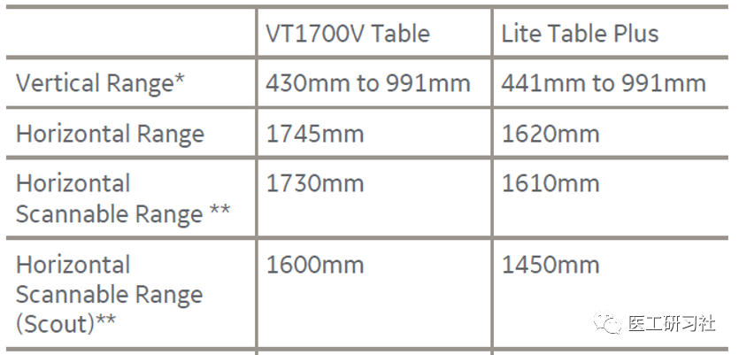
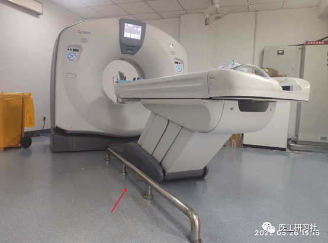

导语

“拆解”系列第5期，讨论CT中最低调的组件--扫描床。

扫描床，又称检查床，是“孔径型”设备承托患者的装置，CT，MR、PET等都需要，作用也大同小异。相比于球管、探测器探测器等核心部件，**扫描床是托举患者的无名英雄，其参数参数往往是最容易被忽略的**。

**扫描床结构**

扫描床(Table或Couch)，通常由一级床(即扫描床板，Cradle)、一级床补偿和液压升降(Elevation)构成，可进行垂直升降、水平纵向运动，其功能是：**定位时将患者送进扫描机架孔内，将被检部位正确地定位在 X 线束扫描平面的位置上；扫描时实现自动进出扫描架孔径**。

**从采购角度，扫描床通常不是重点关注对象；但从临床角度，尤其是在我国单台CT每天扫描100+的情况下，高速舒适稳定的扫描床是非常利于临床高通量检查的。因此，还是建议时适当关注。**

**扫描床参数**

总体而言，扫描床参数包括长度、宽度、承重、床速、最低位、水平移动速度、水平移动精度、扫描范围等参数。其中，扫描床最低位、承重、水平移动速度和精度、水平移动范围和一次性最大扫描范围等比较重要，我们来一起梳理。

**01**

**最低位和最高位**

最低位与最高位，和机架扫描孔径ISO中心相关，最有价值的升降区间是可扫描的最高位和最低位。**出于对患者友好的角度，床的最低位(lowest position)有时会被设计的很低，以方便使用轮椅、转运床的患者**。目前CT扫描床最低位置可以做到32cm左右。

在CT成本竞争越来越激烈的今天，尤其是在实用型16排和64排市场，扫描床升降这一功能，干脆被部分厂家取消。因为床的升降，不仅需要电机、液压、或成本更高的电动丝杠及配套装置，取消对降低整机成本有比较可观的作用。比如，现在一套非升降的扫描床，成本就几千美元而已。 不过，即使有升降功能的扫描床，医院通常也还是会配置踏步台阶。   **因为，多数CT的垂直升降速度为2-7cm/s，放置台阶确实是高流通量压力下的无奈之举。**   **以CT平扫为例，一升一降的耗时，往往会占据整个扫描流程的1/3~1/2。**  

但是，这并意味着可以取消扫描床的升降功能。不妥协，往往体现的是一个厂家的价值观。

**02**

**水平移动速度**

**在应对高负荷检查时，我们会吐槽CT扫描床“慢死了”，通常是指其水平移动速度，直接决定扫描速度。**

**从临床实用角度，高扫描床水平移动速度是非常重要的，因为不仅可以提高，检查效率，更重要的是可以实现大螺距扫描。**比如，飞利浦Spectral CT扫描床的水平移动速度高达350mm/s，能在1秒内完成头部或胸部、不到2秒实现整个上半身的扫描。

**03**

**承重**

目前，**大多数CT的承重范围在205-227kg之间。**为什么是这个数字呢，因为**刚好对应450磅和500磅**，设计时使用英制单位而已。也有更大承重的，比如飞利浦和佳能部分CT的扫描床承重300kg以上。

问题来了，大多数成年人体重集中在40-140kg之间，超过250斤的患者都不太多见，为何扫描床的设计指标会集中在这个区间？ 因为，除工程上设计余量之外，还涉及扫描床板(Cradle)的水平运动精度。在不同承重下，扫描床的水平移动精度是会变化的。比如，某型号CT的最大承重是315kg，在承重小于230kg时，床板移动精度为±0.25mm；承重超过230kg时，精度变为±1mm。   **当然，我们也可以直接认为，在承重范围内，其水平精度是基本不变的。**   **千万不要小瞧“承重”这个参数，因为也会有一些门道在其中。不同配置的扫描床，不仅成本差距不小，而且和临床功能息息相关。**  

比如，GE “摇篮床”扫描模式，配置更好的扫描床会实现更好的动态往复螺旋扫描；还比如，部分CT会有不同型号扫描床供医院选择，但大多数医院在采购时并不会注意这个细节。

GE两种扫描床对比(来自互联网)

**模拟定位扫描床(RT Table)**

在肿瘤放射治疗领域，模拟定位CT是最常用的定位手段。考虑到治疗的精度，会对CT承重提出更高要求，因为床板会置换为平板以达到和治疗床一致，同时做定位时会放置一些额外的外设和位置管理装置，所以   **模拟定位CT扫描床承重多数在300kg左右，并符合AAPM（美国医学物理学家学会）的TG66推荐标准，尤其是进床最远端下沉这个参数。**  

比如，部分医院会将诊断CT用于模拟定位的兼容用机，此时要严格注意扫描床，要选择符合TG66 标准扫描床。

**04**

**床板水平移动精度**

上文提及，不同承重下，扫描床床板的水平移动精度(可重复性)要尽可能高。**如果精度不够，那就会出现连续扫描过程当中，投影数据不准确的问题。**

**通常，水平移动精度的误差，要小于探测器最小层厚的1/2。比如，目前绝大多数CT的扫描床板移动精度在±0.25mm**   **，小于常规探测器层厚(0.5mm、0.6mm、0.625mm)的一半。**  

这里要提一下佳能Aquilion Precision 4K超高清CT的扫描床，**因为其探测器层厚为0.25mm，所以其扫描床板的位移精度在±0.1mm**。为达到这一精度，对扫描床做了特殊设计，采取双层(frame + cradle)进床方式以保证螺旋采集要求。

**05**

**水平移动范围和一次性最大扫描范围**

水平移动范围，是指从头托沿着Z轴方向往床尾部移动的过程中，真正可以进入到机架ISO平面接受曝光的长度。该参数在条件允许的范围内越高越好，有利于在扫描时使用更加灵活的头先进、足先进等摆位方式。比如，**绝大部分CT的水平移动范围都在2000mm左右，完全满足临床要求**。

一次性最大扫描范围，是指从头到足方向，一次性螺旋扫描可以覆盖的范围。比如，**大多数CT的最大扫描范围在1500-18000mm之间，同样完全满足临床要求**。需要说明的是，超大范围扫描的应用场景并不多，不过也有例外，比如车祸后的全身多发骨折急诊扫描，一次性覆盖全身为佳。

**06**

**番外：防撞护栏**

通常扫描床，也会配置一键复位退床和脚踏开关，这是对影像技术人员比较友好的设计，在此不做赘述。

与机架相比，CT扫描床通常通常故障率较低，但在实际临床工作中，经常会遇到急诊等特殊情况，导致CT扫描床会被频繁撞击，反而成了故障高发地。

因此，**为保护扫描床，很多医院会加装防撞护栏，这是一项非常好的措施，极大降低了CT扫描床故障率。**

某院为CT配置的防撞护栏 (原创)

**小结**

关于CT扫描床，推荐重点关注承重、最低位、水平移动速度、水平移动精度等这几项参数。水平移动范围和一次性最大扫描范围，以科普为主，多一点少一点并没有多大区别。

目前已完成机架、X射线系统、探测器及扫描床，CT硬件部分已正式结束。接下来是图像质量和临床应用，咱们下期见。。。

END