“拆解”系列第6期，讨论CT图像。更好的图像始终是CT发展追求的目标之一。

众所周知，人生有三大错觉，分别是：手机震动、我能反杀，她喜欢我。这背后其实蕴含着三个哲学/心理学现象：幽灵震动、达克效应、投射效应。

在医学影像领域，也有类似“错觉”：这家图像好、那家图像差，这可能是由于21天效应和从众效应在作祟。

因为，**图像质量是人们对一幅图像视觉感受的主观评价，甚至可以认为“一千个人眼中有一千个哈姆雷特”**；加上不同厂商的CT图像也有比较鲜明个人风格。因此，**我们很难客观的说：哪家图像更好；但可以说：哪家图像更多细节、更少噪声、更能反映真实情况。**

CT图像包含了**“精确度(precision)”和“准确率(accuracy)”**两方面的定量信息。精度度描述了扫描的可重复性，准确度表征了扫描结果接近真实的程度。因此，**评价CT性能应包括图像质量，以及对运动器官(主要指心脏)成像无比重要的时间分辨率。**

**图像质量**

CT图像也是一种图像，其质量评价类似于数码相机图像评价。我们可以从**空间分辨率、密度分辨率、噪声、CT值准确性**等方面详细展开。

**01**

**空间分辨率**

空间分辨率(spatial resolution)，即高对比度分辨率，描述了当密度分辨率大于10％时，CT影像中能显示的最小细节。空间分辨率一般为像素密度1.5倍，像素越小，数目越多，**空间分辨率越高，图像越清晰**。

考虑到CT属于三维成像，其空间分辨率也应在三维环境中评价。因此，我们通常在两个正交方向上测量：沿着患者的z方向和垂直于患者的x-y方向。早期，x-y方向和z方向的空间分辨率差异巨大；随着16排、64排甚至更高端CT的出现，二者的差异正在迅速消失。

**空间分辨率是能被客观测量出的**，通常以每厘米线对数(lp/cm)或每毫米线对数(lp/mm)来表示，即在视觉上每厘米内可分辨最大的黑白条纹和间隙数。

线对数越多，空间分辨率越高。**可辨最小物体直径(mm)=5÷lp/cm**。比如，某CT的最大空间分辨率为20lp/cm，这意味着其可识别最小物体的直径为0.25mm。

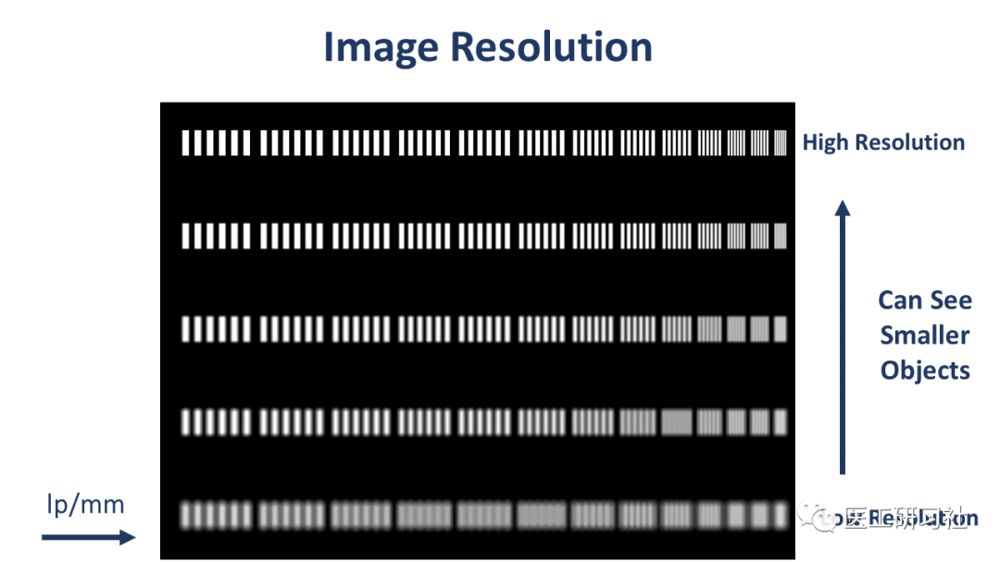线对数越多，空间分辨率越高(来自互联网)

我们以西门子force和佳能precision为例解读CT整机厂家的空间分辨率。**考虑到整个CT影像链都会影响空间分辨率，在白皮书中明确陈述在何种条件(管电压、管电流、层厚、时间、FOV、螺距、重建算法)和模体下获得的空间分辨率，是非常非常重要的。**

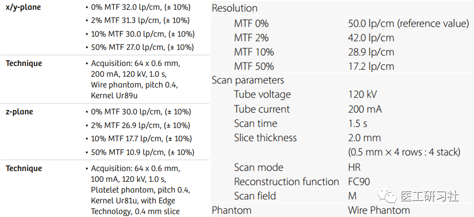两台CT的空间分辨率(来自互联网)

从上图，我们可以看到四种条件下(MTF=0%、MTF=2%、MTF=10%、MTF=50%)的空间分辨率，显然不同条件下的空间分辨率差异巨大。

需要说明的是，MTF(调制传递函数)是更科学空间分辨率的方法，表示条纹间对比度随条纹图频率增大而衰减的关系曲线。MTF介于0%-100%之间，当MTF=0%时，表示经过该成像系统后无法获得目标物体的任何信息；当MTF=100%时，表示经过该成像系统后目标物体的所有信息都被呈现出来。

**在实际工作中，通常不用MTF曲线，而是用离散位置的MTF值来描述**。比如上图中MTF=0%、MTF=2%、MTF=10%、MTF=50%所在点对应的空间分辨率。

MTF曲线和空间分辨率关系(来自互联网)

**很多时候，为使空间分辨率参数"好看"，CT整机厂商仅展示MTF=0%时空间分辨率，这是没有意义的。**因为，**人眼视觉能判断出“恰好能分辨”或“勉强可以区分开”的最精细的条纹，代表极限空间分辨率，相当于MTF=5%的对应点；一旦CT对比度差异低于5%，人眼根本无法察觉，没有任何意义。**

根据2022年4月1日正式实施的医药行业标准《YY/T 1766.1-2021 X射线计算机体层摄影设备图像质量评价方法 第1部分: 调制传递函数评价》，**MTF=0%通常是通过拟合的方法得到，随拟合方法不同结果波动较大，对于临床没有直接的意义，不推荐采用MTF 0%来进行空间分辨率的评价。同时，建议使用MTF=10%和MTF=50%进行评价，并要给出准确的扫描和重建参数。**

因为，**为了方便评估CT性能，CT厂商白皮书要展示MTF=0%(可有可无)、MTF=10%、MTF=50%等三个点的空间分辨率。即便真的要比参数，那也要放在同一水平线上对比。**

**02**

**密度分辨率**

密度分辨率(contrast resolution)，即低对比分辨率(Low Contrast Detectability，LCD)，能分辨组织之间最小密度差异，是断层成像中最重要的性能指标之一。比如，**CT的空间分辨率远远没有DR高，但优势是密度分辨率更高，这也是CT被誉为迄今为止最重要医学发明之一的重要原因。**

密度分辨率，通常被定义为在给定剂量和对比度条件下，可以观察到的最小物体。通过测量具有不同尺寸和不同密度的物体的低对比度体模，可以得到密度分辨率。**CT的密度分辨率越高，说明系统区分不同密度物体的能力越好。**

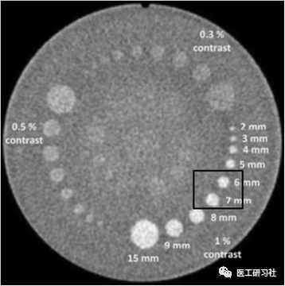

密度分辨率测试模体(来自互联网)

**在CT中，通常以线性衰减系数百分比的形式来展示，比如1%对比度意味着组织的CT值和其背景相差10HU。更常用的是0.3%对比度，意味着组织的CT值和其背景仅相差3HU。**

我们以西门子force和GE APEX为例解读，同样是因为其在白皮书中明确陈述了何种条件(管电压、管电流、层厚、FOV、螺距、重建算法)和模体下获得的密度分辨率。

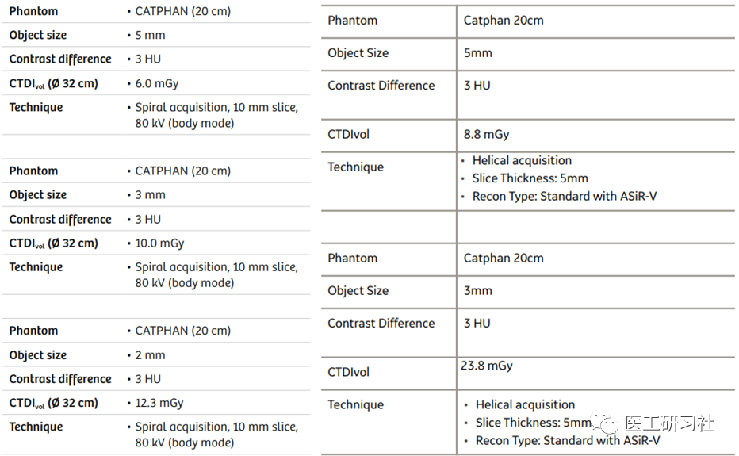两台CT的密度分辨率(来自互联网)

以GE APEX为例，3mm@3HU，23.8mGy(等价于3mm@0.3%，23.8mGy)，意味着在23.8mGy的剂量下，人眼能看到3mm，3HU的插入物。

不过，**与空间分辨率相反，密度分辨率并不容易被客观测量**。**我们通常假定自己有能力看到某种低对比度的组织，实际上对于个人来说，这是一项非常主观的任务。**

影响密度分辨率的参数有很多，比如CT、观察者、扫描参数、重建参数、读取条件、模体、评价方法等，并非所有参数都与CT系统有关。因此，**很难客观评价CT的密度分辨率参数，更难将不同厂商的CT密度分辨率放在一起对比。**

**03**

**噪声**

噪声，是指均匀物质影像中给定区域CT值对其平均值的变异，通常用给定区域CT值的标准偏差表示，比如**＜0.35%，同样需要标明具体扫描条件**。

**噪声是影响CT图像密度分辨率的最大因素，密度分辨率低，则软组织分辨能力就比较差，这就是所谓的没有磁共振“清楚”的来源。**

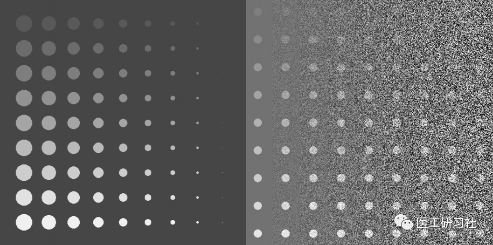有无噪声的图像对比(来自互联网)

以上图为例，我们能明显看有无噪声对图像质量影响极大。必须要说明的是，噪声不能被完全消除的，但是了解清楚噪声来源，有助于降低图像噪声。一般来说，CT图像噪声主要有三个来源：

**电子噪声**

CT硬件系统固有限制引入的噪声。包含探测器光电二极管中的电子噪声、数据采集系统中引入的电子噪声，被扫描物体的X射线散射等引入的噪声。电子噪声噪声不受人为控制影响，可以通过改善硬件系统来减轻这类噪声，但是无法避免的。比如，**探测器的TSV封装技术能降低系统固有噪声**。

**量子噪声**

**量子噪声是CT图像噪声的主要来源**。量子噪声服从泊松分布，即在一束X射线中，光子的分布并不是严格均匀，而是概率均匀。

举个例子，刚开始下雨时，雨量较小，能看出来有些地方雨多一些、有些地方雨少一些；后期雨下大时，雨量较大，很难区分哪个地方雨少、哪个地方雨多。同样，当X光量子少的情况下，我们能看到有些地方X光量子多、有些地方X光量子少，分布不均匀的情况就是量子噪声；当X光量子多的情况下，X光照射到的所有地方在统计学上的分布就大致均匀了，量子噪声也就会不那么明显了。

X射线光子数，主要由扫描条件(管电压、管电流、层厚、扫描速度、螺距等）和探测器效率(QDE、本影-半影比等)共同决定。**扫描条件决定了到达到患者的X射线光子数，探测器效率决定了X射线光子光子离开患者后转化为有效信号的百分比**。探测器效率由系统硬件决定，但我们可以控制X射线光子数。因此，**降低量子噪声的方法很简单，就是增加光量子，即加大X射线剂量。**

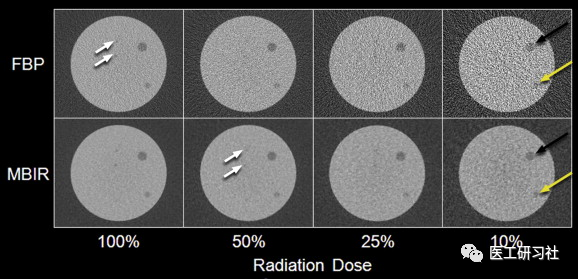

不同X射线剂量下噪声对比(来自互联网)

**为减少图像的噪声，可以提高管电压、管电流和层厚，减小扫描速度和螺距，但也会带来一定的副作用**。比如，提高管电压会降低密度分辨率；增加管电流会导致患者所有受辐射剂量提高，并加大球管损耗；增大扫描层厚会导致3D图像质量下降和部分容积效应增加；降低扫描速度和会使图像更容易引入病人运动导致的运动伪影；降低螺距会使单位时间内器官覆盖范围减小。

因此，**加大X射线剂量是把双刃剑，研究表明：减半噪声需要将剂量加大至原来的4倍**。因此，在实际工作中要根据情况来权衡利弊。

**电子噪声**

图像产生过程引入的噪声。**图****像重建不仅要减少噪声并保留原始图像中的精细结构，还必须保持“看起来自然”的噪声纹理**。重建参数包括重算算法、滤波核、重建FOV等。

目前，常用的重建算法包括滤波反投影(FBP)、迭代重建(IR)、深度学习重建(DLR)。**FBP是第一代重建算法，大多数情况下FBP都可以很好地工作，重建时间短，且能高剂量产生具有较高诊断质量的图像，一直是被影像科医生用来作为“ground truth”**。但对噪声敏感，当X射线量不足时，FBP重建图像质量就会明显降低。

随着计算机性能的提升，IR重建应用越来越广泛。**与FBP相比，IR可以将先验知识整合到重建过程中，能在不影响图像质量的前提下，使用IR辐射剂量可降低23%-76%，提高了图像质量和诊断价值**。但是，迭代重建也有局限性，反复迭代过程会使图像看起来过度平滑，有一种“过度美颜”的不真实感。

与上述图像重建算法相比，**深度学习重建的优点是能具有更好的图像去噪、图像纹理改进和伪影减少，但会进一步增加CT图像重建的复杂性**。

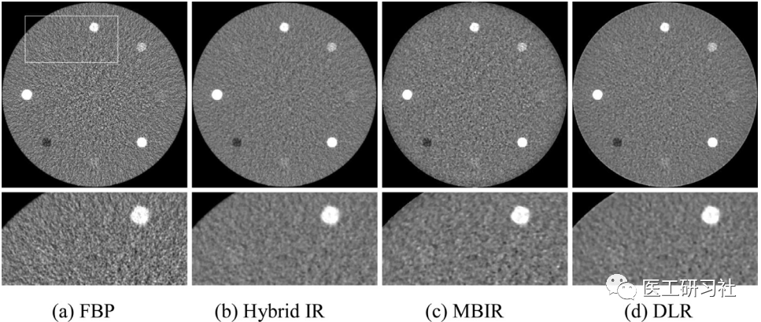低剂量下深度学习重建图像更好(来自互联网)

此外，CT重建滤波核算法也包括标准算法、高分辨算法、软组织算法等等是多种，不同算法作用不同。比如，标准算法多用于脊柱、脑等组织显示显示；高分辨算法类似边缘增强滤波，会增加噪声、提高空间分辨率，但会降低密度分辨率，主要应用于肺部等组织显示；软组织算法类似平滑滤波，会降低噪声、提高密度分辨率，但降低空间分辨率，主要用于肝、肾、软组织等显示。

**04**

**CT值精确度**

CT值，代表X线穿过组织被吸收后的衰减值。某某物质 CT 值 =(µ 物—µ 水)/µ 水 ×1000。由此可见，CT值并不是一个绝对值，而是一个相对值。

**在临床诊断中，放射科医生经常依靠测量CT值来区分健康组织和病灶。****尽管大多数CT厂商并不推荐上述方式(除非健康组织和病灶的CT值差别巨大)，但这凸显了精确CT值的重要性。**

**精确的CT值体现在CT值的一致性和均匀性。**所谓一致性，是指面对同一模体，不同扫描条件下，多次重复扫描后重建模体的CT值应保持一致。所谓均匀性，是指面对均匀模体，测量出的CT值不应随着模体的位置或者所选ROI的位置而发生变化。比如，下图中两个ROI的CT值应该一样。

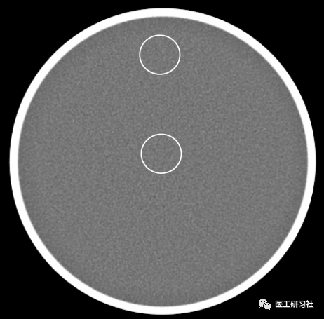

CT值准确度和噪声测试模体(来自互联网)

**由于X射线射束硬化、散热、CT系统稳定性等因素的影响，CT值的精确度应保持在合理区域内。**以GE APEX的CT值准确度为例，在整个16cm的Z轴覆盖范围内，其将碘化对比度的均匀性提高到10 HU以内(变化率为3%)。

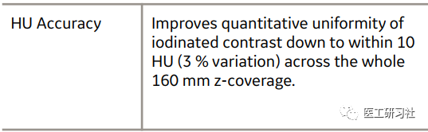

GE APEX的CT值准确度(来自互联网)

此外，还要说明的是，**不同的重建算法下的图像质量会有所不同****，其CT值也会受到影响，这是因为大多数滤波核是针对特定临床应用目的而设计的**。比如，肺算法被设计用来增强精细结构的可见度，用来重建肺部时会提高结节的CT值。

**时间分辨率**

时间分辨率(Temporal Resolution)，指CT采集到可以重建出一层完整图像数据所需的时间。**时间分辨率，并不是评价图像质量的参数，但是决定心脏及周围大血管成像质量的最重要参数影。**

**时间分辨率由CT转速和图像重建数据量共同决定**。比如，转速为0.3s/r时，采用360°数据重建图像，则时间分辨率为300ms；采用 180°数据重建图像，则时间分辨率为为150ms。

如今，CT普遍采用**半扫描重建(Half Scan reconstruction)**技术，形成一层完整图像仅需要机架旋转180度所采集的数据。因此，**CT的时间分辨率等于机架转速的1/2****。需要强调的是，这里的时间分辨率指的是“****单扇区时间分辨率****”。**

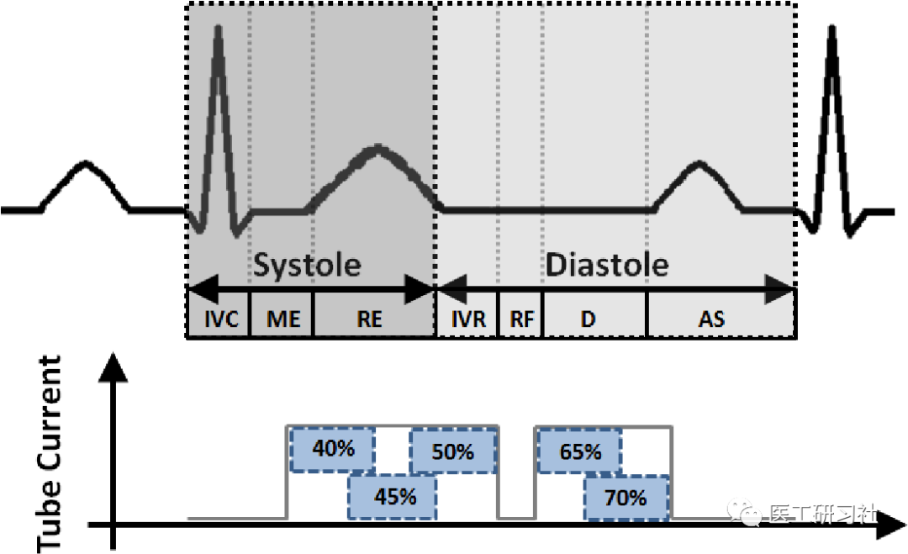心脏的收缩期和舒张期(来自互联网)

因为心脏在不停跳动的，常规成像必然引起运动伪影。**由于心脏是有规律搏动的，最静止的部分是心脏舒张期(Diastole)，想要获得清晰的冠脉图像，在这个阶段成像是最好的选择，能实现“冻结”心脏。**然而，心脏舒张静息期随着心率的增加而变窄：

当心率＜60 次/分时，心脏舒张静息期持续时间约250ms，则时间分辨率要低于250ms，机架转速要＜0.5s/r；

心率70~90 次/分时，静息期持续时间约150ms，则时间分辨率要低于150ms，机架转速要＜0.3s/r；

当心率＞90 次/分时，静息期持续时间约100ms，则时间分辨率要低于100ms，机架转速要＜0.2s/r；

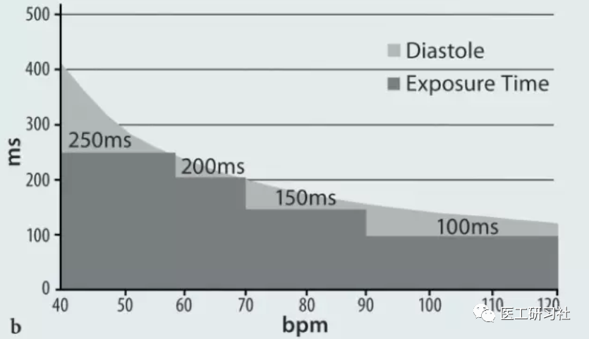不同心率下心脏舒张期持续时间(来自互联网)

显然，心脏的相对静止期会随着心率的加快而明显缩短，**为了获得高质量冠脉成像，要么控制患者心率，要么提高时间分辨率，而将机架转速降低到0.2s/r以下显然是非常困难的，更好的解决办法是双源和多扇区重建**。

**双源**

双源CT在机架的X-Y平面上间隔90°-95°配置了两套球管和探测器，并且扫描时同时采集数据。扫描时，每套系统只需要旋转大约四分之一圈就可以采集到所需要180°的投影数据，相当于在单个R-R间期内实现了双扇区重建，同时还消除了不同R-R间期数据不能准确匹配的问题。**对于双源CT，其单扇区时间分辨率等于机架转速的1/4。**

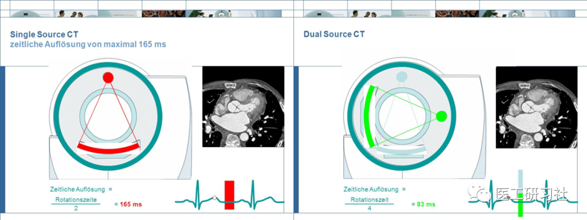双源CT的冠脉CTA采集逻辑(来自互联网)

**双源CT将时间分辨率降低到100ms以内，可以实现不限制心率的冠状动脉扫描****，高心率的病人不再需要服用降低心率的药物，也可获得满意的图像质量。**此外，采用大螺距扫描模式，可以一次心动周期(1-beat)内扫描整个心脏，辐射剂量更低。

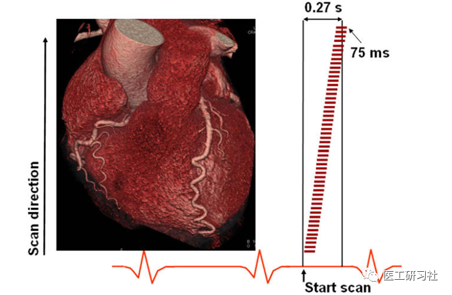大螺距模式可实现1-beat扫描(来自互联网)

**多扇区重建**

当心率＞90 次/分时，为了获得较好的冠脉图像，机架转速要小于0.2s/r才能有足够高的时间分辨率，显然不可能做到。为了获得更高的时间分辨率，诞生了多扇区重建技术。

**当架转速不够时，在心脏舒张静息期内采集的数据不够用于重建时，通过减少每个心脏周期(R-R间期)内的成像时间窗宽度，然后利用相邻数个心动周期的采集数据，组合成图像重建需要180°的数据，称为多扇区重建。**

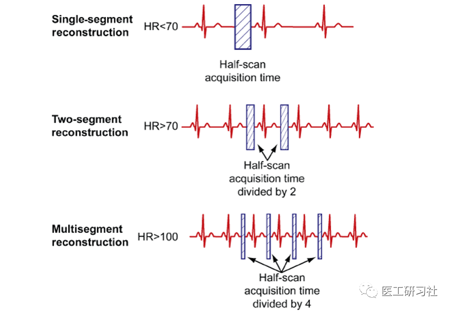单、双、四扇区重建实现逻辑(来自互联网)

**对于多扇区重建，其时间分辨率的范围从最大TR/2到最小TR/2M**，其中TR是机架旋转时间，M是相邻心跳中的段数，通常M在1到4之间。比如，当机架转速为0.25s/r时，采用双扇区重建，其时间分辨率为250/4=62.5ms；采用四扇区重建，其时间分辨率为250/8=31.25ms。**这个时间分辨率，我们称之为“有效时间分辨率”。**

不过，**由于多扇区重建是使用多个心动周期数据来拼出的心动周期图像，要求在扫描期间内患者心率不能发生明显变化，否则就不能够准确匹配不同R-R间期数据，导致图像质量下降**。因此，发展了**冠脉运动伪影校正技术**，比如GE的Snap shot Freeze(SSF)、佳能的Adaptive Motion Correction(AMC)、联影的CardioCapture等，实现了冠状动脉内运动补偿，减少了运动伪影。同时，结合宽体CT的优势，也能在一次心动周期内获得高质量冠脉成像。此外，配合智能门控技术，同样能应对严重心率不齐患者。

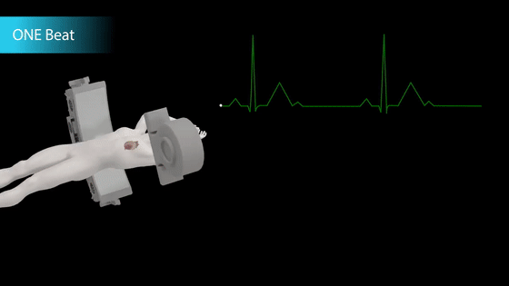

宽体CT也能实现1-beat扫描(来自互联网)

**有效时间分辨率**

我们将CT比作一台相机，则相机快门速度类似时间分辨率，相机广角类似Z轴宽度。针对一颗12cm宽的跳动的心脏，是选择快门速度最快的相机，还是选择广角更大的相机？

通常来说，**快门比广角更重要**。不过，全都要当然更好。因此，**我们能看到双源CT的Z轴覆盖在逐渐变宽，宽体CT的转速也越来越快。**

**Q1**

招标时，要不要认可有效时间分辨率？

**随着冠脉运动伪影校正技术和人工智能技术的应用，冠脉成像得到了明显改善。因此，**“有效时间分辨率”一定是有意义的，正如球管“等效热容量”**。**不过，**招标时通常只认可“单扇区时间分辨率”，因为其有明确的计算依据。**

**与****通过物理方式实现的“等效热容量”不同，“有效时间分辨率”是通过软件方式实现****的**，加上部分厂商也没有明确其计算方法。**为体现招标的公平性，往往选择不认“有效时间分辨率”****。**

不过，考虑到双源CT属于西门子独家。**招标时通常不会将“单扇区时间分辨率”标记为星号参数，仅作为一般条款做要求，这同样也体现了招标的公平性**。

**小结**

本文详细介绍了对临床实践有重要意义的时间分辨率、空间分辨率、密度分辨率、噪声、CT值准确性等参数，充分了解有助于更好把握CT性能。

数十年来，**C****T技术的发展一直紧紧围绕着提高时间分辨率、空间分辨率和Z轴覆盖范围**。目前来看，这三方面已经非常优秀，不过也仍在继续进步。。。

END