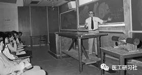
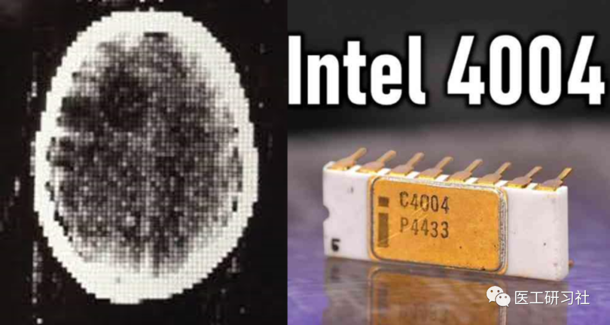
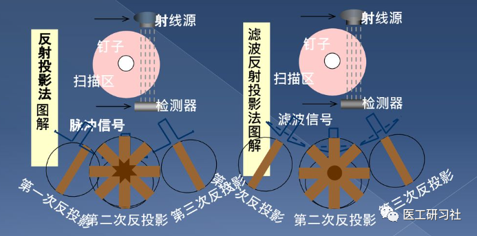
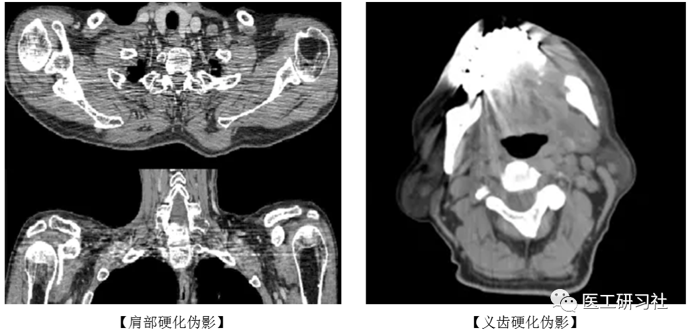
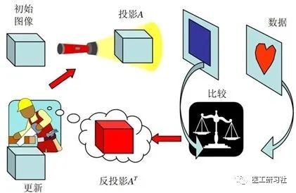
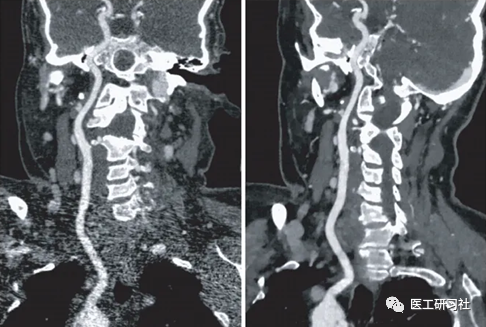
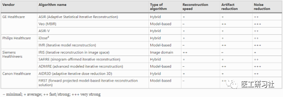
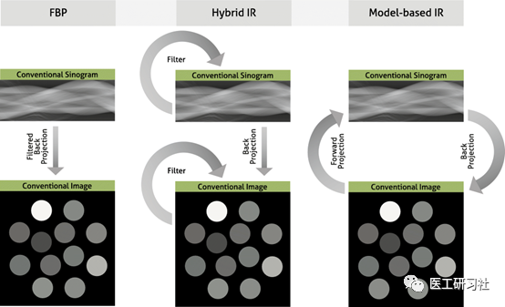
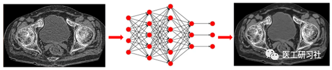

导语

“拆解”系列第7期，讨论CT图像重建算法，硬核的标题、有趣的内容、明确的观点。

纵观整个系列，重建算法篇是比较特殊的。因为从采购角度，值得我们关心的参数只有   **重建速度(幅/秒)**   **，这关乎这图像质量和使用体验，尤其是在我国患者流通量十分巨大的情况下**。

仅从参数角度讨论CT图像重建几乎没有意义，从大历史观角度梳理图像重建技术的发展，或许会更有趣、也更能引人思考。

**1**

**致敬：科马克教授**

第二次世界大战时期，豪斯费尔德 ( Housefield)在英国皇家空军雷达学校任教，彼时科马克(Cormack)也是南非开普敦大学讲师，同时兼任G•舒尔医院放射科物理学家。

作为开普敦唯一的核物理学家，科马克在分析辐射治疗计划时，意识到了解X射线吸收系数在人体内分布的重要性，并想要重建初组织的吸收系数以提高辐射治疗的精确性。

1956年，科马克推导出图像重建的数学理论，并进行了实验，基于其重建技术计算出了铝和木头的吸收系数，此时CT已经在他脑海里萌芽。

科马克老师在授课(来自互联网)

1963年，已在塔夫斯大学任教的科马克教授重复了实验，首次发表了X射线电子计算机断层扫描技术（CT）的论文，提出了人体不同组织对X线吸收量的数学公式，从理论上将X射线与图像重建结合起来，CT理论基础正式诞生。

**如果说豪斯费尔德教授是CT的发明人，那么科马克教授则是CT理论的奠基人。**

**2**

**起源：第一幅重建图像**

CT图像重建，自诞生之日就与计算机的算力紧密相连。1946年，第一台计算机埃尼阿克(ENIAC)诞生。21年后，豪斯费尔德研制出第一台CT原型机，先历时9天采集数据，后又在计算机上耗时2.5小时重建出图像。

1971年，英特尔发布了4004处理器。同年，在进一步改进数据采集和重建技术后，第一台可用于临床的CT安装在伦敦郊外阿特金森·莫利医院，仅4.5分钟就重建出第一幅人脑图像。

第一幅CT图像和英特尔4004处理器(来自互联网)

今天看来，重建一幅80x80的图像是轻而易举的，但在当时重建一幅断层图像的空间复杂度和时间复杂度都极具挑战，短时间内CT图像重建一直是工程师们头疼的问题。

**最初，CT图像是通过称为代数重建技术(ART)的迭代方法重建的，比如第一幅CT图像是通过求解28000个联立方程获得的，可见因其计算量之大，不仅人力不可及，连当时最高性能的计算机也耗时过长。**  

由于当时缺乏高性能计算机，代数重建很快被更简单、更节约时间的滤波反投影取代，并长期霸榜，直到2009年临床上首次引入迭代重建技术。

**3**

**王者：滤波反投影**

我们想象公园中有棵树，从任何方向都只能看到树的一隅。但如果绕树一周，从多种不同角度获取这棵树的投影，就可以反推出这棵树的全貌，这就是**反投影**。

由于直接投影是离散叠加的，会导致投影中心处信号集中、边缘处信号稀疏，必须在空缺处插值才能获得完整图像，这会导致图像边缘模糊，因此引入**滤波反投影**。

反投影和滤波反投影(来自互联网)

**滤波反投影(Filtered Back Projection，FBP)**，顾名思义即先滤波、后反投影，在反投影前将每一个采集投影角度下的投影进行滤波处理，去除这些伪影信号，有助于改善点扩散函数引起的星状伪影，还原真实情况。   **投影越多，定位越精准，得到的图像质量也就越高。**FBP有明显的优缺点：

1）   **操作简便，易于临床实现；图像锐利、保真度高；**   **因人为干预少，因此图像信息相对真实，定量真实性好**；   **因大幅减少计算量，重建速度快，相当长时间内FBP占据着主流**。   **目前，大多数厂家的FBP算法都非常快，普遍重建速度在30-100多幅/秒，完全满足临床使用需求，在很多设备上仍扮演着重要角色。**比如，为患者流通量考虑，能一边扫一边重建的CT就更容易受到到欢迎。

2）由于其理论基础是线性变换，FBP也有不少缺点：   **FBP是剂量依赖型算法，为更高的信噪比，剂量必须足够高，以应对各种噪声**；   **难以克服硬化伪影**   **，相当长时间内，医生都对这些伪影习以为常**，如肩部硬化伪影，盆腔硬化伪影，颅底伪影等；对于无法有效区分X射线在人体内发生的散射，导致图像质量会一定程度下降。

滤波反投影下的硬化伪影(来自互联网)

需要说明的是，尽管理论基础一致，但各厂家重建核心算法都有明显个人风格。加上现代CT属于锥形束CT，轴扫还是螺旋扫、不同螺距、不同扫描野、不同重建野、不同滤波函数、不同部位专用补偿等都不一样，**不能在缺乏其他条件情况下简单比较不同厂家的图像质量，哪怕是同一台CT，其在不同场景下的图像表现也是明显不一样的**。

**4**

**完美继承者：迭代重建**

由于FBP 是将X射线光源视为一个点，重建体素也视为一个点，对整个成像做了很多简化和假设，使**FBP更像“黑盒字”，只能应用非常有限的模型和先验信息**。而实际情况复杂得多，比如当少量光子到达探测器时，就不能正确地建模图像噪声。

因此，CT检查面临两个巨大挑战：   **剂量和伪影**，于是科学家和工程师们着手改进CT重建算法，于是，混合迭代重建诞生。

**迭代重建(Iterative Reconstruction，IR)，顾名思义就是需要循环往复，像炼金，一遍一遍熔化去杂质，直到获得纯度较高的金子**。至于为什么叫   **混合迭代(Hybrid-IR)**，是因为在此过程中，还是不能放弃FBP图像的起始位置，算是对FBP图像的迭代优化。

迭代示意图(来自互联网)

**与滤波反投影相比，迭代重建在降低噪声、去除伪影上有较好的表现，这给降低扫描剂量和去金属伪影提供了可能**。因此，我们发现2010年后，各厂商都推出了基于迭代重建的低剂量成像，如  **ASIR（GE，后期是ASIR-V）、iDose（飞利浦，后期是iDose4）、SAFIRE（西门子）、AIDR 3D（佳能）、ClearView（东软）**等。

与FBP相比，迭代重建大幅改善肩部伪影(来自互联网)

迭代技术刚问世的时候，曾遭到强烈质疑：   **因为和FBP相比较，其图像不够锐利，噪声去除后显得很“假”，像相机开了美颜。尤其是高年资医生对FBP质疑更加强烈，因为他们从学习到工作，全都将FBP视为“金标准”。**  

实际上，   **迭代重建有档位(或叫迭代深度)，**   **随着迭代深度增加，这种变化更加明显，以至于在低剂量下出现了“蜡化伪影”或“塑料伪影”（Plastic artifact），图像边界晕化得一塌糊涂，因此很多时候默认中度档位迭代重建**。此外，   **因其计算复杂度提升，重建速度也没有FBP快，一般在30-70幅/秒，但是仍可接受**。

尽管所面临的质疑是客观存在的，但迭代重建确实是进步的。   **需要强调的是，迭代是一种思想，即用较小的代价来取得更好的结果，提升效率。**   **无论是老入门级CT，还是最新光谱CT、光子计数CT都在使用迭代策略。**  

**与FBP相比，混合迭代将图像质量提升了一大截，尤其是半剂量（50% off），使如多期增强、灌注等等传统高剂量检查可以使用低剂量开展**   **。**需要用户注意的是，各厂家白皮书的降低剂量百分比标称值，是具体某些部位的极限值。比如，肺部等具有强烈对比的部位容易降低剂量，最多降低82%；而腹盆等部位降低50%剂量都算好的。

不同厂家混合和模型迭代对比(来自互联网)  

**未获得广泛应用的模型迭代**

尽管混合迭代表现相当不错，但和理想中的超低剂量、超低噪声、高保真解剖信息还有一段距离，科学家和工程师们仍不满足，着手开发  **模型迭代(Model-Based Iterative Reconstruction，MBIR)**，如  **IMR(飞利浦)、FIRST(佳能)、ADMIRE(西门子)、VEO(GE)**等。

FBP、Hybrid-IR、MB-IR重建逻辑对比(来自互联网)

**与混合迭代相比，模型迭代在降低噪声、提高图像质量方面较滤波反投影和混合迭代重建更有优势能使CT辐射剂量得到更大降低。**比如，一些研究报告称，在成人和儿童患者的一些常规和非常规临床指征和身体区域，全模型迭代比混合迭代和滤波反投影更能降低辐射剂量，同时保持图像质量。

然而，**模型迭代的模型更加复杂，需要更高重建算力，导致重建速度慢，加上成本昂贵，使全模型迭代并未获得广泛应用**。但，**这并不代表全迭代没有未来，其在相当宽的剂量范围中，都可维持很好的低噪声水平**。比如，某项比较Hybrid-IR、MB-IR和DLR三种图像重建技术的研究，发现小结构在高剂量时在MB-IR上更容易看到，在低剂量时在DLR上更容易看到。

**5**

**未来可期：深度学习重建**

随着神经网络，尤其是卷积神经网络(CNN)的成功，人工智能已迅速进入医学成像领域。提及深度学习，我们更多关注点可能在于智能辅助诊断，如肺结节、心血管、骨折、脑出血等自动诊断。其实，基于深度学习的重建技术也已成为CT图像重建的趋势。

关于   **深度学习图像(Deep Learning Reconstruction，DLR)重建**，笔者更愿意使用   **“深度学习图像再现”(represent)**来描述。简单地说，将一幅图像作为输入，经过一个黑箱子（训练过的神经网络），输出一幅高质量的图像。

“黑箱子”般神经网络(来自互联网)

整个过程，看起来像能化腐朽为神奇的“来料加工”，实际上经过训练的神经网络，模拟物体进入人眼、视神经、最后到大脑皮层的过程，多达数层甚至十数层的神经网络，看似引入了一些毫不相干的变量，但是结果往往如此令人着迷。    

不过，和当初对迭代重建类似，DLR面临的质疑声更大，这主要是因为对深度学习不信任，认为整个过程太不透明，更像是“巫术”。但实际上，   **DLR有严谨完整且的数学理论基础，不仅CT，PET、MR图像优化也都在引入深度学习。**  

既然是科学训练，那么其训练集的选择就很有讲究，   **有的(GE)选取高剂量、高标准的FBP图像作为训练集，有的(佳能)采用高剂量、高质量的MB-IR图像作为训练集，**   **这就要求厂商必须具备大量的装机和历史沉淀，遴选出最优秀的图像作为金标准(Ground Truth)。**目前，获得FDA和NMPA批准的DLR算法已有两种：   **AiCE(佳能)和TrueFidelity(GE)**。这意味着，深度学习重建已被监管机构承认，并可以应用于临床。

与迭代重建类似，AiCE(轻度、标准、强度)和True Fidelity(低、中、高)也提供了强度预设，能控制重建图像中的降噪强度，其重建时间同样会根据随选定强度而有所波动。

AiCE示意图(来自互联网)

**与滤波反投影和迭代重建相比，深度学习重建的优点是能具有更好的图像去噪、图像纹理改进和伪影减少，但会进一步增加CT图像重建的复杂性，对于算力要求非常高，高性能GPU(显卡)往往是深度学习重建的标配**   **。**比如，全球AI硬件王者英伟达提供的解决方案，能使   **深度学习重建速度能达到几十幅/秒，基本满足临床使用**。

除CT深度学习重建外，CT智能导航技术、MR加速采集技术、PET/CT超快成像等领域的应用，都得益于人工智能带来的好处。

**6**

**小结**

目前来看，  **迭代重建还有相当强的生命力，比如某些条件下模型迭代重建甚至比深度学习重建表现更好**。不过，我们也必须承认，  **深度学习重建代表着未来**。随着越来越多高质量数据继续迭代神经网络，深度学习重建会越来越好、越来越受欢迎。。。

END