导语

拆解系列第8期：临床应用篇，从基本、高级、超高端三个角度解读使用者最关心的临床应用。

在经历了机架篇、X线系统篇、探测器篇、扫描床篇 、图像质量篇 、重建算法篇等6篇的铺垫后，终于迎来了最重要的临床应用篇。  **如果说硬件决定了CT的档次，那软件就决定了CT的深度和广度。**

**1**

**档次决定临床应用**

从硬件角度，目前CT市场主要分为3个档次：

1）16排档，包括16排、32/40排(32/40排CT能做的16排CT都能做），入门级CT，适合基层医院；

2）64排档，包括60排-63排、64/80排，中端CT，县域医院主力机型和三级医院的走量机型；

3）128排及以上档，包括128/160排、256/320排、双源CT、双层光谱CT（部分也可归为256排档（或称超高端CT）），高端CT，三甲医院主力机型，功能丰富。

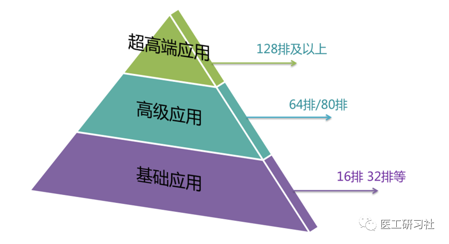

**设备档次决定CT临床应用，越高档次的CT，其临床应用也越丰富越复杂。此外，同档次的CT配置也不尽相同，尤其是超高端CT，各厂家还有独家应用。**

在部署方面，一些功能搭载在操作台上，一些则依赖后处理工作站，有的功能则是二者兼而有之，甚至一些功能还需要引进AI等第三方软硬件。

在厂家提供的招标材料中，相比于硬件参数，临床应用软件的描述占据更大的篇幅，每个分项功能也描述得非常详细，客观上也加剧了用户选型的难度。

不过，或许我们可以尝试化繁为简，让大家一目了然。根据设备档次，可将临床应用大致分为三个应用水平，   **设备档次越高，其所具备的功能也是向下兼容的**。

1）基础应用：通常称为基础包或三维包等；

2）高级应用：动脉血管成像CTA（包含冠脉CCTA），静脉血管成像CTV，结肠分析，肺结节，入门功能成像（灌注、能谱）

3）超高端应用：复杂困难的心脏冠脉成像，心肌灌注，多部位联合扫描，心、脑一站式成像，动态成像等，以及各厂家超高端CT搭载的独家功能。

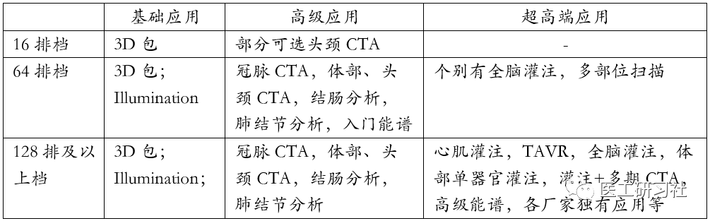

不同档次的CT应用配置(原创)

**对于配置软件，通常我们的心态是：“不管我用不用，反正都得给我”，这当然是很正常的。**  

**随着临床需求的变化，有的软件采购回来后使用率不高，甚至闲置。由于收费和可及性问题，能谱在超高端CT上开展的都不多，主要满足部分科研需求。因此，我们可以发现，在64排档CT上配置能谱功能是比较少见的。**  

**此外，鉴于软件的价格其实并不便宜，建议医院理性决定，与其闲置不用，不如多换1年保修还更实在。**  

下面，我们对以上临床应用进行梳理和解析。

**2**

**基础应用**

所谓基础包，是指CT 扫描结束后最常使用的MPR（多平面重建）、CPR（曲面重建）、MIP（最大密度投影）、MinIP（最小密度投影）、表面三维SSD、三维容积漫游VRT，仿真内窥镜等功能，旨在帮助读片者观察解剖结构，从不同平面、曲面、甚至立体空间进行观察，帮助医生发现病灶，或者给临床一个全局视野。如今，这些功能已经成为了CT最基础的配置。

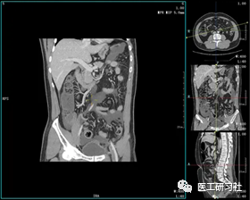

多平面重建MPR(来自互联网)

值得一提的是，随着计算机视觉技术的发展，全息成像（全局光照，Global illumination）也在日渐成为一项重要的CT成像技术。

所谓的“全息”即“全部信息”，指用投影方法记录并且再现被拍物体发出的光的全部信息。这是**一种革命性3D/4D实时渲染技术，有助于实现更逼真的CT三维重建，为医生提供更丰富更直观的解剖结构信息，给临床以更直观的视觉感受，有助于更精确诊断和更全面评估手术方案**。目前，已经有部分厂家在其64排及以上配套工作站上搭载该技术。

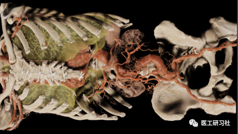

全息成像(来自互联网)

**3**

**高级应用**

这是CT最受关注的一部分，**因为64排及以上CT的时间分辨率高，可以捕捉运动器官，是心血管、体部大血管动静脉检查的重要手段**。某种程度上，我们可以说心脏成像需求驱动着CT档次的提升。

此外，64排档CT的设备也能开展能谱、灌注等功能成像，但受限于设备硬件条件（转速、探测器覆盖范围、能谱原理等），其功能成像仅仅是迈入了门槛。因此，   **即使在64排档CT上部署了这些功能，开展也是不多的。**  

比如，64排CT做全脑灌注需要穿梭扫描，和宽体不动床扫描及双源快速穿梭相比仍有不小的差距；还比如，由于64排CT能谱CT在成像原理上(如两圈扫描、双束twin beam仅支持小螺距)有局限性，能实现的功能也是仁者见仁智者见智。   **在64排CT配置能谱功能，属于“食之无味，弃之可惜”**   **。**  

**01**

**冠脉成像**

目前，**CCTA作为介入的“看门人”地位已经得到国际的公认。****在很多共识和指南中，都强调冠脉成像的基本入门条件为64排CT，且对时间分辨率有一定要求。**因此，冠脉成像及后处理能力是64排CT的主要关切点。

这一部分临床应用包括心脏分析（含钙化积分、冠脉分析、斑块分析、类IVUS、心功能）及首次通过法“心肌灌注”等。

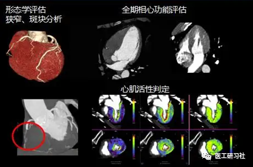

心脏分析软件包(来自互联网)

在64排、128排及以上超高端CT上，心脏功能被着重关注，但是**日常大多数的使用场景，仅存在于对钙化积分、冠脉狭窄、斑块等分析。在采购时，只要配备心脏成像软件包，上述应用就基本涵盖。**

需要说明的是，由于超声的广泛应用，如飞利浦超声的Q lab等是评价射血分数等的实时无辐射重要手段，故CT就很少开展心功能。此外，腺苷等药物对患者存在一定的危险性，多数医院为了免责也很少开展CT心肌负荷灌注，而是交给LGE-MRI等手段去评价心肌，能提供心脏解剖、功能、心肌灌注、心肌活性、室壁运动、心脏代谢和冠状动脉等信息 。

CT能量成像在心脏分析具有重要价值，比如光谱CT由于不依赖扫描前决策是否需要能谱扫描，可以回顾式地观察心肌碘图和水图，如果再增加延迟期扫描，也可以鉴别心肌水肿、陈旧梗死等。

此外，随着AI的应用，ct-FFR等冠脉辅助诊断已经较成熟，大大减轻了影像医生的工作负担。

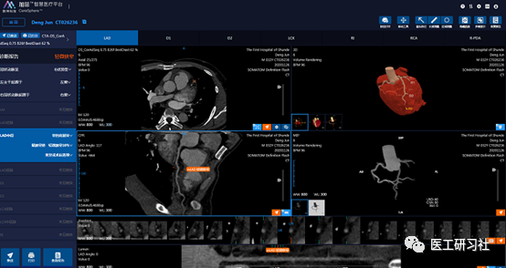

冠脉AI(来自互联网)

**02**

**其他血管成像**

**除冠脉以外的血管成像，如体部CTA以及CTV，也是CT高级应用中的重点之一，因为检查数量多、后处理耗时等，成为继冠脉成像后的第二大关切点。**因此，很多厂家都提供专业血管分析软件，甚至还细分为头颈CTA、体部CTA等软件包，在采购时需要注意不同厂家的软件条目号，例如AVA、Angio、Neck-Brain等。

**评价厂家的后处理工作站好坏，很大一部分也来自于对CTA后处理的评价，毕竟耗费了临床大量时间。**比如，飞利浦星云系列，无需减影，只需要动脉期即可以提取头颈CTA而广受好评。

此外，**AI的出现也着重解决了头颈CTA这一效率痛点，给使用者不错的体验，除一些先天畸形，变异血管AI识别还有待训练以外，绝大多数病例都可以得到快速诊断。**

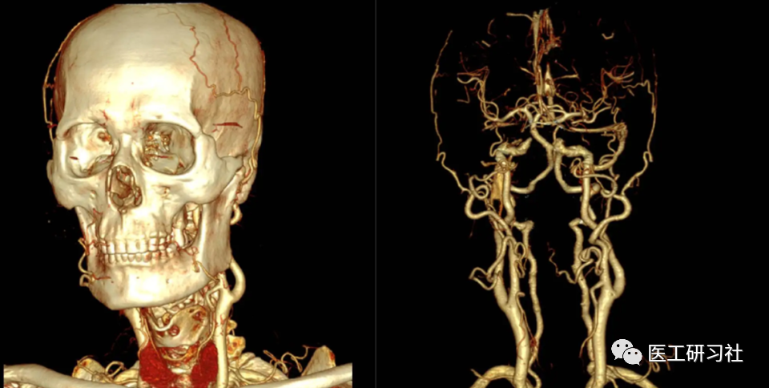

头颈CTA(来自互联网)

**03**

**肺结节和结肠等**

此外，肺结节和结肠也是比较常见的高级应用软件，经常作为单独条目出现在CT的配置文件中，主要搭载在后处理工作站上，软件条目号一般为Lung Nodule和Colon。

由于肺结节诊断更依赖医生对于轴位图像的观察，结节分析（提供倍增时间曲线）需要随访载入患者不同时期影像，就医流程等方面存在限制。不过，   **随着肺结节、肺炎AI的引进，这类疾病的圈定和分析已经非常容易。**  

此外，结肠分析由于需要灌肠、排空、打气等，加之肠镜等手段取代，开展的越来越少。

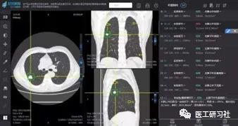

肺结节AI(来自互联网)

**4**

**超高端应用**

**由于扫描速度快、时间分辨率高、覆盖范围大，超高端CT在困难复杂心率冠脉成像、多部位联合扫描、一站式卒中、胸痛、肿瘤检查方面具备无可替代的优势。**除前文提到的冠脉分析软件包外，该档次CT还包括：

1）动态心肌灌注（Dynamic myocardial perfusion）：静息与负荷，包含扫描端序列选件Dynamic myocardial scan；

2）一站式检查、TAVR、可变速扫描、多模式快速切换、炫速4D等多部位检查扫描方法选件；

3）高端能谱检查方法与后处理软件；

4）其他独家应用

其中，动态心肌灌注一般比较少选择（上一章已说明）。不过，对于一站式检查、多部位联合、大范围扫描则需要着重考察。

**01**

**一站式、灌注、多部位联合**

1）  **一站式检查，包括卒中一站式、胸痛一站式、体部肿瘤一站式检查等，可以一次扫描得到各血管形态和组织灌注信息**。以卒中一站式为例，可一次性对出血、缺血、罪犯血管、梗死区域、半暗带等进行评价。  **虽然核磁的弥散对早期缺血梗死很敏感，但由于CT的速度优势，以及卒中中心24小时待机，CT仍是急性卒中检查的首选。**

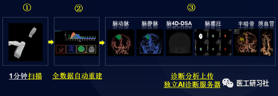

一站式卒中检查(来自互联网)

2）   **灌注**，在超高端CT上开展较多，以中枢神经灌注为例，通常是基于自身设备特性采用最大斜率法、奇异值分解SVD、SVD+等原理而研发，导致不同厂家采用的灌注原理存在差距，CBV、CBF、MTT、TTP、delay time等参数计算也没有统一标准。   **导致图像的迁移性并不好，即A的图像在B的工作站上未必可以完全识别**。近年来，又出现了贝叶斯算法灌注。因此，   **灌注非常考验各厂家的“功力”，采购时不能仅停留在“有没有”，也要考察“好不好”。**  

3）**多部位联合、大范围扫描**，如今临床上对于大范围多部位的联合检查需求越来越高，比如心脑联扫、头颈+脑灌注、TAVR等。各厂家会根据机器硬件特点（宽体、双源等）配置不同扫描选件，比如西门子的Dynamic 4D，佳能的vHP可变速扫描，GE的多模式快速切换等，均旨在一次注射对比剂实现多部位的成像。

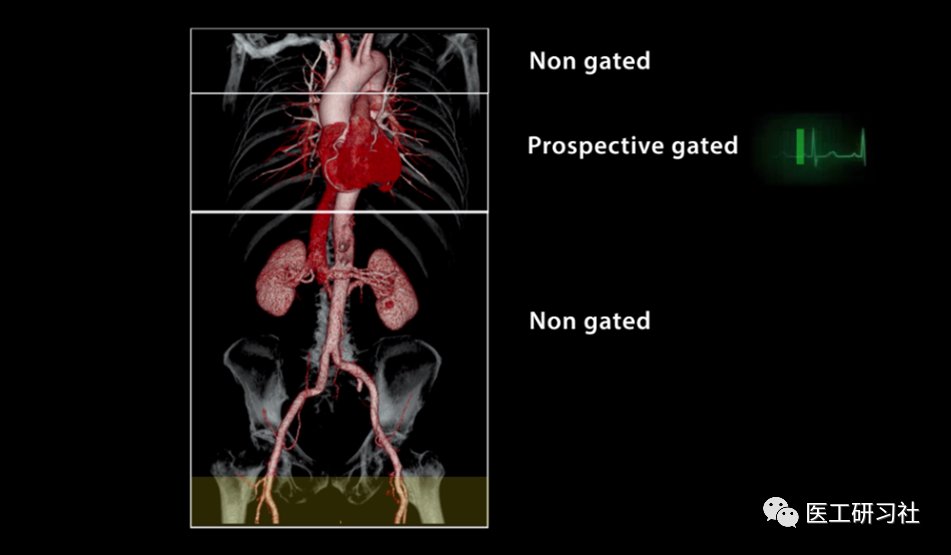

可变速扫描-胸痛三联征(来自互联网)

**01**

**CT能量成像（能谱成像）**

**在超高端CT领域， CT能量成像是超级重点之一，因为超高端CT的能谱实现方案更为容易，甚至可以和灌注等功能成像结合。**

**目前，**   **能谱CT的主要痛点主要在开展的难易程度和收费问题，而双层光谱CT与光子计数CT解决了第一个问题**。因为，他们开创了“非耗时协议”，在于不改变既往工作流程，能从任何常规CT扫描中获得能量成像数据，大大降低了CT能量成像的可及性难度，使能量成像能随时随地应用于全身。

关于能谱应用，目前已有很多比较成熟的应用，如结石分析、痛风分析、钙化斑块分析等。不过，上述应用其实是将能谱成像应用在不同部位的进行描述方法而已。

实际上，**我们更需要关心能谱成像的底层技术**，如单能级图MonoE keV（包含能级数）、能谱碘图、物质基图、能谱曲线、虚拟平扫、有效原子序数等。在临床应用中，是将上述技术有机结合进不同检查，从而形成了各部位的具体应用。此外，我们要考察**能谱的成像速度，后处理方便程度**等。

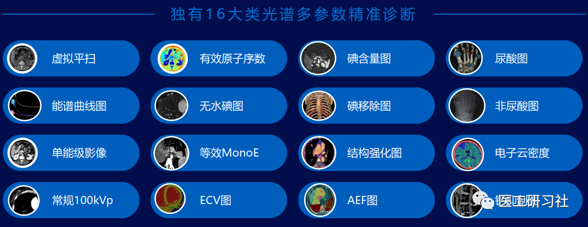

光谱CT的16个多参数技术(来自互联网)

**03**

**独家应用**

在超高端CT领域，已经出现宽体、双源、双层探测器、光子计数等多种CT技术路线，各厂家也有自己独特的软硬件配置。如GE的多模式快速切换联合扫描平台、GSI Pulmonary Perfusion能谱肺灌注等，西门子的Direct DE Angio双能血管减影、开源工作站等，飞利浦的光谱SBI数据包及各种光谱后处理工具，佳能的vHP可变速扫描以及  SURE  Subtraction家族（柔性彩色成像、冠脉减影等）。

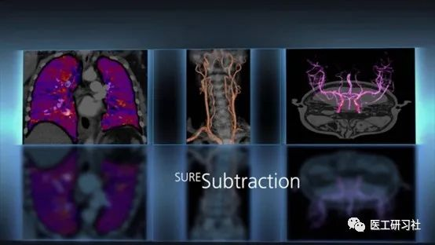

佳能CT柔性彩色成像(来自互联网)

**5**

**小结**

本文简要介绍了日常工作中出场率高、满足各种临床需求的应用软件，完全可以满足每天的海量平扫，部分多期增强，CTA（含CCTA）、灌注等临床工作。

如今，我们已很习惯于“专机专用”，**当我们配置CT时，我们一定考虑拿这台机器做什么？是否需要开展高级检查？是否需要特殊科研支持？这决定了设备档次，也就决定了软硬件配置**。。。

END