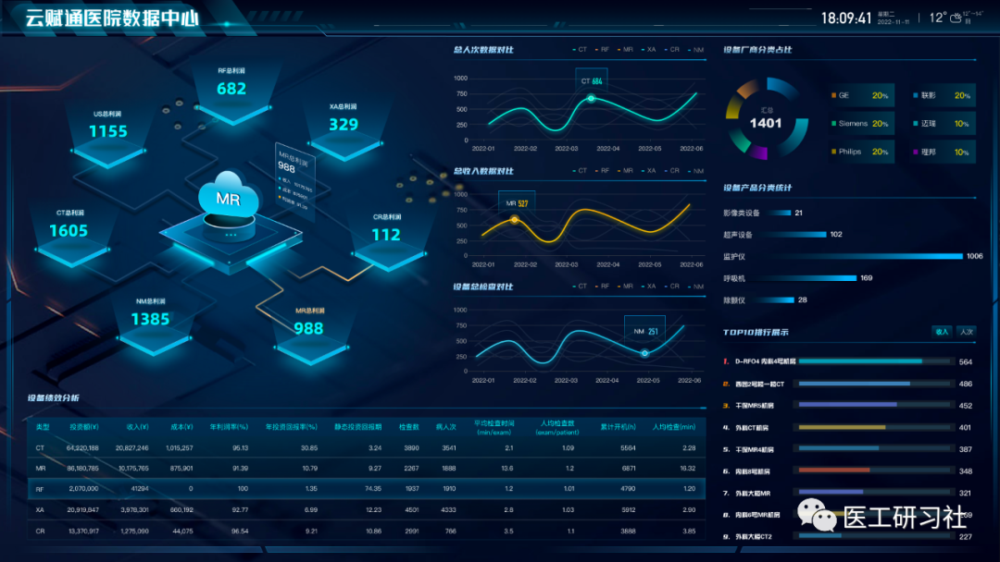

导语  

大型医疗设备管理比你以为的重要的多。“拆解”系列是第9期：售后服务篇，讨论进院前的讨价还价，以及进院后的使用管理。

“读懂CT篇”系列即将完成，后续还会完成“读懂MR篇”、“读懂PET篇”、“读懂DSA篇”、“读懂DR篇”、“读懂US篇”、“读懂LA篇”等等。**不过，“售后服务”只有这一篇，因为在**决策、使用和管理中所有重点设备是相通的。

不管大三甲、还是县级医院，当采购设备时，你是毋庸置疑的甲方，拥有N个选择。不过，一旦设备验收完成，医院会遇到很多事儿，比如，如何有效使用，如何维修管理，如何评价效益，这都是医院管理部门和临床科室要共同思考的问题。

比如，在实际工作中，我们经常听到三种声音：

1）某医院领导说，   我们要精细化管理，放射科设备到底使用率如何，效益怎么样？

2）某医院放射科说，我们今年保修费1000多万，竟然比全科奖金还高，能不能想办法省点钱？

3）某医院设备科说，我们医院大设备全都保修了，临床也不太找我们，真挺省心的。

这三种声音，本质上是**科学决策、维护成本、管理逻辑**的问题，我们要在采购时解决一部分问题，使用时解决一部分问题，管理时解决一部分，不让问题主动找上门。

**1、****采购时：重点设备多保修**

众所周知，放射科是医院最烧钱的科室，其维保成本占据全院总维保支出60~80%，常年居高不下原因有很多，但最重要的大型医疗设备几乎没有替代，99%的医院根本停不起。**我们始终坚持不要一味省钱，而是在不保障临床的前提下省钱。**

比如，某医院CT高压发生器故障，医院自修历时月余成功。这在99.99%医院是不可能的。别说停1个月，停1星期都几乎不可能，这样的省钱没有意义。不过，我们可以从其他方面下手。 比如，一台大型医疗设备的寿命通常在10-15年，对医院来说，采购时谈保修是最佳谈判时机，也是唯一比较有话语权的时候。也许有的医院会说：“不会呀，后期谈保修时我们也有多个选择，也很强势啊”。 不，那是你以为的强势，售后服务看似也有多个选择，但   **本质上只有“原厂”和“第三方”，而且绝大部分时候原厂比第三方好太多，所以“售后服务”一定程度上是卖家市场。**   因此，考虑到医学影像设备维保成本比较高，为防止出现“买得起、用不起”情况， 必须要在采购时把部分问题考虑进去，其中最要的就是保修时间和出保后保修价格。

**3年保修**

根据国家要求，[公立医院](https://zk.cn-healthcare.com/doc-show-59649.html)配置设备严格执行预算采购，   **在保证配置所需档次机型和软硬件的前提下，预算内应尽可能提高保修时限，这已成为整个行业的共识**，因为这无论对医院还是厂家均是双赢。 对医院来说，很多时候，我们会发现   **采购时谈的保修合同比后续单独购买的保修便宜很多，30%、50%都有可能**。 对厂家来说，医院第2-5年的维保合同是最难签的，一方面   **医院管理部门是真的想省这笔巨款，另一方面原厂在很多省份都面临激烈的第三方竞争**，尽管合同金额有一定缩水，但成本也低得多。 需要说明的是，如果有条件建议长期保修CT，因为很多时候CT球管尤其是高端CT球管只有原厂才有，且大部分基本上每年换1个，不得不保修。   **除CT外的其他设备，建议实际情况具体把握，全保或全不保，都不是好的选择。**  

**保修限价**

有时，医院配置所需档次机型和配置后，确实没有足够预算配置3年保修。对此类情况(其实是不管任何情况)，务必谈好保修限价，即出保后保修费不超过多少钱。 通常来说，   **出保后保修费是不超过整机的10%左右，不同设备略有差别**，情况具体讨论。此时，我们需要注意两个问题：

1）   **原厂保修分为技术保、金保、白金保，同时将三种保费记录在合同中**。比如，CT白金保通常包含不限次数球管更换，磁共振白金保通常包含磁体、液氦和外设。

**一般来说，不建议技术保，90%情况电话支持能解决；磁共振建议金保，磁体坏的可能性几乎为零；CT要白金保，千万不要在球管计较。**  

2）**要在合同中体现“不能限制连续保修”，即医院需要保修的时候再保修**。不要担心厂家不愿意，肯认真谈保费，就意味着很多。

**2、****使用时：管理和评价是必须的**

为促进医院实现高质量发展，国家卫生健康委于印发了《三级医院评审标准（2020年版）》，其第二部"医疗服务能力与质量安全监测数据”第五章第158条：**根据医院功能定位和发展规划，有大型医用设备使用、功能开发、社会效益、 成本效益等分析评价。**

关于评价大型医疗设备，我们认为应该从两个方面进行：

1）**是否为医院带来一定社会效益，即能满足临床诊断和科研需求**。满足临床需求是第一位的，可以从使用率量化评价，在正常临床排班下如果设备使用率未达到90%，可认为是满足临床需求的。此外，还可以将基于该设备产生的课题、论文，作为评价社会效益的重要指标。

2）**是否为医院带来一定经济效益**。很多医院评价大型设备的方法是单机效益分析，也作为后续科学决策的依据，但其实单机效益分析是个伪命题，更合理的评价方法是单类效益分析，即一个科室的一类设备综合讨论。因为，临床有权决定如何使用，专机专用才更高效，精确到单台不如   综合评价更有实际意义。比如，通过某类设备的开机率、检查人数(扫描部位数)、扫描量分布、扫描时间分布实现临床精细化管理，再配合HIS收费、运行成本等数据，可实现精确效益分析。 在大型医疗设备的精细化管理方面，确实要必须依靠软件才能实现，目前具备类似功能的并不多，根据实际体验，比较有实际使用价值的是云赋通的“云探医联”，准确率不错。

云赋通“云探医联”截图

**3、****维修时：原厂为主，三方为辅**

如果您是设备科一员，会发现很多设备中小型医疗设备其实只有原厂在服务，医院根本没得选。这并不是垄断，而是根本不赚钱，其售后主要是为了做好服务并维护渠道。不过，影像、放疗、内镜等领域设备存在大量第三方，很明显是因为售后服务具有高附加值。

毋庸置疑，售后服务一定是原厂的好。原厂保修缺点只有一个，但是优点却有很多：

**1）解决问题速度快；**

**2）备件到场快，且只换不修；**

**3）有“兜底”能力；**

**4）规范，有安全感。**

上述几点均击中医院要害，很难想象哪家医院的大型医疗设备停几天，这也就是为什么很多大医院的CT/MR都选择原厂保修，效率确实高，服务确实好，而且在医院迎接检查时能及时提供所有维修和保养记录。

原厂保修，自然价值不菲。尽管前几年，随着国家降低医疗设备检查收费时，原厂也在与时俱进降低维保费，但依然很贵。因此，医院如果没那么急，优秀的第三方其实也是非常好的选择。不过，**目前第三方市场存在严重良莠不齐的现象，我们要选择优秀的第三方，而不是价格低的第三方。** 

目前来看，选择原厂还是第三方主要看医院经济条件，比如江苏、浙江、上海等发达省市比较倾向原厂，江西、湖南、广东等省份比较倾向第三方。据调研，部分第三方也获得了医院的认可。

**无论选择原厂还是优秀的三方，只要医院做好监管和验收工作，我们都认为是很好的选择。这时候，就体现出医院必须要有“懂行”的自己人。**

**4、****任何时：必须要有自己人**

近年来，在部分省份兴起了医院整体托管，医院“设备管理部门”变成“专职采购部门”。其实，只要托管方认真服务，应该是没有问题的。不过，这样少则5年多则10年就会彻底被“外人”控制，再想拿回来必须要花更多时间，因为人才断层已经形成。

也许您会说，我们可以定期换托管方，那样会更糟糕，根本不可能保证医院平稳运行。无论托管与否，医院都要需要自己人。 也许您会问，又不能省钱，又要发工资，为什么还要自己人？ 首先，   **从学科发展角度**，任何学科发展都要靠一代代人努力，医疗设备管理所对应的“生物医学工程”专业自然也不例外，   **从全国范围来看，临床医学工程在很多省份已经被充分认可并拥有一定地位。**   其次，   **从医院招采角度**，如今政府采购都在谈采管分离，即采购监管与执行职能相分离。   **没有管理部门，采购部门就没有“眼睛”，采也采不好，管也管不好**； 再次，   **从维护医院角度**，   **只有自己人才会真正为医院省钱，并凭借专业判断时刻维护医院利益**。比如，很多时候，自己人能快速解决或者在原厂指导下解决，能大幅减少停机时间，变相创造效益；比如，并不是所有重点设备都必须要保修，可根据设备情况判断是否要保修、何时需要保修，以最大程度解决维保经费；

最后，无论何时，永远都要优先相信自己人。**任何事儿，只要有心、有脑、有眼、有手就一定能做好，高手在民间**。

END