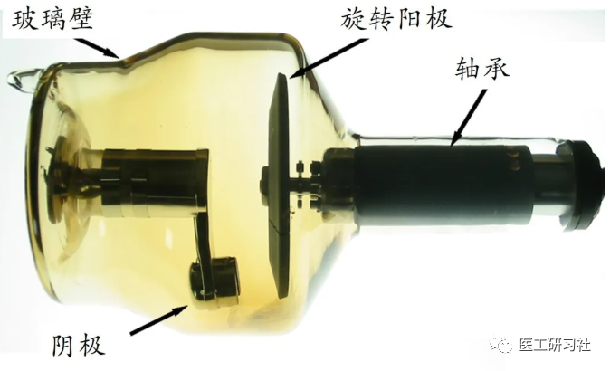
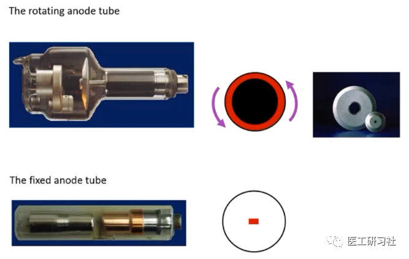
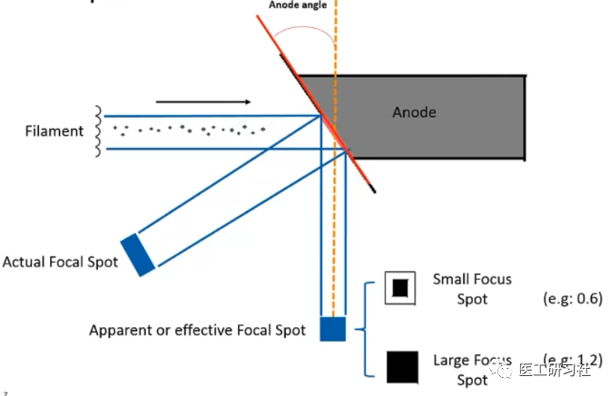
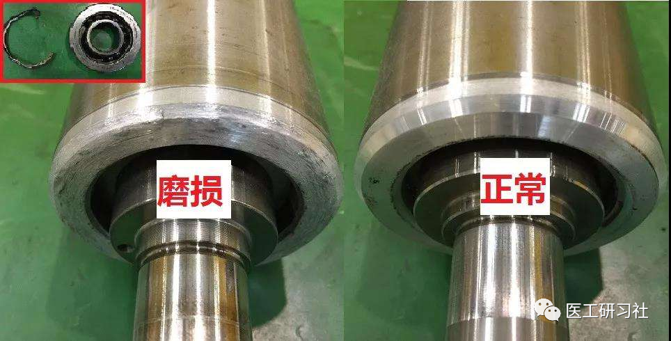
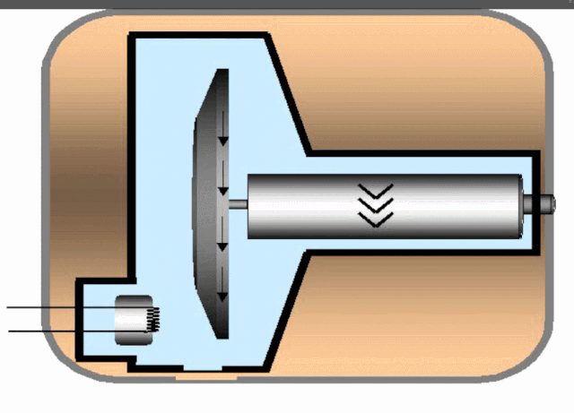
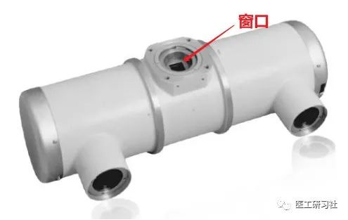

**本文来源：医工研习社**

**原标题为《球管，看这篇就够了(上)》**

**本次转载已获授权，如进行二次转载请与原始平台联系。**

  

导语

  

影像设备界有两大著名的“耗材”，分别是MR的冷头和CT的球管。

  

但冷头并不是耗材，4K冷头由Sumitomo(日本住友)垄断，全世界MR都用，无意外5年没问题。

  

球管可就不一样了，不同厂家的CT球管差别巨大，曝光30万秒和300万秒能一样吗？

  

  

球管，其实就是一个被保护得巨好的大灯泡所发出的不可见光——X射线。

  

修？换灯泡而已，玻璃管还能修修，金属管就没辙了。

  

不用修，得会选啊。

  

所以，得知道球管的结构、参数、主流技术等……

  

球管的基本结构

  

  

  

经典的产生X射线的三个必备条件：  

*   阴极灯丝加热产生的电子，在灯丝周围形成空间电荷，即电子云；
    

*   在高kV所产生的电场和真空条件下产生高速电子流；
    

*   阻止高速电子的金属阳极靶面。
    

  

提取关键词：**阴极、真空、阳极靶**，这就构成了球管的基本结构，一般叫**管芯**。

  

为啥没有高kV呢？灯泡嘛，电肯定外部供给，称之为高压发生器，提供40-150kV的高压，通过两根高压电缆传递给球管的阴阳两极。kV与本文无关，PASS！

  

  

**01**

 **阴 极**

  

阴极由灯丝、聚焦罩、阴极套和玻璃柱芯组成，其作用是发射电子，并聚焦高速电子束，使电子束具有一定的形状、大小轰击靶面而产生具有焦点的X射线。灯丝电压一般是50-10V/50HZ，灯丝电流2-12A。

  

  

灯丝，必然会断。为了提高X线管的使用效率，绝大多数球管的阴极都是2根灯丝，即**双焦点**。长的为大焦点；短的是小焦点。

  

虽然叫焦点，但不是点，而是**矩形块**。

  

这么标准的矩形块就是由聚焦罩产生的。你想啊，灯丝溢出的电子哪能这么听话，肯定导出乱飞，打到玻璃壳上就会造成球管的损坏，聚焦罩是铁镍合金制成的矩形槽，使电子进行聚焦。这出来的焦点，我们称之为实际焦点。

  

**02**

**阳 极**

  

球管给不给力，全靠阳极。

  

有两种阳极：**固定阳极**和**旋转阳极**。

  

固定阳极，就是阳极不动，高速电子流总是逮着靶面一个地方撞击，瞬时负载功率太大。这哪受得了，时间一长球管太容易废了。

  

因此，现在固定阳极用的太少了，也就骨科C臂机会用。

  

  

旋转阳极就不一样了，阳极靶高速旋转，高速电子轰击产生的热量被均匀分布在圆环上，单位面积的热量也就大大减少，从而提高球管的功率。

  

旋转阳极主要由**靶面、转子、轴承**和其他部件组成。

  

**靶面：**接受电子轰击，将热量散发出去，并通过一定的靶角将X射线反射出去。辐射出去的矩形块，称之为有效焦点。在要求有效焦点一定的情况下，靶角越小，实际焦点越大，越不利于靶面散热。因此靶角一般为6°-17.5°。阳极靶要求热容量大，抗热膨胀性好，一般用石墨基铼钨合金做靶面。

  

  

**转子：**转子就是带阳极靶转动的，是通过在转子周围加旋转磁场实现的。

  

一般旋阳X线管用于透视时可不需要转动，但用于摄影时必须转动至额定转速后才能在阴阳极之间加高压， 否则大量电子轰击在靶面上，会引起靶面损坏。

  

根据转速将球管分为高速管和低速管，**3000r/min左右的是低速管，大于8500的是高速管**。高速管当然比低速管强。

  

通常曝光手闸分为两档，一般第一档旋阳启动，第二档加高压曝光。因此，测试球管的旋阳好不好，按一下曝光手闸的1档听球管的声音即可。通常说的旋阳卡死了，就是转子不转了，为什么不转呢？多数都是轴承磨损了。

  

  

**轴承：**支撑转子旋转的，降低其运动过程中的摩擦系数。

  

阳极产生的热量主要通过热辐射散热，效率低。连续曝光后阳极靶温度急剧上升，导致轴承温度升高。因此，为防止过多的热量传导到轴承导致其损坏，通常把轴承外径做得比较细，以减少热传导。

  

  

  

**03**

**玻璃壳**

  

球管要求一定的真空度，因此一般将阴极、阳极和轴承封装在玻璃壳中。通常采用采用熔点高、绝缘强度大、膨胀系数小的钼玻璃制成，以避免因温度变化使玻璃破裂或漏气。

  

X射线管内的真空度应保持在133.322×10\-7Pa(10\-7mmHg)以下，以保证灯丝的正常加热和电子飞向阳极的速度。

  

以上三者就构成一只完整的管芯。

  

**04**

**管 套**

  

管套是封装球管的专门容器，里面充满高压绝缘油，只留窗口用于出射线。管套的作用是：

*   保护管芯；
    

*   减少散溢射线；
    

*   为高压提供安全保障；
    

*   让球管产生的热量有效散出。
    

  

阳极散热就俩途径：

*   热传导，阳极靶-轴承-玻璃壳-油；
    

*   热辐射，阳极靶--玻璃壳-油。
    

反正全指望油。

  

**（未完待续）**

  

END

  

**【器械汇历史文章链接】**

  

[**市场份额50%，业绩增长6%！CT球管独立制造商万睿视：一家从不越界的幕后巨擘**](http://mp.weixin.qq.com/s?__biz=MzA3MzgwNDYxNg==&mid=2247485642&idx=1&sn=420dbbadbd56d61b106cef406fb9a753&chksm=9f0836eda87fbffba23de6901039a1b584567ece621cb6eb1846fb4006a449982f85b3406806&scene=21#wechat_redirect)  

  

[**轻盘点︱当立、万睿视、瑞能……细数全球六大CT球管独立制造商**](http://mp.weixin.qq.com/s?__biz=MzA3MzgwNDYxNg==&mid=2247484742&idx=1&sn=755194db82f288cdd43e877b9e9fbfae&chksm=9f083b61a87fb2775cf42068d348e7c8057bd9b1edab35e1f0b48c13458deacb3d5ed7866af3&scene=21#wechat_redirect)  

  

[**如今只知道GE、飞利浦、西门子，你们还记得爱尔森、皮克、马可尼吗？——细数CT品牌变迁史**](http://mp.weixin.qq.com/s?__biz=MzA3MzgwNDYxNg==&mid=2247483773&idx=1&sn=e6dccd739ccbd0bb1e0ef20081d1c0f9&chksm=9f083f5aa87fb64ca91cec0677394bf6b913961321b5168648e32ba9eb803f32cab16605167f&scene=21#wechat_redirect)