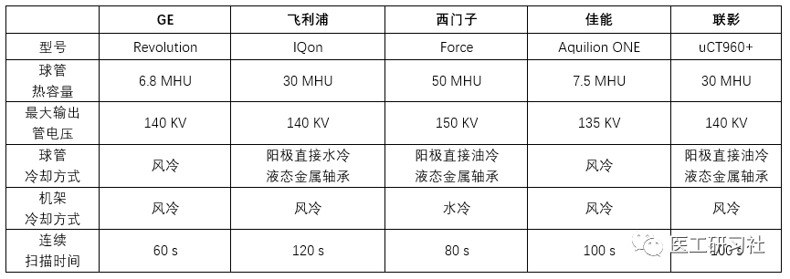

**本文来源：医工研习社**

**原标题为《球管，看这篇就够了(下)：终极技术篇》**

**本次转载已获授权，如进行二次转载请与原始平台联系。**

  

导语

  

作为“球管”终结篇，当然是要炸场的。咱们不吹不黑的聊一聊，这些年厂家们为提高球管寿命做了哪些努力。

1台CT，如果满分10分，球管至少占3分。

  

所以——
如果你是医院的，一定看，也许这篇文章值100万！
如果你是第三方，快来看，能不能挣钱和球管很有关系！
如果你是厂家的，建议看，对手们真的在努力提高球管品质！

  
**温馨提醒：**

1) 为跟上节奏，请一定要看前两篇：

[CT球管技术详解（结构篇）](http://mp.weixin.qq.com/s?__biz=MzA3MzgwNDYxNg==&mid=2247486139&idx=1&sn=523896adff9fed730a0cb40b859872d9&chksm=9f08349ca87fbd8afe9f57eca2eb380cdcb382903b4fc4b32fbb30aeee022c4de18174db5dc7&scene=21#wechat_redirect)

  

[球管，看这篇就够了(中)：参数篇](https://mp.weixin.qq.com/s?__biz=MzU5MDU1NTMzOQ==&mid=2247483873&idx=1&sn=7390b0928a98e4ff64b89ee4e18f1726&scene=21#wechat_redirect)

【↑↑↑ 中篇为付费文章(3.00元)，无法转载，请大家前往原文链接阅读】

  
2) 本文只介绍CT球管，不是差别对待，而是CT球管才是球管中的王者。所有的新技术都是率先应用在CT球管上。出于成本考虑，有些技术可能永远不会用到普通X线球管上！

  

  

正式开讲之前，先来看一下医院CT出保后的场景：

**1）如果球管好——**
*   医院：不怕，球管皮实，保修拖一拖，先省几十万，有问题再说；
*   厂家/第三方：不怕，就算球管皮实，其他配件总会坏吧。亏是不可能的，这辈子都不会亏。

结果：医院省了钱，厂家/第三方赚了钱，双赢。

  

**2）如果球管不好——**

*   医院：我X，赶紧保修，万一球管坏了，不好议价了；
*   厂家/第三方：我X，又坏了，当初就不该同意降低保费。

结果：医院肯定不高兴，厂家/第三方也许不高兴。

那，谁高兴呢？

你猜这些球管是谁造的？

以上场景纯属意淫，如有雷同，就当巧合。

  

球管，作为X射线设备中的顶级工艺，所有厂家都想征服它，为什么我敢这么说？请看下表：

  

  

球管的技术

那些顶级CT厂家们 ，在提升球管寿命的道路上乐此不疲，且听我一一道来。

  

**01**

**金属陶瓷管**

  

从上篇可知，限制球管负荷能力的因素之一是灯丝的最高"安全"温度，该温度不仅与灯丝的熔点有关，也与钨丝的蒸发程度有关。

  

因此，为防止灯丝在高温下的氧化升华，管芯要求抽真空，但玻璃管材料的密封性能有限，钨丝蒸发不仅能使灯丝变细，影响管电流；更会导致管芯玻璃壳内表面上形成薄薄的钨层。高速电子流再次轰击阳极时，薄钨层容易导致管芯打火而导致玻璃管的真空度下降，继而可能损坏管芯。

  

金属陶瓷球管是用金属外壳代替玻璃外壳，一来加大外壳强度；二来金属的真空密封性能更好。打个比方，类似于玻璃内胆热水瓶和金属内胆保温瓶的保温效果差异。金属壳接地可以捕获杂散电子，能有效避免打火及裂纹产生。同时，用陶瓷作电极支座，可以提高绝缘性能。因此，金属管不仅有更长的寿命，还可将灯丝加热到较高温度，以提高球管的负荷。

  

犀利点评：这根本不算啥新技术了，N早以前就各厂家就用上金属芯了。

  

**▲ 图1  左、中为玻璃管芯，右为金属管芯**

  

**02**

**液态金属轴承**

  

从上篇我们知道，传统的CT球管的阳极基本上都是机械滚珠轴承的，负责支撑转子以及传导阳极靶热，如图2。

  

**▲ 图2 机械滚珠轴承球管**

  

为提高阳极靶的散热率，阳极转速越来越快。但有两个问题：
*   1万转的滚珠轴承，已接近物理极限，很难再提高；
*   转速越快，轴承部分产生的热量越来越高，噪音也跟着增加，轴承的磨损也随之加剧。因此，很多球管故障并不是灯丝断了，而是阳极卡死，或者转速不达标，导致无法曝光。  
 
怎么办呢？

  

液态金属轴承出现了！

  

液态金属，一般指的是常温下是液体的低熔点合金。大家第一个想到液态金属肯定是水银，但是水银毒性太强，不能用。因此，液态金属一般是镓、铟或锡的合金。

<video src="vx_attachments/733114254089/yetaijinshu.mp4" position= "absolute" width="100%" height="100%" controls="controls"></video>
  

液态金属轴承是在转子和轴承之间缝隙填充液态金属，取代钢珠，从滚动轴承变成滑动轴承。两个特点导致其秒杀滚珠轴承：  

  

*   高散热率。液态金属的导热率可达100W/m·K级别，很好，但这不是最重要的。与机械轴承通过仅仅滚珠支撑转子和轴承不同，液态金属能够紧密地填充转子和轴承之间缝隙，增加热传导面积，实现360度全方位散热，热传导率可达滚轴轴承的1000倍。
    

  

*   零磨损零震动。阳极转动时，由于没有金属表面的接触，噪音、摩擦、振动及热量都比传动的滚珠轴承少很多。液态金属滑动轴承几乎无摩擦式工作，理论上，液态金属轴承的寿命应该是无限长的；实际上，液态金属轴承的使用寿命也可达到滚珠轴承的数倍。
    
      
    

**▲ 图3 机械滚珠轴承和液态金属轴承对比**

  

犀利点评：液态金属轴承应该算这些年最最最非常牛X的球管技术了，可以说是革命性的。

  

为写此文，专门查了相关专利，西门子和飞利浦最早使用了该技术，西门子应该更早一些，1996年就申请了专利，然后2001年是飞利浦，2011年是GE。我国影像设备厂家联影和CT球管生产商珠海瑞能也申请了相关专利。液态金属轴承技术的普及会大大提高球管的平均寿命。

  

为什么说是平均寿命呢？

  

举个众所周知的栗子，某品牌(不说坏话)的机械承轴球管寿命很少超过40万秒，有时20万秒就熄火了，运气差一年2、3个是正常的。而该品牌的液态金属轴承球管，寿命能达到60-80万秒，运气好能上100万秒。据了解，确实发生过100万秒+的情况。

  

100万秒对该公司的球管来说，应该很好了，反正我是惊呆了，必须点赞。(客观地说，无论从临床使用还是工程师角度，该品牌CT都是不错的，唯独球管是其阿喀琉斯之踵。）

  

但是，对飞利浦的液态金属轴承球管来说，100万秒最多刚及格。以经典的飞利浦MRC800为例，该球管的寿命通常在200万秒左右，300、400万并不是梦！

  

**▲ 图4 传奇的MRC800**

  

液态金属轴承球管就够了吗？

  

创新，永不止步！

  

**03**

**阳极直接冷却**

  

从中篇我们知道，球管有两个重要的指标：热容量和阳极最大冷却率。

  

传统X线管的阳极和轴承被封装在真空中，外面的冷却液无法将热量带出，通过热辐射散热，辅以和阳极连接的固定轴进行热传导。尽管液态金属轴承球管非常优秀，但是依然隔着那层真空金属管，冷却效率依然不高。

  

因此，想让球管更耐用——

*   要么增加阳极靶尺寸以提高热容量；
    

*   要么改便散热方式，提高阳极最大冷却率。  
    

  

两位狠人，分别带着两种技术又来了！

  

**⒈阳极直接油冷**  

  

该技术可能很多人比较陌生，但提起西门子的“0兆球管”，想必影像圈及医工圈无人不晓。

  

首先，0兆球管的实际热容量确实比较小，约为0.6MHu。如果是普通球管，这么小的热容量是连一次常规扫描都无法完成的（请看中篇）。硬扫？不给！直接爆给你看！  

  

这哥们不仅不普通，还很激进！

  

0兆球管，通过阳极直接油冷，使球管阳极冷却率和产热率几乎相等，即使在最大负荷条件下，球管仍可以及时冷却下来，远远少于进行下次操作所需要的时间。球管始终不会热保护。因此，也就不需要大热容量的球管。

  

阳极直接油冷的实现原理，感兴趣的可以读一下专利“High performance anode plate for a direct cooled rotary tube”。没时间的就听我唠唠，总结起来就一句话：球管阳极和阴极一起固定在转子上，阳极轴承和阳极靶面一侧直接浸泡在冷却油里。球管工作时，不再是只有阳极旋转，而是在马达的带动下整个球管在旋转。由于单侧阳极靶阳极直接与冷却油接触，散热面积足够大，极易散热，热量来多少散多少，不存热，有点像“竹筒倒豆子”——直来直去。

  

**▲ 图5 传统球管与0兆球管散热原理对比**

  

按照传统球管热容量计算方法换算，“0兆球管”的热容量可达到30MHu；后续有改进款，二代的等效热容量更是达到了50MHu。

  

那，为啥说它激进呢？

  

栗子又来了，如果将球管比作水库(如图6)，一般球管进水快，出水慢，没办法，必须蓄水。为了让水库蓄水能力更强，需要大水池；而“0兆球管”进水快，出水也快，几乎不需要蓄水，只需要小蓄水池。

  

这就是为啥只有0.6MHu热容量的原因。

  

**▲ 图6 普通球管和0兆球管对比**

  

0.6MHu，意味着阳极靶会更小，意味着球管可以更小！

  

****

**▲ 图7  0兆球管**

  

球管小，意味着机架空间更足。

  

于是，“天才”的双源CT出现了！

  

这是后话了，有机会再说。

  

**⒉阳极直接水冷**  

  

先介绍一个初中物理概念——比热容。

  

比热容，是热力学中常用的一个物理量，用来表示物质吸热或散热本领。比热容越大，物质的吸热或散热能力越强。

  

水的比热容当然比油大，为提高散热效率，油冷变水冷，这就是阳极直接水冷思路。原理很简单：

*   管壳里的绝缘油换成水；
    

*   将阳极靶的固定轴做成中空的，与管壳中的水循环散热。
    
      
    

**▲ 图8 阳极水冷示意图**

  

但是有两个问题：

*   水不是绝缘油，它可以导电。管芯和管壳充满水，一旦管芯打火，那还得了？  
    

*   阳极旋转时，中空的轴强度降低，阳极靶容易产生轻微摆动。  
    

  

飞利浦的解决方法很聪明：

*   **单极高压。**管芯阳极和管壳接地，阴极接负高压(-140KV)。阳极和管壳接地了，两者等电势了，是水是油也就无所谓了；另外多说一句，无论水冷油冷，单极高压是金属管芯稳定及发展的必然。
    

*   **双轴承。**通常球管是阳极靶带着轴承，长得像个蘑菇。为了使阳极旋转时不发生轻微摆动，采用双轴承。不过，与其说“双轴承”，更合理的说法似乎是“长轴承”，轴承的两头固定在管芯金属外壳上，阳极靶在中间。这样转，自然更稳定。而且，更容易提高旋转阳极的转速。
    
      
    

**▲ 图9 iMRC结构图**

  

以上就是飞利浦iMRC冰球管的阳极直冷技术。

  

此外，iMRC还有其他技术，也一定程度上提升了球管寿命，具有借鉴意义：

*   **节段阳极：**将阳极靶面切割为多个节段，减少热涨冷缩，解决了传统靶面对单位面积高热量聚集容易导致阳极变形、龟裂的问题，提高了球管的使用寿命。
    

*   **平板阴极：**球管的阴极从传统的“灯丝”升级为“灯片”，使阴极电子的发射更稳定，提高射线质量。更重要的是，阴极寿命更长(我估计“灯片”永远不会断，怎么想出来的)。
    
      
    

  

犀利点评：与西门子的小球管直冷不同，飞利浦采用的是大球管直冷。

  

从技术上讲，飞利浦属于细水长流型，西门子属于一步到位型，后者更变态一些，这也就导致了早期的“0M球管”的寿命不行，二代以后已经显著改进，越来越好。另外，小球管直接产生了双源CT，这个是划时代的。2005年，CT技术远没有现在这么先进，它第一次实现了不控制心率的心脏冠脉CT。

  

从寿命上讲，西门子的在百万秒左右；飞利浦的更长一些，正常使用3、5年不是什么事儿。

  

永远，不要和造灯泡的比“灯泡”！

  

另外，除“PS”外，联影在其高端CT上也使用了阳极直冷技术。至于怎么实现的，我也很好奇，如果联影同行看到此文，请联系我，再开一篇给小伙伴讲讲，谢谢O(∩\_∩)O~

  

**04**

**飞焦点(动态焦点)**

  

该技术和提高球管寿命无关，但增加采用率，大幅度提高了图像质量。

  

飞焦点的核心是，偏转线圈：

*   让焦点在X-Y平面内的偏转，提升横断位图像质量。  
    

*   让焦点在X-Z平面内的偏转，提升Z轴的图像分辨力。  
    

  

**05**

**总 结**

  

无论从重要性和价值角度，球管在X射线类设备均是核心地位。

  

重要性已说得很多了，再谈点俗气的：64排CT单价约500万，CT球管60-100万/只，使用10年的话，机械滚珠承轴球管和液态金属轴承球管的球管成本差价1000万左右，相当于医院又买了两台CT。

  

你品，你细品。

因此，把液态金属轴承作为评价依据之一，
*   对医院来说是省钱；
*   对厂家来说，是宣传点（都2020年了，液态金属轴承应该是标配）。  
    

当然，如果有阳极直冷技术，更好。

  

球管的常见故障
以下表格来自珠海瑞能官网，总结的很好，直接贴图：

**(点击图片可放大观看)**  

**（全文完）**

  

END

  

**【器械汇历史文章链接】**

  

[**如今只知道GE、飞利浦、西门子，你们还记得爱尔森、皮克、马可尼吗？——细数CT品牌变迁史**](http://mp.weixin.qq.com/s?__biz=MzA3MzgwNDYxNg==&mid=2247483773&idx=1&sn=e6dccd739ccbd0bb1e0ef20081d1c0f9&chksm=9f083f5aa87fb64ca91cec0677394bf6b913961321b5168648e32ba9eb803f32cab16605167f&scene=21#wechat_redirect)

  

[**市场份额50%，业绩增长6%！CT球管独立制造商万睿视：一家从不越界的幕后巨擘**](http://mp.weixin.qq.com/s?__biz=MzA3MzgwNDYxNg==&mid=2247485642&idx=1&sn=420dbbadbd56d61b106cef406fb9a753&chksm=9f0836eda87fbffba23de6901039a1b584567ece621cb6eb1846fb4006a449982f85b3406806&scene=21#wechat_redirect)  

  

[**最新简讯︱西门子医疗移动式CT获批FDA**](http://mp.weixin.qq.com/s?__biz=MzA3MzgwNDYxNg==&mid=2247485871&idx=1&sn=6f90348dbf2383a504c5373e8f7c6f36&chksm=9f083788a87fbe9e38c3a9e1691b3fc214d98bd6b1b6b27294adf842a635733dfff8a41bc88c&scene=21#wechat_redirect)  

  

[**轻盘点︱当立、万睿视、瑞能……细数全球六大CT球管独立制造商**](http://mp.weixin.qq.com/s?__biz=MzA3MzgwNDYxNg==&mid=2247484742&idx=1&sn=755194db82f288cdd43e877b9e9fbfae&chksm=9f083b61a87fb2775cf42068d348e7c8057bd9b1edab35e1f0b48c13458deacb3d5ed7866af3&scene=21#wechat_redirect)  

  

[**轻盘点︱已在中国上市的十大最新PET/CT**](http://mp.weixin.qq.com/s?__biz=MzA3MzgwNDYxNg==&mid=2247485743&idx=1&sn=65d5ae71f00601bc733af591c521ca5b&chksm=9f083708a87fbe1eeb5d56056932e22fec0bc4ce5a48b7fa66f60c2280d20fe0703533bd2807&scene=21#wechat_redirect)  

  

[**2020年1-4月全国公开采购CT近1000台，同比增速27.94%**](http://mp.weixin.qq.com/s?__biz=MzA3MzgwNDYxNg==&mid=2247485441&idx=1&sn=eb559b10248f3a05a3d153cc3fc17fae&chksm=9f083626a87fbf3083a0753e35fa83f3f7dd19c91ab0e450c5f829e9d960b22525f9f812bd3a&scene=21#wechat_redirect)