<h1>CT设备的基本构成</h1>
计算机断层扫描（Computed Tomography，简称CT）是一种高精度、无创的医学影像诊断技术，被广泛应用于肿瘤、神经系统、心血管、骨骼等疾病的诊断和治疗。

  

CT设备是CT技术的核心部分，由多个复杂的组件构成。其中包括X射线管、滑环、探测器、DAS、阵列处理器、高压发生器、准直器、激光定位系统及CT设备子系统等多个组成部分。

  

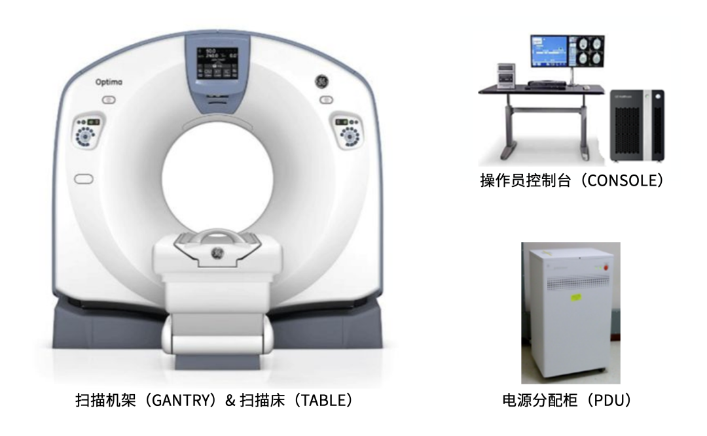

CT设备主要构成

  

**X射线管**

X射线管是CT设备的核心部件，安装固定在扫描架的旋转机架上，也常被称为“球管”。X射线管的作用是将电能转化为X射线，因此其不仅是CT设备的信号源载体，也是CT设备的“高值耗材”。

  

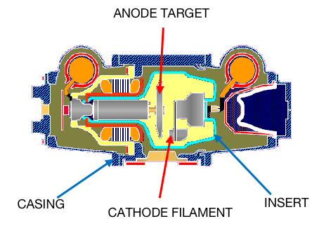

  

X射线管主要由阴极、阳极和转子组成： 

**·** 阴极-在聚焦杯中的钨灯丝(CATHODE FILAMENT)；

**·** 阳极-在X光曝光期间旋转的阳极靶面(ANODE TARGET)；

**·** 转子-旋转阳极的装置

  

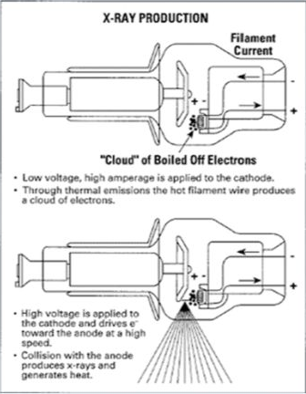

  

当将低电压电流应用于阴极时产生电子, 这会使灯丝发热并产生电子云。然后施加高电压加速电子穿过管到阳极。与阳极碰撞导致99%的热量和1%的电子转换成X射线。

  

**滑环**

滑环(Slip Ring) 在CT设备上起到了为扫描架旋转部分和静止部分的电能和信号传输架起一座桥梁的重要作用。

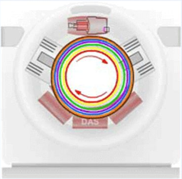

  

**·** 为旋转的机架提供动力

**·** 将信号传送到旋转的机架

**·** 获得扫描数据

**·** 机架从DAS系统接收信号的同时不停旋转

**·** 从旋转的机架传送数据到固定侧

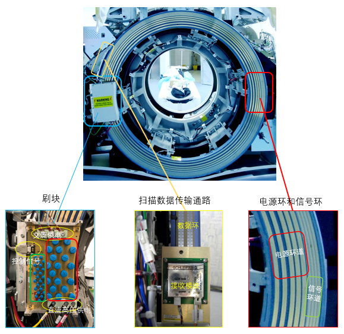

  

**探测器**

探测器的作用是把穿过人体，带有病人信息的X光信号变成电信号，并传输到数据采集系统，经过处理形成原始数据，再由计算机重建成病人的图像。

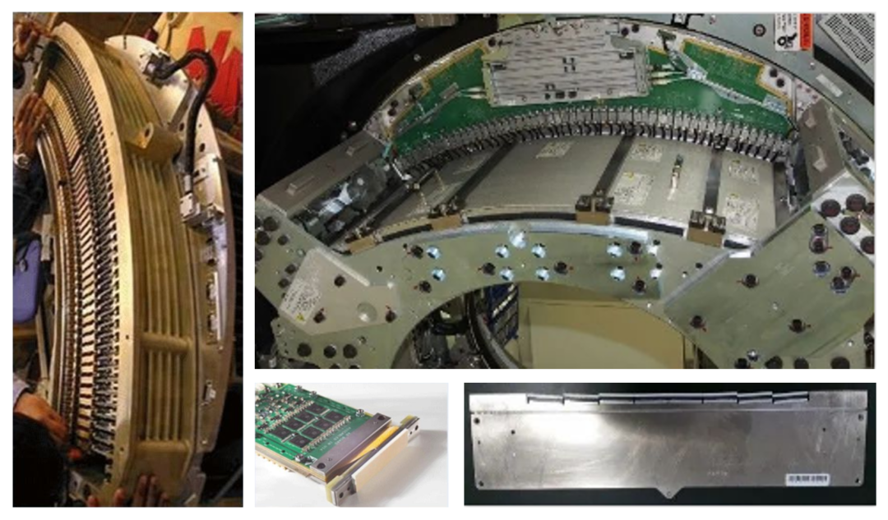

  

**·** 固定在旋转的机架上

**·** 接收穿透患者的X线

**·** 把X线转换为电子信号

**·** 电子信号的强弱依赖于X线穿过患者发生的衰减

  

  

**Data Acquisition (DAS)**

DAS是探测器的重要组成部分，通常由多个采样电路组成，用于将探测器中的模拟信号转换为数字信号，并将它们发送到计算机进行处理。

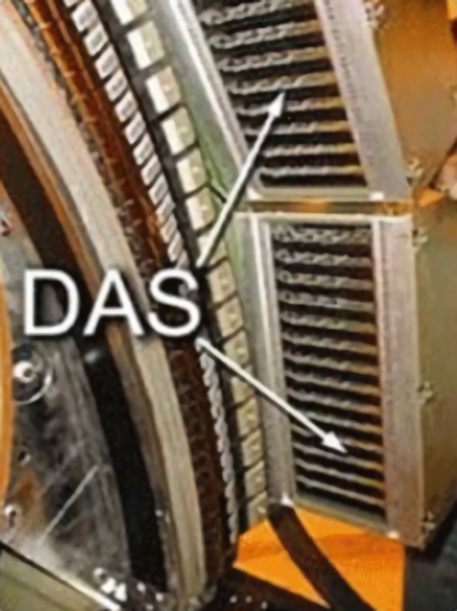

  

**·** 接收探测器的电子信号  

**·** 放大信号

**·** 把模拟信号转换为数字信号

**·** 将数字信号发送到阵列处理器

**·** 通过一系列电缆与探测器连接,在扫描过程中旋转

  

**阵列处理器**

阵列处理器接收来自DAS的数字信号并使用数学算法处理信号重建图像。对于CT扫描来说，采集快速和图像质量是至关重要的，因此阵列处理器处理数字数据和算法的能力非常关键。

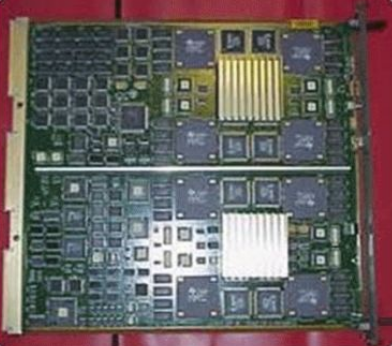

  

**高压发生器**

高压发生器位于旋转机架或独立柜上，负责控制X射线曝光的持续时间，并为X射线管提供所需的电流和电压。

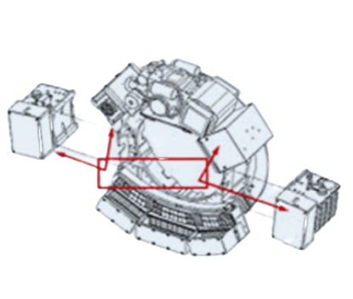

  

**准直器**

准直器是用于控制X射线束的方向和形状的装置，以确保X射线束只照射到需要成像的部位，可在提高成像质量的同时减少患者和医务人员的辐射剂量。

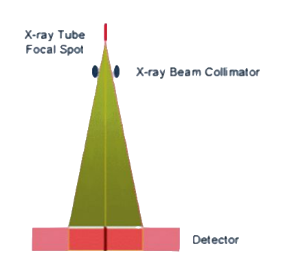

  

**患者摆位对准系统**

患者摆位对准系统位于CT设备的机架上，用于确保患者在进行CT扫描时位置的正确摆放。患者摆位对准系统会在患者身上显示对准标记，使所有扫描位置参照对准系统正确放置在扫描区域内。

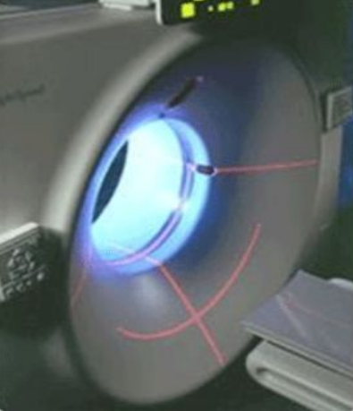

激光对准系统

  

**扫描床**

扫描床的主要作用是承载病人，功能包括床的升降与进出，完成扫描病人的位置定位。

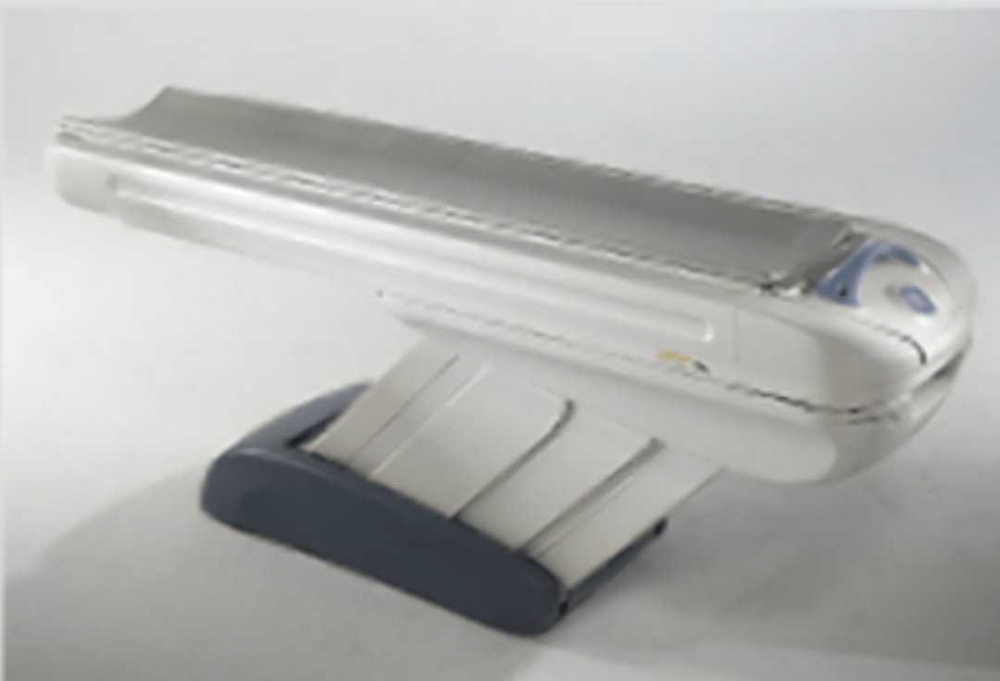

  

**操作员控制台**

操作员控制台是CT设备的控制与信息处理中心。它执行病人扫描，接受被扫描病人的原始数据，重建图像，并在显示器上显示图像与图像后处理。

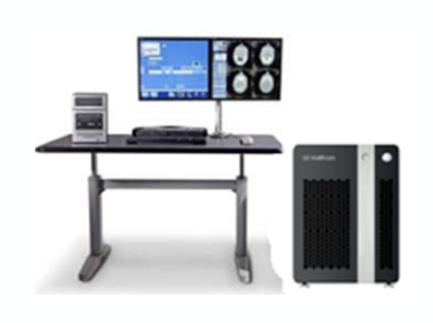

  

**电源分配柜 (PDU）**

电源分配柜将医院提供的三相交流电变换成直流与交流电压，输出到控制台，床与扫描机架。

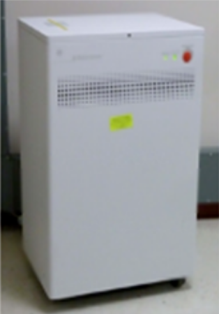