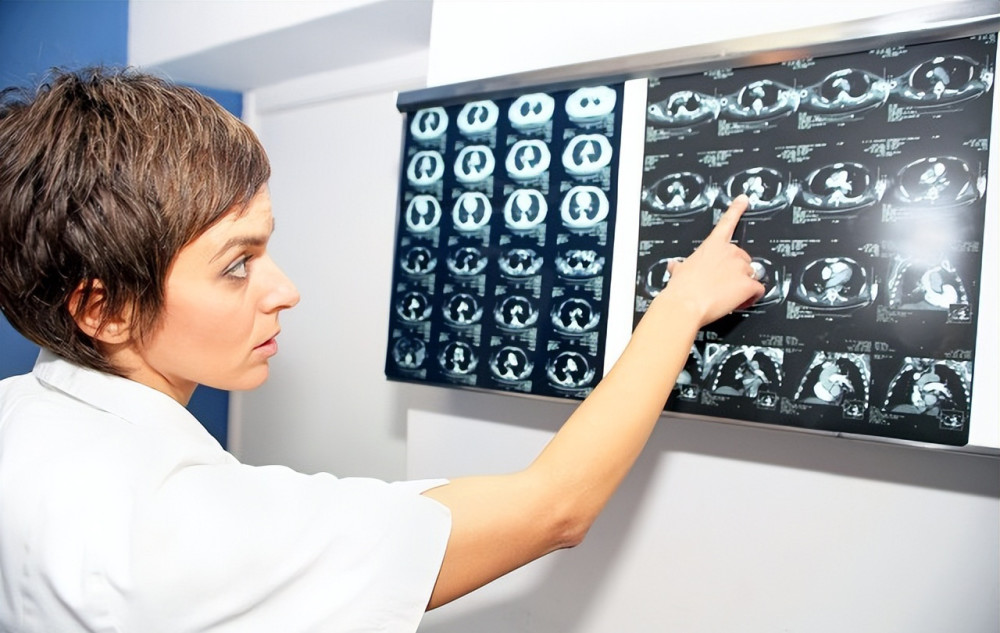
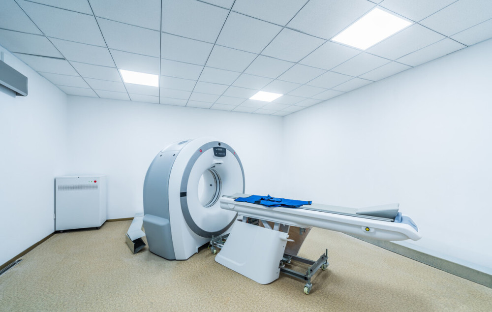

# 低剂量CT、平扫CT、高分辨CT、增强CT，傻傻分不清，一文讲清楚

当发现肺结节，需要定期复查随访，复查的方式就是做胸部CT，那么复查到底需要做什么CT？很多人对低剂量CT、普通平扫CT、高分辨CT、增强CT等各种CT方式分不清，也不太清楚不同CT作用是什么。今天一文总结一下各种不同类型的胸部CT。

**低剂量CT**

低剂量CT，顾名思义就是辐射剂量比较低的CT。很多人知道做CT是有辐射的，随着健康意识的提高，不少人甚至因为担心辐射拒绝做CT。于是，1990年Naidich首次提出了低剂量的概念：在其他条件不变的情况下，降低管电流来降低辐射，同时保证图像诊断要求，其辐射剂量约是普通CT的1/5，约1mSv。低剂量CT并不是特殊的机器，而是通过改变了普通CT机器（一般是64排CT）的参数，但降低了辐射剂量同时，也损失了一部分清晰度，所以他主要用于肺癌高危人群的筛查。低剂量CT仅能用于肺部检查，其他部位不可以用低剂量CT。

**普通平扫CT**

CT平扫是目前临床应用最广泛的，CT平扫对设备要求比较低，绝大多数基层医院也有配备，价格也最便宜，扫描速度快，一般体检和急诊所做的胸部CT就是这种。普通肺部CT也能观察患者肺部是否有占位或者结构上的变化，也可以观察到肿瘤、淋巴结肿大、转移病灶、肺部炎症等等。通常普通CT层厚在5-10mm，所以对于观察有病变的细小肺部结构有时候就显得力不从心。普通平扫CT辐射剂量比低剂量CT要高一点，但也是在人体可接受的范围内。

**高分辨CT（HRCT）**

高分辨CT为薄层(1-2mm)扫描，高分辨率算法重建图像的一种检查技术。HRCT主要用于病灶的微细结构，是普通胸部CT平扫的一种补充。HRCT能清晰地显示肺组织的微细结构，如肺小叶气道、血管等，几乎能显示与大体标本相似的形态学改变。主要是用于诊断肺弥漫性病变、肺小结节等肺部疾病，尤其是判断肺结节良恶性有很大帮助，可以判断直径1.5mm以下的异常影像。在相应软件辅助下，还可以进行三维成像，能更清晰的多角度的观察肺结节的细微结构。

**增强CT**

增强CT是静脉内注射一定剂量的含碘水溶性造影剂，然后在CT机上扫描。做增强CT的目的是强化病灶与周围组织的对比，更有利于发现病灶，同时可以更清晰地显示病灶的范围和性质，为影像科医生提供更多更清晰的信息。比如纵隔部位，由于CT平扫中血管和淋巴结都是等密度，不能很好的区别，做增强CT后血管内有造影剂显示出高密度，如果不做增强扫描，很可能会把一些畸形血管误以为是淋巴结转移，或者把转移淋巴结当做正常的血管。值得一提的是，对于肺部结节，做增强CT意义不大。

​

增强CT的造影剂极少数人可能会过敏，需要注意不做增强或者更换不过敏的造影剂。增强CT由于扫描时间长，所接受的辐射量比CT平扫要高。造影剂最终通过肾脏排泄。所以对于严重肾功能不全的人不能做增强CT。做完增强CT后多饮水，促进造影剂排泄。
