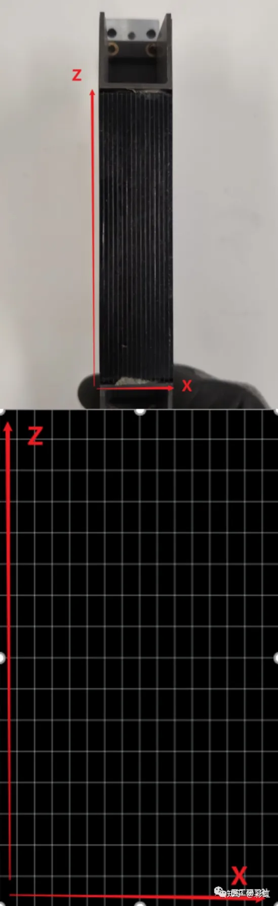

**1、CT探测器的整体认识**

目前，经典的飞利浦Brilliance64 CT，出了名的稳定、皮实。感慨一句：飞利浦的球管太XX耐操了，后面专门开一篇好好说道说道！

CT整体结构就**机架**和**床**两大块，所有CT都这样。

图1 飞利浦CT(来自互联网)

打开机架前盖，最亮眼的是球管和探测器，如下图。也就是今天的主角，**探测器，CT最重要最神奇的部件**。

图2 打开机架前盖的Gantry

继续，拆探测器的外壳，**中间那一长条就是探测器，明显可以看出是一块一块拼起来的**。其他厂家也是一样，**都是拼起来的，有42块的、52块的、56块的**。放大上图红色椭圆部分，可清晰可见每块探测器。

**注意：如不是维修需要，尽量不要拆探测器外壳，探测器是好好呵护的，另外探测器特别特别特别贵！**

图3 探测器前面及细节

肯定特别想拆1块，研究探测器长啥样吧，满足你！

下图就是1块探测器的，正脸和侧脸。**探测器正面是探测器材料，X线从这进入探测器，后面跟着的是X光信号数据处理单元。**

记住右边那张图，很重要。

以上是对探测器的整体认识，下面进入正题。

图4 单块探测器侧面及正面

**2探测器参数图文解读**

厂家每次宣传CT时，**机架转速和探测器**总是要大书特书，毕竟这俩参数是CT一直在努力追求的极限，简直就是CT届的摩尔定律！

**探测器的功能是可将入射的不可见X光转换为可见光的闪烁晶体或荧光物质，以完成后续成像。**

**探测器参数包括探测器材料、探测器排列、每排探测器个数，探测器通道数等。**

探测器材料有好几种，有**高速稀土陶瓷、人造宝石、固体钨酸铬，闪烁晶体GOS**等。四大CT厂家的探测器材料都不太一样，材料就见仁见智，这个离工程师太远。咱们详细分析下面三个参数。

图5 探测器材料(来自互联网)

为便于理解，一般人为定义探测器有三个方向，即X、Y、Z，如下图所示:

**X轴，探测器长度，体现每排探测器的采集单元数；**

**Z轴，探测器宽度，体现探测的排数；**

**Y轴，是X线方向，其实没啥意义。**

图6 探测器的三个方向

很不好理解对吧，继续用图说话。

以单块64排探测器为例分析，从图中（图7上）能清楚看到探测器上有竖直的条纹。**实际上，探测器物理结构像田字格（图7下），不仅有竖直条纹，还有水平条纹。每一格是一个探测器的物理单元。**

图7 探测器正面及物理结构

到这，单个探测器的基本结构算是清楚了，开始讲探测器的参数。

**01**

**探测器排列（宽度）**

继续用上图，64排探测器，**Z轴就代表探测器宽度，64排就是64个单元，每个单元是宽度0.625mm，也是探测器的纵向分辨率。**

因此**探测器总宽64\*0.625=4cm。至于为什么是0.625mm，这是每家工艺决定，佳能是0.5mm，西门子是0.6mm，GE和飞利浦是0.625mm。**

**越薄，图像的细节越多。**

再举个栗子，比如同样16cm探测，GE Revolution是16cm=256\*0.625，Canon Aquilion ONE是16cm=320\*0.5mm。这么薄，也不知道人眼能不能看出来。

肯有人好奇双源CT探测是怎么计算的，一样：Force，探测器参数是96\*0.6\*2mm = 5.76cm\*2，即2块一模一样的5.76cm的探测器。

补充：虽然现在主流基本上都是64排以上，**探测器排列也都是等宽的。**但有些老款CT的探测器排列是不等宽的，具体每家不太一样。**一般定义探测器排数的规则：以Z轴上最小宽度探测器的数目作为探测器的排数。**比如，

16排CT，宽度2.4cm，实际是16+8=24排，宽度是16\*0.75；

40排CT：宽度4cm，实际是40+10=50排，宽度是40\*0.625；

图8 16排、40排、64排探测器Z轴

**02**

**每排探测器的采集单元数**

**1块探测器的X轴是16个单元。16是个好数字，好像其他家探测器也是这样的，主要的是探测器的块数。**

上面说，X轴是探测器长度，体现每排探测器的采集单元数。那怎么体现呢？

咱们看整体探测器的正面（图9），**整体是由42块探测器拼起来的。因此每排探测器的采集单元数：42\*16=672。**

再举个栗子，

Revolution CT每排探测器的采集单元数：52\*16=832；

Aquilion ONE每排探测器的采集单元数：56\*16=896。

图9 探测器正面

**03**

**探测器的总物理单元数**

**探测器的总物理单元数，也就是CT像素。CT的空间分辨率与像素大小有密切关系，一般为像素宽度的1.5 倍。像素越小、数目越多，空间分辨率提高，图像越清晰。**

**CT像素 = X\*Z = 64\*672= 43008。**

同样，其他CT也是这么算的，感兴趣可以看看谁的空间分辨率高。

**3**

**探测器的“层”是如何实现的**

先引用李懋老师的原文：

“排”是指CT探测器在Z轴方向的物理排列数目，简单来讲就是有多少排（个）探测器，就是多少排CT，这个指标主要是反映CT硬件结构。目前的CT都是多排CT（MDCT），即Multi-detector CT或者可以写成Multi-row CT或者Multiple detector row CT。

“层”是指CT数据采集系统（Data Acquisition System, DAS）同步获得图像的能力，这个指标主要是反映CT扫描的功能，是一个功能性参数。所谓功能性参数是指要通过图像性能来反映的，不能直接通过实体显示。有多少层CT就代表扫描一圈能够同步获得多少幅图像。比如，我们常说的16层CT、64层CT，就是表示扫描一圈能够获得16层图像、64层图像。目前的CT基本上都是多层CT（MSCT），即Multi-Slice CT或Multi-slice spiral CT或Multislice CT。

通过第三章，“排”已经足够清楚了吧，下面是层。

**层，是CT扫描一圈能够获得的图像数。**

图10 GPS探测器排与层CT(来自互联网)

上图各家CT的探测器排数和层数的对比，可以看出，就两种情况：

**第一种，探测器层数=探测器排数，即探测器排数和DAS通道数一样。通常来说，64排CT，后面正好跟64通道DAS，扫描一圈获得64幅图（图11）。即，图像数=DAS数=探测器排数。这很好理解对吧。**

图11 常规64排64层技术(来自互联网)

**第二种，探测器层数=探测器排数\*2，即DAS通道数是探测器排数的2倍，图像数=DAS数=探测器排数\*2。**

那后一种怎么实现的呢，两种方法：

**01飞焦点技术**

普通X线成像是X线轰击到阳极靶面的一个点上，反射到探测器上；而**飞焦点成像（图12）是在X线产生的过程中，电子束在磁偏转线圈的作用下，轰击在阳极靶面的不同位置上，从而使焦点在靶面两个不同的位置快速变换。**

图12 飞焦点

**西门子的飞焦点(Z-sharp)技术，通过X线焦点在Z轴上运动，两个焦点位置的X线信号先后到达64排探测器，由64排探测器的“分时读取”并分别传递给128个DAS通道，相当于两个64排探测器在工作，实现每圈64层数据的采集，不仅获得图像加倍，同时也提高了Z轴分辨率，从0.6mm提高到0.33mm。**

**02共轭采集技术**

**X线在机架内旋转180°（即，球管和探测器交换位置）后，可以获得相反方向的X线，即为共轭射线。**

**GE和飞利浦都采用共轭采集技术，该技术是对连续X线信号进行不同时相上的采集，通过两组DAS系统将对相位相差180°的数据分别进行捕获即转换，可重建出双倍于探测排数的图像数，比如飞利浦Ingenuity Core128，是64排128层CT。**

同样，**使用共轭采集技术后，可将采样率提高1倍，同时也提高Z轴分辨率，从0.625mm提高到0.3mm。**

**飞焦点和共轭采集本质上都是通过提高1倍数据采样率，实现获得双倍图像数，同时也提高了Z轴分辨率。**