  
随着人类发现X射线，这项技术不断应用到医学领域，比如**X光机、DR、CT、乳腺钼靶**等医疗设备，它们的主要核心均是利用X射线技术来实现设备的各种功能，这其中的X射线源——球管也一直是此类设备的核心，今天我们来说说**球管技术发展**，主要分析一下当今球管制造中的那些比较“牛”的关键技术。

  

*   **X射线产生原理**：运动中的电子与物质相互作用产生X射线。
    

*   **球管基本原理**：如图1，阴极灯丝通电后升温释放出电子(带负电荷)并在高压电场的作用下高速撞向阳极靶面，电子运动的动能百分之一左右转换成X射线，其余部分转化成热能。
    

  

**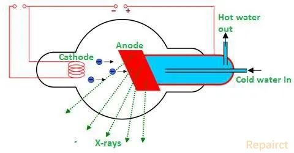**

**▲ 图1**

  

简单了解原理之后，我们来看看这些年**球管发展的主要技术节点**，以及**目前在用的****主流球管都使用了哪些技术**。

  

**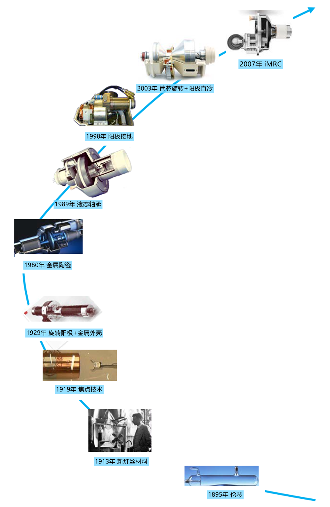**

**▲ 图2**

  

  

图3为飞利浦在**上世纪50年代制造的传统X射线管**的主要部件，其中使用了旋转阳极技术，管芯材质为全玻璃管芯，并且散热方面采用被动散热理念，此设计一直沿用至今，目前许多DR等设备依然使用这种类型的球管作为X射线源。

  

**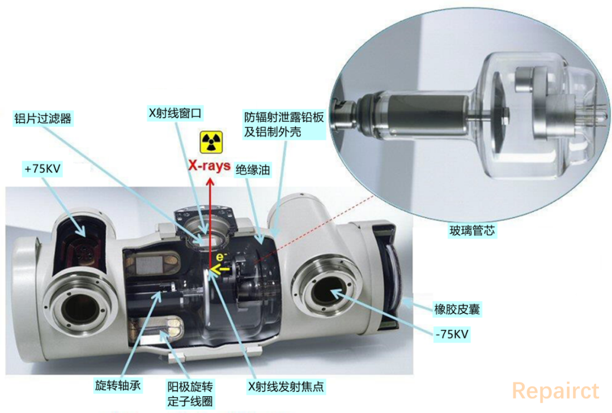**

**▲ 图3**

  

  

图4为飞利浦**在1980年推出的一款金属陶瓷球管**，为了让阳极线圈距离转子部分更近，转子与外壳部分使用了陶瓷进行绝缘，这样可以缩短阳极启动的时间，阳极轴承部分使用弹簧悬挂技术提高稳定性的同时也可以延长使用寿命，阳极靶盘的尺寸在当时几乎是最大的，所以有着较高的热容量(2010年IEC取消了热容量单位来表示，这里为了方便理解依然采用此单位)，阴极部分同时采用了多焦点技术满足不同需求。

  

**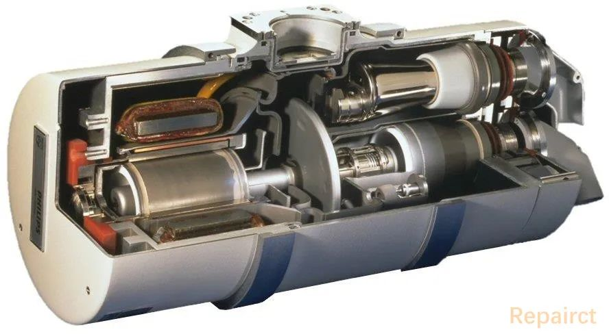**

**▲ 图4**

  

  

图5为飞利浦**1989年推出的MRC200液态金属轴承球管**，主要用于血管造影设备，飞利浦第一个将液态金属轴承应用到球管制造领域，随后几年GE、西门子、东芝(现佳能)等均紧随其后。

  

其实在研发阶段，飞利浦的工程师遇到了很多问题，最开始的原型管在测试中几乎无法产生X射线，气体会混合到液态金属内导致高压电无法导通，最终在工程师的努力下这些问题被慢慢解决。

  

**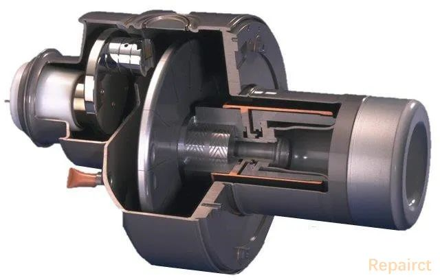**

**▲ 图5**

  

液态金属轴承主要**使用液态金属润滑剂取代滚珠轴承**，填充厚度约为10-50µm。目前**主流的高端CT设备使用的球管几乎均应用到此技术**。

  

液态金属轴承的主要优点：

*   几乎无噪音；
    

*   可以连续运转，对使用寿命几乎无影响，并且可以没有启动等待时间；
    

*   更高的导热效率，可以使用更大的靶盘；
    

*   可以承受更高的离心力(提高CT扫描转速)。
    

  

图6为正在组装的飞利浦MRC200球管液态金属轴承系统。

  

**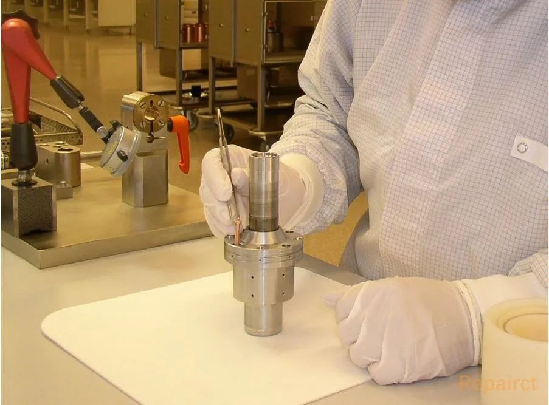**

**▲ 图6**

  

  

不光是液态金属轴承好用，**滚珠轴承也有新突破**。

  

图7为瓦里安(现万睿视)生产的**AEG(阳极接地技术)系列球管**解剖图。1998年，瓦里安改进了一种特殊的阳极“冷却”方式，在普通球管工作的过程中，当电子击中阳极靶面时会有40%以上的电子被反射到真空中，随后在电场的作用下再次返回阳极靶面造成阳极靶进一步发热，瓦里安为管芯增加了捕获装置(如图7左边的第22项)，对于相同管电流及电压下阳极发热量下降超过三分之一。

  

**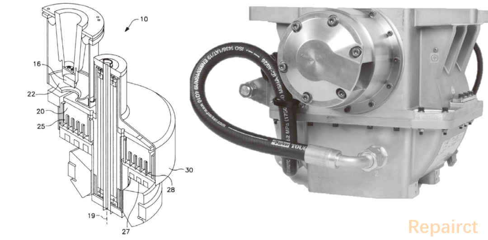**

**▲ 图7**

  

此外，瓦里安将阳极靶背面设计成多个凹槽(如图8)来增加有效散热面积。瓦里安不断**改进滚珠轴承表面涂层来进一步提高轴承使用寿命**，并且在靶盘两端安装轴承将转子重心位于轴承之间，进一步提高靶面在高速转动时的稳定性，这也为实现更高的CT机架旋转速度奠定了基础，提高了CT机扫描心脏的能力。

  

**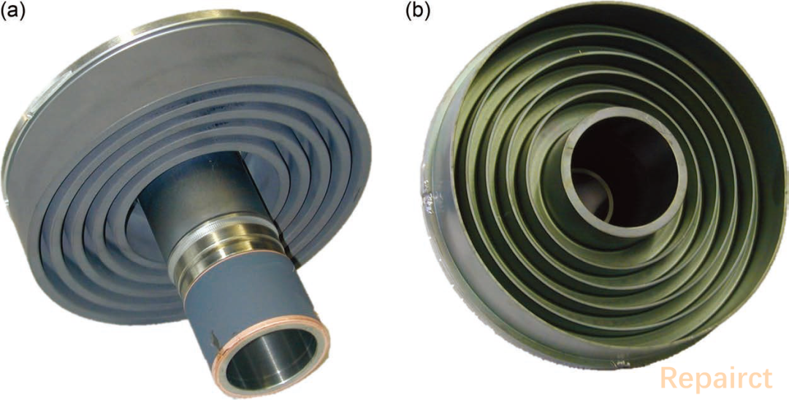**

**▲ 图8**

  

2010年以来瓦里安还推出一系列**AEG(阳极接地)球管**，也同样具备散射电子收集装置来减少阳极不必要的发热，同时整体采用非常紧凑的结构，阴极与转子驱动线圈位于同一侧，阳极端非常小的绝缘间隙提高了转子驱动时的效率。

  

  

图9为西门子0兆球管解剖图。2003年，西门子通过一些创新的方法，实现了很早之前(上世纪40年代末)人们提出的一种**旋转框架球管**，由于此球管**在体积较小的情况下具备了极强的散热性能**，并且由于我国的一些政策要求，西门子将其称之为0兆球管。

**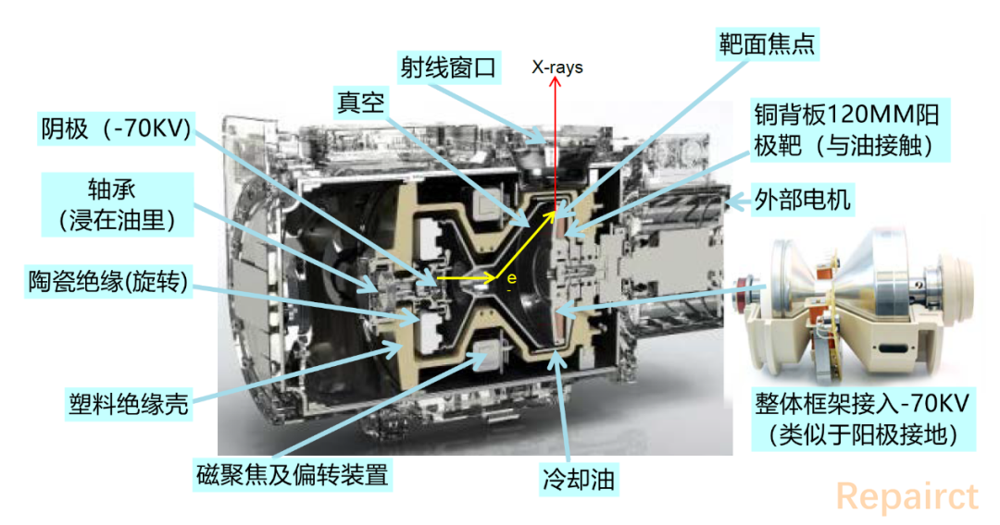**

**▲ 图9**

  

直到如今，0兆球管已经发展了几代，基本原理及各个组件如图10，球管阳极使用了直径只有120mm铜衬底的阳极靶，并且阳极作为整个框架的一部分跟随旋转，阳极背部直接与冷却油接触，所以拥有极强的散热能力，其中框架两端的轴承部分也同样浸在油中，在油的润滑下其使用寿命大大增加。阴极发射的电子经过磁聚焦叠加及偏转装置转向后射入阳极靶面焦点并使其相对于CT整机保持在一个固定位置。图10可以看出球管内部结构非常紧凑。

  

**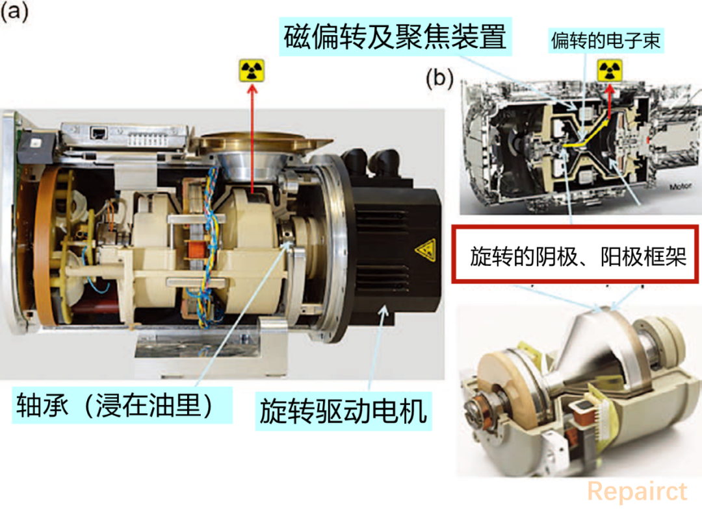**

**▲ 图10**

  

0兆球管虽然优点明显，但其中也有一些至今很难克服的缺点，其中由于框架是相对于油中旋转，而不是传统的相对于真空中，而**物体在液体中旋转时相对于在空气或者真空中的旋转摩擦阻力要大得多**，这直接导致**旋转驱动电机的功率急剧上升**，同时整体的发热量随之增加，这使得整个球管的功率受到了一定的限制。

  

西门子通过巧妙的流体力学设计，找到了极大地控制摩擦阻力的方法，但**球管的尺寸以及功率仍然受到了限制**。

  

另外，0兆球管的电子相对于阳极靶面的入射角度为50°左右，而不是像其他大多数球管是接近与垂直的入射方式，这使得电子在撞击阳极时的散射现象增强，最终导致电能转换为X射线的转换率在一定程度上降低。

  

当立(DUNLEE)其实也开发了自己的旋转框架管原型，但最终没有量产。

  

  

图11为飞利浦**iMRC球管**管芯解剖图。在球管制造领域飞利浦可以说是一直走在最前端，许多非常好的设计理念均为飞利浦提出的，图12的iMRC球管使用了**平板灯丝设计**，相较于传统灯丝具有更长的使用寿命，并且具有更高的电子发射量，全新设计的聚焦偏转装置具有高聚焦特点，即使在低管电压下也能提供非常高的焦点电流密度。阳极采用分段式设计来避免材料的热应力，冷却水从旋转轴内部流过可快速的将阳极产生的热量带走。

  

**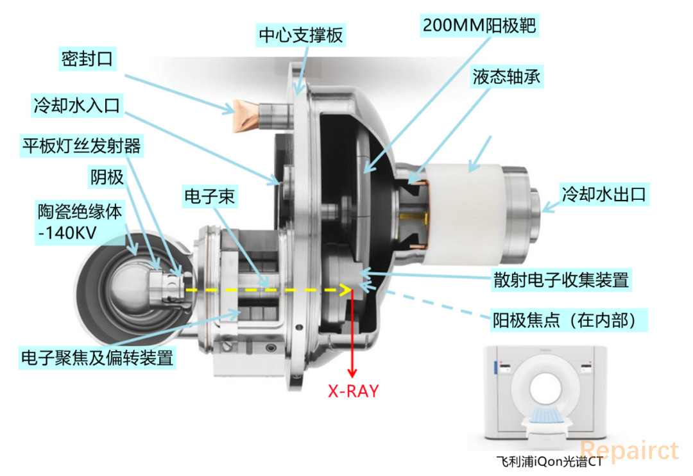**

**▲ 图11**

  

  

**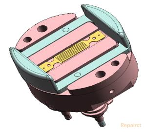**

**▲ 图12** **iMRC球管平板灯丝CAD图**

  

  

**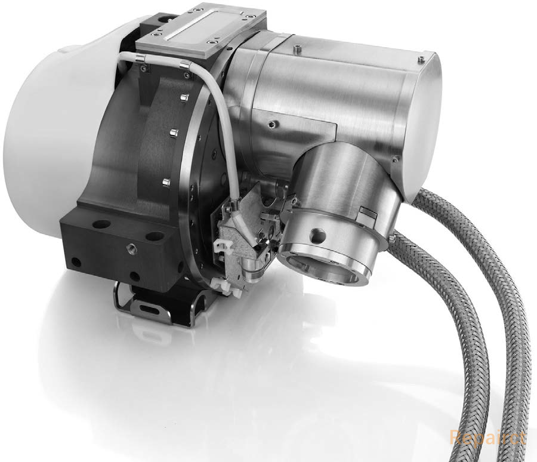**

**▲ 图 13** **iMRC球管**

  

  

  

**主流高端球管热处理能力简单对比表**

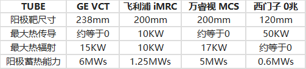

球管技术通过多年的发展产出了许多顶尖的设计，期待我们国产球管早日取得新的突破，早日摆脱其它国家的技术垄断。

END

  

**【器械汇往期文章链接】**

  

[**轻盘点︱细数10家国产CT球管制造商**](http://mp.weixin.qq.com/s?__biz=MzA3MzgwNDYxNg==&mid=2247486545&idx=1&sn=1f2c9602567636e23296dc851ebf236c&chksm=9f083276a87fbb60157893a963b2c1d46272309aace52739d680850b605ac51c868204ee388a&scene=21#wechat_redirect)

  

[**轻盘点︱当立、万睿视、瑞能……细数全球六大CT球管独立制造商**](http://mp.weixin.qq.com/s?__biz=MzA3MzgwNDYxNg==&mid=2247484742&idx=1&sn=755194db82f288cdd43e877b9e9fbfae&chksm=9f083b61a87fb2775cf42068d348e7c8057bd9b1edab35e1f0b48c13458deacb3d5ed7866af3&scene=21#wechat_redirect)

  

[**CT球管技术详解（厂商最新技术篇）**](http://mp.weixin.qq.com/s?__biz=MzA3MzgwNDYxNg==&mid=2247486192&idx=1&sn=9f125a350b3078d3f86e1d356821c65d&chksm=9f0834d7a87fbdc17cece66d5f6b730655ceee058073b02188cb5941b1d149c16d029d9d49a5&scene=21#wechat_redirect)  

  

[**CT球管技术详解（结构篇）**](http://mp.weixin.qq.com/s?__biz=MzA3MzgwNDYxNg==&mid=2247486139&idx=1&sn=523896adff9fed730a0cb40b859872d9&chksm=9f08349ca87fbd8afe9f57eca2eb380cdcb382903b4fc4b32fbb30aeee022c4de18174db5dc7&scene=21#wechat_redirect)  

  

[**国内冷阴极球管技术最新进展**](http://mp.weixin.qq.com/s?__biz=MzA3MzgwNDYxNg==&mid=2247486457&idx=1&sn=9a3ef496dfdac4b21bb86a29b5dcc56f&chksm=9f0835dea87fbcc8b9b34e8b526e6f4d69f4a7b93e051fef0fe0fe779d65238ef0191c3fa2a0&scene=21#wechat_redirect)