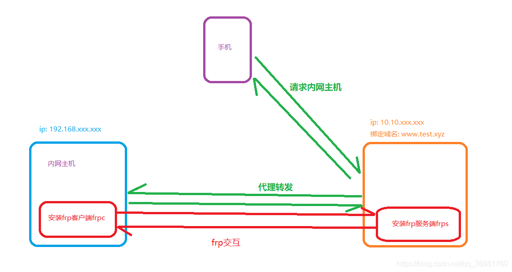
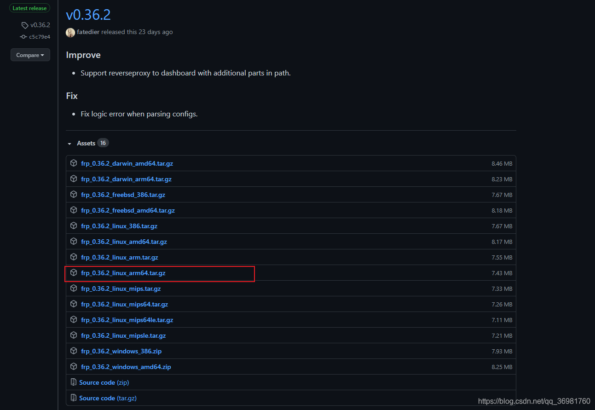
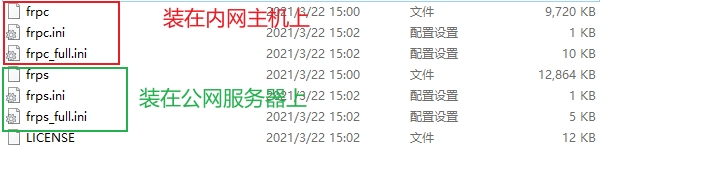
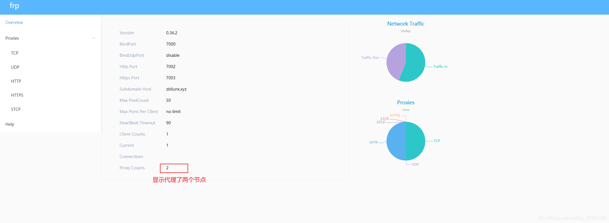
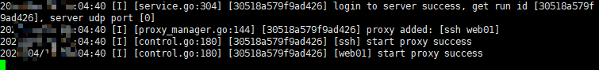
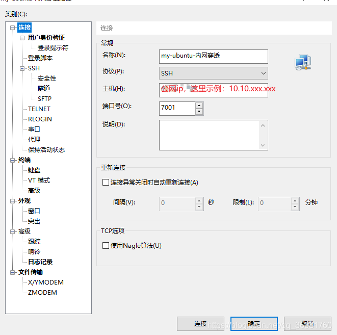
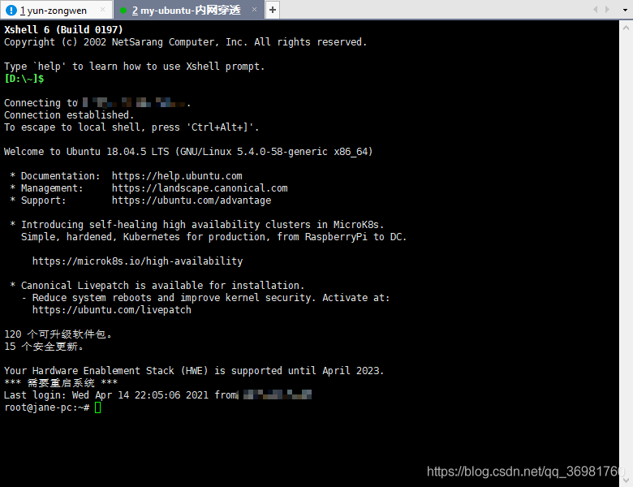
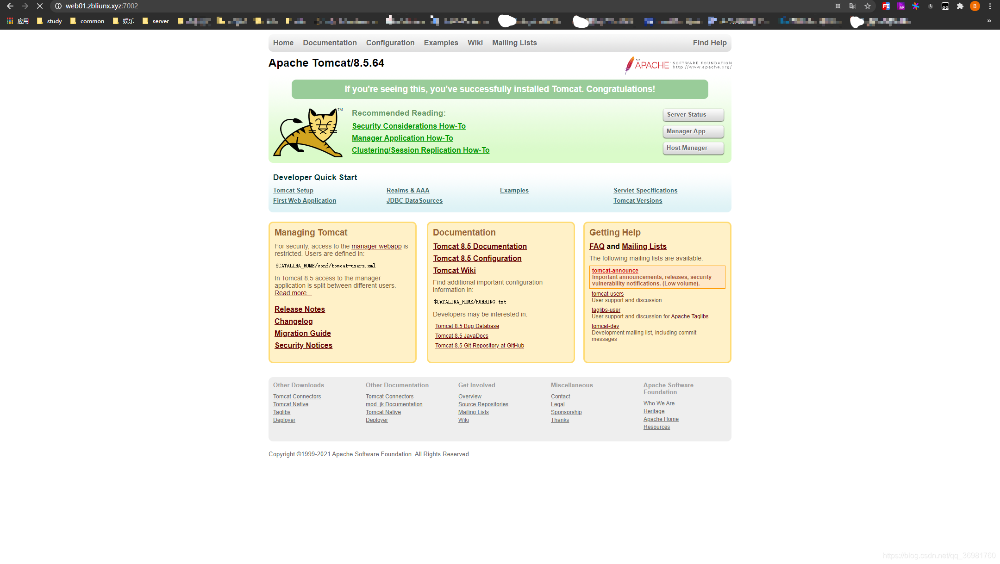

# FRP搭建内网穿透

## 1.概述：

frp可以通过有公网IP的的服务器将内网的主机暴露给互联网，从而实现通过外网能直接访问到内网主机；frp有服务端和客户端，服务端需要装在有公网ip的服务器上，客户端装在内网主机上。

## 2.简单的图解：



## 3.准备工作：

1.一个域名（www.test.xyz）

2.一台有公网IP的服务器(阿里云、腾讯云等都行)

3.一台内网主机

4.[下载frp](https://github.com/fatedier/frp/releases)，选择适合的版本下载  


解压如下：  


我这里服务器端和客户端都放在了/usr/local/frp/目录下

## 4.执行命令

```shell
# 服务器端给执行文件添加权限
cd /usr/local/frp
sudo chmod 777 frps

# 客户端给执行文件添加权限
cd /usr/local/frp
sudo chmod 777 frpc
```

## 5.修改配置文件

### 1.公网服务器端：

```shell
# 打开服务器端配置文件
vim ./frps.ini

# 我的填写内容如下：
[common]
bind_port = 7000         # 服务端与客户端通信端口
dashboard_port = 7500    # 后台管理端口
dashboard_user = admin   # 后台登录用户名
dashboard_pwd = admin

vhost_http_port = 7002   # http穿透端口
vhost_https_port = 7003  # https穿透端口
max_pool_count = 50

token = aaa123			# 身份验证令牌，frpc要与frps一致
tcp_mux = true

log_file = /usr/local/frp/frps.log  # 日志相关
log_level = info
log_max_days = 3

authentication_timeout = 0  # 服务器与客户端时间相差15min会连接失败，0表示不验证
subdomain_host = test.xyz   # 注册的域名
privilege_mode = true

```

**注意**：访问的端口一定要开放

启动frps：

```shell
# 前台启动
./frps -c ./frps.ini

# 后台启动
./frps -c ./frps.ini &
```

启动成功后，可以访问后台管理界面(这里举例地址：www.test.xyz:7500)  


### 2.客户端(内网主机):

```shell
# 打开客户端配置文件
vim ./frpc.ini

# 我的填写内容如下：
[common]
server_addr = 10.10.xxx.xxx  # 公网服务器ip
server_port = 7000   		# 公网服务端通信端口

token = aaa123				# 令牌，与公网服务端保持一致
tcp_mux = true

log_file = /usr/local/frp/frpc.log	# 日志相关
log_level = info
log_max_days = 3
authentication_timeout = 0 			# 服务器与客户端时间相差15min会连接失败，0表示不验证

[ssh]							# 添加ssh节点 
type = tcp
local_ip = 192.168.xxx.xxx
local_port = 22
remote_port = 7001				# 指明由公网服务器的7001端口代理

[web01]							# 添加web节点
type = http
local_ip = 192.168.xxx.xxx
local_port = 8080				# 本地8080端口可以通公网服务器7002端口访问,这里我的8080跑着tomcat
subdomain = web01				# 自定义子域名

```

启动frpc

```shell
# 前台启动
./frpc -c ./frpc.ini

# 后台启动
./frpc -c ./frpc.ini &
```

frpc启动成功示例如下：



## 6.最终结果验证：

### 1.测试ssh节点：

使用xshell连接通过公网服务器连接内网主机  


测试连接成功：  


### 2.测试web01节点：

请求地址：http://web01.test.xyz:7002 能访问到内网的tomcat首页  


## 7.设置frp开启自启动

**使用systemd管理frp：**

1.服务端：

```shell
# 需要先 cd 到 frp 解压目录.
# 复制文件
cp frps /usr/local/bin/frps
mkdir /etc/frp
cp frps.ini /etc/frp/frps.ini
# 编写 frp service 文件，以 ubuntu 为例
vim /usr/lib/systemd/system/frps.service # 有时候需要手动创建system文件夹


# frps.service内容如下
[Unit]
Description=frps
After=network.target
 
[Service]
TimeoutStartSec=30
ExecStart=/usr/local/bin/frps -c /etc/frp/frps.ini
ExecStop=/bin/kill $MAINPID
 
[Install]
WantedBy=multi-user.target


# 启动 frp 并设置开机启动
systemctl enable frps
systemctl start frps
systemctl status frps

# 部分服务器上,可能需要加 .service 后缀来操作,即:
systemctl enable frps.service
systemctl start frps.service
systemctl status frps.service
```

2.客户端：

```shell
# 需要先 cd frp 解压目录.
# 复制文件
cp frpc /usr/local/bin/frpc
mkdir /etc/frp
cp frpc.ini /etc/frp/frpc.ini
# 编写 frp service 文件，以 centos7 为例
vim /usr/lib/systemd/system/frpc.service  # 有时候需要手动创建system文件夹


# frpc.service内容如下
[Unit]
Description=frpc
After=network.target
 
[Service]
TimeoutStartSec=30
ExecStart=/usr/local/bin/frpc -c /etc/frp/frpc.ini
ExecStop=/bin/kill $MAINPID
 
[Install]
WantedBy=multi-user.target


# 启动 frp 并设置开机启动
systemctl enable frpc
systemctl start frpc
systemctl status frpc

# 部分服务器上,可以需要加 .service 后缀来操作,即:
systemctl enable frpc.service
systemctl start frpc.service
systemctl status frpc.service
```

## 8.避坑：

尽量避开浏览器 ERR\_UNSAFE\_PORT，这些端口浏览器会识别为不安全端口，不能访问；例如下端口：

```txt
1, // tcpmux
7, // echo
9, // discard
11, // systat
13, // daytime
15, // netstat
17, // qotd
19, // chargen
20, // ftp data
21, // ftp access
22, // ssh
23, // telnet
25, // smtp
37, // time
42, // name
43, // nicname
53, // domain
77, // priv-rjs
79, // finger
87, // ttylink
95, // supdup
101, // hostriame
102, // iso-tsap
103, // gppitnp
104, // acr-nema
109, // pop2
110, // pop3
111, // sunrpc
113, // auth
115, // sftp
117, // uucp-path
119, // nntp
123, // NTP
135, // loc-srv /epmap
139, // netbios
143, // imap2
179, // BGP
389, // ldap
465, // smtp+ssl
512, // print / exec
513, // login
514, // shell
515, // printer
526, // tempo
530, // courier
531, // chat
532, // netnews
540, // uucp
556, // remotefs
563, // nntp+ssl
587, // stmp?
601, // ??
636, // ldap+ssl
993, // ldap+ssl
995, // pop3+ssl
2049, // nfs
3659, // apple-sasl / PasswordServer
4045, // lockd
6000, // X11
6665, // Alternate IRC [Apple addition]
6666, // Alternate IRC [Apple addition]
6667, // Standard IRC [Apple addition]
6668, // Alternate IRC [Apple addition]
6669, // Alternate IRC [Apple addition]
```