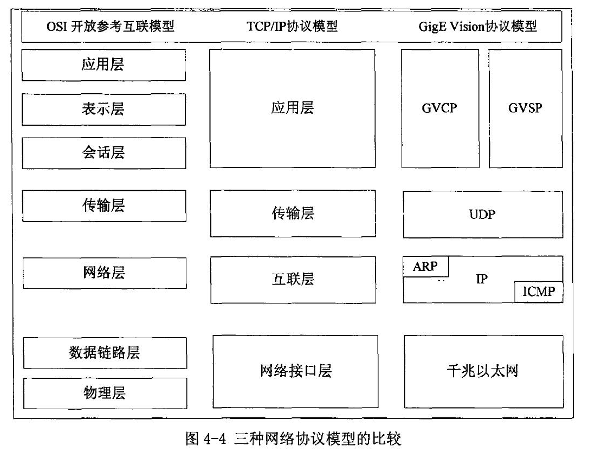

GigE Vision是由AIA制定的通信协议，用来实现在机器视觉领域利用千兆以太网接口进行图像的高速传输。该标准是基于UDP协议，与普通网络数据包不同之处在于应用层协议，应用层协议采用GVCP（GigE Vision控制协议）和GVSP（GigE Vision流传输协议），分别用来对相机进行配置和数据流的传输。图像采集系统软件的实现就是基于这两种协议。下图所示为TIP/IP协议和GigE Vision协议的对比：

  

GigE Vision定义了主机如何发现、控制千兆以太网相机以及从一个或多个GigE相机采集图像。GigE Vision标准充分利用千兆以太网的几个特征：

（1）      采用5类双绞线，成本低，无需集线器就可以传输一百米，传输带宽高达125MByte/s

（2）      网络化：组建一个网络，可以从多个相机采集图像，所有相机共享同一个带宽；

（3）      支持巨帧模式：GigE Vision相机几乎都支持巨帧模式，运行数据包大小为9014个字节，传输大容量数据包效率高；

当一个GigE Vision设备上电后，它会尝试按照下面的顺序获得IP地址：

（1）      固定IP，如果分配了固定IP，将会采用该IP地址；

（2）      DHCP服务器，如果没有被分配IP地址，它将在网络上搜索DHCP服务器，并请求分配IP地址；

（3）      如果上述两种方法都失败，它将自动假设一个169.254.x.x的IP地址，然后查询网络中该IP地址是否被占用，如果没有，则使用该IP，否则，重复该过程，直到找到一个没有被占用的IP地址；

由于相机可能在任何时候加入到网络中，所以驱动器必须有一些方法来搜索新的相机。为了实现该功能，驱动器会周期性地向网络中广播一个搜索消息包，每个兼容GigeVision的相机在收到该消息后都用自己的IP地址进行应答。下面的算法描述了设备搜索过程：

（1）      主机应用程序以广播的方式向网络中发送搜索消息帧，该消息帧中包含主机的MAC地址和IP地址；

（2）      网络中的所有GigE设备一直在GVCP端口侦听网络状态，当发现有搜索消息帧在网络中传输时就会接收该广播帧。对消息帧进行解包分析后，会将自身相关的配置信息填充到搜索应答器中，这些消息包含GigE设备型号、制造商、IP地址，MAC地址等，最后以单播的方式向主机发送搜索消息应答帧；

（3）      主机应用程序接收到该应答帧，根据需要进行相应的处理，即完成了一次网络GigE设备的搜索过程，相机搜索过程如下图所示：

  

**GVCP协议:**

GVCP允许应用程序配置和控制GigE相机，应用程序使用UDP协议发送命令，并等待设备响应，然后发送下一命令，该机制弥补了UDP协议的面向无连接缺点，保证了数据传输的完整性和可靠性。

**GVSP协议：**

该协议定义了GVSP发射机如何发送图像数据、图像状态等信息到GVSP接收机，GVSP数据包总是在GVSP发射机和接收机之间传输。GVSP通过GVCP对数据包的传输提供了一种可靠性机制。