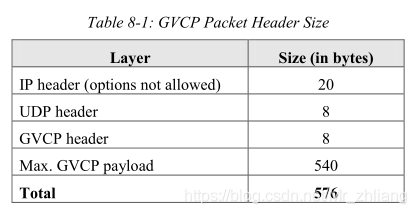
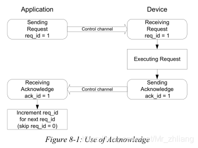
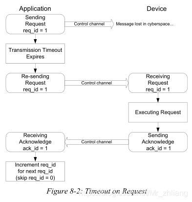
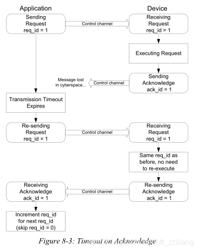

## 简介

​ GVCP是基于UDP传输协议的应用层协议。它基本上允许应用程序配置设备（通常是摄像机），并实例化设备上的流通道，以及在特定事件发生时通知应用程序。

​ **目标**：

​ 1、允许GigE 视觉设备和GigE应用程序之间进行交换命令和确认消息；  
​ 2、为应用程序提供一种方法，以便在适用时实例化来自设备的流通道；  
​ 3、为GigE Vision设备定义一种机制，用于向GigE Vision应用程序发送异步事件消息（使用事件生成器）；  
​ 4、提供唯一性访问方案，以便只有一个应用程序可以控制设备；  
​ 5、最小化GigE视觉设备的IP堆栈复杂度。

## GVCP Transport Protocol Considerations

​ GVCP必须使用UDP和IPV4作为传输协议；设备和应用程序不能在GVCP的IP数据报中使用任何IP选项。这样IP头的大小固定在20字节。

## UDP

​ GVCP头提供一个8位字段，其中包含16进制键值0x42，用于设备与应用程序识别GVCP包，设备的第一个GVCP端口号必须为3956。

​ GVCP端口（3956）已经在IANA中注册，应用程序可以使用任何可用的动态端口号。当应用程序发送GVCP包时，它使用设备GVCP端口(3956)作为目标，并动态分配UDP端口号作为源。该设备以应用程序动态UDP端口为目标，GVCP端口(3956)为源，响应GVCP请求。出于兼容性的原因，设备必须始终使用标准的GVCP端口号来表示它的第一个实例。这允许支持非mdns的应用程序使用GVCP DISCOVERY命令枚举设备。

### Fragmentation

​ 分段定义了将大消息分割成适合通过IP协议传输的小段的方式。对于IP，避免IP碎片的最大传输单元（MTU）是576字节（即所有主机需要接受或从碎片重新组装的最大数据报为576字节）。576字节包括IP头、UDP头、GVCP头以及数据负载部分（以太网报头不属于576字节的一部分）。字段如下表：  

### Packet Size Requirements

​ GVCP有效载荷必须是32位（4字节）的倍数。GVCP头本身也是32位的倍数。

### Reliability and Error Recovery

​ 可靠性由应用程序有选择性的请求来自每个命令消息的确认来实现的，如下图所示：  
  
​ 当请求确认时，如果在用户可配置超时之后应用程序没有收到确认，则应再次发送该命令，当重新发送命令时，应用程序必须保持req\_id字段不变。消息重试次数可以由用户设定，默认值为3。*req\_d* 初始值不能为0，在控制通道关闭后，其值会被初始化。此外，还启用了端到端连接，通过设置心跳计数来侦听链路是否断开。同理，其值是可以自定义的。一般来说，应用程序端的心跳频率应略低于设备端的1/3，这样可以在UDP包发送丢失时排除心跳因素的干扰。

  
​ 另一方面，如果设备接收到与此应用程序先前接收到的命令具有相同req\_id字段的命令，则它知道已经接收了两次相同的命令。如果两次运行该命令对设备状态没有影响，则允许这样做。否则，该命令只执行一次。并且在所有请求确认的情况下，设备必须为它接收到的每个命令（原始命令和重复命令）返回一个确认。如下图：  

### Flow Control

​ 流控制确保接收的消息不会过流，方案如下：  
​ 程序发送第一个数据包时，会在请求确认时必须等待确认消息。在收到第一个确认消息之前，不可以发送第二个数据包，除非传输超时或应用程序本身没有请求确认。  
​ 流管理控制可使用IEEE802.3暂停机制。如果设备支持暂停机制，那么暂停配置必须在设备重置期间保持。

## GVCP端口（3956）
​ GVCP头提供一个8位字段，其中包含16进制键值0x42，用于设备与应用程序识别GVCP包，设备的第一个GVCP端口号必须为3956。

​ GVCP端口（3956）已经在IANA中注册，应用程序可以使用任何可用的动态端口号。当应用程序发送GVCP包时，它使用设备GVCP端口(3956)作为目标，并动态分配UDP端口号作为源。该设备以应用程序动态UDP端口为目标，GVCP端口(3956)为源，响应GVCP请求。出于兼容性的原因，设备必须始终使用标准的GVCP端口号来表示它的第一个实例。这允许支持非mdns的应用程序使用GVCP DISCOVERY命令枚举设备。

PCAPNG是PCAP Next Generation Dump File Format的缩写，意思是PCAP下一代文件格式，后缀名为.pcapng。[1][2]

外文名
pcapng
全称
PCAP Next Generation Dump File Format
是为了突破现有广泛使用但是受限的PCAP格式的一个尝试，仍在进行中。