# NAT ALG原理与应用
**1  NAT ALG简介**

普通NAT实现了对UDP或TCP报文头中IP地址及端口的转换功能，但对应用层数据载荷中的字段无能为力，在许多应用层协议中，比如多媒体协议（H.323、SIP等）、FTP、SQLNET等，TCP/UDP载荷中带有地址或者端口信息，这些内容不能被NAT进行有效的转换，就可能导致问题。而NAT ALG（Application Level Gateway，应用层网关）技术能对多通道协议进行应用层报文信息的解析和地址转换，将载荷中需要进行地址转换的IP地址和端口或者需特殊处理的字段进行相应的转换和处理，从而保证应用层通信的正确性。

例如，FTP应用就由数据连接和控制连接共同完成，而且数据连接的建立动态地由控制连接中的载荷字段信息决定，这就需要ALG来完成载荷字段信息的转换，以保证后续数据连接的正确建立。

**2  NAT ALG特点**

NAT ALG为内部网络和外部网络之间的通信提供了基于应用的访问控制，具有以下优点：

(1)    ALG统一对各应用层协议报文进行解析处理，避免其它模块对同一类报文应用层协议的重复解析，可以有效提高报文转发效率。

(2)    可支持多种应用层协议：FTP、H.323（包括RAS、H.225、H.245）、SIP、DNS、ILS、MSN/QQ、NBT、RTSP、SQLNET、TFTP等。

**3  NAT ALG技术实现**

先介绍ALG涉及到的两个概念：

会话：记录了传输层报文之间的交互信息，包括源IP地址、源端口、目的IP地址、目的端口，协议类型和源/目的IP地址所属的VPN实例。交互信息相同的报文属于一条流，通常情况下，每个会话对应出方向和入方向的两条流。

动态通道：当应用层协议报文中携带地址信息时，这些地址信息会被用于建立动态通道，后续符合该地址信息的连接将使用已经建立的动态通道来传输数据。

下面以多通道应用协议FTP在NAT组网环境中的ALG应用来具体说明报文载荷的转换过程。

**3.1  ALG与FTP的应用**

FTP的两种不同工作模式：PORT（主动模式）与PASV（被动模式）。

FTP需要用到两个连接：控制连接与数据连接，控制连接专门用于FTP控制命令及命令执行信息传送；数据连接专门用于传输数据（上传/下载）。

**3.1.1  主动模式（PORT）的连接过程**

如[图1]所示，位于内部网络的客户端以PORT方式访问外部网络的FTP服务器，经过中间的设备进行NAT转换，该设备上使能了ALG特性。

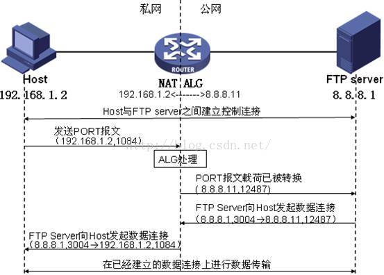

图1 FTP PORT方式报文载荷的ALG处理图

图1中私网侧的主机要访问公网的FTP服务器。NAT设备上配置了私网地址192.168.1.2到公网地址8.8.8.11的映射，实现地址的NAT转换，以支持私网主机对公网的访问。组网中，若没有ALG对报文载荷的处理，私网主机发送的PORT报文到达服务器端后，服务器无法根据私网地址进行寻址，也就无法建立正确的数据连接。整个通信过程包括如下四个阶段：

(1)    私网主机和公网FTP服务器之间通过TCP三次握手成功建立控制连接。

(2)    控制连接建立后，私网主机向FTP服务器发送PORT报文，报文中携带私网主机指定的数据连接的目的地址和端口，用于通知服务器使用该地址和端口和自己进行数据连接。

(3)    PORT报文在经过支持ALG特性的NAT设备时，报文载荷中的私网地址和端口会被转换成对应的公网地址和端口。即设备将收到的PORT报文载荷中的私网地址192.168.1.2转换成公网地址8.8.8.11，端口1084转换成12487。

(4)    公网的FTP服务器收到PORT报文后，解析其内容，并向私网主机发起数据连接，该数据连接的目的地址为8.8.8.11，目的端口为12487（注意：一般情况下，该报文源端口为20，但由于FTP协议没有严格规定，有的服务器发出的数据连接源端口为大于1024的随机端口，如本例采用的是wftpd服务器，采用的源端口为3004）。由于该目的地址是一个公网地址，因此后续的数据连接就能够成功建立，从而实现私网主机对公网服务器的访问。

在HOST（FTP客户端）抓包如图2所示：

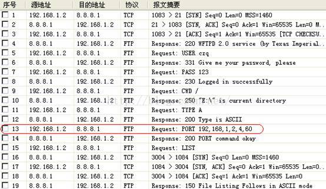

图2 PORT模式FTP客户端抓包

在FTP服务器端抓包如图3所示：

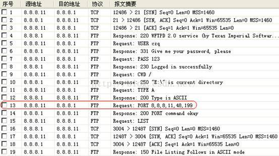

图3 PORT模式FTP服务器端抓包

由上抓包可知：主动模式（PORT）的连接过程是：客户端程序首先会为自己随机分配一个TCP 端口，它使用这个端口向服务器的FTP端口（默认为21）发出连接请求，服务器接受请求之后会建立一条控制链路，然后客户程序向服务器发出PORT命令（通常格式为PORT A1,A2,A3,A4,P1,P2，其中A1,A2,A3,A4为客户端IP地址，P1,P2为随机的一个数据连接端口号，端口号等于P1\*256+P2），告诉服务器它的数据通道的端口打开了。当需要传送数据时，服务器向客户端提供的随机端口发送连接请求，请求被接受之后便开始传输数据，主动模式下，需要做ALG处理的是客户端发出的PORT报文，如FTP客户端上抓包中的第13个报文，其中有一个包含地址和端口的字段为Request arg，如图4所示：

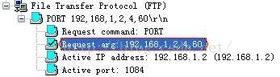

图4 ALG转换前的PORT报文

FTP客户端发出的PORT报文经过NAT设备后对应FTP服务器端上抓的第13个报文，私网地址192.168.1.2转换成公网地址8.8.8.11，端口1084转换成12487，如图5所示：

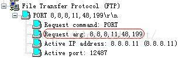

图5 ALG转换后的PORT报文

**3.1.2  被动模式（PASV）的连接过程**

如[图6]所示，位于外部网络的FTP客户端以PASV方式访问内部网络的FTP服务器，经过中间的设备进行NAT转换，该设备上使能了ALG特性。

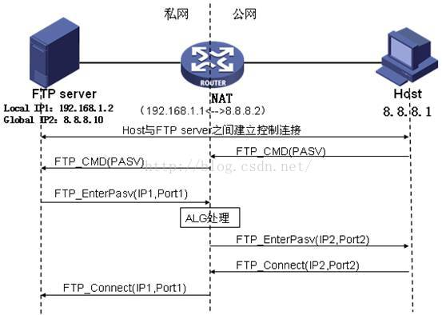

图6 FTP PASV方式报文载荷的ALG处理图

图2中的NAT设备上配置了私网地址192.168.1.1到公网地址8.8.8.2的映射，实现地址的NAT转换。整个通信过程包括如下四个阶段：

(1)    建立控制通道

客户端向服务器发送TCP连接请求。TCP连接建立成功后，服务器和客户端进入用户认证阶段。若TCP连接失败，服务器会断开与客户端的连接。

(2)    用户认证

客户端向服务器发送认证请求，报文中包含FTP命令（USER、PASSWORD）及命令所对应的内容。客户端发送的认证请求报文在通过配置了ALG的设备时，报文载荷中携带的命令字将会被解析出来，用于进行状态机转换过程是否正确的检查。若状态机转换发生错误，则丢弃报文。这样可防止客户端发送状态机错误的报文攻击服务器或者非法登陆服务器，起到保护服务器的作用。客户端的认证请求报文通过ALG处理之后，到达服务器端，服务器将对其进行响应。

(3)    创建数据通道

认证状态正确且用户是服务器已经授权的客户端，才能和服务器建立数据连接，进行数据的交互。如[图6]所示，当客户端发送“PASV”命令发起连接时，服务器会在发送给客户端的PASV响应报文中携带自己的私网地址和端口号（IP1,Port1），响应报文经过ALG设备时被解析，其中携带的服务器的私网地址和端口号被转换成其对应的公网地址和端口号（IP2,Port2），之后在该地址和端口与客户端的地址和端口之间将建立起数据通道。

(4)    数据交互

客户端和服务器之间的数据交互可以直接通过数据通道来进行。

在FTP服务器端抓包如图7所示：

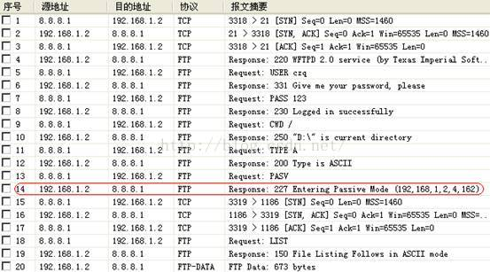

图7 PASV模式FTP服务器端抓包

由上抓包可知：被动模式（PASV）的连接过程是客户端程序首先为自己随机分配一个TCP端口，使用这个端口向服务器的FTP端口发出连接请求，服务器接受请求之后会建立一条控制链路，然后客户端程序发出PASV命令，要求服务器采用PASV模式建立数据连接，服务器便为自己随机分配一个数据通道端口，并将这个端口号告诉客户端程序（通常格式为：Entering Passive Mode (A1,A2,A3,A4,P1,P2)，其中A1,A2,A3,A4为服务器IP地址，P1,P2为随机端口号）。当需要传送数据时，客户端程序采用另一个随机端口向服务器提供的数据通道端口发送连接请求，请求被接受之后便开始传输数据，数据链路通道打开，被动模式下，需要做ALG处理的是服务器发出的Pasv response报文，如上抓包中的第14个包，其中有一个包含地址和端口的字段为Response arg，如图8所示：

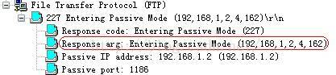

图8 需要做ALG的Pasv response报文

**3.2  ALG与H323/SIP的应用**

**3.2.1  ALG与H323的应用**

H.323协议用于发起会话，它能控制多个参与者参加的多媒体会话的建立和终结，并能动态调整和修改会话属性，如会话带宽要求、传输的媒体类型（语音、视频等）、媒体的编解码格式、广播的支持等。

H.323协议采用Client/Server模型，如在图9所示的语音组网中，主要通过网关（Gateway）与网守（Gatekeeper)之间的通信来完成用户呼叫的建立过程。

网关（Gateway）：用于连接H323电话终端；

网守（Gatekeeper）：注册/位置/代理服务器，管理各gateway

 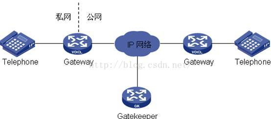

图9 H.323语音应用组网图

H323协议栈如图10所示：

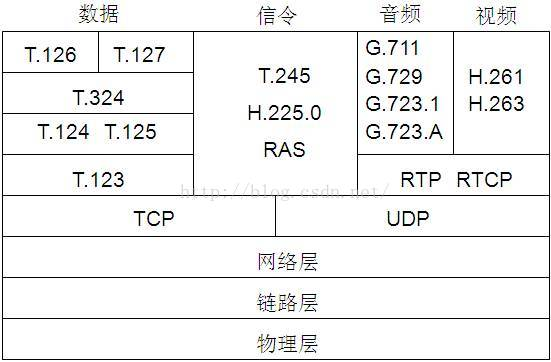

图10 H.323协议栈

由协议栈可知，H323是一个协议族，由众多协议来完成地址定位，注册，媒体协商等一系列工作。其中TCP/UDP载荷中带有地址或者端口信息，若在网关进行了NAT处理后，则需要进行ALG处理的有H.225、H.245、RAS等信令协议报文，具体为：

(1)    UDP RAS报文：gatekeeper、registar、admission的request和confirm报文

(2)    TCP H.225报文：setup、alerting、connect报文

(3)    TCP H.245报文：open logical chanel、open logical chanel ACK报文

H323通信中会建立4种连接：

RAS连接：网关与网守之间的UDP连接，源目的端口均是1719。

H.225连接：routed模式建立在网关与网守之间，redirect模式建立在网关与网关之间的TCP连接。源端口一般是发起方随机分配的，目的端口是1720。

H.245连接：routed模式建立在网关与网守之间，redirect模式建立在网关与网关之间的TCP连接。源端口一般是发起方随机分配的，目的端口通过H.225的connect报文协商。

RTP/RTCP连接：建立在网关与网关之间的UDP连接。源和目的通过H.245连接里的open logical chanel及其ACK报文协商。

**3.2.2  ALG与SIP的应用**

SIP（Session Initiation Protocol，会话初始协议）是一个用于建立、更改和终止多媒体会话的应用层控制协议，其中的会话可以是IP电话、多媒体会话或多媒体会议。SIP是通过各种头域里的信息的交互来管理会话的。而头域里与呼叫建立相关的包含IP地址和端口信息的字段需要被ALG处理，否则无法正确进行呼叫。SIP UA直接呼叫组网如图11所示（两台路语音由器作为SIP UA，能够互相直接呼叫）：

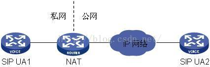

图11 SIP UA直接呼叫组网图

SIP消息采用文本方式编码，包括请求消息与响应消息两类。SIP请求消息包括如下六种。

(1)    INVITE：用于邀请用户加入一个呼叫。

(2)    ACK：用于对请求消息的响应消息进行确认。

(3)    OPTIONS：用于请求协商能力信息。

(4)    BYE：用于释放已建立的呼叫。

(5)    CANCEL：用于释放尚未建立的呼叫。

(6)    REGISTER：用于向SIP注册服务器登记用户位置等信息。

SIP响应消息用于对请求消息进行响应，指示呼叫或注册的成功或失败状态。在请求与响应报文中需要进行ALG处理的地址字段类型主要有：Via、Record\_Route、Contact、SDP。

ALG处理流程为如下三个步骤：

首先，ALG根据会话标识的协议类型对报文进行解码，若解码发现报文为不需要做ALG或解码发现为错误字段时退出，解码发现需进行字段转换时进一步处理；

其次，ALG查找接口上的NAT配置，根据NAT配置转换报文中的IP地址、端口、call-id等信息并建立关联表，关联表记录了载荷地址的转换关系；

最后，ALG调整报文载荷中的长度字段，如sipmessage header的content-length字段标识message body的长度，ALG对message body中的地址转换后，message body长度可能变化，content-length字段值需要置为变化后的值。