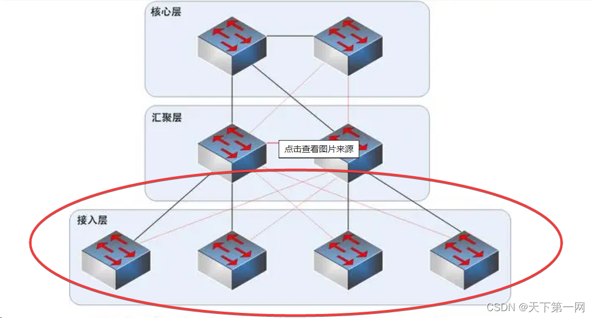
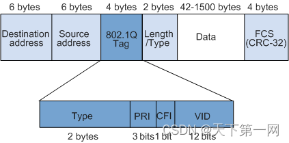
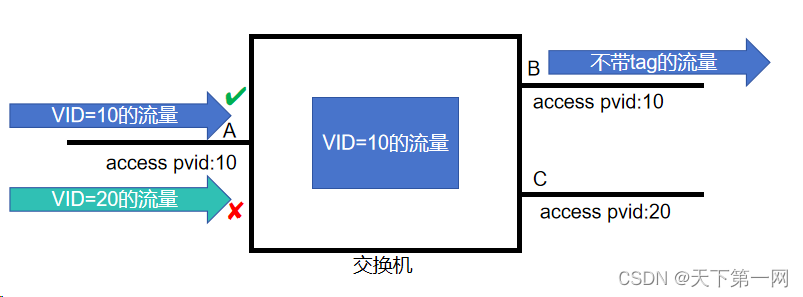
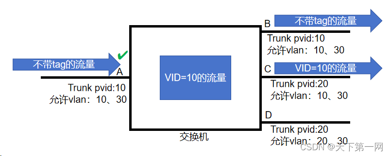
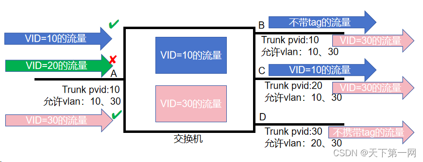
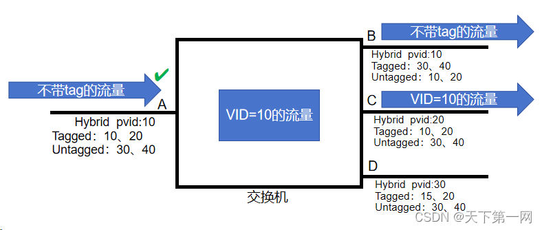
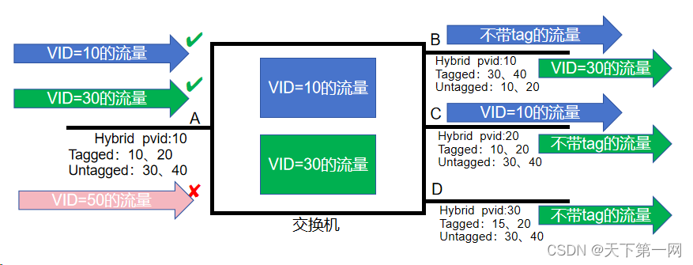

# 华为VLAN转发原理，一篇讲透永不忘
## 序

vlan，Virtual Local Area Network（虚拟局域网），在二层网络中，vlan技术绝对是大头，在二层组网中一定会用到的技术，下面通俗易懂得讲透vlan技术。

## 为什么要用VLAN

以下图典型的三层网络架构为例，假如网关在汇聚层上，那么汇聚层以下就属于二层网络，也就是一个广播域，如果不加以划为，这些二层设备收到BUM流量（广播、组播、未知单播）后就会在整个广播域内泛洪。



BUM流量是很常见的，比较常见的就是ARP广播流量，每当设备需要访问一个IP地址时，设备需要对IP包进行封装，封装上二层头部，众所周知，二层头部有两个非常重要的字段，一个是源Mac地址，也就是自己的Mac地址，源Mac地址设备肯定是知道的。还有一个是目的Mac地址，如果设备第一次访问这个IP地址，那么目的Mac地址是不知道的，这时候就需要发送广播的ARP包请求目标IP所对应的Mac地址，只有目标IP的设备才会回复自己Mac地址，这样需要访问IP的设备才能学习到目标IP的Mac地址（随便说一下，学到IP对应的这个Mac地址默认老化时间是300秒，300秒后要重新发广播ARP学习），所以说BUM流量在网络中是非常普遍的。BUM流量在整个广播域内泛洪，广播域过大，网络中充斥着大量的BUM流量，造成网络拥塞，丢包，甚至瘫痪。

将网络划分成多个VLAN，不同VLAN之间不能直接通信，在二层网络中，一个VLAN就是一个广播域，BUM流量只会在一个VLAN内泛洪，缩小了网络的广播域，可以更好避免广播风暴，避免网络拥塞等。

划分VLAN还可以将内网不同的部分进行隔离，网络更安全。

## VLAN原理

交换机最主要的功能是快速转发数据，那交换机是怎么识别不同VLAN的流量的呢，可以想象一下打篮球比赛，假设大家都不认识的情况下，怎么区分哪个队员是哪一队呢，两个队伍通常会穿不同颜色的衣服，这样就可以快速区分了，在vlan转发中，这个不同的颜色就是VLAN ID，简称VID， VID占12bit，取值范围为1-4094，0和4095协议中规定为保留的ID，VID在802.1Q tag中，整个802.1Q tag插入到二层头中，如下图所示，802.1Q tag中除了VID，还有其他字段，Type字段用于表示帧类型，PRI在QoS中用到。  
 



## 交换机转发VLAN原理

在讲解这部分之前，首先记住一句话：**数据在链路传输看情况是否携带tag，数据进入到设备中一定有tag。**

在华为交换机中，以太网二层接口类型有Access接口、Trunk接口、Hybrid接口。

下面详细讲解着三种接口是怎么处理vlan流量的：

#### Access接口

交换机上主要用来连接用户PC、服务器等终端设备的接口。Access接口通常收发不带tag的流量。收到的流量也可以携带tag，从接口发出的流量一定是不带tag的。Access接口只能加入一个VLAN。

*   **收到不带tag的流量（含发送规则）：**

如下图所示，接口A收到流量，该接口可以接收流量，打上该接口pvid值的tag（下图中也就是tag中的VID为10），流量进入设备内部，然后设备内部携带tag的流量会根据设备中其他接口的pvid值发送流量，如下图的B接口pvid为10，和设备内部VID为10的流量匹配，流量可以从给接口发送出去。C接口pvid为20，和设备内部流量的VID不匹配，因此流量不能从该接口发送出去。


总结：Access接口可以接收所有不携带tag的流量，接口pvid和tag中的VID一致才能发送流量，发出时不携带tag。

*   **收到携带tag的流量**

如下图所示，接口A收到两份流量，一份是携带tag VID为10的流量，VID和接口的pvid匹配，该接口可以接收流量；另一份是携带tag VID为20的流量，VID和接口的pvid不匹配，这份流量会被丢弃，携带tag VID为10的流量流量进入设备内部，后续流程和上述一样。



总结：如果携带tag的流量，Access接口只能接收VID为接口pvid的流量。

###### 配置

Access接口相关参数配置如下

```bash
vlan 10   #创建vlan 10
interface GigabitEthernet0/0/1
 port link-type access  #配置接口类型为Access类型
 port default vlan 10   #配置接口pvid为10
```

#### Trunk接口

Trunk接口允许多个VLAN的数据帧通过，这些数据帧通过802.1Q Tag实现区分。Trunk接口常用于交换机之间的互联，也用于连接路由器、防火墙等设备的子接口。

Trunk接口除了可以配置接口的pvid，还可以配置允许通过VLAN列表。

*   **收到不带tag的流量（含发送规则）：**

如下图所示，接口A收到不带tag的流量，打上该接口pvid值的tag（下图中也就是tag中的VID为10），然后查看允许vlan列表，如果打上的VID在允许列表中，该接口可以接收流量，流量进入设备内部，然后设备内部携带tag的流量会根据设备中其他接口的允许vlan列表发送流量，根据pvid确定发送流量时是否需要携带tag，如下图的B接口允许vlan列表中有10，和设备内部VID为10的流量匹配，流量可以从该接口发送出去，再根据该接口的pvid为10，与设备内部流量VID一致，故流量从该接口发送出去的流量不携带tag；C接口允许vlan列表中有10，和设备内部VID为10的流量匹配，流量可以从该接口发送出去，再根据该接口的pvid为20，与设备内部流量VID不一致，故流量从该接口发送出去的流量需要携带tag，VID为10；D接口允许vlan列表中没有10，和设备内部VID为10的流量不匹配，流量不能从该接口发送出去。



总结：接收流量时先打上接口pvid，再查看允许vlan列表，在允许列表中则接收，否则丢弃；发送流量时查看允许vlan列表，VID在允许列表中就可以从该接口发出，是否携带tag看接口pvid，pvid和VID一致不带tag发出，pvid和VID不一致则携带tag发出。

*   **收到携带tag的流量：**

如下图所示，接口A收到携带tag的流量，和不带tag的流量相比，省去了打tag的环节，直接查看允许vlan列表，如果VID在允许列表中，该接口可以接收流量，流量进入设备内部，如下图VID=10和VID=30的流量。然后发送流量的规则和上述的一样，这里就不再赘述。



总结：接口收到携带tag的流量，直接查看接口允许vlan列表，VID在允许列表中就可以接收流量，否则丢弃。

###### 配置

Trunk接口相关参数配置如下

```bash
vlan batch 10 20 30   #创建vlan10、20、30
interface GigabitEthernet0/0/1
 port link-type trunk  #配置接口类型为Trunk
 port trunk pvid vlan 10   #配置接口pvid为10
 port trunk allow-pass vlan 10 20 30   #配置允许vlan列表为10、20、30
```

#### Hybrid接口

Hybrid接口与Trunk接口类似，也允许多个VLAN的数据帧通过，这些数据帧通过802.1Q Tag实现区分。用户可以灵活指定Hybrid接口在发送指定VLAN的数据帧时是否携带Tag。

Trunk接口可以配置接口的pvid，还可以配置允许通过VLAN列表，其中允许通过VLAN列表又细分为Tagged和Utagged，记住，Tagged和Untagged都是允许通过VLAN列表。

*   **收到不带tag的流量（含发送规则）**

如下图所示，接口A收到不带tag的流量，打上该接口pvid值的tag（下图中也就是tag中的VID为10），然后查看允许vlan列表，该接口的允许列表为：10、20、30、40，打上的VID在允许列表中，该接口可以接收流量，流量进入设备内部，然后设备内部携带tag的流量会根据设备中其他接口的允许vlan列表发送流量，根据允许列表的种类确定发送流量时是否需要携带tag，如下图的B接口Untagged允许vlan列表中有10，和设备内部VID为10的流量匹配，流量可以从该接口发送出去，因为是Untagged类型的允许vlan列表，故流量从该接口发送出去的流量不携带tag；C接口Tagged允许vlan列表中有10，和设备内部VID为10的流量匹配，流量可以从该接口发送出去，因为是Tagged类型的允许vlan列表，故流量从该接口发送出去的流量需要携带tag，VID为10；D接口允许vlan列表中（Tagged和Untagged）没有10，和设备内部VID为10的流量不匹配，流量不能从该接口发送出去。



总结：接收不带tag的流量时先打上接口pvid，再查看允许vlan列表（包括Tagged和Untagged），在允许列表中则接收，否则丢弃；发送流量时查看允许vlan列表，VID在允许列表中就可以从该接口发出，是否携带tag看允许列表类型，VID在Untagged列表类型时不带tag发出，VID在Tagged列表类型时则携带tag发出。

*   **收到携带tag的流量：**

如下图所示，接口A收到携带tag的流量，和不带tag的流量相比，省去了打tag的环节，直接查看允许vlan列表（包括Tagged和Untagged），如果VID在允许列表中，该接口可以接收流量，如下图中允许vlan列表为10、20、30、40，可以接收VID=10和VID=30的流量，流量进入设备内部。发送流量的规则和上述的一样，这里就不再赘述。



总结：接口收到携带tag的流量，直接查看接口允许vlan列表（包括Tagged和Untagged），VID在允许列表中就可以接收流量，否则丢弃。

###### 配置

Hybrid接口相关参数配置如下

```bash
vlan batch 10 20 30 40    #创建vlan10、20、30、40
interface GigabitEthernet0/0/1
 port link-type hybrid    #配置接口类型为Hybrid类型
 port hybrid pvid vlan 10    #配置接口pvid为10
 port hybrid tagged vlan 10 20    #配置Tagged类型的允许vlan列表为10、20
 port hybrid untagged vlan 30 40    #配置Untagged类型的允许vlan列表为30、40
```

华为交换机接口默认类型为Hybrid，默认接口pvid为1，默认配置Untagged类型允许vlan  1。

我们在网络环境中用的比较多的类型是Access和Trunk类型。

## 写在最后

Vlan二层技术在面试中也会经常遇到，在这篇文章中我以通俗易懂的方式详细讲解了Vlan的转发原理，在认真看完理解后，配合模拟器练习，抓包观察数据包tag字段变化，领会Vlan转发原理，你一定会对Vlan技术有更深的了解，以后在网络中遇到Vlan的问题也会非常清晰。