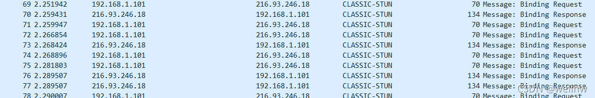

# 路由器四种NAT
## NAT的工作原理

&nbsp;&nbsp;&nbsp;&nbsp;&nbsp;&nbsp;&nbsp;NAT缓解了IPV4地址不够用的问题，同时也带来了限制，那就是NAT外部的主机无法主动跟位于NAT内部的主机通信，NAT内部主机想要通信，必须主动和公网的一个IP通信，路由器负责建立一个映射关系，从而实现数据的转发， 这就是NAT的工作原理。

## NAT分类

一般NAT可以分为四种类型

### *1.Full Cone NAT（*完全圆锥型NAT*）*

&nbsp;&nbsp;&nbsp;&nbsp;&nbsp;&nbsp;内网主机建立一个UDP socket(LocalIP:LocalPort) 第一次使用这个socket给外部主机发送数据时NAT会给其分配一个公网(PublicIP:PublicPort),以后用这个socket向外面任何主机发送数据都将使用这对(PublicIP:PublicPort)。此外，任何外部主机只要知道这个(PublicIP:PublicPort)就可以发送数据给(PublicIP:PublicPort)，内网的主机就能收到这个数据包 

### *2.Restricted Cone NAT（*地址限制圆锥型NAT*）*

&nbsp;&nbsp;&nbsp;&nbsp;&nbsp;&nbsp;&nbsp;&nbsp;内网主机建立一个UDP socket(LocalIP:LocalPort) 第一次使用这个socket给外部主机发送数据时NAT会给其分配一个公网(PublicIP:PublicPort),以后用这个socket向外面任何主机发送数据都将使用这对(PublicIP:PublicPort)。此外，如果任何外部主机想要发送数据给这个内网主机，只要知道这个(PublicIP:PublicPort)并且内网主机之前用这个socket曾向这个外部主机IP发送过数据。只要满足这两个条件，这个外部主机就可以用自己的(IP,任何端口)发送数据给(PublicIP:PublicPort)，内网的主机就能收到这个数据包

### *3.Port Restricted Cone NAT（*端口限制圆锥型NAT*）*

&nbsp;&nbsp;&nbsp;&nbsp;&nbsp;&nbsp;&nbsp;内网主机建立一个UDP socket(LocalIP:LocalPort) 第一次使用这个socket给外部主机发送数据时NAT会给其分配一个公网(PublicIP:PublicPort),以后用这个socket向外面任何主机发送数据都将使用这对(PublicIP:PublicPort)。此外，如果任何外部主机想要发送数据给这个内网主机，只要知道这个(PublicIP:PublicPort)并且内网主机之前用这个socket曾向这个外部主机(IP,Port)发送过数据。只要满足这两个条件，这个外部主机就可以用自己的(IP,Port)发送数据给(PublicIP:PublicPort)，内网的主机就能收到这个数据包

### *4.Symmetric NAT（*对称型NAT*）*

&nbsp;&nbsp;&nbsp;&nbsp;&nbsp;&nbsp;&nbsp;内网主机建立一个UDP socket(LocalIP,LocalPort),当用这个socket第一次发数据给外部主机1时,NAT为其映射一个(PublicIP-1,Port-1),以后内网主机发送给外部主机1的所有数据都是用这个(PublicIP-1,Port-1)，如果内网主机同时用这个socket给外部主机2发送数据，第一次发送时，NAT会为其分配一个(PublicIP-2,Port-2), 以后内网主机发送给外部主机2的所有数据都是用这个(PublicIP-2,Port-2).如果NAT有多于一个公网IP，则PublicIP-1和PublicIP-2可能不同，如果NAT只有一个公网IP,则Port-1和Port-2肯定不同，也就是说一定不能是PublicIP-1等于 PublicIP-2且Port-1等于Port-2。此外，如果任何外部主机想要发送数据给这个内网主机，那么它首先应该收到内网主机发给他的数据，然后才能往回发送，否则即使他知道内网主机的一个(PublicIP,Port)也不能发送数据给内网主机，这种NAT无法实现UDP-P2P通信。 

从上面也描述也可以看出，安全性系数,  对称型 > 端口受限锥型 > 受限锥型 > 全锥型

## 不同NAT的穿透属性

 对称nat无法穿透，这个说法不正确，对称nat与full cone nat、对称nat 与 ip受限cone、是可以穿透的，对称nat与 端口受限、对称nat与对称nat，不可穿透。  
类型：  
1.full cone NAT全椎  
2.Restricted Cone ip NAT受限  
3.port Restricted Cone NAT 端口受限  
4.Symmetric NAT对称  
穿透关系：上述4种类型，如果定义他们的值为序列号，N为序列号相加。则N<=6可穿透。  
2 和 4 序列相加 = 6 则可穿透。 3(端口受限)和4（对称）= 7 不可穿透。 

## Wireshark抓包分析4种Nat类型

### *Full Cone NAT（*完全圆锥型NAT*）*

设备只是从192.168.1.101 发送给216.93.246.18，但是216.93.246.15可以直接给192.168.1.101发数据，这种即是Full Cone NAT 

  

###  *Restricted Cone NAT（*地址限制圆锥型NAT*）*

 从抓包可以看出，192.168.1.101需要先给216.93.246.18和216.93.246.15发消息，这两个服务器地址才可以给192.168.1.101回复，这个只是匹配IP地址，不会去检测端口，这就是Restricted Cone NAT

只有收过NAT内部送来的封包的地址才能将封包送入 

### *Port Restricted Cone NAT（*端口限制圆锥型NAT*）* 

 

从抓包可以看出，需要内网先给两个服务器发送请求，才可以正常收到服务器回复数据包 ，但是会严格匹配IP和端口号

只有收过NAT内部送来的封包的地址和端口号才能将封包送入 

### *Symmetric NAT（*对称型NAT*）* 

 

 请求和回复必须要对应才可以，只有有请求才能够访问内网主机

Symmetric NAT只允许先由私有网络內的使用者发送封包到公网网路中的使用者 可以回传封包 

## 注意事项

&nbsp;&nbsp;&nbsp;&nbsp;&nbsp;&nbsp;&nbsp;&nbsp;以上三种NAT外侧端口号可以不变，但是Symmetric NAT的一定不同

## 参考链接

[NAT4种类型\_mtAsnow-CSDN博客](https://blog.csdn.net/pyl88429/article/details/104717859?utm_medium=distribute.pc_relevant.none-task-blog-2~default~CTRLIST~default-1.no_search_link&depth_1-utm_source=distribute.pc_relevant.none-task-blog-2~default~CTRLIST~default-1.no_search_link "NAT4种类型_mtAsnow-CSDN博客")

## NAT类型检测工具

[【NAT类型测试工具下载】NAT类型测试工具 1.0绿色免费版-ZOL软件下载](https://xiazai.zol.com.cn/detail/46/457024.shtml "【NAT类型测试工具下载】NAT类型测试工具 1.0绿色免费版-ZOL软件下载")

## RTL8197FH NatType支持设置

[\[Realtek sdk-3.4.14b\] RTL8197开启Cone Nat support功能，支持设置NatType设置操作\_wgl307293845的博客-CSDN博客](https://blog.csdn.net/wgl307293845/article/details/120728387 "[Realtek sdk-3.4.14b] RTL8197开启Cone Nat support功能，支持设置NatType设置操作_wgl307293845的博客-CSDN博客")