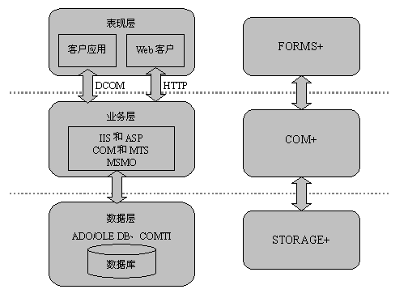
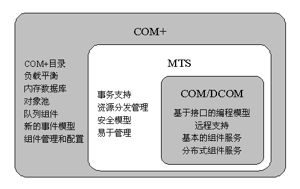
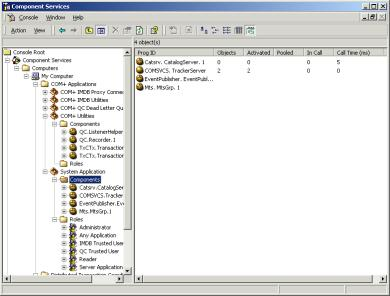
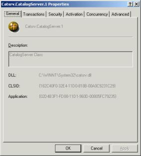
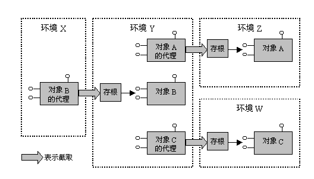
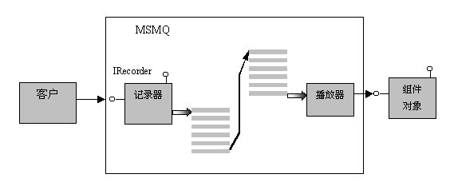
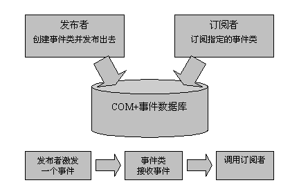
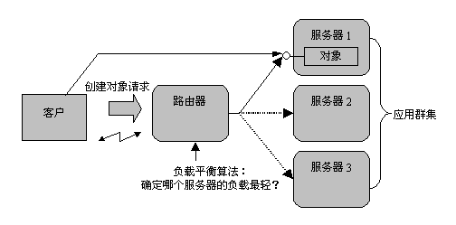
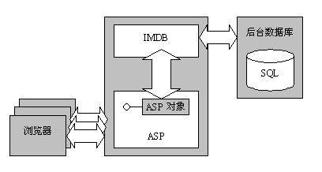
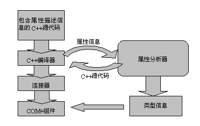

<h1>COM+理解</h1>
(作者：潘爱民)  
  

我们从各种媒体对Windows 2000的介绍可以看到，在Windows 2000众多新的功能和特性之中，对于开发人员来说，COM+是最值得关注的一个焦点。在Windows 2000的Beta版本中，我们已经看到了COM+的面貌，也感受到了COM+将带给我们程序设计和开发过程中思路上的变化。本文旨在从技术的角度对COM+作一个基本的介绍，以便开发人员更好地了解COM+。

COM+并不是COM的新版本，我们可以把它理解为COM的新发展，或者为COM更高层次上的应用。COM+的底层结构仍然以COM为基础，它几乎包容了COM的所有内容。有一种说法这样认为，COM+是COM、DCOM和MTS(Microsoft Transaction Server)的集成，这种说法有一定的道理，因为COM+确实综合了这些技术要素。但更重要的一点是，COM+倡导了一种新的概念，它把COM组件软件提升到应用层而不再是底层的软件结构，它通过操作系统的各种支持，使组件对象模型建立在应用层上，把所有组件的底层细节留给操作系统，因此，COM+与操作系统的结合更加紧密，这也是COM+非得等到Windows 2000发布才能面世的主要原因。

我们知道，COM是个开放的组件标准，它有很强的扩充和扩展能力，从COM到DCOM，再到MTS的发展过程也充分说明了这一点。对COM有使用经验的读者一定可以感觉到，虽然COM已经改变了Windows程序员的应用开发模式，把组件的概念融入到Windows应用中，但是由于种种原因，DCOM和MTS的许多优越性还没有为广大的Windows程序员所认识。MTS针对企业应用和Web应用的特点，在COM/DCOM的基础上又添加了许多功能和特性，包括事务特性、安全模型、管理和配置等，MTS使COM成为一个完整的组件体系结构。由于历史的原因，COM、DCOM和MTS相互之间并不很融洽，难以形成统一的整体，不过，这种状况很快就要结束，因为COM+将把这三者有效地统一起来，形成一个全新的、功能强大的组件体系结构，并且把DCOM和MTS的各种优势以更为简捷的方式带给Windows 2000程序员和用户。

本文分四个部分，第一部分介绍COM+的基本结构；第二部分介绍COM+提供的一些系统服务；第三部分讲述COM+应用开发模型；第四部分介绍COM+的特性并作简要总结。通过阅读这些内容，读者可以看到，COM+将带给我们一些什么样的程序设计概念，它和Windows 2000将如何改变我们的应用，如何改变应用的开发模式。

**一****.COM+****基本结构**

COM+不再局限于COM的组件技术，它更加注重于分布式网络应用的设计和实现，已经成为Microsoft系统平台策略和软件发展策略的一部分。COM+继承了COM几乎全部的优势，同时又避免了COM实现方面的一些不足。COM+紧紧地与操作系统结合起来，通过系统服务为应用程序提供全面的服务，这一部分介绍COM+的基本结构。

**1.Windows DNA****策略**

在介绍COM+结构之前，我们首先看看Microsoft推出的Windows DNA(Distributed interNet Application Architecture)策略，因为COM+将在DNA策略中扮演重要的角色。Windows DNA是Microsoft多年积累下来的技术精华集合起来而形成一个完整的、多层结构的企业应用总体方案，它使Windows真正成为企业应用平台。

熟悉MTS的读者一定知道，Microsoft在MTS的基础上提出了多层软件结构的概念。从大的方面来讲，一个企业应用或者分布式应用可以分为表现层、业务层和数据层。表现层为应用的客户端部分，它负责与用户进行交互；业务层构成了应用的业务逻辑规则，它是应用的核心，通常由一些MTS组件构成；数据层为后台数据库，它既可以位于专用的数据服务器，也可以与业务层在同一台服务器上。MTS主要位于中间层，它为业务组件提供了一个运行和管理的统一环境。图1(a)显示了这种多层结构的技术组成模型。

Windows DNA是一个简化了的三层结构，如图1(b)所示。

 (a) 三层结构技术组成模型 (b) Windows DNA结构

图1

在现有的系统平台以及软件开发工具条件下，为了实现多层结构的企业应用，我们必须使用各种分离的技术，开发人员要学习每一种软件技术，包括使用Win32 API以及系统提供的一些服务。图1(a)列出了某些可能用到的软件或者技术，学习这些知识本身就不是一件轻松的事情，更何况要开发出优秀的应用程序来。在Windows平台上使用过这些技术的程序员一定深有体会。

图1(b)则要简明得多，这是一个尚未实现的结构模型，但是Microsoft正在朝这个方向努力。在表现层，我们现在开发应用程序，要么使用Win32 API开发客户应用，要么利用HTML或DHTML直接把浏览器用作客户应用。在DNA结构中，FORMS+还只是一个技术框架，它将把Win32 GUI和Web API结合起来，并朝着DHTML的方向发展，我们可以从已经发布的Microsoft Internet Explorer 5的结构模型中看到FORMS+的一些端倪。在数据层，STORAGE+还只是一种提法，不过Microsft已经把数据库接口从ODBC转移到ADO和OLE DB上，这将最终促进数据层接口技术的统一。

在中间业务层，COM+已经成为现实，它以系统服务的形式把原先散落的众多技术综合起来，并提供简单的编程模型，以直接应用层的编程接口为应用程序提供服务。COM+是DNA结构的核心，它将成为企业应用或者分布式应用的基本工具。伴随着Windows 2000的面世，DNA结构也将逐渐清晰，最终带给我们一个全新的应用软件模型。

**2.COM+****基本结构**

COM+的基本结构并不复杂，简单说起来，它把COM和MTS的编程模型结合起来，同时又增加了一些新的特性。

  

从COM的发展角度来看，COM最初作为桌面操作系统平台上的组件技术，主要为OLE服务。但是随着Windows NT与DCOM的发布，COM通过底层的远程支持使组件技术延伸到了分布式应用领域，充分体现了COM的扩展能力以及组件结构模型的优势。MTS为COM增添了许多新的内容，弥补了COM和DCOM的一些不足，它注重于服务器一端的组件管理和配置环境。COM+进一步把COM、DCOM和MTS统一起来，形成真正适合于企业应用的组件技术。COM、DCOM、MTS以及COM+的结构关系如图2所示。

图2 COM+组成结构图

COM+不仅继承了COM、DCOM和MTS的许多特性，同时也新增了一些服务，比如负载平衡、内存数据库、事件模型、队列服务等。COM+新增的服务为COM+应用提供了很强的功能，建立在COM+基础上的应用程序可以直接利用这些服务而获得良好的企业应用特性，本文第二部分将重点介绍这些服务。

COM+还提供了一个比MTS更好的组件管理环境，如图3所示。COM+管理程序(COM+ Explorer)也采用了MMC(Microsoft Management Console)标准界面。对应于MTS中的包(Package)，COM+称之为COM+应用(COM+ Application)，每一个COM+应用也包括一个或多个COM+组件以及与应用有关的角色信息。通过COM+管理程序，我们可以设置COM+应用和COM+组件的属性信息，比如组件的事务特性、安全特性等等。如图4所示。

图3 COM+管理程序运行示意图

图4 COM+组件的属性配置示意图

我们知道，COM和MTS把组件的所有配置信息都保存在Windows的系统注册表中，然而，COM+的做法有所不同，它把大多数的组件信息保存在一个新的数据库中，称为COM+目录(COM+ Catalog)。COM+目录把COM和MTS的注册模型统一起来，并提供了一个专门针对组件的管理环境。我们既可以通过COM+管理程序检查或设置COM+目录信息，也可以在程序中通过COM+提供的一组COM接口访问COM+目录信息。

  
  

COM+一方面提供了许多新的服务和一个一致的管理环境，另一方面它支持说明性编程模型(declarative programming model)，也就是说，开发人员可以按尽可能通用的方式开发组件程序，把一些细节留到配置时刻再确定。举例来说，我们开发一个COM+组件，它支持负载平衡特性，但是我们在开发组件的时候，并不确定它是否使用负载平衡特性，而把是否支持负载平衡特性留待配置时刻再作决定。有的应用可能会需要负载平衡特性，而有的应用可能并不需要，我们可以通过COM+管理程序配置组件的属性来决定组件是否支持负载平衡特性。MTS安全模型实际上是一个典型的说明性编程技术，它把组件的安全角色信息留到配置时刻再给出确切的定义，而非编程时刻。COM+继承了MTS的安全模型。

利用COM+的服务和管理工具，以及随后发布的一些开发工具，开发一个COM+组件要比开发一个COM组件容易得多，因为COM+组件实际上是建立在COM+系统服务基础上的应用程序，我们可以避免底层繁琐的细节处理。通过COM+系统服务，我们在获得可靠性的同时，也使我们的组件或者应用程序更趋于标准化，在更广泛的范围内体现组件或者应用的多态性。

**3.****对象环境**

COM+组件的可管理性和可配置性是如何获得的呢？如同MTS组件一样，COM+为每一个对象提供了一个对象环境(Object Context)，COM+系统可以在创建COM+对象的时候为其分配一个环境对象，这种技术也被称为截取(intercept)，下面的步骤可以进一步说明截取的概念：

(1) 组件对象通过说明性属性(declarative attributes)指定它的一些基本要求；

(2) 当客户程序调用CoCreateInstance函数时，COM+系统检查客户代码是否运行在与对象类兼容的对象环境中；

(3)如果客户代码的运行环境与对象类所要求的兼容，那么不必使用截取技术，直接创建对象并返回对象的接口引用；

(4) 如果不兼容，那么CoCreateInstance函数切换到一个与对象类兼容的环境中，然后创建对象并返回一个代理对象；

(5)在以后的接口方法调用过程中，代理对象在调用前和调用后都要做一些处理以便方法的运行环境能够满足对象的要求。

COM+引入了环境(context)的概念，它是指共享同一套运行要求的对象集合。由于不同的对象类可能使用了不同的配置信息，所以一个进程通常包含一个或多个环境，这些环境的配置互不兼容。所有无配置信息的对象都驻留在调用方的环境中。每一个环境都有一个对象，即对象环境，运行在此环境中的对象可通过CoGetObjectContext API函数得到此对象环境，利用对象环境的IObjectContextInfo接口可以访问到环境的属性信息。

COM+的对象引用即客户拥有的对象接口指针与环境相关，所以我们不能简单地把对象引用从一个环境传递到另一个环境。当客户从一个环境调用到另一个环境中的对象时，中间必须经过代理对象和存根代码，由代理对象截取调用，负责进行环境切换，这个过程类似于COM的跨进程列集(marshaling)处理。如图5所示。

图5 跨环境调用示意图

从图5我们可以看出，环境与COM线程模型中的套间(apartment)非常类似，当对象引用(即对象接口指针)从一个环境传递到另一个环境时，它也要经过列集(marshaling)处理，即调用CoMarshalInterface和CoUnmarshalInterface函数。这样才能保证客户代码和对象分别在自己的环境中执行，对于支持事务特性、安全特性或其他特殊要求的应用，这是很重要的。

虽然跨环境的调用必须经过代理和存根代码，但是这并不意味着需要经过线程切换，这是环境与套间的重要区别。在跨套间调用过程中，影响性能的主要因素在于线程切换，而不是参数列集(marshaling)和散集(unmarshaling)处理，因此跨环境调用比跨套间调用的效率可能要高得多。COM+引入了环境概念，但套间的概念仍然存在，两者的区别在于，套间是线程模型的基本单元，而环境则是列集机制的基本边界。环境和套间没有包含关系，一个环境中的对象可以运行在不同的套间，此时跨套间调用也必须经过代理对象；一个套间中的对象也可以包含多个环境对象，此时跨环境调用也必须经过代理对象。

从以上对COM+的介绍我们可以看出，COM+的底层结构仍然以COM为基础，但在应用方式上则更多地继承了MTS的处理机制，包括MTS的对象环境、安全模型、配置管理等。但COM+并不是对COM和MTS进行简单的封装，它也引入了许多新的内容，正是这些新特征使得COM+更加适合于企业应用的组件对象模型，这些新特征通过一组系统服务来体现，下一部分介绍这些系统服务。

**二****.COM+****系统服务介绍**

COM+的系统服务充分体现了COM+的特征，通过这些系统服务，我们可以很容易地开发出多层结构的应用系统，因为这些系统服务本身已经满足了多层应用的一些基本要求。COM+以系统服务的形式为应用提供了许多新特性，这有多方面的好处，首先，客户或者组件程序可以直接利用这些系统服务，避免了底层的细节处理，减少开发成本，降低代码量，同时也减小了犯错误的可能性；其次，有一些系统服务涉及到较复杂的逻辑，可能要访问底层的系统资源，应用层很难实现这些系统服务；另外，使用系统服务可增强可靠性，因为这些系统服务已经经过严格的测试，应用系统要获得同样的可靠性需要很昂贵的代价。

COM+的系统服务有的从MTS继承过来，有的是新增加的。这一部分重点对新增的一些系统服务作初步的介绍，包括队列组件、负载平衡、内存数据库和事件服务，最后介绍其他一些在MTS中已经引入的、但COM+又增强了的系统服务，包括事务、对象池、安全模型以及管理特性。

**1.COM+****队列组件**

我们知道，COM客户与远程组件之间的交互是基于RPC连接的，客户连接到一个组件对象，请求指定的接口，然后通过接口指针执行同步调用。虽然COM也允许异步调用，但客户与组件的生存期必须保持一致，调用必须在连接有效期范围内进行。

COM+除了支持这种基于RPC连接的运行方式，它还支持另一种运行模式，我们称为基于消息的通讯过程，它可以有效地把客户与组件的生存期分离开。这种模式通过COM+的队列组件服务实现，图6是队列组件的基本模型结构。

图6 队列组件模型结构图

  
  

队列组件并没有使用直接的RPC连接，而是采用了底层的消息系统MSMQ(Microsft Message Queue Server)。通过底层的队列机制，客户与组件的生存周期可以被分离在不同的时间点上。客户程序不再直接调用组件对象，它利用消息机制与组件对象进行通讯，即使组件对象并没有运行，客户程序仍然可以执行操作。

COM+应用可以以透明方式支持同步和异步两种调用方式，当客户和组件程序建立了连接之后，客户以同步方式直接调用组件的方法；如果客户与组件没有建立直接的连接，那么客户以异步方式与组件进行通讯。如果组件对象被标识为“队列化”，那么它支持队列方式运行，于是一个被称为“COM+记录器”的代理对象自动把所有该组件的调用请求记录到一个永久队列中，该队列被保存在客户机上；以后当客户机连接到网络上，位于服务器上的“COM+播放器”从永久队列中获得调用信息，执行真正的调用操作。队列组件以透明的方式把同步和异步两种程序运行方式统一在一个单一的编程模型中，所以COM+应用系统为获得异步特性并不需要作额外的工作。我们仍然可以按通常的方式开发组件和客户程序，但是由于队列方式的特殊性，所以组件必须满足两个限制条件：第一，组件的接口成员函数只能有输入参数，不能包含输出参数，这些输入参数将被传递到MSMQ消息中；第二，组件接口成员函数的返回值HRESULT的含义不能与应用相关，它不标识与应用有关的信息。

在队列组件的异步交互过程中，客户程序创建一个组件对象，它实际上创建了一个记录器代理对象，所有的调用都通过记录器进行，记录器把调用请求记录下来，然后通过MSMQ传递到服务器组件，服务器上的播放器再执行这些方法调用。使用这种异步方法的难点在于，客户程序如何获得返回信息，这包含几种可能情况以及解决办法：第一，客户并不关心执行结果；第二，我们可以用响应队列来实现客户程序；第三，客户也可以把自己的一些特征信息传递给组件对象，以便组件对象以同样异步的方式通知客户应用。选择什么样的解决方法取决于应用的需要，我们可以灵活使用各种技术。

队列组件对于分布式应用非常有意义，尤其是在慢速网络上运行的应用系统，这种机制可以保证应用系统能够可靠地运行。在应用系统包含大量客户节点但服务器数量又比较少的情况下，客户应用程序可以把它们的请求放到队列中，当服务器负载比较轻的时候再处理这些请求，因此队列机制也从另一个角度实现了应用系统的负载平衡以及可伸缩特性。

**2.COM+****事件模型**

COM不仅定义了客户调用组件对象的通讯过程，它也定义了反向的通讯过程，这就是COM可连接对象(connectable object)机制。组件对象定义了出接口(outgoing interface)的所有特征，客户程序实现出接口，当客户程序与对象建立连接之后，客户通过连接点对象建立它与客户端接收器对象之间的反向连接。实际上，这时的连接点对象成了接收器对象的客户方。

COM的可连接对象有很大的优势，它的扩展能力非常强，几乎总是可以满足应用的需要。但是从实际应用的情况来看，它也存在一些缺点，表现在以下几个方面：第一，事件源和客户方紧紧绑定在一起，双方程序代码依赖于出接口的定义，我们必须在编译时刻知道对方的信息；第二，源对象需要编写大量代码来支持这种机制，尤其是为了支持多通道事件；第三，连接点接口的设计模式并没有考虑到分布式环境的特点，所以它在分布式环境下并不很有效。

COM+事件模型改进了COM的可连接对象机制，它采用了多通道的发布/订阅(multicasting publish/subscribe)事件机制，它允许多个客户去“订阅”事件，这些事件由各种组件对象“发布”。COM+事件服务维护一个事件数据库，数据库包含各种事件、发布者、订阅者以及所有的订阅信息。当发布者激发事件时，COM+事件服务对事件数据库中有关的订阅信息进行检查，然后通知对应的订阅者。COM+事件模型基本结构如图7所示。

图7 COM+事件模型结构图

COM+事件模型通过事件类来传递源对象的出接口事件信息，以便它可以与客户方的入接口事件方法相匹配，这种方式与COM可连接对象机制很类似，所以老式的COM组件和客户程序可以很方便地使用新的COM+事件模型。

COM+事件模型用中心服务和中心管理的方式把发布者与订阅者之间的依赖关系分离开，它用事件类作为发布者和订阅者之间的中间对象，发布者必须通过事件类发布信息。事件类是由COM+事件服务提供的对象，它实现了事件接口，所以对于发布者来说，它扮演了订阅者的角色。当发布者要激发事件时，它创建一个事件类对象，调用相应的事件方法，然后释放对象的接口。COM+事件服务会决定如何通知订阅者，决定什么时候通知订阅者。如同队列组件情形一样，发布者和订阅者的生存时间可以被分离，从这个意义上讲，所有事件接口函数只能包含输入参数。

订阅者订阅事件也很方便，它只要通过COM+事件服务创建一个订阅对象，并注册到事件数据库中，以后它就会接收到来自发布者的事件通知。

COM+事件系统不仅仅为应用程序提供事件服务，它也为操作系统的内部实现提供事件服务，比如，它也用来实现Windows 2000的底层系统事件通知服务(SENS)，包括用户登录事件、网络连接事件等等，我们可以创建和注册一个订阅对象来接收这些系统事件。这是COM+事件系统的一个应用，当然接收这种系统事件必须符合一定的安全策略。

**3.****负载平衡**

负载平衡是分布式应用的一种高层次需求，如果没有很好的工具支持，那么实现负载平衡需要付出很大的代价。我们可以使用DCOM和MTS的配置特性实现静态负载平衡，但是要实现真正的动态负载平衡并不容易，我们很难根据当前系统的负载状态把对象创建请求传递到负载最轻的机器上，我们必须编写大量的代码来间接支持这种特性。

COM+提供了一个负载平衡服务，它可以以透明方式实现动态负载平衡。但是为了使组件支持负载平衡，首先我们必须定义一个应用群集(application cluster)，应用群集是指一组已经安装了服务器端组件的机器(至多可达8台机器)，然后我们把一台机器配置成负载平衡路由器(router)，负载平衡路由器会把对象的创建请求传递到应用群集中的某一台机器上。

COM+负载平衡以NT系统服务的形式运行在路由器机器上，当路由器的SCM(Service Control Manager)接收到远程创建对象请求时，它把请求传递到负载最轻的机器上。实现负载平衡的一个难点是如何确定应用群集中的哪台机器是负载最轻的。COM+负载平衡引擎使用缺省的负载平衡算法，它根据每台机器上每个对象实例的方法调用的响应时间作为参考值计算出负载平衡参数，这种算法不一定是最佳算法，但对于大多数应用已经足够了。COM+也允许应用程序使用自定义的负载平衡引擎。

COM+负载平衡应用模型中对象创建过程如图8所示。

图8 负载平衡模式下对象创建示意图

  
  

客户程序仍然可以按通常的方式创建远程对象，在CoCreateInstanceEx函数中指定路由器机器名，当创建成功之后，它得到的对象实例运行在当前负载最轻的服务器上。路由器检查COM+目录，看请求创建的组件对象是否支持负载平衡，如果是，则它根据路由算法，把创建请求路由到负载最轻的服务器上。然后，应用群集中的服务器接收到创建请求之后，它就创建对象，并把对象引用直接返回给客户机。因此，一旦对象已经被成功创建，那么客户与对象之间的连接是直接进行的，而不必再通过路由器。

COM+应用程序的负载平衡特性并不需要编写代码来支持，客户程序和组件程序都可以按通常的方式实现。因此，获得负载平衡特性不是一种程序设计和开发的行为，而是一种配置行为，通过配置实现分布式应用程序的负载平衡。当然我们在编写负载平衡组件时，要避免使用与当前机器环境相关的信息，比如当前机器的名字或者依赖与本地机器上某个路径下的某个文件，等等。

**4.****内存数据库(IMDB)**

COM+的内存数据库(In Memory Database)服务是一个全新的服务，它用于保存应用的非永久状态信息。我们知道，对于以数据为中心的应用软件，为了提高系统的运行效率，它应该尽可能让更多的数据驻留在内存中，尤其是客户程序频繁访问的数据信息。IMDB是一个驻留在内存中的支持事务特性的数据库系统，它可以为COM+应用程序提供快速的数据访问。

IMDB的基本功能在于优化数据查询和数据获取，它可以装载后台数据库系统中的数据表，也可以装载应用程序的非永久数据信息。使用IMDB的最典型的例子是Web应用，它把客户频繁访问的数据信息放在IMDB中，以便成百上千的客户得到快速的响应。因为物理内存容量越来越大(在机器上安装2GB物理内存已经成为现实)，并且价格越来越便宜，所以通过IMDB，我们只要增加物理内存就可以提高系统的响应速度，而且把频繁访问的数据从数据层移到业务层可以有效地减少网络流量。图9给出了基于IMDB的Web应用基本结构。

图9 基于IMDB的Web应用结构示意图

IMDB的接口为OLE DB和ADO，所以组件对象可以通过这些标准接口访问IMDB。由于IMDB是内存中的数据库，所以IMDB只对本机器上的COM+组件有效，也就是说，IMDB不支持分布式概念，并且多个IMDB机器不能装入同一个数据表，如果多个组件要共享IMDB中的信息，那么这些组件必须运行在同一台机器上。

IMDB以NT系统服务的形式运行在服务器上，在服务启动时，IMDB从后台数据库中把所有指定的数据表装入到共享内存中。IMDB以整个数据表为单位装载数据，如果内存不够，装不下整个表，那么IMDB会产生错误。组件对象通过进程内代理对象访问IMDB中的数据表。因为IMDB为了使数据访问尽可能快速，它并没有实现SQL查询处理器，所以我们不能使用SQL命令访问IMDB数据，只能通过标准的ISAM技术访问IMDB数据，也就是说我们必须通过索引访问数据。

IMDB不仅可以把数据表缓冲起来，它也可以管理应用系统的非永久状态信息，如果运行在同一台机器上的不同组件需要共享大量的信息，那么选择IMDB是一个理想的解决方案。

**5.****对其他服务的增强**

前面介绍的几个系统服务是COM+针对分布式应用新增加的服务，这些服务以及其他一些原先在MTS中已经提供的服务合起来构成了COM+的底层服务体系。我们知道，COM已经提供了组件对象与客户程序之间的基本通讯过程，包括对象创建、跨进程机制、接口管理等等，而COM+提供的底层服务则着眼于一些高层次的应用需求，特别是构建大型软件系统或者分布式软件系统需要支持的一些特性。下面对COM+在MTS基础上增强的一些服务作一简要说明。

(1) 事务特性。

事务允许组件可以把一组独立的操作形成一个整体操作，事务操作要么成功，要么失败。COM+仍然支持MTS的事务语义，通过SetAbort或SetComplete完成事务操作。COM+还支持其他的事务操作模式，如果一个对象被标为“AuotAbort”，那么在事务操作过程中，若发生异常，则系统自动调用SetAbort。同样地，如果一个对象被标为“AutoComplete”，那么在每一个方法调用之后，除非此方法显式调用了SetAbort，否则系统会自动调用SetComplete。而且COM+还支持BYOT(Bring Your Own Transaction)，即允许COM+组件参与非MTS事务处理环境管理的事务。

(2) 安全性。

COM+的安全模型仍然沿用了MTS的基于角色的安全模型，根据用户的角色访问应用的有关功能模块。这种安全模型需要开发人员与管理人员协同完成，在开发阶段，开发人员负责定义各种角色，并且在实现组件功能时，只允许指定角色的用户才可以执行这些功能；在配置阶段，管理员负责为所有的角色指定有关的用户帐号。COM+扩充了MTS安全模型，它允许开发人员和管理员指定到方法一级的安全控制，在MTS安全模型中，我们只能在MTS包一级指定安全角色。通过COM+对象环境信息，COM+的安全模型更为细致，比如，它允许开发人员控制每一个接口、或者每一个方法如何扮演客户，等等。

(3) COM+对象池。

对象池是指把对象的实例保留在内存中，以便当客户请求创建对象时可以马上用到这些对象。对象池如同IMDB一样，完全是出于效率考虑的原因，用来建立大型的应用系统。对象池的概念在MTS 2.0中已经被引入了，因为MTS组件的IObjectControl接口的三个成员函数Activate、Deactivate和CanBePooled用于对象池的管理。但是MTS 2.0实际上并没有支持对象池，也就是说，不管对象是否支持对象池缓存操作，它的IObjectControl::CanBePooled函数永远不会被调用到。COM+继承了MTS对象池的概念，并且真正实现了对象池的功能。

(4) 管理服务。

在本文第一部分我们已经看到了COM+管理程序，它代替了MTS管理程序(MTS Explorer)和DCOM配置程序(DCOMCNFG.EXE)。对于多层结构应用，COM+管理程序是个不可缺少的工具，应用系统的安全特性以及事务特性等基本配置都需要通过管理程序实现。由于MMC界面操作简单、直观，所以管理员无须学习其他的管理工具，就可以配置所有的应用系统。而且COM+管理程序支持脚本语言，因此，开发人员和管理员可以创建一些脚本代码以便实现管理工作的自动化。COM+还引入了一个新的“ApplID”，它是一个128位GUID，标识一个与一组属性值相联系的CLSID。通过“ApplID”，管理员可以为应用配置和维护多个版本。

这一部分重点讨论了COM+的各个系统服务，尤其是COM+新增加的几个系统服务，这些系统服务使COM+更加适合于分布式应用的开发。有些系统服务并不需要COM+应用通过编程来获得，比如负载平衡和队列组件服务等；而有的服务则可以简化编程模型，比如事件服务；其他有一些服务可以用来提高系统的性能，比如内存数据库、对象池等。

**三****.COM+****应用开发**

在介绍了COM+的基本概念以及系统服务之后，第三部分我们讨论COM+应用开发的一些问题。首先我们讨论从COM转向COM+对于应用开发模式带来的变化，然后介绍基于属性的C++编程语言。

**1****.应用开发支持**

COM规范的一个重要特征是它定义的COM接口与开发语言无关，因此我们可以在各种开发语言中实现COM对象或者使用COM对象，事实也确实如此。但是，我们可以发现，虽然COM与C++的二进制结构最为接近，但我们在C++语言中实现COM对象并不轻松，编写一个C++类与实现一个COM对象有很大的差别，即使使用了MFC或者ATL这样的类库或模板库，我们仍需要学习COM的一些底层知识，否则难以编写出正确无误的组件程序。

  
  

用过Visual Basic 6.0的读者一定有这样的体会，在VB6中编写自动化(Automation)组件非常简单，只要按常规的方法编写“Class Module”即可实现COM组件。Vb6编译器承担了所有的底层细节处理任务，对于程序员而言只是一些“Class Module”。虽然这种开发模式限制了程序员的控制能力，但对于大多数情况，VB6不失为一个快速实现COM组件的开发环境。

COM+推出之后，它的开发模式也将有一些转变，尤其对于Visual C++程序员，在编译时刻程序员可以在代码中使用一些说明性的语句来设置COM+组件的属性，比如CLSID、ProgID、线程模型以及双接口等，如果不指定这些属性，编译器将使用缺省值。以前我们为了使COM组件支持某些非缺省的特性，我们必须通过编写代码来实现这些特性，所以程序员一定要对各种特性了解得非常清楚才能够编写出正确的代码来，这也是实现COM组件的一个难点。COM+一方面与操作系统紧密结合，另一方面从开发的角度来讲，COM+将进一步与编译器结合，它将扩展C++的一些语法，使得我们可以在代码中描述COM+特性，然后由编译器直接提供这些特性的支持，从而减少程序员的工作量，提高COM+组件的生产效率。

在代码中利用说明性的语句指示编译器产生与COM+组件有关的元数据(metadata)，COM+运行系统将利用这些元数据管理COM+组件。从某种意义上讲，我们可以认为元数据是一些类型库信息，所以，实际上支持COM+组件的C++开发系统将把IDL/ODL的语法与C++语法结合起来。后面讲到基于属性的编程模型时我们将会看到这种情况。

全面支持COM+组件的开发工具要等到Windows 2000发布之后，在Visual Studio的下一个版本中才可能实现。作为一种兼容的方案，在现在的Visual C++版本中，编译器仍然只支持原先的C++语法，当它在预处理过程中，碰到说明性的描述信息时，它把这些属性信息交给属性分析器去处理，属性分析器是一个编译扩展模块，它把属性信息转换成C++代码，然后送回编译器，编译器再把这些源代码编译到目标代码中。属性分析器产生的其他一些信息，比如类型信息，也被编入最终代码。编译器的结构如图10所示。

图10 COM+组件编译过程示意图

**2.****基于属性的C++编程语言**

基于属性的编程模型将直接把COM+组件的属性信息写到C++源代码中，指导编译器产生COM+组件，这样可以使程序员不必编写底层的处理代码，因为这些代码对于几乎所有的组件都差不多，因此让开发工具直接产生这些代码可避免重复劳动。这种方式比MFC的宏以及ATL的模板类更为直接。

属性并没有影响基本的C++语义，并且属性的语法也比较简单。属性可以用在任何说明性的语句前面，比如C++类的声明、变量的声明都可以在其前面用方括号指定其属性。需要注意的是，通常我们不在类型或者实例定义语句中指定属性信息。下面的代码说明了属性的用法：

\[ 

 uuid("346bf467-3467- d211-23c6-000000000000"),

 helpstring("IMyInterface Interface"),

\]

interface IMyInterface : IUnknown

{

 HRESULT Func1 ( \[in\] long, \[out,retval\] long\* );

 HRESULT Func2 ( \[in\] long, \[out,retval\] long\* );

};

\[

 coclass,

 progid("MyComp.MyObj.1"),

 uuid("346bf468-3467- d211-23c6-000000000000"),

 helpstring("MyObj Class")

\]

class CMyObj : public IMyInterface

{

public:

 CMyObj ();

// IMyInterface

public:

 HRESULT Func1 ( \[in\] long, \[out,retval\] long\* );

 HRESULT Func2 ( \[in\] long, \[out,retval\] long\* );

 ……

};

如果读者熟悉IDL或者ODL语法，那么对上面例子中的属性描述一定非常清楚。Visual C++的属性分析器分析属性关键字，并产生相应的C++源代码(实际上是ATL代码)。下表列出了属性分析器支持的一些常用属性关键字。

  
  

表1 常用属性关键字列表

|   |   |
| --- | --- |
| 属性关键字 | 说明 |
| coclass | 加入COM特性支持，产生相应的IDL文件。 |
| dual | 把一个接口标记为双接口，支持两种访问方式：vtable或者IDispatch。 |
| emitidl | 指示后续所有的属性信息都被写到IDL文件中。 |
| id | 指定自动化接口中方法的分发ID(DISPID)。 |
| in/out | 指定参数的传递方向。 |
| progid | 指定组件的ProgID。 |
| retval | 指示此参数为方法的返回值。 |
| threading | 指定组件的线程模型。 |
| uuid | 指定类、类型库或者接口的GUID标识。 |
| module | 指定组件程序的信息，包括程序类型、文件名、类型库GUID、版本等信息。 |

基于属性的编程模型为Visual C++程序员开发COM+组件提供了捷径，它避免了MFC繁杂的宏定义和ATL晦涩的模板类。属性编程模型还包括其他一些语义或语法，比如事件定义、对象构造等，我们将可以在新版本的Visual C++或者COM+ SDK中看到这些变化。

**四**.**总结**

虽然COM+仍然以COM和MTS为底层基础，但是由于它定位的原因，所以COM+新增加的内容较多。与COM相比较，COM+与Windows操作系统结合得更为紧密，反过来，Windows操作系统也更加依赖于COM+；与MTS相比较，COM+更加适合于分布式应用的开发，它提供了许多大型分布式应用系统才可能用到的一些功能。从目前计算机硬件以及Windows操作系统的发展趋势来看，COM+有可能成为推动Windows 2000操作系统的一个重要技术支柱，同时COM+和Windows 2000联合起来使得企业应用直接进入分布式应用领域，这是我们目前已经可以感觉得到的一个发展方向。

以下列出COM+的几个主要特性：

(1) 真正的异步通讯。COM+底层提供了队列组件服务，这使客户和组件有可能在不同的时间点上协同工作，COM+应用无须增加代码就可以获得这样的特性。

(2) 事件服务。新的事件机制使事件源和事件接收方实现事件功能更加灵活，利用系统服务简化了事件模型，避免了COM可连接对象机制的琐碎细节。

(3) 可伸缩性。COM+的可伸缩性来源于多个方面，动态负载平衡以及内存数据库、对象池等系统服务都为COM+的可伸缩性提供了技术基础，COM+的可伸缩性原理上与多层结构的可伸缩特性一致。

(4) 继承并发展了MTS的特性。从COM到MTS是一个概念上的飞跃，但实现上还欠成熟，COM+则完善并实现了MTS的许多概念和特性。

(5) 可管理和可配置性。管理和配置是应用系统开发完成后的行为，在软件维护成本不断增加的今天，COM+应用将有助于软件厂商和用户减少这方面的投入。

(6) 易于开发。COM+应用开发的复杂性和难易程度将决定COM+的成功与否，虽然COM+开发模型比以前的COM组件开发更为简化，但真正提高开发效率仍需要借助于一些优秀的开发工具。

COM+标志着Microsoft的组件技术达到了一个新的高度，它不再局限于一台机器上的桌面系统，它把目标指向了更为广阔的企业内部网，甚至Internet国际互连网络。COM+与多层结构模型以及Windows操作系统为企业应用或Web应用提供了一套完整的解决方案。

本文写在Windows 2000和COM+发布之前，最终COM+的面貌和功能可能会有所取舍。由于种种原因，第二部分介绍的系统服务在最终发布的Windows 2000中不一定全部实现，但以后的版本一定会逐步实现所有这些服务；第三部分介绍的开发方式可能在Microsoft的下一代开发工具中会有所改变，不过我们可以对这种开发模型有所认识，提前做好思想上的准备。