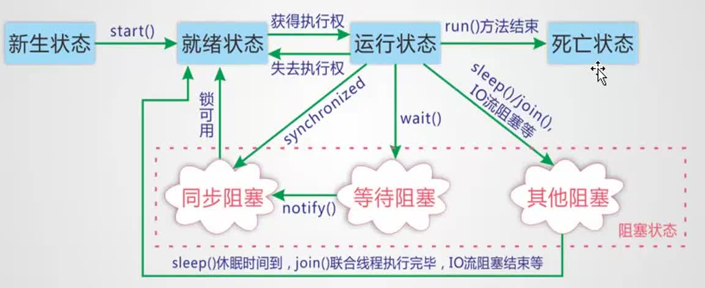

全局代码块

<%！ %> 括起来的代码块

# Java复习

*   整型默认int 浮点数默认double
*   默认转型

*   有long就为long
*   有double就为double

*   && 短路
*   引用占用四个细节
*   bool为四个或者一个（数组时）

# 05 创建war项目

创建Maven project时选择Packaging为War型

在webapp文件夹下，新建meta-info web-info两个文件夹及web.xml文件

04Maven项目关系

目录结构-jar版

*   src/main/java com.bjsxt（src.main.java.com.bjsxt） 用来写java代码。最终打包只有com.bjsxt，其他没有体现
*   src/main/resources 也是快捷目录（src.main.java.com.bjsxt的快捷目录）存放的是配置文件，虽然看见resources但是里面所有配置文件最终会被编辑放入到casses类路径（web项目的话，jar项目直接放到根目录下）
*   src/test/java 写测试java代码
*   src/text/resources/测试用的配置文件
*   pom.xmlMaven的配置文件。当前项目所依赖的其他项目或jar包或插件等

Maven项目之间的关系

*   依赖关系：标签《dependency》把另一个项目的jar引入到当前项目；自动下载另一个项目所依赖的其他项目
*   继承关系：父项目（所有有子项目的项目都是父项目，他可以是另一个父项目的子项目）的打包类型一定要选择pom。具有继承关系时，pom.xml就会多一个标签

*   如果子项目的groupid和version与父项目相同，在子项目中可以不配置这两项
*   父项目pom.xml中是看不到有哪些子项目的。在逻辑上具有父子项目关系

*   聚合关系：前提是继承关系。只是父项目会把子项目包含到父项目中。子项目的类型必须是maven module 而不是mavenproject。这个跟上一个没有根本的区别，只是在逻辑关系上表明父子关系。具有聚合关系的父项目，在pom.xml中多一个《modules》标签

聚合项目和集成关系的区别

*   在语义上，聚合项目的父项目和子项目具有较强的关系（只是多了，父项目对子项目关系的体现）
*   在语义上，单纯的继承关系，只是在子项目中体现出父项目是哪一个

面向项目模型，很多思想上的东西跟面向对象相似

dependencys标签外面加《dependencyManagement》标签，则成为私有的依赖，不能被子项目继承

03Maven项目创建

坐标：每一个jar文件都有一个唯一坐标，通过左边可以精确确定是哪一个jar

Group ID ：公司名称，一般是公司网址倒写

Artifact ID：项目名

Version ：版本

常见一个Maven项目，选项Package 指定项目类型

jar：java项目

war：web项目

pom：逻辑父项目 （project object mode 项目对象模型，即把一个项目（Project）当做对象看待，通过Maven构建工具可以让对象和对象之间产生关系）只要一个项目有子项目，就必须是pom类型。

# 275 提高反射技能的性能，效率

setAccessibe（）

*   该方法，用来启用（true）和禁止（false）访问安全检查的开关
*   禁止安全检查，可以提高反射的运行速度

可以考虑使用：cglib/javaassist字节码操作

ORM Object Relationship Mapping //这里的Relationship 指的是 关系型数据库

OXM Object Xml Mapping

*   类和表结构对应
*   属性和字段对应
*   对象和记录对应

这样就可以将数据库中的表跟类对应，数据行跟对象相对应

# 271 自定义注解

要点：

@interface用来生命一个注解

元注解：注解的注解，用来描述注解的注解

@Target ElemnetType

*   package 包 PACKAGE
*   类、接口、枚举Anotation类型 TYPE
*   类型成员（方法、构造方法、成员变量、枚举值） METHOD CONSTRUCTOR FIELD ENUM
*   方法参数和本地变量 PARAMETER LOCAL-VARIABLE

@Retention RetentionType

*   SOURCE 在源文件中有效（即源文件保留） 编译器时期
*   CLASS 在class文件中有效（即class保留） 类加载时
*   RUNTIME在运行时有效（即运行时保留），在runtime时可以被反射机制读取

@Documented

@Inherited

# 270 注解

注解不是程序本身。可以被其他程序（比如：编译器、jvm--代码级、编译器级、虚拟机级等）读取并解析

@Override @Deprecated @SuppressWarnings all

*   @Target(ElementType.METHOD)
*   @Retention(RetentionPolicy.SOURCE)

@SuppressWarnings

*   @Target(

*   TYPE：类型包含类 接口 枚举
*   FIELD：属性
*   METHOD：方法
*   PARAMETER：参数
*   CONSTRUCTOR：构造方法
*   LOCAL\_VARIABLE：本地变量)

*   @Retention(RetentionPolicy.SOURCE)
*   deprecation 使用了过时的类或者方法的警告
*   unchecked 执行了未检查的转换时的警告，如使用集合时未指定类型
*   failthrough 当在Switch语句使用时发生case穿透
*   path 在类路径、源文件路径等中有不存在路径的警告
*   serial 当在可序列化的类上缺少serialVersionUID定义时的警告
*   finally 任何finally语句不能完成时的警告
*   all 关于以上所有情况的警告

定位分类

*   相对定位：relative是相对于元素原有位置移动指定的距离（top，Left，right，bottom），并且本元素的移动，不会影响其他元素
*   绝对定位：relative 绝对定位默认情况下，他的参考系是。当他的父容器定位方式为相对定位relative，则本元素的绝对定位的参考系是父容器。
*   固定定位：fixed 相对于屏幕的定位，即参考系是屏幕

盒子模型

外边距margin

*   作用：用来设置元素和元素之间的间隙

边框：border

*   作用：用来设置元素的边框大小等格式

内边距padding

*   作用：设置内容和边框之间的距离
*   注意：内边距不会改变内容区域的大小
*   可以单独设置上下左右的内边距

内容区域

*   改变内容区域的大小
*   设置宽和高既可以改变内容区域的大小

并发三要素（多个线程对同一个对象同时操作）

*   同一个对象
*   多个线程操作
*   同时操作

线程同步实现的两个条件

*   线程队列
*   锁机制：synchronize

由于同一进程的多个线程共享同一块存储空间，在带来方便的同时，也带来了访问冲突的问题。为了保证数据在方法中被访问时的正确性，在访问时加入锁机制（synchronize），当一个线程获得对象的排他锁，独占资源，其他线程必须灯带，使用后释放即可。但存在一下问题

*   一个线程持有锁会导致其他所有需要此锁的线程挂起
*   在多线程竞争下，加锁、释放锁会导致比较多的上下文切换和调度延时，引起性能问题
*   如果一个优先级高的线程灯带一个优先级低的线程释放锁，会导致优先级倒置，引起性能问题

# 212 并发 非同步

# 211网红思维

isAlive：表示线程是否还活着

setName getName：真实角色名称（ 名称包括两个 真实角色名称、代理角色名称 ）

Thread.currentThread 当前线程

210 守护线程（注意跟Linux下的守护进程无关）

守护线程：是为用户线程服务的，虚拟机不用等待守护线程执行完毕

线程分为：用户线程和守护线程

虚拟机必须确保用户线程执行完毕

虚拟机不用等待守护线程执行完毕

守护线程功能：后台记录操作日志、监控内存使用

# 208 线程状态

线程状态 Tread.State

*   NEW 尚未启动的线程 新生状态
*   RUNNABLE 就绪状态 运行状态 统称为Runnable
*   BLOCKED 被阻塞，等待监视器锁定的线程处于此状态
*   WAITING 正在等待另一个线程执行特定动作的线程处于此状态
*   TIMED\_WAITING正在灯带另一个线程执行动作达到指定等待时间的线程处于此状态（调用Sleep（）方法，线程就是此状态）
*   TERMINATED 已退出的线程处于此状态

Tread.activeCount 当前活动线程数量，包括主线程

# 206 Join

Join是对象方法，调用该方法的方法（对象.join()所在的方法体）被阻塞，该方法所在的对象开始执行

简单的说就是，join方法的对象插队执行，先获得执行权，执行完毕后，再返回，继续执行join之后的方法

# 205 yield 礼让

yield 让当前正在执行的线程暂停，将线程从运行状态转入就绪状态，让CPU重新调度

与sleep一样都是静态方法，可以直接调用

# 204 线程的停止

设置停止标志位，不停检测标志位，满足条件自动退出

# 203 线程状态

新生状态-每一个新生状态线程都有自己的工作空间

就绪状态-》新生状态调用start（）方法后进入就绪状态，等待CPU分配。就绪状态线程被放入就绪队列

运行状态-》获取到CPU资源的开始运行

阻塞状态-》当调用sleep（）wait（）或同步锁定时，线程进入阻塞状态 sleep占有资源等待 wait不占有资源等待

死亡状态-》stop destroy（均不建议使用已经deprecated）或者运行完毕后

运行状态--sleep（）join（） IO流阻塞等 -》进入其他阻塞

运行状态--wait（）-》进入等待阻塞--notify()-》进入同步阻塞--锁可用-》进入就绪状态

运行状态 --synchronized-》进入同步阻塞--锁可用-》进入就绪状态

# 线程方法

sleep

*   使线程停止运行一段时间，线程此时处于阻塞状态
*   如果调用了sleep方法后，没有其他等待执行的线程，这个时候当前线程不会马上恢复执行，依然处于sleep状态，直到被唤醒
*   sleep让渡执行权，达到某条件后，恢复执行

join（）

*   阻塞指定线程等到另一个线程完成以后再继续执行

yield

*   让当前正在执行线程暂停，不是阻塞线程，而是将线程转入就绪状态
*   调用yield方法后，如果没有其他灯带执行的线程，此时当前线程就会马上恢复执行
*   临时让渡一下执行权，若无其他的竞争人，则自动获得执行权

setDeamon（）

*   将制定的线程设置成后台线程，成为守护线程
*   创建用户线程的线程结束后，后台线程也随之小王
*   只能在线程启动之前将它设为后台线程

setPriority（int newPriority） getPriority

*   线程的优先级代表的是概率
*   范围从1-10 默认5

stop（）

*   停止线程，不建议使用

# 202 lambda（希腊字母 入 的读音）

lambda表达式：

*   避免匿名内部类定义过多（简化匿名内部类定义）
*   其实质属于函数式编程的概念

简化过程：

函数式类、函数式接口（只有一个方法）

外部类-》静态内部类-》局部内部类（方法内部定义的类）-》匿名内部类（借助父类或者接口-因为匿名类没有名字，所以使用父类或接口，后面带实现体{}）-》Lambda 1.去掉内名内部类的父类或者接口用()->代替

# 201 多线程 静态代理模式 本节只有静态代理的内容

Thread（new Runable）这里的Thread 成为代理类，实现代理模式

婚庆公司中的婚庆公司就是代理

真实角色：新婚夫妻 实现 结婚

代理角色：婚庆公司 实现 结婚

真实角色将 结婚 传递给 代理角色

都需要实现代理接口（Thread Run 都实现了两个接口Runable）

详解：真实角色是实现方法，代理角色，负责调用真实角色的方法。

# 200 Callable

属于高级并发编程，juc（Java 5.0 提供的 java.util.concurrent(简称JUC)包）编程的一部分

与Runable 区别

1.  可以抛出异常
2.  可以有返回值

使用步骤：

1.  实现callable 接口，重写call方法//与runable 类似
2.  创建目标对象：CDownloader cd = new CDownloader("picture address","baidu.png");
3.  创建执行服务：ExecutorService ser = Executors.newFixedTreadPool(1);//线程池
4.  提交执行：Future result1 = ser.submit(cd1);//每个线程单独提交
5.  获取结果：boolean r1 = result1.get();//每个线程单独获取
6.  关闭服务：ser.shutdown();

# 199 多线程 龟兔赛跑 抢票

# 08 IO流

08171 IO File 字符集 乱码

08167 文件夹创建遍历

*   mkdir 上级目录不存在，创建失败，抛出异常 mkdirs 上级目录不存在，创建上级目录（若最后一个文件夹创建失败，前面的文件夹已经被创建）
*   list() 列出指定路径内容（应用于路径问文件夹的new File()），返回的是返回的是字符串数组是所有文件的名称。包含文件及文件夹
*   listFiles() 返回的是 File 对象数组 包含文件及文件夹
*   listRoots 列出所有盘符，返回的是File对象数组

递归调用的一般写法，构成，及顺序（一般退出递归条件判断在递归体前面，保证递归体满足调剂才执行）

*   递归头：递归结束语句（条件语句）
*   递归体：递归实际要完成的工作
*   递归尾：调用自身

08168 File API

*   getName() 返回文件名
*   getPath() 返回路径（相对绝对取决于给出的路径，含文件名）new File("filename.ext") -> filename.ext ; new File("d:/filename.ext")->d:/filename.ext
*   getAbsolutePath 取绝对路径
*   getParent 取出，去掉文件名，剩下的路径部分(filename.exe -> null;path/filename.exe -> path; c:/path/filename.ext ->c:/path)
*   exists 若文件存在，做如下判断

*   isFile

*   length() （文件都是字符串）

*   isDirectory

*   length() = 0

*   createNewFile() 创建文件（不能创建文件夹）。若文件存在，则返回false，否则返回true，创建失败抛出IOException异常

*   File(File parent, String child) 根据 parent 路径名和 child 路径名字符串创建一个新 File 实例。
*   File(String pathname) 通过将给定路径名字符串转换成抽象路径名来创建一个新 File 实例。
*   File(String parent, String child) 根据 parent 路径名字符串和 child 路径名字符串创建一个新 File 实例。
*   File(URI uri) 通过将给定的 file: URI 转换成一个抽象路径名来创建一个新的 File 实例。

*   delete()

08167 IOFile API使用规则\_重要

08166 IO开篇

本篇开始是J2SE 第二部分属于应用层面 01-07 是J2SE 第一季高琪 1.基本语法 2.面向对象OOP 3.容器（重中之重）

核心类（五个类三个接口）

*   File 文件类
*   InputStream OutputStree 输入输出字节流
*   Reader Writer 输入输出字符流
*   Closeable 关闭流接口（通知操作系统可以关闭流，释放资源）
*   Flushable 刷新流接口（对缓冲区强制刷新）
*   Serializable 序列化接口

本质上 字符流也是对字节流的封装。

流的方向一切以程序为中心，进入程序的叫输入，流出程序的叫输出

ORM对象关系（数据库）映射

带s的方法

*   startsWith endswith
*   exists
*   equals
*   contains containsAll
*   implements extends throws

名词

*   collections arrays
*   mkdirs

07 容器和数据结构

hashset 底层是 hashmap 底层是 数组链表

treeset 底层是 treemap 底层是 红黑树

vector hashlist 底层是 array数组

queue底层是linkedlist

set list queue 都继承自collect接口

# 157 TreeMap 的使用和底层原理

底层采用红黑树

# 152 手工实现HashMap

底层 数组 加链表

BST 二叉查找树（缺点：不平衡，极端情况成为线性查找-整棵树只有一个分支）---》AVL（A V L 是三个作者的名字）自平衡二叉树（缺点：过于平衡，部分情况建树耗费比查找还高）==》红黑树（根和叶子都是黑色、红色的子节点都是黑色、每一个路径上的黑色节点数相同）

B树（外排序）-》B-树-》B+树-》B×树 也是逐步改进

# 142 LinkedList 特点 底层实现

底层使用链表实现

# 133 容器泛型-底层代码解析

List 与 List 其实是一个东西

collection主要方法:

*   boolean add(Object o)添加对象到集合
*   boolean remove(Object o)删除指定的对象
*   int size()返回当前集合中元素的数量
*   boolean contains(Object o)查找集合中是否有指定的对象
*   boolean isEmpty()判断集合是否为空
*   Iterator iterator()返回一个迭代器
*   boolean containsAll(Collection c)查找集合中是否有集合c中的元素
*   boolean addAll(Collection c)将集合c中所有的元素添加给该集合
*   void clear()删除集合中所有元素
*   void removeAll(Collection c)从集合中删除c集合中也有的元素
*   void retainAll(Collection c)从集合中删除集合c中不包含的元素

# 132 泛型概念 自定义反省

泛型（Generic）是JDK1.5后新增的，可以帮我们建立类型安全的集合

容器（集合）类似一个桶，随便什么东西都可以放，泛型保证，一个桶只能同一种东西，就类似给桶贴一个标签（泛型 类型）指明要放的东西

总结：泛型的本质是“数据类型的参数化”。我们可以把“泛型”理解为数据类型的一个占位符（形式参数），即告诉编译器，在调用泛型时必须传入指定类型的参数

在类的声明处添加泛型列表，例如，这个字符是任何字符无限制，不够一般使用T E K V三个字符。
~~~java
class ClassName{}

public T getProperty(E param1,V param2)
~~~

06 异常机制

RuntimeException（unchecked）：都是可以通过代码避免的异常例如：

*   NullPointException
*   ClassCastException
*   NumberFormatException
*   ArithmaticException
*   IllegalArgumentException
*   IllegalAccessException 反射访问私有属性setAccessible(true)
*   NoSuchElementException
*   InterruptedException Thread.Sleep（）

Exception

*   IOException

*   EOFException

*   SQLException
*   OOM

Error

try withresource(带资源操作的try，这里面应该是会发生unchecked exception的，因为它们实现了closable 接口) 的用法：try(会出现异常的代码，例如打开文件 以及 其他会产生异常的代码) {正常处理代码} // 他会保证try()中任何代码出现问题，都会调用close（调用的是实现了closable 接口的对象）

05 常用类

05117 时间类

date DateTime（SimpleDataTime） calendar（GregoryCalendar）

05115-116 String类 StringBuild StringBuffer

StringBuilder 效率高，线程不安全

StringBuffer 效率低，线程安全

StringBuilder StringBuffer都是继承自AbstractStringBuilder

indexof substring length() charAt

reverse delete append insert setCharAt deleteCharAt

System : in out exit() gc() currentTimeMillis()

getProperty

  
|    属性名     |      属性说明       |
| ------------ | ------------------ |
| java.version | Java 运行时环境版本 |
| java.home    | Java 安装目录       |
| os.name      | 操作系统的名称      |
| os.version   | 操作系统的版本      |
| user.name    | 用户的账户名称      |
| user.home    | 用户的主目录        |
| user.dir     | 用户的当前工作目录   |

Runtime :getRuntime().freeMemory()

05113-114包装类

Integer类有一个private static final integercach\[\] = for i:=0 to 255 {new Integer.valueof(i-128);} 创建在堆中的缓存（-128到127）

Integer在-128-127 之间时，直接返回堆中对象的引用 return cache\[i+128\]

04 面向对象深入和数组深入

04106 API的阅读方法

Arrays 常见方法（Array 数组类 Arrays 静态类，提供各种工具）

String 常见方法

java.util.Collections 是一个包装类集合（工具类/帮助类）。它包含有各种有关集合操作的静态多态方法。此类不能实例化，就像一个工具类，用于对集合中元素进行排序、搜索以及线程安全等各种操作，服务于Java的Collection框架

类似的还有 Arrays

04105 String字符串

Java的内存分析中，提到的“常量池”，分为以下三种

1.  全局字符串常量池（String Pool）：全局字符串常量池中存放的内容是在类加载完成后存到String Pool中的，在每个VM中只有一份，存放的是字符串常量池的引用值（在堆中生成字符串对象实例）
2.  class文件常量池（Class Constant Pool）：class常量池是在编译的时候每个class都有的，在编一阶段，存放的是常量（文本字符串、final常量等）和符号引用
3.  运行时常量池（Runtime Constant Pool）：运行时常量池是在类加载完成之后，将每个class常量池中的符号引用值转存到运行时常量池中，也就是说，每个class都有一个运行时常量池，类在解析之后，将符号引用替换成直接引用，与全局常量池中的引用保持一致

04104 内部类 非静态内部类、静态内部类

内部类

*   成员内部类 可以使用任意 访问控制符修饰。编译时生成的类文件：外部类$内部类.class（java为每一个类生成单独class文件）

*   非静态内部类（外部类里使用非静态内部类和平时使用其他类没什么不同）

*   非静态内部类必须寄存在一个外部类对象里。因此，如果有一个非静态内部类对象那么一定存在对应的外部类对象。非静态内部类对象单独属于外部类的某个对象
*   非静态内部类可以直接访问外部类的成员，但是外部类不能访问非静态内部类成员
*   非静态内部类不能有静态方法、静态属性和静态初始化块
*   外部类的静态方法、静态代码块不能访问非静态内部类，包括不能使用非静态内部类定义变量、创建实例

*   静态内部类

*   匿名内部类
*   局部内部类 比较少见

类的六类关系（横向，纵向）

*   依赖 可以简单的理解，就是一个类A使用到了另一个类B，而这种使用关系是具有偶然性的、、临时性的、非常弱的，但是B类的变化会影响到A；比如某人要过河，需要借用一条船，此时人与船之间的关系就是依赖；表现在代码层面，为类B作为参数被类A在某个method方法中使用，该对象是方法的实参（被依赖的对象在外部创建），方法退出后，与还对象的关系即告取消
*   关联 它体现的是两个类、或者类与接口之间语义级别的一种强依赖关系，比如我和我的朋友；这种关系比依赖更强、不存在依赖关系的偶然性、关系也不是临时性的，一般是长期性的，而且双方的关系一般是平等的、关联可以是单向、双向的；表现在代码层面，为被关联类B以类属性的形式出现在关联类A中，也可能是关联类A引用了一个类型为被关联类B的全局变量；
*   聚合 雁群与大雁的关系。对象为全局变量，初始值为空，只有在使用时，才将外部对象赋值进来（聚合对象在外部创建），随时可以置空，将两者关系解除；聚合是关联关系的一种特例，他体现的是整体与部分、拥有的关系，即has-a的关系，此时整体与部分之间是可分离的，他们可以具有各自的生命周期，部分可以属于多个整体对象，也可以为多个整体对象共享；比如计算机与CPU、公司与员工的关系等；表现在代码层面，和关联关系是一致的，只能从语义级别来区分； 组合对象定义为成员变量，在构造函数中初始化
*   组合 大雁与翅膀的关系。代码层面，全局变量，在定义时初始化，或者构造函数中初始化（组合对象在内部创建，随主对象的创建而创建，随主对象消失而消失。生命周期与主对象一致）；组合也是关联关系的一种特例，他体现的是一种contains-a的关系，这种关系比聚合更强，也称为强聚合；他同样体现整体与部分间的关系，但此时整体与部分是不可分的，整体的生命周期结束也就意味着部分的生命周期结束；比如你和你的大脑；表现在代码层面，和关联关系是一致的，只能从语义级别来区分； 定义为成员变量，同时完成新建
*   继承
*   实现

04103 接口详解

接口是比“抽象类”还“抽象”的“抽象类”，可以更加规范的对子类进行约束。全面地专业地实现了：规范和具体实现的分离。

*   从接口的实现者角度看，接口定义了可以向外部提供的服务
*   从接口的调用者角度看，接口定义了实现者能提供哪些服务
*   接口是两个模块之间通信的标准，通信的规范。如果能把你要设计的模块之间的接口定义好，就相当于完成了系统的设计大纲，剩下的就是添砖加瓦的具体实现了。大家在工作以后，做系统时往往就是使用“面向接口”的思想来设计系统
*   接口和实现类不是父子关系，是实现规则的关系
*   接口就是规范，定义的是一组规则，体现了现实世界中的“如果你是...则必须...”的思想，如果你是天使，则必须能飞。如果你是汽车，则必须能跑。如果你是好人，则必须能干掉坏人。如果你是会人，则必须欺负好人

接口的定义

1.  访问修饰符：只能是public
2.  接口名：与类名要求一致
3.  extends：接口可以多继承，多个父接口以，隔开
4.  常量：接口中的属性只能是常量。总是以public static final 修饰，不写（默认）也是
5.  方法：接口中的方法只能是public abstract。省略的话也是public abstract

使用要点

1.  子类通过implements 来实现接口中的规范（方法）
2.  接口不能直接创建实例，但是可以用于声明引用变量类型
3.  JDK1.7之前，接口只能包含静态常量、抽象方法。不能有普通属性、构造方法、普通方法

02 面向对象基础

02084 数组使用

数组也是一个对象。Java提供了数据越界检查，所以在堆中存储的数组对象中，单独有一个内容存放了数据的大小（下标），同时也说明数组的length是数组的一个属性，不需要加（）

*   静态初始化 Integer\[\] str = {0,1,2,3,4};
*   动态初始化
*   默认初始化 String\[\] str = new str\[5\]; //成员变量默认都是 0

02083 final修饰符

*   final 三个不可以

*   类：不可以继承
*   方法：不可以重写
*   变量：不可以改变

*   static 两个类 （方法：类方法； 变量：类变量）（没有类类，所以static不能修饰类）或者说两个全局，类方法、类变量都是全局的

static修饰的方法：

1、父类中的静态方法可以被继承、但不能被子类重写。

2、如果在子类中写一个和父类中一样的静态方法，那么该静态方法由该子类特有，两者不构成重写关系。

final修饰：

1、修饰类表示不允许被继承。

2、父类中的方法可以被继承、但不能被子类重写，不能修饰构造方法。

3、修饰变量表示不允许被修改

a）方法内部的局部变量，使用前被赋值即可（只能赋值一次），没有必要非得初始化。

b）类中的成员变量（如果没有在定义时候初始化，那么只能在构造代码块中或者构造方法中赋值）

c）基本数据类型的变量（初始化赋值之后不能更改）

d）引用数据类型的变量（初始化之后不能再指向另外一个对象，但对象的内容是可以变的）

02082 转型casting

转型只能在父类与子类之间转，不在一个继承树上的类之间不可以转的，

*   向上转型
*   向下转型

02081 多态 多态的三个条件

多态：多种状态，多种形式。指的是同一个方法调用，由于对象不同可能会有不同的行为。现实生活中，同一个方法，经过重写的具体实现会完全不同

*   继承
*   重写
*   父类引用指向子类

02080 封装的使用细节

访问控制的常见处理方式：

对于类的属性（成员变量）一般是private。可以通过set get方法进行暴露（局部变量都是放在栈帧中，只有在访问时才在栈中分配空间，所以没有初始值）

对于类的方法（成员方法）一般是public。因为大部分方法都是用来给他人调用的，除非比较复杂的系统，面向的使用环境也比较负责

02079 封装的使用 访问控制符

*   private 本类
*   default 本类 本包
*   protected 本类 本包 子类
*   public 本类 本包 子类 所有类

测试结果：（属性）

private：同包类不能访问；子类不能访问（子类拥有父类的一切，包括私有，但是私有的对子类不可见，也就是子类不能访问父类私有属性）

default：同包类可以访问；不同包不能用；子类可以访问

02078 super（）父类对象引用 继承树

super用来访问被子类覆盖的父类方法与属性（属性实际上是隐藏，不是覆盖。且没有动态的说法）

每一个类的构造方法中，无论是否显式声明，第一句一定是super（），这样保证先初始化继承树上的每一个父类（？程序块如何保证自顶而下全部执行一遍？）

静态初始化块也是自顶而下（往上追溯）的顺序执行，进行初始化

02076 equals（==）重写

\== 代表比较双方是否相同。如果是基本类型表示值相等，引用类型表示指针相同（是否指向同一个对象）

无论在==进行比较还是在方法传参时，引用类型、值类型传递的都是值，只不过引用类型传递的是指针值

equals不重写的话，与==功能一直

02075方法的重写及返回值

*   方法名、参数表必须跟父类完全一致
*   返回值类型 必须 与父类返回值类型一致，或者，是父类返回值类型的子类
*   子类方法的访问权限（public private etc.）必须大于等于父类方法的访问权限

02074 instanceof的使用

1.子类对象是父类的实例 new Object() instanceof Object = true new AnyClass() instanceof Object = true

2.new Object() instanceof AnyClass = false

02073静态导入

静态导入，用来将类中的静态变量、静态方法引入，后面代码可以直接使用，不需要指定类名了，当然有名字重复的，还是需要用类名来界定

02072 包机制

包机制是Java中管理类的重要手段

包对于类，相当于文件夹对于文件的作用（类是文件，包是文件夹。不同的类放在不同的文件夹里面，文件夹当然可以根据自己的想法要求组织）

import 包路径+类文件名（不含.java扩展名）：也就是说import引入的是java文件

02070静态初始化块

类初始化：静态成员变量初始化-静态成员代码

对象初始化： 成员变量初始化- 成员代码-构造函数

02069 static关键字\_内存分析静态变量和静态方法

在类中，用static声明的成员变量为静态成员变量，也成为类变量。类变量的生命周期和类相同，在整个应用程序执行期间都有效

类的基本组成（个人总结）

*   成员变量
*   成员代码（动态块）
*   成员方法
*   静态成员变量
*   静态成员代码（静态块）
*   静态成员方法

在Java中，一个类体由2部分构成:

*   一部分是变量的定义;

*   成员变量
*   局部变量

*   一部分是方法的定义(一个类中可以有多个方法) 

成员变量和局部变量的区别

  成员变量：(类似于C中的全局变量的概念，所以也可以说是全局变量)

 ①成员变量定义在类中，在整个类中都可以被访问。

 ②成员变量随着对象的建立而建立，随着对象的消失而消失，存在于对象所在的堆内存中。

 ③成员变量有默认初始化值。

 局部变量：

 ①局部变量只定义在局部范围内，如：函数内，语句内等，只在所属的区域有效。

 ②局部变量存在于栈内存中，作用的范围结束，变量空间会自动释放。

 ③局部变量没有默认初始化值 

 在使用变量时需要遵循的原则为：就近原则

 首先在局部范围找，有就使用；接着在成员位置找。

静态变量（也叫做类变量，类属性）

  由static修饰的变量称为静态变量，其实质上就是一个全局变量。如果某个内容是被所有对象所共享，那么该内容就应该用静态修饰；没有被静态修饰的内容，其实是属于对象的特殊描述。

成员变量和静态变量的区别

 1、两个变量的生命周期不同

 成员变量随着对象的创建而存在，随着对象被回收而释放。

 静态变量随着类的加载而存在，随着类的消失而消失。

 2、调用方式不同

 成员变量只能被对象调用。

 静态变量可以被对象调用，还可以被类名调用。

 3、别名不同

 成员变量也称为实例变量。

 静态变量也称为类变量。

 4、数据存储位置不同

 成员变量存储在堆内存的对象中，所以也叫对象的特有数据。

 静态变量数据存储在方法区（共享数据区）的静态区，所以也叫对象的共享数据。

列表对比：

 成员变量、局部变量、静态变量的区别 

  
|          |    成员变量    |         局部变量         |     静态变量      |
| -------- | ------------- | ----------------------- | ---------------- |
| 定义位置 | 在类中,方法外  | 方法中,或者方法的形式参数 | 在类中,方法外      |
| 初始化值 | 有默认初始化值 | 无,先定义,赋值后才能使用  | 有默认初始化值     |
| 调用方式 | 对象调用       | \---                    | 对象调用，类名调用 |
| 存储位置 | 堆中          | 栈中                    | 方法区            |
| 生命周期 | 与对象共存亡   | 与方法共存亡             | 与类共存亡         |
| 别名     | 实例变量       | \---                    | 类变量            |

02068 this的本质，对象创建过程4步

创建一个对象分为以下四步：

1.  分配对象空间，并将对象成员变量初始化为0或者空。方法局部变量在栈帧
2.  执行属性值的显式初始化
3.  执行代码块（非静态代码块） 我加的
4.  执行构造方法
5.  返回对象的地址给相关变量

this的本质 就是 “已经创建成功的对象的地址”！ 由于在构造方法（以及成员代码块）执行前，对象的内存空间已经分配好。因此，在构造方法（以及成员代码块）中完全可以使用This代表“当前对象”

this的用法：

this（参数）：调用构造器，必须放在构造方法中，并且是第一条语句（在构造方法重载时，可以调用另一个重载的构造方法）

02067通用分代来及回收机制

年轻代（新生代） ：Eden S1 S2

*   新建对象首先放到Eden中，当Eden满后，触发： minor GC 采用根搜索法将Eden、from区的存活对象分类后复制到To区中（特殊的直接进入老年区），然后清空Eden及Servival From 区（首次只需清除Eden区，Servival区本身就是空的）。
*   进入To区前，若存在To区中放不下的大的对象，则直接进入年老代
*   进入To区前，对于年龄大于某一数值（15）后的对象，直接进入年老大
*   新建的对象如果新生代（Eden）区放不下，也直接进入老年代

年老代 （老年代） 当年老代达到一个阈值，启动major GC

当年老代满了后，启动 Full GC（代价最大）

持久代 方法区（也叫做非堆区、静态区），内部含有常量池

System.gc() 建议执行一次GC垃圾回收，但不一定执行，具体执行时机由JVM决定

针对HotSpot VM的实现，它里面的GC其实准确分类只有两大种：

*   Partial GC：并不收集整个GC堆的模式

*   Young GC：只收集young gen的GC
*   Old GC：只收集old gen的GC。只有CMS的concurrent collection是这个模式
*   Mixed GC：收集整个young gen以及部分old gen的GC。只有G1有这个模式

*   Full GC：收集整个堆，包括young gen、old gen、perm gen（如果存在的话）等所有部分的模式。

Major GC通常是跟full GC是等价的，收集整个GC堆。但因为HotSpot VM发展了这么多年，外界对各种名词的解读已经完全混乱了，当有人说“major GC”的时候一定要问清楚他想要指的是上面的full GC还是old gen。

最简单的分代式GC策略，按HotSpot VM的serial GC的实现来看，触发条件是：

*   young GC：当young gen中的eden区分配满的时候触发。注意young GC中有部分存活对象会晋升到old gen，所以young GC后old gen的占用量通常会有所升高。
*   full GC：当准备要触发一次young GC时，如果发现统计数据说之前young GC的平均晋升大小比目前old gen剩余的空间大，则不会触发young GC而是转为触发full GC（因为HotSpot VM的GC里，除了CMS的concurrent collection之外，其它能收集old gen的GC都会同时收集整个GC堆，包括young gen，所以不需要事先触发一次单独的young GC）；或者，如果有perm gen的话，要在perm gen分配空间但已经没有足够空间时，也要触发一次full GC；或者System.gc()、heap dump带GC，默认也是触发full GC。

HotSpot VM里其它非并发GC的触发条件复杂一些，不过大致的原理与上面说的其实一样。

当然也总有例外。Parallel Scavenge（-XX:+UseParallelGC）框架下，默认是在要触发full GC前先执行一次young GC，并且两次GC之间能让应用程序稍微运行一小下，以期降低full GC的暂停时间（因为young GC会尽量清理了young gen的死对象，减少了full GC的工作量）。这是HotSpot VM里的奇葩嗯。

并发GC的触发条件就不太一样。以CMS GC为例，它主要是定时去检查old gen的使用量，当使用量超过了触发比例就会启动一次CMS GC，对old gen做并发收集。

02066垃圾回收机制

饭店比喻：

C++：有客人来吃饭，吃好后，需要自己收盘子，擦桌子，一旦忘了，那么这张桌子就没办法用了

Java：有专门的服务员，垃圾回收器。客人吃饭后直接走人，服务员来收拾桌子，供下一个人用

垃圾回收算法

1.引用计数法

堆里面的所有对象，每被一用一次，计数加1，那么，计数为零则可以回收

缺点：循环引用无法识别（对象1 引用了 对象2 同时 对象2 也引用了对象1，他们跟其他对象没有任何关系，却无法被回收）

2.引用可达法（根搜索算法）

通常使用引用可达法

把所有的引用关系，做一张图。则可以做 广度或者深度搜素，就可以找出循环引用；

02064内存分配详解

方法区的内容

*   静态成员代码块
*   静态成员变量
*   静态成员方法
*   成员方法
*   字符串常量以及类符号常量

栈帧的内容

*   被调用方法内使用的所有局部变量

堆内对象的内容

*   成员变量（非静态）
*   引用变量（常量的话，存放的是 指向方法区的地址）
*   指向各个方法的指针
*   word ：指向类地址

02063一个典型类的写法UML入门

02-060面向对象和面向过程的区别

面向对象是宏观的。微观上，依然是面向过程