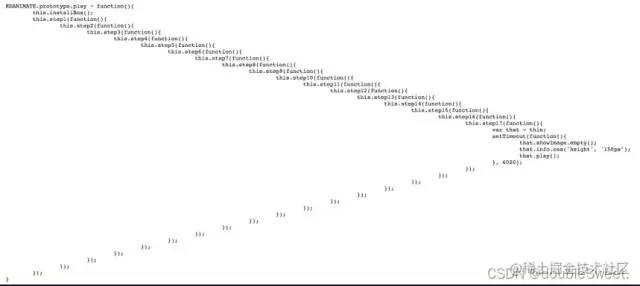

### 同步&异步的概念  

在讲这四种异步方案之前，我们先来明确一下同步和异步的概念：

所谓**同步(synchronization)**，简单来说，就是**顺序执行**，指的是同一时间只能做一件事情，只有目前正在执行的事情做完之后，才能做下一件事情。比如咱们去火车站买票，假设窗口只有1个，那么同一时间只能处理1个人的购票业务，其余的需要进行排队。这种one by one的动作就是同步。**同步操作的优点**在于做任何事情都是依次执行，井然有序，不会存在大家同时抢一个资源的问题。**同步操作的缺点**在于**会阻塞后续代码的执行**。如果当前执行的任务需要花费很长的时间，那么后面的程序就只能一直等待。从而影响效率，对应到前端页面的展示来说，有可能会造成页面渲染的阻塞，大大影响用户体验。

所谓**异步(Asynchronization)**，指的是当前代码的执行不影响后面代码的执行。当程序运行到异步的代码时，会将该异步的代码作为任务放进任务队列，而不是推入主线程的调用栈。等主线程执行完之后，再去任务队列里执行对应的任务即可。因此，**异步操作的优点就是**：**不会阻塞后续代码的执行**。

### js中异步的应用场景

开篇讲了同步和异步的概念，那么在JS中异步的应用场景有哪些呢？

*   定时任务：setTimeout、setInterval
    
*   网络请求：ajax请求、动态创建img标签的加载
    
*   事件监听器：addEventListener
    

### 实现异步的四种方法

对于setTimeout、setInterval、addEventListener这种异步场景，不需要我们手动实现异步，直接调用即可。但是对于ajax请求、node.js中操作数据库这种异步，就需要我们自己来实现了~

#### 1、 回调函数

在微任务队列出现之前，JS实现异步的主要方式就是通过回调函数。以一个简易版的Ajax请求为例，代码结构如下所示：

```
function ajax(obj){
 let default = {
   url: '...',
   type:'GET',
   async:true,
   contentType: 'application/json',
   success:function(){}
    };

 for (let key in obj) {
        defaultParam[key] = obj[key];
    }

    let xhr;
    if (window.XMLHttpRequest) {
        xhr = new XMLHttpRequest();
    } else {
        xhr = new ActiveXObject('Microsoft.XMLHTTP');
    }
    
    xhr.open(defaultParam.type, defaultParam.url+'?'+dataStr, defaultParam.async);
    xhr.send();
    xhr.onreadystatechange = function (){
        if (xhr.readyState === 4){
            if(xhr.status === 200){
                let result = JSON.parse(xhr.responseText);
                // 在此处调用回调函数
                defaultParam.success(result);
            }
        }
    }
}
```

我们在业务代码里可以这样调用ajax请求：

```
ajax({
   url:'#',
   type:GET,
   success:function(e){
    // 回调函数里就是对请求结果的处理
   }
});
```

ajax的success方法就是一个回调函数，回调函数中执行的是我们请求成功之后要做的进一步操作。这样就初步实现了异步，但是回调函数有一个非常严重的缺点，那就是**回调地狱**的问题。大家可以试想一下，如果我们在回调函数里再发起一个ajax请求呢？那岂不是要在success函数里继续写一个ajax请求？那如果需要多级嵌套发起ajax请求呢？岂不是需要多级嵌套？如果嵌套的层级很深的话，我们的代码结构可能就会变成这样：


因此，为了解决回调地狱的问题，提出了Promise、async/await、generator的概念。

#### 2、Promise

Promise作为典型的微任务之一，它的出现可以使JS达到异步执行的效果。一个Promise函数的结构如下列代码如下：

```
const promise = new Promise((resolve, reject) => {
 resolve('a');
});
promise
    .then((arg) => { console.log(`执行resolve,参数是${arg}`) })
    .catch((arg) => { console.log(`执行reject,参数是${arg}`) })
    .finally(() => { console.log('结束promise') });
```

如果，我们需要嵌套执行异步代码，相比于回调函数来说，Promise的执行方式如下列代码所示：

```
const promise = new Promise((resolve, reject) => {
 resolve(1);
});
promise.then((value) => {
     console.log(value);
     return value * 2;
    }).then((value) => {
     console.log(value);
     return value * 2;
    }).then((value) => {
    console.log(value);
    }).catch((err) => {
  console.log(err);
    });
```

即，通过then来实现多级嵌套(**链式调用**)，这看起来是不是就比回调函数舒服多了~

每个Promise都会经历的生命周期是：

*   进行中（pending） - 此时代码执行尚未结束，所以也叫未处理的（unsettled）
*   已处理（settled） - 异步代码已执行结束 已处理的代码会进入两种状态中的一种：
*   已完成（fulfilled） - 表明异步代码执行成功，由resolve()触发
*   已拒绝（rejected）- 遇到错误，异步代码执行失败 ，由reject()触发
    

因此，pending，fulfilled, rejected就是Promise中的三种状态啦~ 大家一定要牢记，在Promise中，要么包含resolve()来表示Promise的状态为fulfilled,要么包含reject()来表示Promise的状态为rejected。不然我们的Promise就会一直处于pending的状态，直至程序崩溃...

除此之外，Promise不仅很好的解决了链式调用的问题，它还有很多神奇的操作呢：

*   \*\*Promise.all(promises)\*\*：接收一个包含多个Promise对象的数组，等待所有都完成时，返回存放它们结果的数组。如果任一被拒绝，则立即抛出错误，其他已完成的结果会被忽略
    
*   **Promise.allSettled(promises)**: 接收一个包含多个Promise对象的数组，等待所有都已完成或者已拒绝时，返回存放它们结果对象的数组。每个结果对象的结构为{status:'fulfilled' // 或 'rejected', value // 或reason}
    
*   **Promise.race(promises)**: 接收一个包含多个Promise对象的数组，等待第一个有结果（完成/拒绝）的Promise，并把其result/error作为结果返回
    

```
function getPromises(){
    return [
        new Promise(((resolve, reject) => setTimeout(() => resolve(1), 1000))),
        new Promise(((resolve, reject) => setTimeout(() => reject(new Error('2')), 2000))),
        new Promise(((resolve, reject) => setTimeout(() => resolve(3), 3000))),
    ];
}

Promise.all(getPromises()).then(console.log);
Promise.allSettled(getPromises()).then(console.log);
Promise.race(getPromises()).then(console.log);
```

打印结果如下：  


#### 3、Generator

Generator是ES6提出的一种异步编程的方案。因为手动创建一个iterator十分麻烦，因此ES6推出了generator，用于更方便的创建iterator。也就是说，Generator就是一个返回值为iterator对象的函数。  
在讲Generator之前，我们先来看看iterator是什么：  
**iterator是什么？**  
**iterator中文名叫迭代器。它为js中各种不同的数据结构(Object、Array、Set、Map)提供统一的访问机制。任何数据结构只要部署了Iterator接口，就可以完成遍历操作。** 因此iterator也是一种对象，不过相比于普通对象来说，它有着专为迭代而设计的接口。

**iterator 的作用：**

*   为各种数据结构，提供一个统一的、简便的访问接口；
*   使得数据结构的成员能够按某种次序排列；
*   ES6 创造了一种新的遍历命令for…of循环，Iterator 接口主要供for…of消费
    

**iterator的结构：** 它有**next**方法，该方法返回一个包含**value**和**done**两个属性的对象（我们假设叫result）。**value**是迭代的值，后者是表明迭代是否完成的标志。true表示迭代完成，false表示没有。iterator内部有指向迭代位置的指针，每次调用**next**，自动移动指针并返回相应的result。

原生具备iterator接口的数据结构如下：

*   Array
*   Map
*   Set
*   String
*   TypedArray
*   函数里的arguments对象
*   NodeList对象
    

这些数据结构都有一个Symbol.iterator属性，可以直接通过这个属性来直接创建一个迭代器。也就是说，Symbol.iterator属性只是一个用来创建迭代器的接口，而不是一个迭代器，因为它不含遍历的部分。  
使用Symbol.iterator接口生成iterator迭代器来遍历数组的过程为：

```
let arr = ['a','b','c'];

let iter = arr[Symbol.iterator]();

iter.next() // { value: 'a', done: false }
iter.next() // { value: 'b', done: false }
iter.next() // { value: 'c', done: false }
iter.next() // { value: undefined, done: true }
```

**for ... of的循环内部实现机制其实就是iterator，它首先调用被遍历集合对象的 Symbol.iterator 方法，该方法返回一个迭代器对象，迭代器对象是可以拥有.next()方法的任何对象，然后，在 for ... of 的每次循环中，都将调用该迭代器对象上的 .next 方法。然后使用for i of打印出来的i也就是调用.next方法后得到的对象上的value属性。**

对于原生不具备iterator接口的数据结构，比如Object，我们可以采用自定义的方式来创建一个遍历器。

比如，我们可以自定义一个iterator来遍历对象：

```
let obj = {a: "hello", b: "world"};
// 自定义迭代器
function createIterator(items) {
    let keyArr = Object.keys(items);
    let i = 0;
    return {
        next: function () {
            let done = (i >= keyArr.length);
            let value = !done ? items[keyArr[i++]] : undefined;
            return {
                value: value,
                done: done,
            };
        }
    };
}

let iterator = createIterator(obj);
console.log(iterator.next()); // "{ value: 'hello', done: false }"
console.log(iterator.next());  // "{ value: 'world', done: false }"
console.log(iterator.next());  // "{ value: undefined, done: true }"
```

**接下来，我们来聊聊Generator:**  
我们通过一个例子来看看Gnerator的特征：

```
function* createIterator() {
  yield 1;
  yield 2;
  yield 3;
}
// generators可以像正常函数一样被调用，不同的是会返回一个 iterator
let iterator = createIterator();
console.log(iterator.next().value); // 1
console.log(iterator.next().value); // 2
console.log(iterator.next().value); // 3
```

Generator 函数是 ES6 提供的一种异步编程解决方案。形式上，Generator 函数是一个普通函数，但是有两个特征:

*   function关键字与函数名之间有一个星号
    
*   函数体内部使用yield语句，定义不同的内部状态
    

Generator函数的调用方法与普通函数一样，也是在函数名后面加上一对圆括号。不同的是，调用Generator函数后，该函数并不执行，返回的也不是函数运行结果，而是一个指向内部状态的指针对象，也就是遍历器对象（**Iterator Object**）

打印看看Generator函数返回值的内容：

发现generator函数的返回值的原型链上确实有iterator对象该有的next，**这充分说明了generator的返回值是一个iterator**。除此之外还有函数该有的return方法和throw方法。

在普通函数中，我们想要一个函数最终的执行结果，一般都是return出来，或者以return作为结束函数的标准。运行函数时也不能被打断，期间也不能从外部再传入值到函数体内。但在generator中，就打破了这几点，所以generator和普通的函数完全不同。当以function\*的方式声明了一个Generator生成器时，内部是可以有许多状态的，以yield进行断点间隔。期间我们执行调用这个生成的Generator,他会返回一个遍历器对象，用这个对象上的方法，实现获得一个yield后面输出的结果。

```
function* generator() {
    yield 1
    yield 2
};
let iterator = generator();
iterator.next()  // {value: 1, done: false}
iterator.next()  // {value: 2, done: false}
iterator.next()  // {value: undefined, done: true}
```

**yield和return的区别：**
*   都能返回紧跟在语句后面的那个表达式的值
*   yield相比于return来说，更像是一个断点。遇到yield，函数暂停执行，下一次再从该位置继续向后执行，而return语句不具备位置记忆的功能。
*   一个函数里面，只能执行一个return语句，但是可以执行多次yield表达式。
*   正常函数只能返回一个值，因为只能执行一次return；Generator 函数可以返回一系列的值，因为可以有任意多个yield
    

语法注意点：
*   yield表达式只能用在 Generator 函数里面
*   yield表达式如果用在另一个表达式之中，必须放在圆括号里面
*   yield表达式用作函数参数或放在赋值表达式的右边，可以不加括号。
*   如果 return 语句后面还有 yield 表达式，那么后面的 yield 完全不生效
    

**使用Generator的其余注意事项：**

*   需要注意的是，yield 不能跨函数。并且yield需要和\*配套使用，别处使用无效
```
function* createIterator(items) {
  items.forEach(function (item) {
    // 语法错误
    yield item + 1;
  });
}
```

*   箭头函数不能用做 generator
    

**讲了这么多，那么Generator到底有什么用呢？**

*   因为Generator可以在执行过程中多次返回，所以它看上去就像一个可以记住执行状态的函数，利用这一点，写一个generator就可以实现需要用面向对象才能实现的功能。
    
*   Generator还有另一个巨大的好处，就是把异步回调代码变成“同步”代码。这个在ajax请求中很有用，避免了回调地狱.
    

#### 4、 async/await

最后我们来讲讲async/await,终于讲到这儿了！！！async/await是ES7提出的关于异步的终极解决方案。我看网上关于async/await是谁的语法糖这块有两个版本：

*   第一个版本说async/await是Generator的语法糖
    
*   第二个版本说async/await是Promise的语法糖
    

其实，这两种说法都没有错。**关于async/await是Generator的语法糖：** 所谓Generator语法糖，表明的就是aysnc/await实现的就是generator实现的功能。但是async/await比generator要好用。因为generator执行yield设下的断点采用的方式就是不断的调用iterator方法，这是个手动调用的过程。针对generator的这个缺点，后面提出了co这个库函数来自动执行next，相比于之前的方案，这种方式确实有了进步，但是仍然麻烦。而async配合await得到的就是断点执行后的结果。因此async/await比generator使用更普遍。

**总结下来，async函数对 Generator函数的改进，主要体现在以下三点:**

*   内置执行器：Generator函数的执行必须靠执行器，因为不能一次性执行完成，所以之后才有了开源的 co函数库。但是，async函数和正常的函数一样执行，也不用 co函数库，也不用使用 next方法，而 async函数自带执行器，会自动执行。
*   适用性更好：co函数库有条件约束，yield命令后面只能是 Thunk函数或 Promise对象，但是 async函数的 await关键词后面，可以不受约束。
*   可读性更好：async和 await，比起使用 \*号和 yield，语义更清晰明了。
    

**关于async/await是Promise的语法糖：** 如果不使用async/await的话，Promise就需要通过链式调用来依次执行then之后的代码：

```
function counter(n){
 return new Promise((resolve, reject) => { 
    resolve(n + 1);
    });
}

function adder(a, b){
    return new Promise((resolve, reject) => { 
    resolve(a + b);
    });
}

function delay(a){
    return new Promise((resolve, reject) => { 
    setTimeout(() => resolve(a), 1000);
    });
}
// 链式调用写法
function callAll(){
    counter(1)
       .then((val) => adder(val, 3))
       .then((val) => delay(val))
       .then(console.log);
}
callAll();//5
```

虽然相比于回调地狱来说，链式调用确实顺眼多了。但是其呈现仍然略繁琐了一些。而**async/await的出现，就使得我们可以通过同步代码来达到异步的效果**：

```
async function callAll(){
   const count = await counter(1);
   const sum = await adder(count + 3);
   console.log(await delay(sum));
}
callAll();// 5
```

由此可见，Promise搭配async/await的使用才是正解！

**总结**

*   promise让异步执行看起来更清晰明了，通过then让异步执行结果分离出来。
*   async/await其实是基于Promise的。async函数其实是把promise包装了一下。使用async函数可以让代码简洁很多，不需要promise一样需要写then，不需要写匿名函数处理promise的resolve值，也不需要定义多余的data变量，还避免了嵌套代码。
*   async函数是Generator函数的语法糖。async函数的返回值是 promise 对象，这比 Generator 函数的返回值是 Iterator 对象方便多了。同时，我们还可以用await来替代then方法指定下一步的操作。
*   感觉Promise+async的操作最为常见。因为Generator被async替代了呀~
    

> 作者：DoubleSweet
> 
> 原文链接：https://juejin.cn/post/7082753409060716574