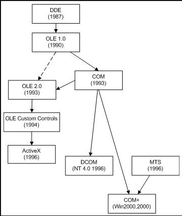

<h1>MS历史学习：OLE COM DCOM COM+技术与OPC技术</h1>
微软的许多技术，如OLE、ActiveX、以及DirectX等都是基于COM技术而建立起来的。微软本身也大量地使用COM组件来定制他们的应用程序及操作系统。  
# 综述

  

**DDE：**Dynamic Data Exchange，主要解决进程间通信问题，局限在于通信数据量以及网络数据通信，之后出现过NetDDE、FastDDE和AdvancedDDE等扩展版。  
**OLE：**Object Linking and Embedding，对象连接与嵌入，提供了建立复合文档的方法。1.0版本中使用了Virtual Function Table(VTBL)技术，在2.0中已经由COM取代。  
**OLE Custom Controls：**当时作为一种VB Extension控件的替代方案，以扩展名为.ocx的动态链接库的形式封装。  
**ActiveX：**从OLE Custom Controls发展而来，主要是为了使控件面向Internet应用，在ActiveX架构中，除了IUnknown接口之外，其余接口均是可选的，这样使得控件文件更小，下载速度更快。  
**DCOM：**Distributed Component Object Model，分布式组件对象模型，扩展COM功能，使其支持不同电脑上的对象之间进行通信。  
**MTS：**Microsoft Transaction Server  
**COM+：**将MTS集成到COM技术中。

参考资料：  
[Object Linking and Embedding](http://en.wikipedia.org/wiki/Object_Linking_and_Embedding)  
[ActiveX](http://en.wikipedia.org/wiki/ActiveX_Control)  
[Component\_Object\_Model](http://en.wikipedia.org/wiki/Component_Object_Model)  
[Distributed\_Component\_Object\_Model](http://en.wikipedia.org/wiki/Distributed_Component_Object_Model)
  
# 定义
OLE(Object Link Embeded) = ActiveX  
ole是在客户应用程序间传输和共享信息的一组综合标准。允许创建带有指向应用程序的链接的混合文档以使用户修改时不必在应用程序间切换的协议。OLE基于组件对象模型(COM) 并允许开发可在多个应用程序间互操作的可重用即插即用对象（不同的程序间的通信，例如把剪贴板的图片拷到word中）。该协议已广泛用于商业上，在商业中电子表格、字处理程序、财务软件包和其他应用程序可以通过客户/服务器体系共享和链接单独的信息。（20多年前的历史了~基本过时了）  
  
   
COM(Component Object Model) & DCOM(Distribute-)   
所谓COM即“组件对象模型”，是一种说明如何建立可动态互变组件的规范，此规范提供了为保证能够互操作，客户和组件应遵循的一些二进制和网络标准。通过这种标准将可以在任意两个组件之间进行通信而不用考虑其所处的操作环境是否相同、使用的开发语言是否一致以及是否运行于同一台计算机。开发COM的目的是为了使应用程序更易于定制、更为灵活，简而言之，就是一种打包技术。  
  
  
  
COM的优点？(Bill Gates 当年的设想)  
 首先：用户一般希望能够定制所用的应用程序，而组件技术从本质上讲就是可被定制的，因而用户可以用更能满足他们需要的某个组件来替换原来的那个。其次，由于组件是相对应用程序独立的部件，我们可以在不同的程序中使用同一个组件而不会产生任何问题，软件的可重用性将大大的得到增强。第三，随着网络带宽及其重要性的提高，分布式网络应用程序毫无疑问的成为软件市场上越来越重要的买点。组件价构可以使得开发这类应用程序的过程得以简化。  
  
  
## 什么是DCOM  
  
  
 DCOM的前身就是COM(Common Object Model)，就是Microsoft在Windows上所开立的链接库组件化的规格，像一个大型的软件系统是无法由一个大的执行档所组成，以前是以DLL来取代共享的链接库，现在是以COM来做为共同的链接库，并把链接库以对象导向的方式包装成组件，以利程序的独立性与再用性；而DCOM（Distributed）就是可以让这些PC上COM组件可以让其它PC来使用。简单的说，就是让不同计算机的程序可以被相互叫用，你可能还记得DLL吧，就是你可以去加载一个链接库，并去呼叫其链接库的一个子程序，所以DLL就是单部PC的链接库，而DCOM不但可以取代DLL，而且DCOM它甚至可以让不同的计算机间可以相互呼叫，也就是说A的PC可以呼叫B的PC的某一个程序去执行，这样的观念是否与传统完成不一样，也改变了我们程序设计的习惯了。  
  
  
  
  
## 什么是COM+？  
 COM+并不是COM的简单升级，COM+的底层结构仍然以COM为基础，它几乎包容了COM的所有内容，COM+综合了COM、DCOM和MTS这些技术要素，它把COM组件软件提升到应用层而不再是底层的软件结构，它通过操作系统的各种支持，使组件对象模型建立在应用层上，把所有组件的底层细节留给操作系统，因此，COM+与操作系统的结合更加紧密。  
 COM+不再局限于COM的组件技术，它更加注重于分布式网络应用的设计和实现。COM+继承了COM几乎全部的优势，同时又避免了COM实现方面的一些不足，把COM、DCOM和MTS的编程模型结合起来，继承了它们的绝大多数特性，在原有的特性上增加了新的功能。  
  
  
   
  
  
## COM+的新的优点?  
 以下列出COM+的几个主要特性：  
  
  
 COM+不仅继承了COM所有的优点，而且还增加了一些服务，比如队列服务、负载平衡、内存数据库、事件服务等。  
  
  
 队列服务对于分布式应用非常有意义，特别是在现在网络速度很慢的情况下，这种机制可以保证应用系统能够可靠地运行。在应用系统包含大量节点但服务器又繁忙的情况下，客户应用程序可以把它们的请求放到队列中，当服务器负载比较轻的时候再处理这些请求；  
  
  
 又如COM+提供了负载平衡服务，它可以实现动态负载平衡，而且COM+应用程序的负载平衡特性并不需要编写代码来支持，客户程序和组件程序都可以按通常的方式实现。获得负载平衡特性并不是用程序设计的方式来实现的，而是通过配置实现分布式应用程序的负载平衡，如上所讲的队列服务，其实也反映了一种负载平衡。  
  
  
 (1) 真正的异步通讯。COM+底层提供了队列组件服务，这使客户和组件有可能在不同的时间点上协同工作，COM+应用无须增加代码就可以获得这样的特性。  
  
  
 (2) 事件服务。新的事件机制使事件源和事件接收方实现事件功能更加灵活，利用系统服务简化了事件模型，避免了COM可连接对象机制的琐碎细节。  
  
  
 (3) 可伸缩性。COM+的可伸缩性来源于多个方面，动态负载平衡以及内存数据库、对象池等系统服务都为COM+的可伸缩性提供了技术基础，COM+的可伸缩性原理上与多层结构的可伸缩特性一致。  
  
  
 (4) 可管理和可配置性。管理和配置是应用系统开发完成后的行为，在软件维护成本不断增加的今天，COM+应用将有助于软件厂商和用户减少这方面的投入。  
  
  
 (5) 易于开发。COM+应用开发的复杂性和难易程度将决定COM+的成功与否，虽然COM+开发模型比以前的COM组件开发更为简化，但真正提高开发效率仍需要借助于一些优秀的开发工具。  
  
  
 COM+标志着Microsoft的组件技术达到了一个新的高度，它不再局限于一台机器上的桌面系统，它把目标指向了更为广阔的企业内部网，甚至Internet国际互连网络。COM+与多层结构模型以及Windows操作系统为企业应用或Web应用提供了一套完整的解决方案。  
  
  
   
  
  
# OLE & COM & DCOM &COM+  
  
  
## 一、过去的OLE和今天的OLE  
  
  
 作为COM技术前身的OLE，其最初含义是指在程序之间链接和嵌入对象数据（Object Link Embeded）。它提供了建立混合文档的手段（资深Windows 3.X 用户可能记得当初在Word6.0中插入一个图形的新奇和喜悦，有关复合文档，后面文章详细讲述），使得那些没有太多专业知识的用户能够很容易地协调多个应用程序完成混合文档的建立。1991年制定的OLE1.0规范主要解决多个应用程序之间的通信和消息传递问题，微软希望第三方开发商能够遵守这个规范，以使在当时的Windows平台上的应用程序能够相互协调工作，更大的提高工作效率。然而事与愿违，只有很少的软件开发商支持它。为此，微软于1993年发布了新的规范——OLE2.0，它在原有的基础上完善并增强了以下各方面的性能：   
1．OLE自动化：一个程序有计划地控制另一个程序的能力。  
2．OLE控件：小型的组件程序，可嵌入到另外的程序，提供自己的专有功能。  
3．OLE文档：完善了早期的混合文档功能，不仅支持简单链接和嵌入，还支持在位激活、拖放等功能。  
  
  
强大的功能使得很多的开发商开始支持新的OLE技术，因为微软在OLE2.0中建立了一个称为COM（Component Object Model即组件对象模式）的新规范。  
  
  
## 二、OLE应用及相关名词  
 容器：  
 容器是一个客户程序，它具有申请并使用其它COM组件通过接口为其它程序实现的功能；  
  
  
 服务器：  
 服务器通过特定的接口将自己完成的一些功能，提供给使用自己的应用程序（例如画笔程序是一个文档服务器，它提供创建并编辑BMP 图像的功能）。当打开Word，选择【插入】菜单下的【对象...】项，您可以看到在您的系统中存在哪些文档服务器，此时的Word以文档容器的身份出现。  
  
  
 在位激活：  
 当您双击插入的对象后发现Word的菜单有些改变成文档服务器程序的菜单，可以在当前的环境下编辑对象，这称为在位激活。   
   
 自动化：   
 和OLE文档技术类似，允许一个应用程序通过编程控制另一个应用程序“自愿”提供的功能的技术称为OLE自动化。自身暴露一些可编程对象给其它程序的应用程序叫自动化服务器，利用并操纵自动化服务器提供的功能的应用程序叫自动化客户或自动化控制器，有些程序既是自动化服务器又是自动化控制器。例如在VC中我们可以通过编程创建并编辑一个Excel工作表（很多参考书都以此为例），这里的VC就是自动化控制器，而创建工作表的Excel程序则是自动化服务器，但在Excel中我们又可以利用VBA语言创建PowerPoint的幻灯片，它又成了自动化控制器。利用OLE自动化技术可以实现软件的一次开发和多次利用，这也是集成组件的关键技术。无论是操作系统还是应用软件，微软都有意识朝着这个方向发展，例如从Windows95开始，包括WindowsNT4.0以后的操作系统的Shell就实现了OLE自动化技术。 那么什么是ActiveX？它和OLE有什么联系呢？  
  
  
## 三、ActiveX战略  
  
  
 同早期的功能薄弱的OLE1.0相比，OLE2.0得到了很多软件厂商的支持。许多程序设计人员编写了大量的实现OLE自动化服务器功能的组件（不一定是EXE文件），这些组件一般不求功能齐全、强大，而是实现专门的功能，可以被其它程序编程控制，由此承袭OLE的名字称为OLE控件。它们在文件名中的扩展名一般为OCX（OLE Control Extension）。 微软刚刚赢得广大软件厂商的支持，使OLE技术深入人心，然而“人算不如天算”，国际互联网的超速发展让比尔·盖茨始料未及。加上早期的OLE1.0不得人心，导致后来的人们总把在Word中插入一个图形当作OLE技术的全部，各类资料在介绍新OLE技术时命名也不统一，造成很大的混乱。针对这些情况，微软在1996年重新制订了一个关于OLE的规范——OLE 96规范。这个规范扩展了 OLE控件的能力，并贯彻微软的Internet战略使它更易于在网络环境中使用，还考虑命名混淆的问题，重新给OLE控件贴上一个标签——ActiveX控件。不仅如此，以前的什么OLE文档也相应称为ActiveX 文档了。总之，为了满足Internet战略，微软把OLE换成了ActiveX，企图使人们重新看待新的OLE——ActiveX，把它看做网络上的解决软件组件问题的标准。 许多在Windows上同微软合作得很好的厂商在开发新版本软件时都开始支持ActiveX技术，例如Delphi、PowerBuild等开发工具。原来同Windows竞争的操作系统也开始支持ActiveX，例如Macintosh，甚至老对手OS/2上也可以使用ActiveX控件。ActiveX技术也许真的会成为一个异种平台争相支持的规范，如果能够进一步完善ActiveX、采用更开放的策略以及微软不被卸成八大块的话。  
  
  
其实，.NET只不过是COM的别名而已。对于一个经验丰富的C++程序员(可惜我不是，C#还没玩好呢)而言，.NET就是COM的进化，而微软内部.NET可以说是“COM 3.0”。其实，CLR就是一个不折不扣的COM对象。但是，请注意，.NET使用一种不同的方法来编写组件，这样.NET组件与原先的COM组件存在明显的不同。.NET组件不需要使用注册表和类型库，因为所有关于组件的信息都以元数据的形式包含在程序集(Assembly)中。但是，借助于一个称为COM Interop的工具，COM对象和.NET对象可以很好地协作:通过提供软件包类，.NET对象可以访问COM对象;通过提供所有的注册表项和COM对象构建机制，COM对象可以访问.NET对象。   
  
  
## OPC技术  
  
  
OPC(OLE for Process Control, 用于过程控制的OLE)是一个工业标准，管理这个标准国际组织是OPC基金会，OPC基金会现有会员已超过220家。遍布全球，包括世界上所有主要的自动化控制系统、仪器仪表及过程控制系统的公司。  
  
  
基于微软的OLE(现在的Active X)、COM (部件对象模型)和DCOM (分布式部件对象模型)技术。OPC包括一整套接口、属性和方法的标准集，用于过程控制和制造业自动化系统。  
  
  
 OPC全称是OLE for Process Control，它的出现为基于Windows的应用程序和现场过程控制应用建立了桥梁。在过去，为了存取现场设备的数据信息，每一个应用软件开发商都需要编写专用的接口函数。由于现场设备的种类繁多，且产品的不断升级，往往给用户和软件开发商带来了巨大的工作负担。通常这样也不能满足工作的实际需要，系统集成商和开发商急切需要一种具有高效性、可靠性、开放性、可互操作性的即插即用的设备驱动程序。在这种情况下，OPC标准应运而生。OPC标准以微软公司的OLE技术为基础，它的制定是通过提供一套标准的OLE/COM接口完成的，在OPC技术中使用的是OLE 2技术，OLE标准允许多台微机之间交换文档、图形等对象。   
   
COM是Component Object Model的缩写，是所有OLE机制的基础。COM是一种为了实现与编程语言无关的对象而制定的标准，该标准将Windows下的对象定义为独立单元，可不受程序限制地访问这些单元。这种标准可以使两个应用程序通过对象化接口通讯，而不需要知道对方是如何创建的。例如，用户可以使用C++语言创建一个Windows对象，它支持一个接口，通过该接口，用户可以访问该对象提供的各种功能，用户可以使用Visual Basic，C，Pascal，Smalltalk或其它语言编写对象访问程序。在Windows NT4.0操作系统下，COM规范扩展到可访问本机以外的其它对象，一个应用程序所使用的对象可分布在网络上，COM的这个扩展被称为DCOM（Distributed COM）。  
   
通过DCOM技术和OPC标准，完全可以创建一个开放的、可互操作的控制系统软件。OPC采用客户/服务器模式，把开发访问接口的任务放在硬件生产厂家或第三方厂家，以OPC服务器的形式提供给用户，解决了软、硬件厂商的矛盾，完成了系统的集成，提高了系统的开放性和可互操作性。   
   
OPC服务器通常支持两种类型的访问接口，它们分别为不同的编程语言环境提供访问机制。这两种接口是：自动化接口（Automation interface）；自定义接口（Custom interface）。自动化接口通常是为基于脚本编程语言而定义的标准接口，可以使用VisualBasic、Delphi、PowerBuilder等编程语言开发OPC服务器的客户应用。而自定义接口是专门为C++等高级编程语言而制定的标准接口。OPC现已成为工业界系统互联的缺省方案，为工业监控编程带来了便利，用户不用为通讯协议的难题而苦恼。任何一家自动化软件解决方案的提供者，如果它不能全方位地支持OPC，则必将被历史所淘汰。