转自：[Windows版本，OS内核版本，Windows SDK之间的关系 - 知乎](https://zhuanlan.zhihu.com/p/339516655 "Windows版本，OS内核版本，Windows SDK之间的关系 - 知乎")

**前言：**我们经常会会被几个概念弄混淆，什么是Windows版本号，什么又是操作同内核版本，开发C++的时候什么又是WindowsSDK，实际上区别很简单，本文做一个小的总结。

## 一、Windows版本

**1.1 查看Windows版本号的几种方法**

**（1）“设置/系统/关于”，**打开如下界面

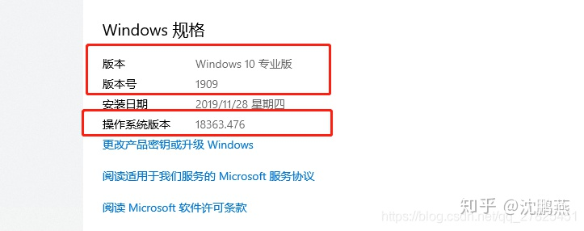

**（2）在cmd里面运行命令VER**

C:\\Users\\Administrator>VER

Microsoft Windows \[版本 10.0.18363.476\]

**（3）使用win+R，在运行里面运行 winver，**打开

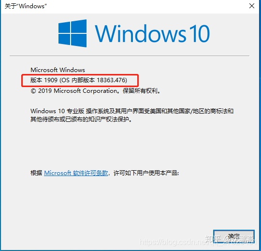

**1.2 Windows的版本，版本号，OS内核版本**

**（1）Windows版本。**

指的是什么专业版，教育版，家庭版，旗舰版等等。

**（2）Windows版本号。**

即Win 10 的大版本号，也就是推出前所确定的版本日期。如：1607 是 2106 年 7 月确定的版本、1703 是 2017 年 3 月确定的版本、1709 是 2017 年 9 月确定的版本，我的1909是Windows19年9月份推出的版本。

**（3）OS内核版本号。**

OS 版本，是内部版本，是大版本的详细版本号。是在大版本推出后，对其进行修补漏洞修复 BUG 后的版本号。如 ：1709 版本的 16299.15 和 16299.19。如果再有新的更新修复补丁推出后，OS 版本号还会改变。它的一本格式为：

**10.0.\*\*\*\*\*.\*\*\***

比如我上面的**OS内核版本为18363，然后后面还有一个小的版本号，即上面的476**，

我们经常说的比如，18363新增加的功能，指的就是OS内核版本。

windows10的前缀都是10.0开头的，另外下面附上历史版本的版本数字。

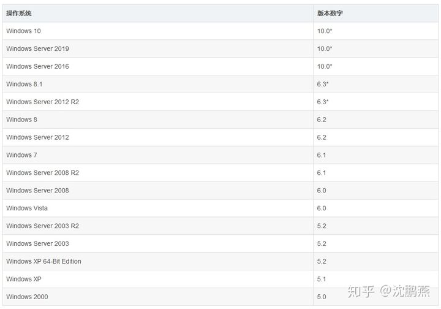

**总结：**

*   另外，版本号（大版本号）如： 1607、1703 和 1709 ，1803,1903,1909之间都有大的功能加入。
*   而 OS 版本号的改变，只是对漏洞修补和 BUG 的修复，没有大的功能加入。

**二、Windows SDK**

Windows SDK 是未开发人员准备的软件开发包，可以让我们方便的开发Windows应用程序，同一台电脑上可以安装很多不同版本的Windows SDK，一般在安装Visual Studio的时候会安装一个版本的Windows SDK，我也可以自己下载其他的版本，同时安装多个版本的Windows SDK，只需要我在配置VS的时候选择不同的window SDK版本即可，如下：

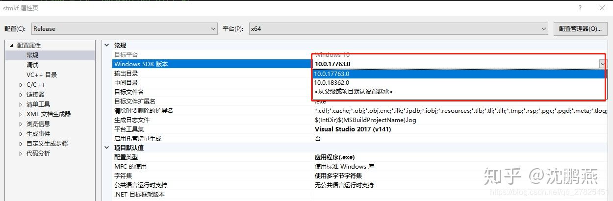

**（1）各个版本的Windows SDK 下载**

[https://developer.microsoft.com/zh-cn/windows/downloads/sdk-archive](https://link.zhihu.com/?target=https%3A//developer.microsoft.com/zh-cn/windows/downloads/sdk-archive "https://developer.microsoft.com/zh-cn/windows/downloads/sdk-archive")

我们发现Windows SDK 和Windows版本并没有直接的关系，但是有一定的限制要求，比如太低的SDK版本可能不能在新版本的Windows平台上使用，我们可以查看SDK的详细说明。

**（2）最新版本的Windows SDK下载**

[https://developer.microsoft.com/en-us/windows/downloads/windows-10-sdk](https://link.zhihu.com/?target=https%3A//developer.microsoft.com/en-us/windows/downloads/windows-10-sdk "https://developer.microsoft.com/en-us/windows/downloads/windows-10-sdk")

另外所有的关于Windows上面的开发、工具、下载等等都可以在网站上获取：[https://developer.microsoft.com/zh-cn/windows](https://link.zhihu.com/?target=https%3A//developer.microsoft.com/zh-cn/windows "https://developer.microsoft.com/zh-cn/windows")

## 三、Windows纯净系统下载的几种方法

**1、Windows官网下载**

进入官网：[https://www.microsoft.com/zh-cn/software-download](https://link.zhihu.com/?target=https%3A//www.microsoft.com/zh-cn/software-download "https://www.microsoft.com/zh-cn/software-download")

这里面可以下载，Windows10，Windows8.1，Windows7等，我们选择win10，得到的地址如下：

[https://www.microsoft.com/zh-cn/software-download/windows10](https://link.zhihu.com/?target=https%3A//www.microsoft.com/zh-cn/software-download/windows10 "https://www.microsoft.com/zh-cn/software-download/windows10")

会有如下界面：

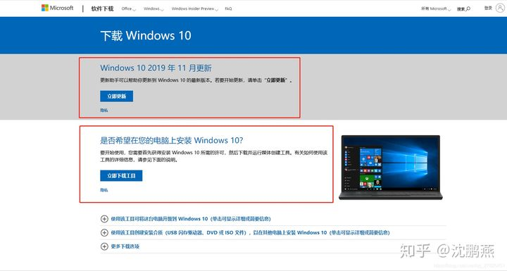

如果我们只想更新自己的系统，我们选择第一个**Windows更新助手**，会下载一个名为**Windows10Upgrade9252.exe** 的可执行文件，运行它然后它会进行验证，环境验证，下载，在线完成下载，并更新自己的电脑系统，比如我昨天的更新的1909版本就是通过这个更新的。

如果我们想要下载完整的ISO镜像文件，我们选择第二个，下载得到一个名为**MediaCreationTool1909.exe的制作工具**，然后运行按照指示即可下载，下载指定版本，语言的Windows系统，是一个ISO文件。

**2、从官网获取ISO镜像文件的下载地址**

前面是通过下载工具来下载的，现在如何直接在网页上面选择Windows系统的版本呢？可以如下操作：

**（1）浏览器输入官方地址：**

[https://www.microsoft.com/zh-cn/software-download/windows10](https://link.zhihu.com/?target=https%3A//www.microsoft.com/zh-cn/software-download/windows10 "https://www.microsoft.com/zh-cn/software-download/windows10")

**（2）键盘按下F12进入开发者模式**（有些笔记本电脑可能需要按下Fn+F12），在右边选择如图所示的设备图标后，在页面左侧选择任何一个移动设备型号，然后再按下F5（Fn+F5）刷新页面。然后关掉开发这模式，这时候我们发现，页面居然变了，如下：

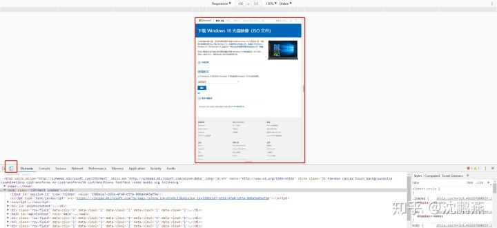

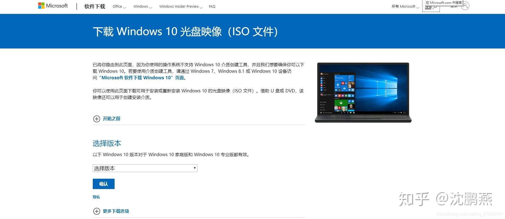

**（3）选择版本 下拉框，**选择Windows版本，然后确认，然后选择语言，确认，然后选择32bit还是64bit，进行下载。

如果页面太小看不清，可以按照下图的方式放大页面（选择150%）

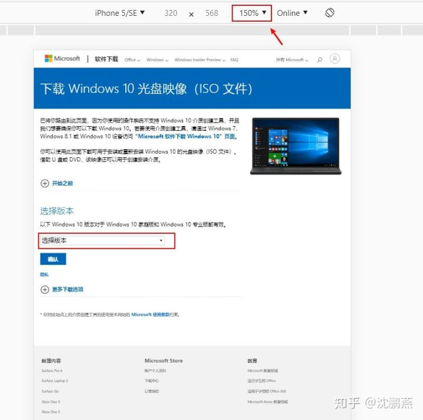

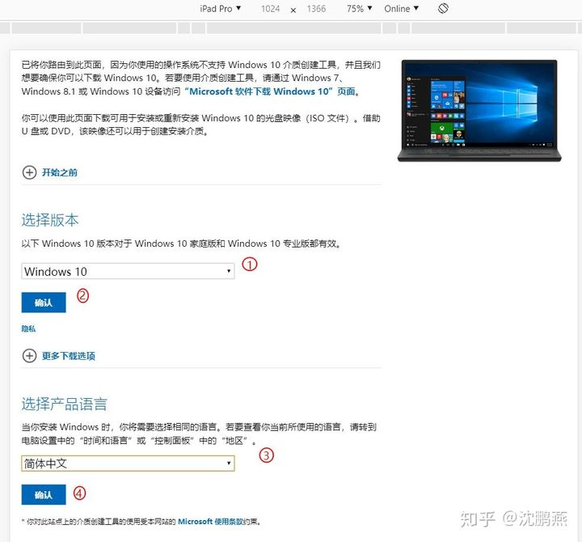

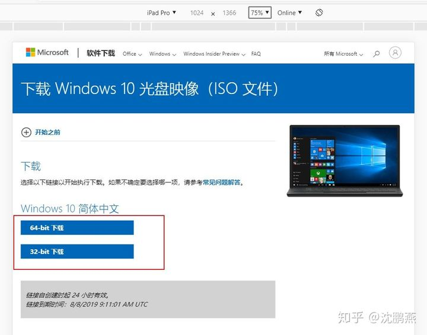

**3、如何从MSDN我告诉你下载Windows 10镜像**

（1）打开浏览器，输入网址: [http://msdn.itellyou.cn/](https://link.zhihu.com/?target=http%3A//msdn.itellyou.cn/ "http://msdn.itellyou.cn/")

（2）选择下载的版本“”

网址左边导航栏中选择操作系统。点击想要下载的Windows 10 版本（Windows 10 1909为例），在右边出现的列表中，点击详细信息按钮， 复制出现的下载链接。

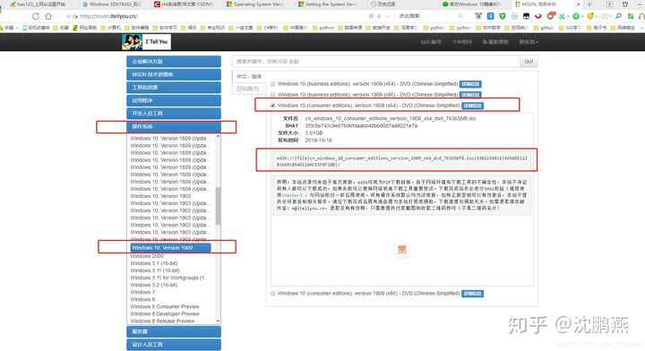

然后复制的Ed2k链接不能通过浏览器直接下载，需借助第三发放开发使用第三方下载工具（迅雷）， 粘贴复制的链接到下载工具，即可开始下载。

**4、UUP（Unified Update Platform）平台下载**

统一升级平台，微软于在Windows 10 insider中率先推出的一种新的升级方式，该方式的最大特点：该方式根据不同的设备实现差异化的更新下载，大大减小的下载更新文件的大小。

**UUP的出现主要针对系统直接升级的方式**。

那么UUP可以制作成ISO吗？

答案是肯定的。

**（1）打开第三方UUP文件下载网站，**

[https://uup.rg-adguard.net/index.php](https://link.zhihu.com/?target=https%3A//uup.rg-adguard.net/index.php "https://uup.rg-adguard.net/index.php")

**（2）在出现的下拉框中选择想要的Windows 10 镜像（语言，版本），**并在最后一个下拉框Select type download 中选择Download ISO compiler in OneClick! (run downloaded CMD-file)

完成上一步后，会在下拉框右边显示下载链接，选择第一个下载链接下载cmd文件，即

creatingISO\_18363.387\_zh-cn\_amd64\_professional.cmd

双击下载的cmd，实际上这就是一个cmd命令文件，注意我们一般将这个cmd文件放在一个单独文件夹中，然后双击该cmd命令，然后就会开始自动下载，会下载到和cmd命令文件的同一级目录之下。

就会自动开始下载UUP文件并自动转化为ISO镜像文件。

关于如何激活Windows这里就先不说明了。