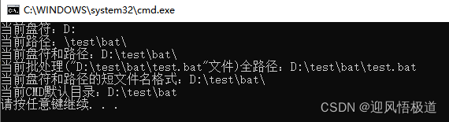

<h1>%~dp0是什么意思</h1>
转载自 www.cnblogs.com/yxsylyh 转载内容如下：

cd /D %~dp0的意思如下：

更改当前目录为批处理本身的目录 
比如你有个批处理a.bat在D:\qq文件夹下 
a.bat内容为 
cd /d %~dp0 
在这里 
cd /d %~dp0的意思就是cd /d d:\qq 
%0代表批处理本身 d:\qq\a.bat 
~dp是变量扩充 
d就是扩充到分区号 d: 
p就是扩充到路径 \qq 
dp就是扩充到分区号路径 d:\qq 

扩展阅读：

“d”为Drive的缩写，即为驱动器，磁盘
“p”为Path缩写，即为路径，目录
“f”是file，即文件
“n”是name 文件名
“x”是eXtension 文件扩展名
“s”为Short，短的路径名
“a”为attribute，即文件属性
“t”为time，即文件的日期/时间
“z”为siZe，即文件的大小

选项语法:

    ~0         - 删除任何引号(")，扩充 %0
    %~f0        - 将 %0 扩充到一个完全合格的路径名(“f”是file，即文件)
    %~d0        - 仅将 %0 扩充到一个驱动器号
    %~p0        - 仅将 %0 扩充到一个路径
    %~n0        - 仅将 %0 扩充到一个文件名(“n”是name 文件名)
    %~x0        - 仅将 %0 扩充到一个文件扩展名
    %~s0        - 扩充的路径只含有短名(“s”为Short，短的)
    %~a0        - 将 %0 扩充到文件的文件属性(“a”为attribute，即属性)
    %~t0        - 将 %0 扩充到文件的日期/时间(“t”time)
    %~z0        - 将 %0 扩充到文件的大小(Size 大小)
    %~$PATH:0   - 查找列在路径环境变量的目录，并将 %0 扩充
                  到找到的第一个完全合格的名称。如果环境变量名
                  未被定义，或者没有找到文件，此组合键会扩充到
                  空字符串

可以组合修饰符来得到多重结果:

    %~dp0       - 仅将 %0 扩充到一个驱动器号和路径
    %~nx0       - 仅将 %0 扩充到一个文件名和扩展名
    %~fs0       - 仅将 %0 扩充到一个带有短名的完整路径名
    %~dp$PATH:0 - 查找列在路径环境变量的目录，并将 %I 扩充
                  到找到的第一个驱动器号和路径。
    %~ftza0     - 将 %0 扩充到类似输出线路的 DIR

%0为当前批处理文件
如果0换成1为第一个文件，2为第2个
参考文献：

[1] http://zhidao.baidu.com/link?url=9lkw8NW__Pz6N6dlwRAeHs4xE82U1dF6-0wXWbBSxKoXgivbpMVbR0syGV-2B284lxPiIpY87Gvbq4vcgWYcQa

%~dp0的含义 : 获取批处理文件的目录。

一、%~dp0的含义分析:
在D:\test\bat目录下有一个test.bat文件,内容如下：
~~~c
@echo off
echo dp0 = %~dp0
pause
~~~
运行效果：

 具体分析下%~dp0的含义
~~~c
~                是扩展的意思，变量扩充(下面详细介绍)，相当于把一个相对路径转换绝对路径
%0             代指批处理文件自身（绝对路径 "D:\test\bat\test.bat"，注意有双引号）
%~d0         是指批处理所在的盘符，其中d代表drive。(扩充到盘符 D: )
%~p0         是指批处理所在的目录，其中p代表path。(扩充到路径 \test\bat\ ）
%~dp0       是批处理所在的盘符加路径。（扩充到盘符和路径 ：D:\test\bat\）
~~~
cd %~dp0 就是进入批处理所在目录了

二、扩展下test.bat脚本
~~~c
@echo off
echo 当前盘符：%~d0
echo 当前路径：%~p0
echo 当前盘符和路径：%~dp0
echo 当前批处理(%0文件)全路径：%~f0
echo 当前盘符和路径的短文件名格式：%~sdp0
echo 当前CMD默认目录：%cd%
pause
~~~
效果：

 

 

三、扩充变量语法详解
可以参考命令 call /?

C:\Users\DELL>call /?
从批处理程序调用另一个批处理程序。
 
CALL [drive:][path]filename [batch-parameters]
 
  batch-parameters   指定批处理程序所需的命令行信息。
 
如果命令扩展被启用，CALL 会如下改变:
 
CALL 命令现在将卷标当作 CALL 的目标接受。语法是:
 
    CALL:label arguments
 
一个新的批文件上下文由指定的参数所创建，控制在卷标被指定
后传递到语句。你必须通过达到批脚本文件末两次来 "exit" 两次。
第一次读到文件末时，控制会回到 CALL 语句的紧后面。第二次
会退出批脚本。键入 GOTO /?，参看 GOTO :EOF 扩展的描述，
此描述允许你从一个批脚本返回。
 
另外，批脚本文本参数参照(%0、%1、等等)已如下改变:
 
 
     批脚本里的 %* 指出所有的参数(如 %1 %2 %3 %4 %5 ...)
 
     批参数(%n)的替代已被增强。你可以使用以下语法:
 
         %~1         - 删除引号(")，扩展 %1
         %~f1        - 将 %1 扩展到一个完全合格的路径名
         %~d1        - 仅将 %1 扩展到一个驱动器号
         %~p1        - 仅将 %1 扩展到一个路径
         %~n1        - 仅将 %1 扩展到一个文件名
         %~x1        - 仅将 %1 扩展到一个文件扩展名
         %~s1        - 扩展的路径只含有短名
         %~a1        - 将 %1 扩展到文件属性
         %~t1        - 将 %1 扩展到文件的日期/时间
         %~z1        - 将 %1 扩展到文件的大小
         %~$PATH:1   - 查找列在 PATH 环境变量的目录，并将 %1
                       扩展到找到的第一个完全合格的名称。如果
                       环境变量名未被定义，或者没有找到文件，
                       此修改符会扩展到空字符串
    可以组合修改符来取得多重结果:
        %~dp1       - 只将 %1 扩展到驱动器号和路径
        %~nx1       - 只将 %1 扩展到文件名和扩展名
        %~dp$PATH:1 - 在列在 PATH 环境变量中的目录里查找 %1，
                      并扩展到找到的第一个文件的驱动器号和路径。
        %~ftza1     - 将 %1 扩展到类似 DIR 的输出行。
    在上面的例子中，%1 和 PATH 可以被其他有效数值替换。
    %~ 语法被一个有效参数号码终止。%~ 修定符不能跟 %*
    使用
C:\Users\DELL>
四、%cd%和%~dp0获取当前目录区别
%cd%和%~dp0都能用来表示当前目录，但是他们在不同的使用场景下，功能却不相同：

%cd% 代表的是执行文件的当前工作目录（强调bat是在哪里启动的，可变的）；
%~dp0 代表的是当前批处理文件所在完整目录（强调bat的文件位置，固定的）。

                        
原文链接：https://blog.csdn.net/icanlove/article/details/39370963