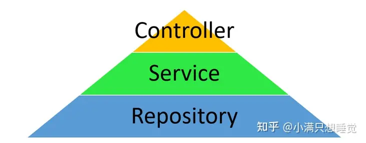

# 15分钟入门23种设计模式：图解，范例和对比
## 开门见山

我们直奔主题，分类呈现23种设计模式的庐山真面目：

| 创建型 (5)Creational | 结构型 (7)Structural | 行为型 (11)Behavioral |
| --- | --- | --- |
| 工厂方法 Factory method抽象工厂 Abstract factory建造者 Builder原型 Prototype单例 SingleTon | 适配器 Adapter桥接 Bridge组合 Composite装饰 Decorator外观 Facade享元 Flyweight代理 Proxy | 责任链 Chain of responsibility命令 Command解释器 Interpreter迭代器 Iterator中介 Mediator备忘录 Memento观察者 Observer状态 State策略 Strategy模板方法 Template method访问者 Visitor |

这23种设计模式源于GoF所著的"Design Patterns - Elements of Reusable Object-Oriented Software"一书（也有将该书直接简称为GoF），译著为“设计模式：可复用面向对象软件的基础”。原书将这23种设计模式分为三类：

*   **创建型**包含5种模式，涉及对象/对象组合的创建构建。
*   **结构性**包含7种模式，涉及对象/类之间的关系。
*   **行为型**包含11种模式，涉及对象/类的行为、状态、流程。

从该书的标题我们可以了解到，设计模式是一个**面向对象**开发方法下的概念，是解决**代码设计/软件架构**问题的**可复用**的元素，同时是**基本元素**（elements）。引用原书的例子，我们大家所熟识的MVC模式，Model-View-Controller，就可以解构为几种设计模式的组合演变，比如可以在View和Model的关系中看到观察者模式 Observer、组合模式 Composite、装饰模式 Decorator，在Controller中发现策略模式的影子。通过对23种基础模式的有机利用和结合，可以进一步演化出更复杂的软件架构。限于篇幅，本文不会讲解每种设计模式的定义和背景，读者可以参考[设计模式简介](https://link.zhihu.com/?target=https%3A//link.segmentfault.com/%3Fenc%3DztnBprCgT4K6DuYCzhYYYQ%253D%253D.ri7wWecb%252BTovAGPSTD8RGiQHtzkjO%252BNUqIp19tHX5Wf8tldwDYmkOto1R5ZENNzanJ8KJUL0%252BW%252BbHJDfj5J0iQ%253D%253D)来学习定义。

## 设计模式的UML、类比和范例

这个部分，我们逐步从尝鲜到类比，深入理解一些比较常见有趣的设计模式的UML及其经典实例。GoF原书中也推荐学习者从“模式怎样相互关联”以及“研究目的相似的模式“出发来学习和选择设计模式。首先看看最简单常见的`策略模式`和另一个同属**行为型模式**的`状态模式`：

|  | 策略模式 Strategy | 状态模式 State |
| --- | --- | --- |
| UML |  |  |
| 范例 | \- Comparator#compare() 和 Collections#sort()- Spring Security: PasswordEncoder | \- 标准范例: javax.faces.lifecycle.LifeCycle#execute()- 形似样例：Java Thread State, ExoPlayer |
| 概述 | 让外部对算法的相互替换无感 | 允许一个对象根据内部状态改变行为 |
| 关键字 | Strategy, rule | State, switch, phase, lifecycle |
| 核心角色 | Strategy | State |

策略模式和状态模式在UML图形上非常相像，他们之间的主要区别如下：

*   状态对象可以持有上下文对象（调用方），但策略模式一般存在这种依赖。
*   状态模式可以在彼此之间进行跳转替换，比如调用了播放器的`play`方法，那么状态可能从`stop`\->`playing`，这个操作可以用状态对象完成。
*   一个策略和调用方的关系（依赖）可能弱于状态和上下文对象的关系（持有、属性）。
*   策略的不同可能只影响一个行为，但是状态的不同影响状态持有对象行为的方方面面。

整体上策略模式要比状态模式更加简明易懂，应用场景更广，在大型项目中的应用也随处可见。而状态模式虽然也是对常见概念的抽象，其应用却相对有限，其原因可能是，在更多的情况下，把行为的差异定义在不同的状态中，可能并非符合直觉的操作：与其把状态也定义为对象承载行为，不如把状态定义为一个标记，直接用`if`或`switch`判断来的直接。或者换言之，大多数情况下，问题还没有复杂到要用状态模式的程度。

借助这种对比的视角，我们来学习更多模式。先看看以下三种结构型设计模式：

|  | 适配器 | 桥接模式 | 外观 |
| --- | --- | --- | --- |
| UML |  |  |  |
| 范例 | RecyclerView.Adapter | 范例比较少：- Collections#newSetFromMap()- (ADB?)，如Spring中Service和Repository的关系 | 非常常见，如：Facades, FacesContext, ExternalContext, DataSource#getConnection() |
| 概述 | 将一个类的接口转换成满足另一个要求的接口 | 将抽象部分与它的实现部分分离 | 为子系统中的一组接口提供一个一致易用的界面 |
| 关键字 | Adatper | Wrapper | Context |
| 核心角色 | Adpter, Adaptee | Bridge | Facade |

适配器模式、桥接模式和外观模式同属结构型设计模式，他们三者概念上很相像，都是通过建立接口来为类的方法建立或重构关系，比如，似乎我们用外观的视角去解释适配器，也能解释的通，Adapter就是在帮助Adaptee建立统一界面，或者建立桥梁。

设计模式就是这样，非要较真，所有的设计模式都大同小异（至少在一个类型之内），这是学习设计模式的一个误区。回到上面的三个设计模式上，他们的核心区别更多体现在时机和出发点上：**适配器Adapter强调兼容性，桥接Bridge强调抽象与实现的分离，而外观Facade强调简化复杂性**。我们分辨这些模式也应该从意图出发来看。

Spring的三层结构也融合体现了Facade和Bridge的设计，Service和Repository之间偏重体现Bridge模式理念，而Controller和Service之间更像Facade模式：Controller整合Service，对外提供API:

  

  

下面我们再看几种常见的行为型模式的类比分析：

|  | 代理 | 装饰 | 中介 |
| --- | --- | --- | --- |
| UML |  |  |  |
| 范例 | \- Java Reflect API: Proxy- Java EJB: Enterprise JavaBean, JavaX Inject, JavaX PersistenceContext- ActivityManager 和 ActivityManagerService- PerformanceInspectionService 和 PerformanceTestManagementService | \- Java IO: GZIPOutputStream and OutputStream, Reader and BufferedReader)- java.util.Collections, checkedXXX(), synchronizedXXX() 和 unmodifiableXXX() 系列方法，拓展集合- HttpServletRequestWrapper and HttpServletResponseWrapper- JScrollPane | \- Java Message Service, JMS by Oracle- java.util.Timer (all scheduleXXX() methods), java.util.concurrent.ExecutorService (the invokeXXX() and submit() methods) |
| 概述 | 通过代理来控制对一个对象的访问 | 动态地给一个对象添加功能 | 封装对象之间的交互（传话筒） |
| 关键字 | Delegate | Wrapper | MessageQueue, Dispatcher |
| 核心角色 | Proxy | Decorator | Mediator |

这里，从类之间关系上看，代理和装饰更为相似，而中介则不同，它只是名字上和代理相近。关于代理(访问和控制)和装饰（增强和扩展）的区分，同样可以从目的和意图的角度区分。以代理来为例，**它的首要作用是建立访问通道**，比如安卓中，应用和系统之间用Binder来进行IPC，而在应用进程和系统进程间，为了这种IPC调用，大量应用了代理模式，名为Proxy的对象随处可见。而在设计[Hydra Lab](https://link.zhihu.com/?target=https%3A//link.segmentfault.com/%3Fenc%3DoI1C1%252BueEAUX%252FQAFcO%252BdKw%253D%253D.Vv0AG4GCYUQ3wrE8v2Uy3D%252FsPaiafuGu2YhJJNXjbwyCqFxXQiQJdqDYaKMbt1Em)的过程中，为了让测试用户能方便的在测试实例中通过[SDK](https://link.zhihu.com/?target=https%3A//link.segmentfault.com/%3Fenc%3DZy%252BehAmto6xNGmPVk%252FTcwQ%253D%253D.y%252BB95XwIScW%252Beh7iuCtz7T9RvsvCIPbHvdohJDbcf%252BVfpZauw%252BHpznHIIOjBw2obbq%252FWhFmJt%252BbYIV6zZGuEfQ%253D%253D)访问一些[Hydra Lab Test Agent](https://link.zhihu.com/?target=https%3A//link.segmentfault.com/%3Fenc%3DzyF1xCG%252B3Svx9sakF7Jx4Q%253D%253D.R1QMJ7qtMuiW2MAAQDFn5GlbwGwNWFbEn1Tosyrte9V1R4gcmuPUXC9RAA9Gui84H6CsiazqGR6J7VL1F4xHrk1ErIHIddT%252FNgOvsu4AfLaSLVd7dHVihNkNxJQVcz3QcXBWrGFOOzSsI%252FgJAvY3fQ%253D%253D)的服务方法，我们也应用了一个简明的静态代理来实现这种不同环境下的访问。

在代理模式下，有了访问通道，自然就可以做到对通信的控制，比如基于权限的、或是基于格式验证的。而装饰模式着眼于**增强、扩展**，比如BufferedRead对于Reader的增强。从这个角度讲，一个类如果叫AuthWrapper就会比较奇怪，AuthProxy则更常见一些，因为授权这种操作明显更强调控制。当然这取决于具体情境。

中介其实是很宽泛的概念，解耦通信的双方或多方，比较火热的各类MQ框架其实是这个模式的一个衍生。

|  | 观察者 | 访问者 |
| --- | --- | --- |
| UML |  |  |
| 范例 | \- java.util.Observer, Observable- java.util.EventListener- ReactiveX Interface Observer | \- AnnotationValueVisitor- ElementVisitor- TypeVisitor- SimpleFileVisitor- VisitCallback- ClassVisitor (ASM 9.4) |
| 概述 | 对个观察者监听一个主题对象 | 表示一种对某对象中各元素的只读操作 |
| 关键字 | Observable, Observer, Subject,Subscription | Visitor |
| 核心角色 | Observer, Subject | Visitor, Element |

这两个模式之间在实现上其实并没有太多联系。但二者都是想去“读”，不会直接改变被读对象的状态。观察者通过订阅监听的方式被动地读，而访问者是主动视角，以一种独特的方式读。和观察者很相近的“Listener”，是更常见的概念，更轻量，因而也更广泛。

|  | 责任链 | 备忘录 |
| --- | --- | --- |
| UML |  |  |
| 范例 | \- OkHttp Interceptors- java.util.logging.Logger- javax.servlet.Filter | \- Activity#onSaveInstanceState(...))- Java Serializable |
| 概述 | 建立处理链条传递请求 | 捕获对象状态并保存，以备状态恢复 |
| 关键字 | Chain, Interceptor, Filter, proceed, Response | State, Lifecycle, Context |
| 核心角色 | Handler | Memonto, Originator, Caretaker |

责任链和备忘录模式虽然意图和设计上都不相同，但二者都有非常浓厚的IoC控制反转的味道，和生命周期的设计联系紧密。玩游戏的同学对备忘录模式最容易建立理解，一个存档就是一个持久化的State，游戏本身的存读档服务作为caretaker，帮你保证你肝的进度不会白费。所以备忘录模式其实非常的常见，软件世界里俯拾皆是。

|  | 命令 | 解释器 |
| --- | --- | --- |
| UML |  |  |
| 范例 | \- IShellOutputReceiver- Java Runnable | \- java.util.Pattern- java.text.Normalizer- java.text.Format- javax.el.ELResolver |
| 概述 | 将请求封装为对象，从而方便参数化和请求队列管理 | 定义文法和表示方式 |
| 关键字 | Executor | Expression |
| 核心角色 | Command, Receiver, Invoker(Executor) | Interpretor, Expression |

上面两者也无法直接类比，但是当二者合体，命令的解释和执行一气呵成，一个脚本语言的c执行器雏形就诞生了。这里的命令模式其实比“命令”本身在设计上有更周全的考虑，它还包括了对执行结果的接收接口的预留。

|  | 抽象工厂 | 工厂方法 |
| --- | --- | --- |
| UML |  |  |
| 范例 | \- DocumentBuilderFactory(JavaX)- TransformerFactory(JavaX)- XPathFactory(JavaX)- BeanFactory#getBeanProvider(Spring) | java.util.Calendar#getInstance() |
| 概述 | 将一个类的接口转换成满足另一个要求的接口 | 由工厂的子类决定创建的实例对象 |
| 关键字 | Factory, new..., create... | Factory, newInstance, Creator |
| 核心角色 | AbstractFactory | Creator |

其他模式还包括：建筑者模式，原型模式，享元（类似多例），单例；组合；模板方法，迭代器。这些模式或是不常用，或是过于常用常见，且都比较简单，限于篇幅本文不再一一详述。

通过这个类比学习的过程，我们可能会逐步感受到，设计模式的重点并不在于类之间关系的严格定义、罗列和排布，无意义的争辩、论证会陷入“把设计模式当作一个严格的学术理论”的`误区`。更多的，我们应该从问题的意图出发，发散思考解决方案中可能包含的设计元素，然后根据实际情况精简到合理的规模。

所以我们不必纠结于相近的两种模式的严格界定和区分，比如，无需辩驳一种实现究竟是用的代理还是装饰，而是理解这两种模式的`看问题的角度`和`意图`，融会贯通，灵活组合运用：如果你强调的角度是功能拓展，那设计方案就是装饰；如果你强调的是访问控制，那就是代理。很多初学者觉得很多模式很相似，感到多余，这是很正常的感受和学习阶段；随着更多应用和实战，你会成长和洞察更多模式的意义；后来你已经成为设计大师，灵活运用设计模式、AOP、函数式、算法乃至ML解决各类问题，讲述和推动方案的实现，设计模式的探讨和辩论只不过是茶余饭后的谈资。这一点，在原书“怎样选择设计模式”章节中，也有提及。

总结来讲，初学设计模式，关注点可以放在：

*   这个设计模式解决什么类型的问题，`意图`是什么，以及它如何对概念进行抽象（`关键角色`）和解决（`接口、关系`）的。
*   用设计模式作为大家沟通软件设计的`语言`，掌握这些术语，减少沟通成本。

## 如何学习和使用设计模式

本部分内容源自GoF原书中1.8章的内容“怎样使用设计模式”，精简了原书的7步为6步，并去除了翻译腔：

1.  浏览一遍该模式，掌握关键要素  
    这个模式的名字是什么，意图是什么，里面的关键角色是什么，常见的关键词？
2.  回头去研究结构部分、参与者部分和协作部分  
    进一步了解角色的职责和关系，有哪些接口，以及模式的适用性：这个模式更适合解决什么类型的问题？
3.  看看示例代码  
    例子能让我们了解模式解决的实际问题，成为我们实现的参考。
4.  参考模式中的命名方法  
    比如，在Strategy模式中，你可以直接给算法命名末尾加上Strategy来体现这个模式；再比如，可以用create作为方法的开头前缀来凸显工厂方法。
5.  定义类和接口  
    选定好模式、完成命名后，下一步可以建立好类与接口之间的继承/实现关系，定义代表数据和对象引用的实例变量。
6.  实现模式  
    开始依据模式实现解决方案。

设计模式的引入是带有一定成本的，学习成本和复杂性的增加就是其中之一，也可能会有性能上的损耗（虽然可以忽略），但它为架构带来了灵活性，使其更加清晰可维护。接下来，作为拓展阅读，我们可以探讨一下设计模式的意义，获得更深的理解。

## 设计模式的意义和批判

谈及为什么需要设计模式时，首先要回答什么设计是好的设计。软件是对现实问题复杂性的抽象和管理，Uncle bob说：“软件应该是可变的”，正如现实世界“唯一不变的就是不断地变化”，软件应该能灵活地应对现实世界的需求。所以我们会讨论软件架构的**可扩展性、可维护性、高可用、可重用、可移植性**等。如果你只是在编写一个又一个的脚本、一次性工具或者编程练习题，当然不用把问题复杂化。但如果你希望你的软件有更强的生命力和更广阔的前景，那就要严肃对待软件设计，防止代码腐化。

此外，一个人的力量是有限的，如果希望借助协作来扩大软件的服务范围、影响力，那么**可读性**也就重要起来。“Good code is like well-written prose”，好代码应该像优美的散文；至少是自解释的。引述GoF的原文，“所有结构良好的面向对象软件体系结构中都包含了许多模式...内行的设计者知道：不是解决任何问题都要从头做起...这些模式解决特定的设计问题，使面向对象设计更灵活、优雅，最终复用性更好。”所以这里的两层意思就一方面强调了模式对软件设计本身的好处，一方面说明了这些模式建立了大家在面向对象设计上的共识和交流基础。此外，大师们还总结了一些设计原则来框定好的设计。

### SOLID设计原则

尽管很多教程将设计原则和设计模式放在一起讨论，暗示设计模式是遵从了设计原则，实际上他们并非同出一家。而且设计原则有很多种说法，这里我们分享Uncle Bob提出的最容易记忆的版本，SOLID 原则：

*   **S**ingle responsibility, 单一职责原则 SRP：就一个类而言，应该仅有一个引起它变化的原因。
*   **O**pen-close, 开闭原则 OCP：软件实体应该对于扩展是开放的，对于修改是封闭的。
*   **L**iskov substitution, 里氏代换原则 LSP。子类型必须能够替换掉它们的父类型。把父类实例替换成子类实例，程序行为不应该有变化。
*   **I**nterface segregation, 接口隔离原则 ISP。  
    

*   一个类对另外一个类的依赖性应当是建立在最小的接口上的。
*   客户端程序不应该依赖它不需要的接口方法（功能）。

  

*   **D**ependency inverse, 依赖倒转原则 DIP：  
    

*   高层模块不应该依赖低层模块。两个都应该依赖抽象。
*   抽象不应该依赖细节，细节应该依赖抽象。

  

我们可以认为这些设计模式是解决设计问题思考的准绳，也可以认为他们只是一种理念。正如Uncle bob 所说："The SOLID principles are not rules. They are not laws. They are not perfect truths... This is a good principle, it is good advice..."。总之，了解这些可以帮助我们把握思考方向，但不能帮我们解决问题。换言之，对于初学者而言，设计原则可能没有设计模式那样强的实战意义。

### 批判之声

关于设计模式的**批判**，源自于对其创立所处时代的主流编程语言的局限性的挑战，以及对于面向对象本身的质疑。有人认为设计模式的提出反映了Java和C++自身语言特性的缺失；也有认为如果灵活运用aspect-oriented-programming，就用不着搞出来23种之多啰啰嗦嗦的设计模式了。对此，笔者觉得纯粹的理论上的对错没那么重要，软件开发是科学和艺术的结合地带，而设计模式是一个时代开发者思考的精华沉淀，能给我们带来的不仅是具体方案，更多的是解决问题的思维方式，它们本身就存在于大量的编程实践中，GoF对他们进行了提炼和综述，这本身就是意义巨大的成果了，更何况他们已经成为工程师文化的一部分，成为了术语。例如，我们从Spring中既能看到AOP的应用、函数式编程的应用，也能看到建造者、工厂模式、策略等等的应用。编程大师应该是博学和不拘一格的，代码的艺术正在于灵活和适时的运用，囿于固执信仰而拒绝经典或者新知断不可取。

## 其他常见疑问FAQ

Q: 设计模式和后续流行的的Reactive、函数式编程、AOP、IoC以及DI之间的关系是什么？

A: 总体上，这些是不同维度的概念，总结为下表：

| 概念 | 释义（译） | 范畴 |
| --- | --- | --- |
| 设计模式 | Software design pattern | 软件设计的解决方案 |
| IoC | 控制反转 Inversion of control | 软件架构层面的一种设计模式 |
| DI | 依赖注入 Dependency injection | 一种设计模式 |
| AOP | Aspect-oriented programming，面向切面的编程 | 编程范式（面向对象） |
| 函数式编程 | Functional programming | 编程范式（声明式） |
| Reactive | Reactive programming, 响应式编程 | 编程范式（声明式） |
| 微服务 | Microservices | 一种架构模式（面向服务的架构） |

Q: 是否还有其他设计模式？

A: 有的，随着软件开发实践的演化，有越来越多的设计模式被总结出来，只不过可能还没有一本经典将其整理入册。比如常见的锁的双重检查，也被认为是一种独立于语言的并发型设计模式。DI也是设计模式 Concurrency Patterns，其角色包括注入器Injector，服务Service，客户端Client和接口Interfaces。DI也是一种创建型Creational设计模式，其意图在于优化类之间依赖关系，因而和整个软件或模块的架构的相关性更密切。