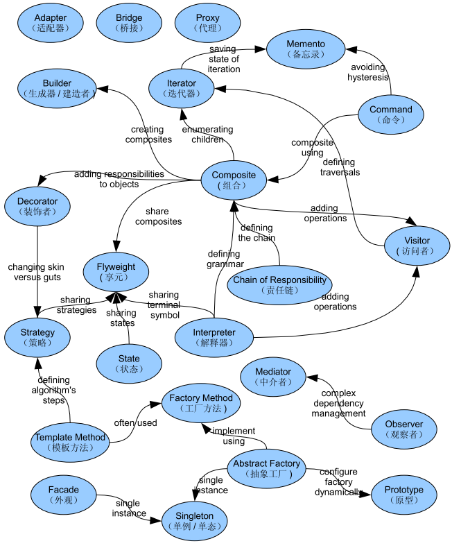
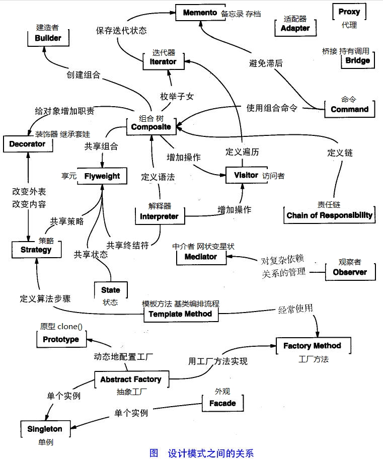
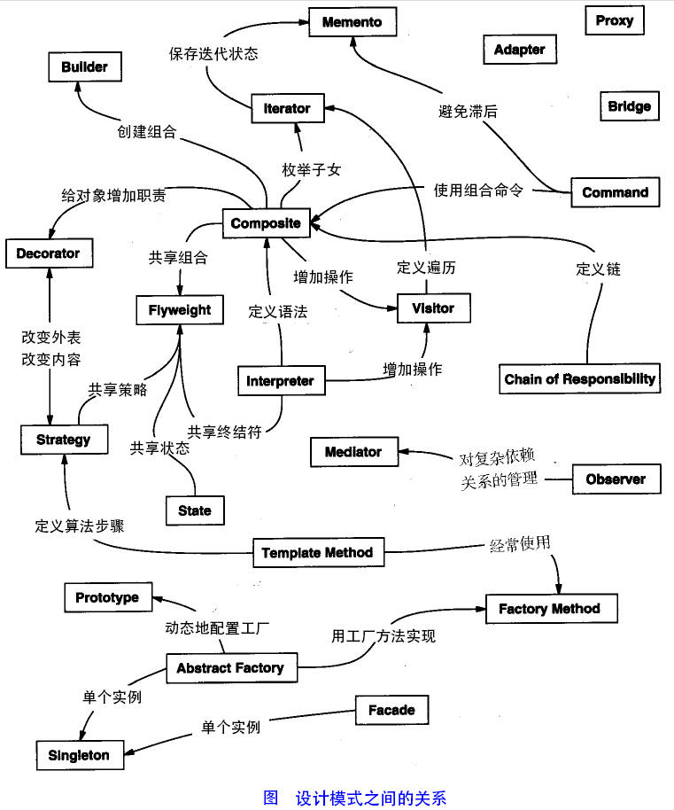
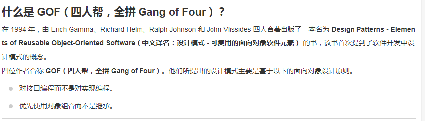

# 23种设计模式之间的关系
https://www.runoob.com/design-pattern/design-pattern-tutorial.html
学习设计模式不容易，将各种设计模式之间的关系弄懂更加困难。下图列出了各种不同的设计模式之间的关系，可以作为学习设计模式后的一个总结，大家也可以打印出来供平常参考之用。由于该图之前网络中只有英文版本，这里特地将英文和中文的名字一起列出，方便大家的阅读。

就我个人而言，这幅图里的关系还是不全的，比方说，Singleton Pattern就可以和绝大多数的其他Pattern 相关联。不过毕竟一幅图里要表达的内容越多越复杂，能说明50%-60%的情况已经不错了。

根据上图的关系，我们可以看出以下几个模式是跟其他的模式关系相当密切的，也就是我们需要重点掌握的几种模式：

*   组合（Composite）模式
    
*   迭代器（Iterator）模式
    
*   抽象工厂（Abstract Factory）模式
    
*   享元（Flyweight）模式
    
*   访问者（Visitor）模式
    

当然，不是说其他模式不重要，只不过理解了以上的模式再去了解其他模式，可以起到事半功倍的效果（本人观点，仅限参考^\_^）。各位大大如果对这些关系有疑问或者需要补充说明的，欢迎留言，我会补充上去。

最后在说一点学习编程的技巧，那就是“重复重复再重复”，熟能生巧嘛！动手的记忆效果一定比只是看看书的效果要强很多（所以上面的图偶也是自己一边看一边画的，画完之后发觉居然还记住了一部分，哈哈）。

