首先，我感觉不必像 @李Shawn 同学一样认为DNN、CNN、RNN完全不能相提并论。从广义上来说，NN（或是更美的DNN）确实可以认为包含了CNN、RNN这些具体的变种形式。在实际应用中，所谓的深度神经网络DNN，往往融合了多种已知的结构，包括卷积层或是LSTM单元。但是就题主的意思来看，这里的DNN应该特指全连接的神经元结构，并不包含卷积单元或是时间上的关联。因此，题主一定要将DNN、CNN、RNN等进行对比，也未尝不可。

其实，如果我们顺着神经网络技术发展的脉络，就很容易弄清这几种网络结构发明的初衷，和他们之间本质的区别，希望对题主有所帮助。

\=========================== 分 割 线 就 是 我 ================================

  

神经网络技术起源于上世纪五、六十年代，当时叫**感知机**（perceptron），拥有输入层、输出层和一个隐含层。输入的特征向量通过隐含层变换达到输出层，在输出层得到分类结果。早期感知机的推动者是Rosenblatt。*（扯一个不相关的：由于计算技术的落后，当时感知器传输函数是用线拉动变阻器改变电阻的方法机械实现的，脑补一下科学家们扯着密密麻麻的导线的样子…）*

但是，Rosenblatt的单层感知机有一个严重得不能再严重的问题，即它对稍复杂一些的函数都无能为力（比如最为典型的“异或”操作）。连异或都不能拟合，你还能指望这货有什么实际用途么o(╯□╰)o

  

随着数学的发展，这个缺点直到上世纪八十年代才被Rumelhart、Williams、Hinton、LeCun等人（反正就是一票大牛）发明的**多层感知机**（multilayer perceptron）克服。多层感知机，顾名思义，就是有多个隐含层的感知机（废话……）。好好，我们看一下多层感知机的结构：

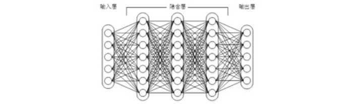

  

***图1****上下层神经元全部相连的神经网络——多层感知机*

  

多层感知机可以摆脱早期离散传输函数的束缚，使用sigmoid或tanh等连续函数模拟神经元对激励的响应，在训练算法上则使用Werbos发明的反向传播BP算法。对，这货就是我们现在所说的**神经网络****NN**——神经网络听起来不知道比感知机高端到哪里去了！这再次告诉我们起一个好听的名字对于研（zhuang）究（bi）很重要！

  

多层感知机解决了之前无法模拟异或逻辑的缺陷，同时更多的层数也让网络更能够刻画现实世界中的复杂情形。相信年轻如Hinton当时一定是春风得意。

  

多层感知机给我们带来的启示是，**神经网络的层数直接决定了它对现实的刻画能力**——利用每层更少的神经元拟合更加复杂的函数\[1\]。

（Bengio如是说：functions that can be compactly represented by a depth k architecture might require an exponential number of computational elements to be represented by a depth k − 1 architecture.）

  

即便大牛们早就预料到神经网络需要变得更深，但是有一个梦魇总是萦绕左右。随着神经网络层数的加深，**优化函数越来越容易陷入局部最优解**，并且这个“陷阱”越来越偏离真正的全局最优。利用有限数据训练的深层网络，性能还不如较浅层网络。同时，另一个不可忽略的问题是随着网络层数增加，**“梯度消失”现象更加严重**。具体来说，我们常常使用sigmoid作为神经元的输入输出函数。对于幅度为1的信号，在BP反向传播梯度时，每传递一层，梯度衰减为原来的0.25。层数一多，梯度指数衰减后低层基本上接受不到有效的训练信号。

  

2006年，Hinton利用预训练方法缓解了局部最优解问题，将隐含层推动到了7层\[2\]，神经网络真正意义上有了“深度”，由此揭开了深度学习的热潮。这里的“深度”并没有固定的定义——在语音识别中4层网络就能够被认为是“较深的”，而在图像识别中20层以上的网络屡见不鲜。为了克服梯度消失，ReLU、maxout等传输函数代替了sigmoid，形成了如今DNN的基本形式。单从结构上来说，**全连接的****DNN****和图****1****的多层感知机是没有任何区别的**。

  

值得一提的是，今年出现的高速公路网络（highway network）和深度残差学习（deep residual learning）进一步避免了梯度消失，网络层数达到了前所未有的一百多层（深度残差学习：152层）\[3,4\]！具体结构题主可自行搜索了解。如果你之前在怀疑是不是有很多方法打上了“深度学习”的噱头，这个结果真是深得让人心服口服。

  

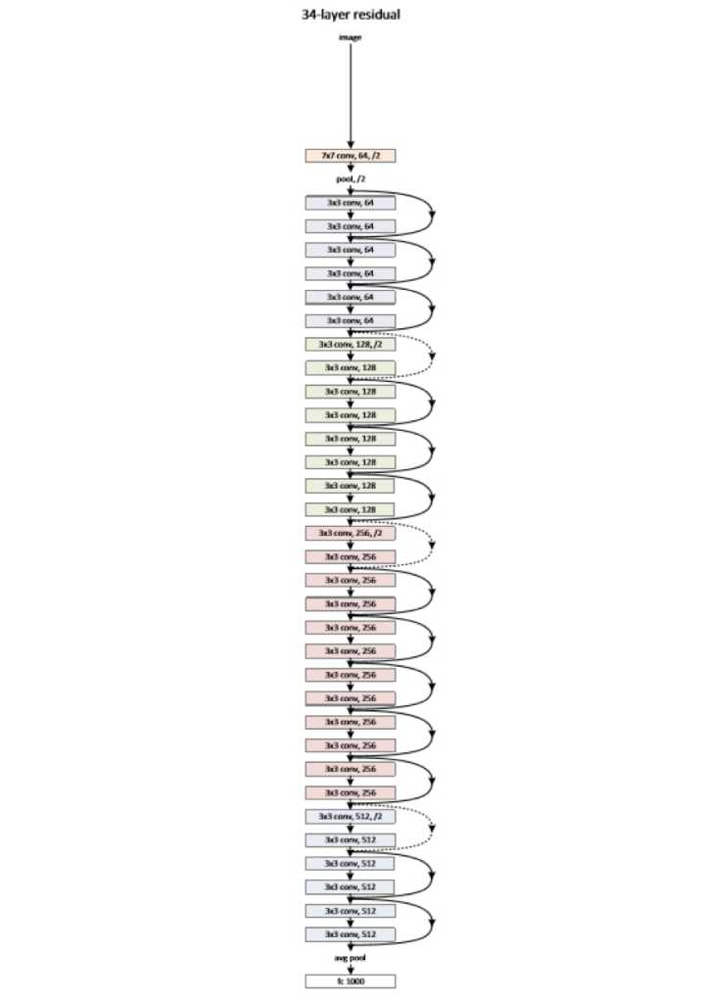

  

***图2****缩减版的深度残差学习网络，仅有34**层，终极版有152**层，自行感受一下*

  

如图1所示，我们看到**全连接****DNN****的结构里下层神经元和所有上层神经元都能够形成连接**，带来的潜在问题是**参数数量的膨胀**。假设输入的是一幅像素为1K\*1K的图像，隐含层有1M个节点，光这一层就有10^12个权重需要训练，这不仅容易过拟合，而且极容易陷入局部最优。另外，图像中有固有的局部模式（比如轮廓、边界，人的眼睛、鼻子、嘴等）可以利用，显然应该将图像处理中的概念和神经网络技术相结合。此时我们可以祭出题主所说的卷积神经网络CNN。对于CNN来说，并不是所有上下层神经元都能直接相连，而是**通过“卷积核”作为中介。同一个卷积核在所有图像内是共享的，图像通过卷积操作后仍然保留原先的位置关系。**两层之间的卷积传输的示意图如下：

  

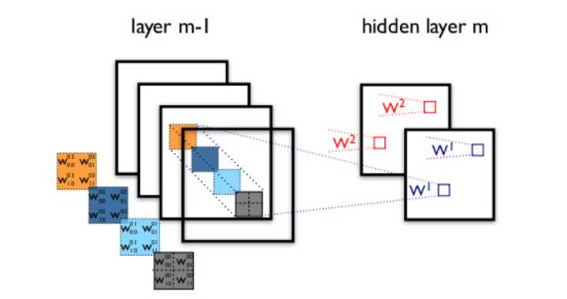

***图3****卷积神经网络隐含层（摘自Theano**教程）*

  

通过一个例子简单说明卷积神经网络的结构。假设图3中m-1=1是输入层，我们需要识别一幅彩色图像，这幅图像具有四个通道ARGB（透明度和红绿蓝，对应了四幅相同大小的图像），假设卷积核大小为100\*100，共使用100个卷积核w1到w100（从直觉来看，每个卷积核应该学习到不同的结构特征）。用w1在ARGB图像上进行卷积操作，可以得到隐含层的第一幅图像；这幅隐含层图像左上角第一个像素是四幅输入图像左上角100\*100区域内像素的加权求和，以此类推。同理，算上其他卷积核，隐含层对应100幅“图像”。每幅图像对是对原始图像中不同特征的响应。按照这样的结构继续传递下去。CNN中还有max-pooling等操作进一步提高鲁棒性。

  

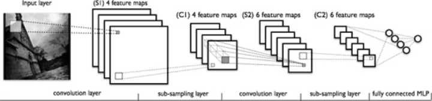

  

***图4****一个典型的卷积神经网络结构，注意到最后一层实际上是一个全连接层（摘自Theano**教程）*

  

在这个例子里，我们注意到**输入层到隐含层的参数瞬间降低到了****100\*100\*100=10^6****个**！这使得我们能够用已有的训练数据得到良好的模型。题主所说的适用于图像识别，正是由于**CNN****模型限制参数了个数并挖掘了局部结构的这个特点**。顺着同样的思路，利用语音语谱结构中的局部信息，CNN照样能应用在语音识别中。

  

全连接的DNN还存在着另一个问题——无法对时间序列上的变化进行建模。然而，**样本出现的时间顺序对于自然语言处理、语音识别、手写体识别等应用非常重要**。对了适应这种需求，就出现了题主所说的另一种神经网络结构——循环神经网络RNN。

  

在普通的全连接网络或CNN中，每层神经元的信号只能向上一层传播，样本的处理在各个时刻独立，因此又被成为前向神经网络(Feed-forward Neural Networks)。而在**RNN****中，神经元的输出可以在下一个时间戳直接作用到自身**，即第i层神经元在m时刻的输入，除了（i-1）层神经元在该时刻的输出外，还包括其自身在（m-1）时刻的输出！表示成图就是这样的：

  

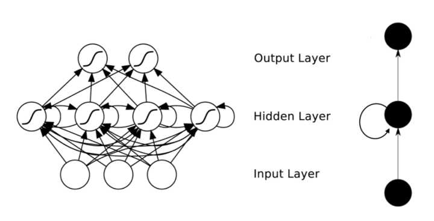

***图5*** *RNN**网络结构*

  

我们可以看到在隐含层节点之间增加了互连。为了分析方便，我们常将RNN在时间上进行展开，得到如图6所示的结构：

  

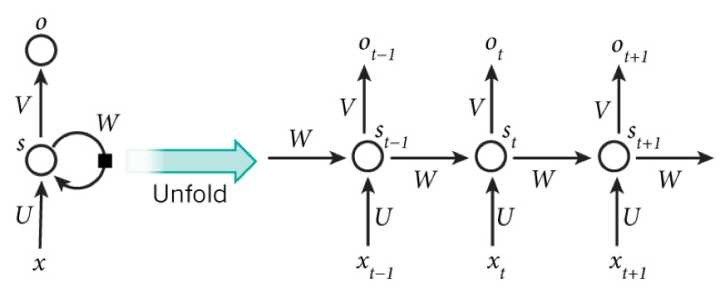

***图6*** *RNN**在时间上进行展开*

  

Cool，**（****t+1****）时刻网络的最终结果O(t+1)****是该时刻输入和所有历史共同作用的结果**！这就达到了对时间序列建模的目的。

  

不知题主是否发现，RNN可以看成一个在时间上传递的神经网络，它的深度是时间的长度！正如我们上面所说，**“梯度消失”现象又要出现了，只不过这次发生在时间轴上**。对于t时刻来说，它产生的梯度在时间轴上向历史传播几层之后就消失了，根本就无法影响太遥远的过去。因此，之前说“所有历史”共同作用只是理想的情况，在实际中，这种影响也就只能维持若干个时间戳。

  

为了解决时间上的梯度消失，机器学习领域发展出了**长短时记忆单元****LSTM****，通过门的开关实现时间上记忆功能，并防止梯度消失**，一个LSTM单元长这个样子：

  

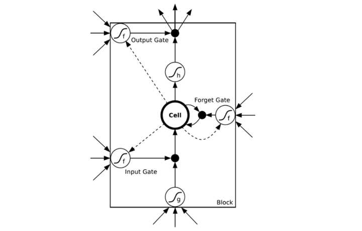

***图7*** *LSTM**的模样*

  

除了题主疑惑的三种网络，和我之前提到的深度残差学习、LSTM外，深度学习还有许多其他的结构。举个例子，RNN既然能继承历史信息，是不是也能吸收点未来的信息呢？因为在序列信号分析中，如果我能预知未来，对识别一定也是有所帮助的。因此就有了**双向****RNN****、双向****LSTM****，同时利用历史和未来的信息。**

  

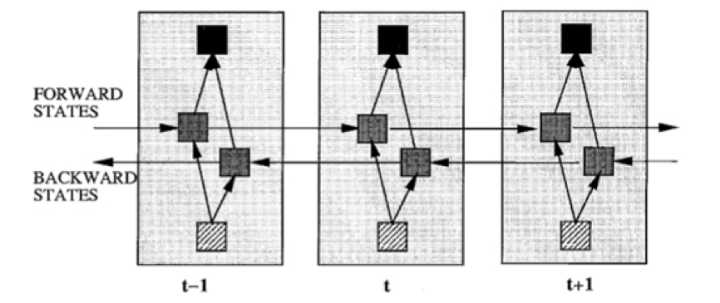

***图8****双向RNN*

  

事实上，**不论是那种网络，他们在实际应用中常常都混合着使用，比如****CNN****和RNN****在上层输出之前往往会接上全连接层，很难说某个网络到底属于哪个类别。**不难想象随着深度学习热度的延续，更灵活的组合方式、更多的网络结构将被发展出来。尽管看起来千变万化，但研究者们的出发点肯定都是为了解决特定的问题。题主如果想进行这方面的研究，不妨仔细分析一下这些结构各自的特点以及它们达成目标的手段。入门的话可以参考：

Ng写的Ufldl：[UFLDL教程 - Ufldl](https://link.zhihu.com/?target=http%3A//ufldl.stanford.edu/wiki/index.php/UFLDL%25E6%2595%2599%25E7%25A8%258B)

也可以看Theano内自带的教程，例子非常具体：[Deep Learning Tutorials](https://link.zhihu.com/?target=http%3A//www.deeplearning.net/tutorial/)

欢迎大家继续推荐补充。

当然啦，如果题主只是想凑个热闹时髦一把，或者大概了解一下方便以后把妹使，这样看看也就罢了吧。

  
  

**参考文献：**

\[1\] Bengio Y. Learning Deep Architectures for AI\[J\]. Foundations & Trends® in Machine Learning, 2009, 2(1):1-127.

\[2\] Hinton G E, Salakhutdinov R R. Reducing the Dimensionality of Data with Neural Networks\[J\]. Science, 2006, 313(5786):504-507.

\[3\] He K, Zhang X, Ren S, Sun J. Deep Residual Learning for Image Recognition. arXiv:1512.03385, 2015.

\[4\] Srivastava R K, Greff K, Schmidhuber J. Highway networks. arXiv:1505.00387, 2015.

  
  
  

【“科研君”公众号初衷始终是希望聚集各专业一线科研人员和工作者，在进行科学研究的同时也作为知识的传播者，利用自己的专业知识解释和普及生活中的 一些现象和原理，展现科学有趣生动的一面。该公众号由清华大学一群在校博士生发起，目前参与的作者人数有10人，但我们感觉这远远不能覆盖所以想科普的领域，并且由于空闲时间有限，导致我们只能每周发布一篇文章。我们期待更多的战友加入，认识更多志同道合的人，每个人都是科研君，每个人都是知识的传播者。我们期待大家的参与，想加入我们，进QQ群吧~：108141238】

  
  

【非常高兴看到大家喜欢并赞同我们的回答。应许多知友的建议，最近我们开通了同名公众号：**PhDer**，也会定期更新我们的文章，如果您不想错过我们的每篇回答，欢迎扫码关注~ 】  

  

[http://weixin.qq.com/r/5zsuNoHEZdwarcVV9271](https://link.zhihu.com/?target=http%3A//weixin.qq.com/r/5zsuNoHEZdwarcVV9271) (二维码自动识别)

**卷积神经网络**是一种曾经让我无论如何也无法弄明白的东西，主要是名字就太“高级”了，网上的各种各样的文章来介绍“什么是卷积”尤为让人受不了。听了吴恩达的网课之后，豁然开朗，终于搞明白了这个东西是什么和为什么。我这里大概会用6~7篇文章来讲解CNN并实现一些有趣的应用。看完之后大家应该可以自己动手做一些自己喜欢的事儿了。

## 一、引子：边界检测

我们来看一个最简单的例子：“边界检测（edge detection）”，假设我们有这样的一张图片，大小8×8：

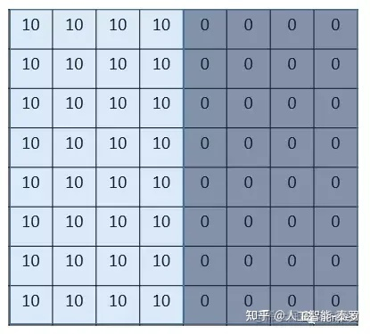

图片中的数字代表该位置的像素值，我们知道，像素值越大，颜色越亮，所以为了示意，我们把右边小像素的地方画成深色。图的中间两个颜色的分界线就是我们要检测的边界。怎么检测这个边界呢？我们可以设计这样的一个 **滤波器（filter，也称为kernel）**

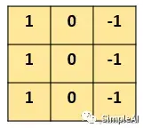

大小3×3：然后，我们用这个filter，往我们的图片上“盖”，覆盖一块跟filter一样大的区域之后，对应元素相乘，然后求和。计算一个区域之后，就向其他区域挪动，接着计算，直到把原图片的每一个角落都覆盖到了为止。这个过程就是 **“卷积”**。

（我们不用管卷积在数学上到底是指什么运算，我们只用知道在CNN中是怎么计算的。）  
这里的“挪动”，就涉及到一个步长了，假如我们的步长是1，那么覆盖了一个地方之后，就挪一格，容易知道，总共可以覆盖6×6个不同的区域。那么，我们将这6×6个区域的卷积结果，拼成一个矩阵：

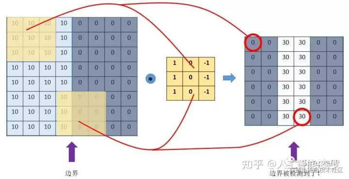

**诶？！发现了什么？**

这个图片，中间颜色浅，两边颜色深，这说明咱们的原图片中间的边界，在这里被反映出来了!从上面这个例子中，我们发现，**我们可以通过设计特定的filter，让它去跟图片做卷积，就可以识别出图片中的某些特征**，比如边界。

上面的例子是检测竖直边界，我们也可以设计出检测水平边界的，只用把刚刚的filter旋转90°即可。对于其他的特征，理论上只要我们经过精细的设计，总是可以设计出合适的filter的。**我们的CNN**

**（convolutional neural network），主要就是通过一个个的filter，不断地提取特征，从局部的特征到总体的特征，从而进行图像识别等等功能。** **那么问题来了**，我们怎么可能去设计这么多各种各样的filter呀？首先，我们都不一定清楚对于一大推图片，我们需要识别哪些特征，其次，就算知道了有哪些特征，想真的去设计出对应的filter，恐怕也并非易事，要知道，特征的数量可能是成千上万的。其实学过神经网络之后，我们就知道，**这些filter，根本就不用我们去设计**，每个filter中的各个数字，不就是参数吗，我们可以通过大量的数据，来 **让机器自己去“学习”这些参数**嘛。这，就是CNN的原理。

## 二、CNN的基本概念

**1.padding 填白**

从上面的引子中，我们可以知道，原图像在经过filter卷积之后，变小了，从(8,8)变成了(6,6)。假设我们再卷一次，那大小就变成了(4,4)了。**这样有啥问题呢？**

主要有两个问题：

*   每次卷积，图像都缩小，这样卷不了几次就没了；
*   相比于图片中间的点，图片边缘的点在卷积中被计算的次数很少。这样的话，边缘的信息就易于丢失。

为了解决这个问题，我们可以采用padding的方法。我们每次卷积前，先给图片周围都补一圈空白，让卷积之后图片跟原来一样大，同时，原来的边缘也被计算了更多次。

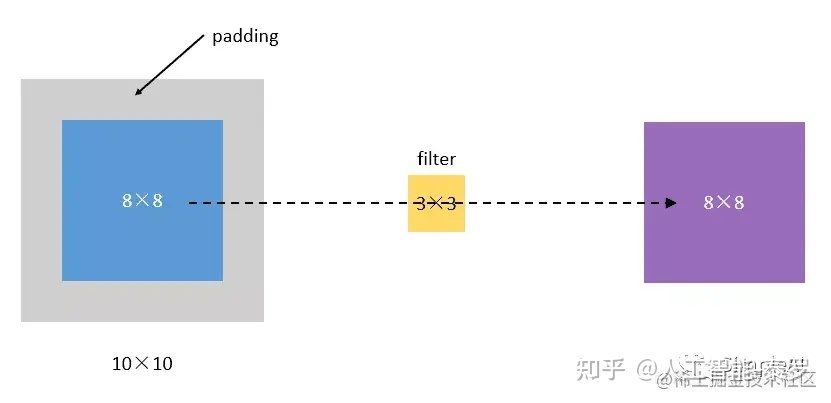

比如，我们把(8,8)的图片给补成(10,10)，那么经过(3,3)的filter之后，就是(8,8)，没有变。我们把上面这种“让卷积之后的大小不变”的padding方式，称为 **“Same”**方式，

把不经过任何填白的，称为 **“Valid”**方式。这个是我们在使用一些框架的时候，需要设置的超参数。

**2.stride 步长**

前面我们所介绍的卷积，都是默认步长是1，但实际上，我们可以设置步长为其他的值。

比如，对于(8,8)的输入，我们用(3,3)的filter，

如果stride=1，则输出为(6,6);

如果stride=2，则输出为(3,3);（这里例子举得不大好，除不断就向下取整）

**3.pooling 池化**

这个pooling，是为了提取一定区域的主要特征，并减少参数数量，防止模型过拟合。

比如下面的MaxPooling，采用了一个2×2的窗口，并取stride=2：

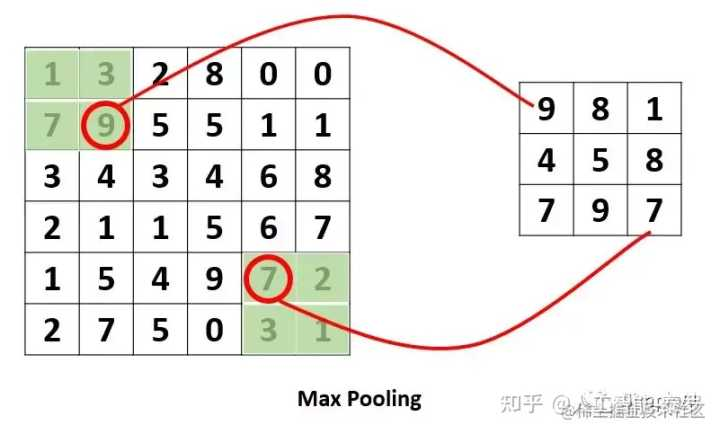

除了MaxPooling,还有AveragePooling，顾名思义就是取那个区域的平均值。

**4.对多通道（channels）图片的卷** **积** **（重要！）**

这个需要单独提一下。彩色图像，一般都是RGB三个通道（channel）的，因此输入数据的维度一般有三个：**（长，宽，通道）**。

比如一个28×28的RGB图片，维度就是(28,28,3)。前面的引子中，输入图片是2维的(8,8)，filter是(3,3)，输出也是2维的(6,6)。如果输入图片是三维的呢（即增多了一个channels），比如是(8,8,3)，这个时候，我们的filter的维度就要变成(3,3,3)了，它的 **最后一维要跟输入的channel维度一致。**

这个时候的卷积，**是三个channel的所有元素对应相乘后求和**，也就是之前是9个乘积的和，现在是27个乘积的和。因此，输出的维度并不会变化。还是(6,6)。但是，一般情况下，我们会 **使用多了filters同时卷积**，比如，如果我们同时使用4个filter的话，那么 **输出的维度则会变为(6,6,4)** 。我特地画了下面这个图，来展示上面的过程：

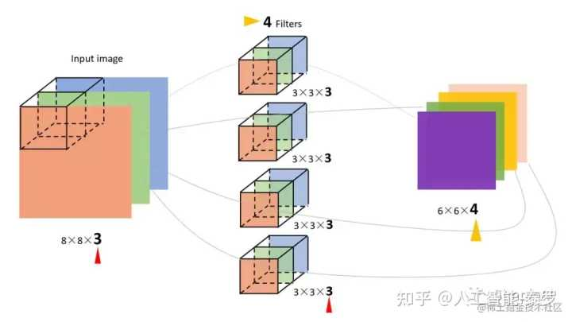

图中的输入图像是(8,8,3)，filter有4个，大小均为(3,3,3)，得到的输出为(6,6,4)。

我觉得这个图已经画的很清晰了，而且给出了3和4这个两个关键数字是怎么来的，所以我就不啰嗦了（这个图画了我起码40分钟）。其实，如果套用我们前面学过的神经网络的符号来看待CNN的话。

*   我们的输入图片就是X，shape=(8,8,3);
*   4个filters其实就是第一层神金网络的参数W1,，shape=(3,3,3,**4**),这个4是指有4个filters;
*   我们的输出，就是Z1，shape=(6,6,4);
*   后面其实还应该有一个激活函数，比如relu，经过激活后，Z1变为A1，shape=(6,6,4);

所以，在前面的图中，我加一个激活函数，给对应的部分标上符号，就是这样的：

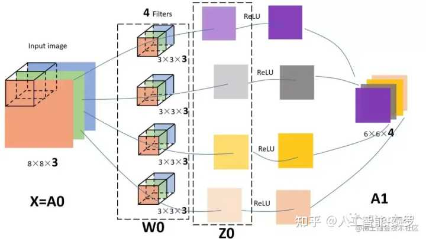

【个人觉得，这么好的图不收藏，真的是可惜了】

## 三、CNN的结构组成

上面我们已经知道了卷积（convolution）、池化（pooling）以及填白（padding）是怎么进行的，接下来我们就来看看CNN的整体结构，它包含了3种层（layer）：

**1\. Convolutional layer（卷积层—CONV）**

由滤波器filters和激活函数构成。 一般要设置的超参数包括filters的数量、大小、步长，以及padding是“valid”还是“same”。当然，还包括选择什么激活函数。

**2\. Pooling layer （池化层—POOL）**

这里里面没有参数需要我们学习，因为这里里面的参数都是我们设置好了，要么是Maxpooling，要么是Averagepooling。

需要指定的超参数，包括是Max还是average，窗口大小以及步长。

通常，我们使用的比较多的是Maxpooling,而且一般取大小为(2,2)步长为2的filter，这样，经过pooling之后，输入的长宽都会缩小2倍，channels不变。

**3\. Fully Connected layer（全连接层—FC）**

这个前面没有讲，是因为这个就是我们最熟悉的家伙，**就是我们之前学的神经网络中的那种最普通的层，就是一排神经元**。因为这一层是每一个单元都和前一层的每一个单元相连接，所以称之为“全连接”。

这里要指定的超参数，无非就是神经元的数量，以及激活函数。接下来，我们随便看一个CNN的模样，来获取对CNN的一些感性认识：

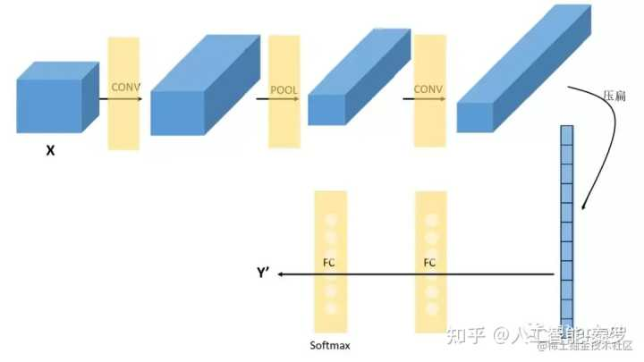

上面这个CNN是我随便拍脑门想的一个。它的结构可以用：

X→CONV(relu)→MAXPOOL→CONV(relu)→FC(relu)→FC(softmax)→Y  
来表示。这里需要说明的是，在经过数次卷积和池化之后，我们 **最后会先将多维的数据进行“扁平化”，** 也就是把 **(height,width,channel)** 的数据压缩成长度为 **height × width × channel** 的一维数组，然后再与 **FC层**连接，**这之后就跟普通的神经网络无异了**。可以从图中看到，随着网络的深入，我们的图像（严格来说中间的那些不能叫图像了，但是为了方便，还是这样说吧）越来越小，但是channels却越来越大了。在图中的表示就是长方体面对我们的面积越来越小，但是长度却越来越长了。

## 四、卷积神经网络 VS. 传统神经网络

其实现在回过头来看，CNN跟我们之前学习的神经网络，也没有很大的差别。

**传统的神经网络，其实就是多个FC层叠加起来**。

CNN，无非就是把FC改成了CONV和POOL，就是把传统的由一个个神经元组成的layer，变成了由filters组成的layer。那么，为什么要这样变？有什么好处？

具体说来有两点：

**1.参数共享机制（parameters sharing）**

我们对比一下传统神经网络的层和由filters构成的CONV层：

假设我们的图像是8×8大小，也就是64个像素，假设我们用一个有9个单元的全连接层：

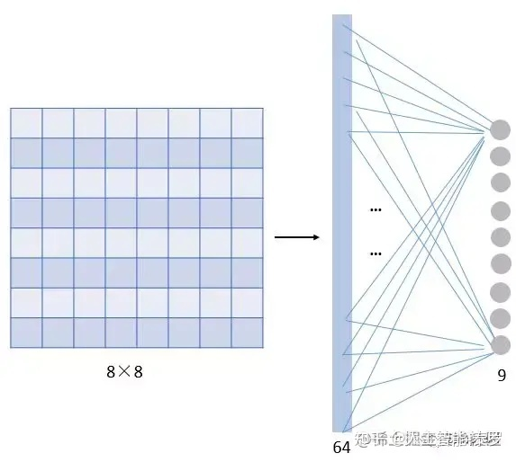

那这一层我们需要多少个参数呢？需要 **64×9 = 576个参数**（先不考虑偏置项b）。因为每一个链接都需要一个权重w。那我们看

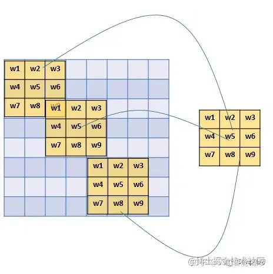

看**同样有9个单元的filter**是怎么样的：

其实不用看就知道，**有几个单元就几个参数，所以总共就9个参数**！因为，对于不同的区域，我们都共享同一个filter，因此就共享这同一组参数。

这也是有道理的，通过前面的讲解我们知道，filter是用来检测特征的，**那一个特征一般情况下很可能在不止一个地方出现**，比如“竖直边界”，就可能在一幅图中多出出现，那么 **我们共享同一个filter不仅是合理的，而且是应该这么做的。** 由此可见，参数共享机制，**让我们的网络的参数数量大大地减少**。这样，我们可以用较少的参数，训练出更加好的模型，典型的事半功倍，而且可以有效地 **避免过拟合**。

同样，由于filter的参数共享，即使图片进行了一定的平移操作，我们照样可以识别出特征，这叫做 **“平移不变性”**。因此，模型就更加稳健了。

**2.连接的稀疏性（sparsity of connections）**\\

由卷积的操作可知，输出图像中的任何一个单元，**只跟输入图像的一部分有关**系：

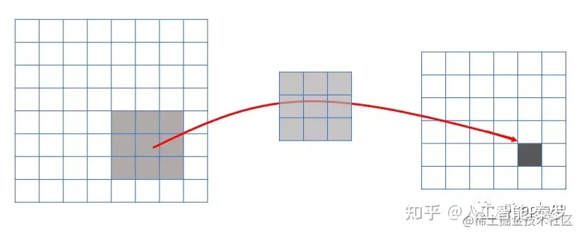

而传统神经网络中，由于都是全连接，所以输出的任何一个单元，都要受输入的所有的单元的影响。这样无形中会对图像的识别效果大打折扣。比较，每一个区域都有自己的专属特征，我们不希望它受到其他区域的影响。

**正是由于上面这两大优势，使得CNN超越了传统的NN，开启了神经网络的新时代。**

看 **同样有9个单元的filter**是怎么样的：  

> 作者：tntxia  
> 链接：[https://juejin.cn/post/7022812074858414087](https://link.zhihu.com/?target=https%3A//juejin.cn/post/7022812074858414087)  
> 来源：稀土掘金