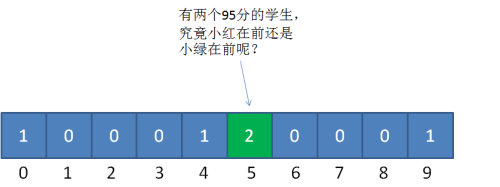

有这样一道排序题：数组里有20个随机数，取值范围为从0到10，要求用最快的速度把这20个整数从小到大进行排序。

第一时间你可能会想使用快速排序，因为快排的时间复杂度只有O(nlogn)。但是这种方法还是不够快，有没有比O(nlogn)更快的排序方法呢？你可能会有疑问：O(nlogn)已经是最快的排序算法了，怎么可能还有更快的排序方法？

让我们先来回顾一下经典的排序算法，无论是归并排序，冒泡排序还是快速排序等等，都是基于元素之间的比较来进行排序的。但是有一种特殊的排序算法叫**计数排序**，这种排序算法不是基于元素比较，而是利用数组下标来确定元素的正确位置。

在刚才的题目里，随即整数的取值范围是从0到10，那么这些整数的值肯定是在0到10这11个数里面。于是我们可以建立一个长度为11的数组，数组下标从0到10，元素初始值全为0，如下所示：

先假设20个随机整数的值是：**9, 3, 5, 4, 9, 1, 2, 7, 8，1，3, 6, 5, 3, 4, 0, 10, 9, 7, 9**

让我们先遍历这个无序的随机数组，每一个整数按照其值对号入座，对应数组下标的元素进行加1操作。

比如第一个整数是9，那么数组下标为9的元素加1：

第二个整数是3，那么数组下标为3的元素加1：

继续遍历数列并修改数组......

最终，数列遍历完毕时，数组的状态如下：

数组中的每一个值，代表了数列中对应整数的出现次数。

有了这个统计结果，排序就很简单了，直接遍历数组，输出数组元素的下标值，元素的值是几，就输出几次：

**0, 1, 1, 2, 3, 3, 3, 4, 4, 5, 5, 6, 7, 7, 8, 9, 9, 9, 9, 10**

显然，这个输出的数列已经是有序的了。

这就是计数排序的基本过程，它**适用于一定范围的整数排序**。**在取值范围不是很大的情况下，它的性能在某些情况甚至快过那些O(nlogn)的排序，例如快速排序、归并排序。**

代码实现如下：
~~~ java
public static int[] countSort(int[] array) {
    //1.得到数列的最大值
    int max = array[0];
    for (int i = 1; i < array.length; i++) {
        if (array[i] > max)
            max = array[i];
    }
    //2.根据数列的最大值确定统计数组的长度
    int[] coutArray = new int[max + 1];
    //3.遍历数列，填充统计数组
    for(int i = 0; i < array.length; i++)
        coutArray[array[i]]++;

    //4.遍历统计数组，输出结果
    int index = 0;
    int[] sortedArray = new int[array.length];
    for (int i = 0; i < coutArray.length; i++) {
        for (int j = 0; j < coutArray[i]; j++) {
            sortedArray[index++] = i;
        }
    }

    return sortedArray;
}
~~~
这段代码在一开始补充了一个步骤，就是求得数列的最大整数值max，后面创建的数组countArray,长度就是max+1，以此保证数组最后一个下标是max。

从功能角度来看，这段代码可以实现整数的排序。但是这段代码其实并不严谨。

比如这个数列：**95, 94, 91, 98, 99, 90, 99, 93, 91, 92**。该数列最大值是99，但最小值是90，如果我们只以数列的最大值来决定统计数组的长度的话，就要创建长度为100的数组，那么就会浪费前面90个空间。

为了解决这个问题，我们不再以（输入数列的最大值+1）作为统计数组的长度，而是以（数列最大值和最小值的差+1）作为统计数组的长度。同时，数列的最小值作为一个偏移量，用于统计数组的对号入座。

以刚才的数列为例，统计数组的长度为 99-90+1=10，偏移量等于数列最小值90。

对于第一个整数95，对应的统计数组下标为95-90=5，如图所示：

这是一方面，另外，上述代码知识简单地按照统计数组的下标输出了元素值，并没有真正给数列排序。如果仅仅只是给整数排序，这样并没有问题。但如果是在现实业务里，比如给学生的考试分数排序，如果遇到相同的分数就会分不清谁是谁。看看下面这个例子：

给出一个学生的成绩表，要求按成绩从底到高排序，如果成绩相同，则遵循原表固有顺序。

当我们填充统计数组之后，我们只知道有两个成绩并列95分的学生，却不知道谁是小红，谁是小绿：

对此，我们只需在填充完统计数组之后，对统计数组做一下变形。我们仍然以学生的成绩表为例，把之前的统计数组进行变形，统计数组从第二个元素开始，每一个元素都加上前面所有元素之和：

相加的目的就是为了让统计数组存储的元素值等于相应整数的最终排序位置。比如下标是9的元素值是5，代表原始数列的整数9最终的排序是在第5位。

接下来，我们创建输出数组sortedArray，长度和输入数列一致，然后从后向前遍历输入数列：

**第一步**，遍历成绩表最后一行的小绿：小绿是95分，找到countArray下标为5的元素，值是4，代表小绿的成绩排名是在第4位。

同时给countArray下标是5的元素值减1，从4变成3，代表着下次再遇到95分时，最终排名是第3位。

**第二步**，遍历成绩表倒数第二行的小白：小白是94分，找到countArray下标是4的元素，值是2，代表小白的成绩排名在第2位。

同时，给countArray下标是4的元素值减1，从2变成1，代表下次再遇到94分的成绩时（实际上已经遇不到了），最终排名是第1位。

**第三步**，遍历成绩表倒数第三行的小红：小红是95分，找到countArray下标是5的元素，值是3（最初是4，减1变成了3），代表小白的成绩排名在第3位。

同时，给countArray下标是5的元素值减1，从3变成2，代表下次再遇到95分的成绩时（实际上已经遇不到了），最终排名是第2位。

因此，同样是95分的小红和小绿就能清楚地排出顺序，所以优化版的计数排序**属于稳定排序**。

后面的遍历过程依此类推。

改进版本的计数排序代码如下：
~~~ java
public static int[] countSort(int[] array) {
    //1.得到数列的最大值与最小值，并算出差值d
    int max = array[0];
    int min = array[0];
    for (int i = 1; i < array.length; i++) {
        if (array[i] > max) {
        max = array[i];
        }
        if(array[i] < min) {
        min = array[i];
        }
    }
    int d = max - min;
    //2.创建统计数组并计算统计对应元素个数
    int[] countArray = new int[d + 1];
    for (int i = 0; i < array.length; i++) {
        countArray[array[i] - min]++;
    }
    //3.统计数组变形，后面的元素等于前面的元素之和
    int sum = 0;
    for (int i = 0; i < countArray.length; i++) {
        sum += countArray[i];
        countArray[i] = sum;
    }
    //4.倒序遍历原始数组，从统计数组找到正确位置，输出到结果数组
    int[] sortedArray = new int[array.length];
    for (int i = array.length - 1; i > 0; i--) {
        sortedArray[countArray[array[i] - min] - 1] = array[i];
        countArray[array[i] - min]--;
    }
    return sortedArray;
}
~~~
如果原始数列的规模是N，最大最小整数的差值是M，由于代码中第1、2、4步都涉及到遍历原始数列，运算量都是N，第3步遍历统计数列，运算量是M，所以总体运算量是3N+M，去掉系数，**时间复杂度是O(N+M)**。

至于空间复杂度，如果不考虑结果数组，只考虑统计数组的话，**空间复杂度是O(M)**。

虽然计数排序看上去很强大，但是它存在**两大局限性**：

**1.当数列最大最小值差距过大时，并不适用于计数排序**

比如给定20个随机整数，范围在0到1亿之间，此时如果使用计数排序的话，就需要创建长度为1亿的数组，不但严重浪费了空间，而且时间复杂度也随之升高。

**2.当数列元素不是整数时，并不适用于计数排序**

如果数列中的元素都是小数，比如3.1415，或是0.00000001这样子，则无法创建对应的统计数组，这样显然无法进行计数排序。

正是由于这两大局限性，才使得计数排序不像快速排序、归并排序那样被人们广泛适用。